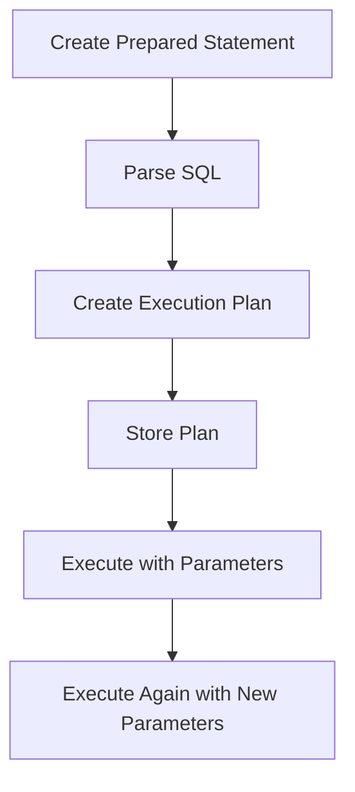

# PostgreSQL Prepared Statements

## Introduction

When working with databases, the way you execute your SQL commands can significantly impact both performance and security. PostgreSQL prepared statements offer a powerful mechanism to optimize query execution and protect your application against SQL injection attacks.

In this tutorial, we'll explore what prepared statements are, why they're essential, and how to implement them effectively in your PostgreSQL applications.

## What Are Prepared Statements?

Prepared statements are precompiled SQL templates that can be executed multiple times with different parameter values. When you use a prepared statement, the database:

1. Parses the SQL statement
2. Creates an execution plan
3. Stores this plan for repeated use with different values



This approach offers significant advantages over traditional query execution, especially for repetitive queries or when dealing with user input.

## Benefits of Using Prepared Statements

### 1. Performance Optimization

When you execute the same query multiple times with different values, prepared statements allow PostgreSQL to skip the parsing and planning phases after the first execution, resulting in:

- Reduced CPU usage
- Lower latency for query execution
- More efficient database resource utilization

### 2. Protection Against SQL Injection

Perhaps the most important benefit of prepared statements is their inherent protection against SQL injection attacks. Since the SQL command and the data are sent to the database separately, there's no risk of malicious SQL code being injected through parameter values.

### 3. Improved Code Readability

Using prepared statements often results in cleaner, more maintainable code by separating the SQL logic from the data values.

## Creating and Using Prepared Statements in PostgreSQL

Let's explore how to use prepared statements in different contexts:

### Basic Syntax

The basic pattern for using prepared statements in PostgreSQL involves three steps:

1. **PREPARE**: Define the statement template
2. **EXECUTE**: Run the prepared statement with specific values
3. **DEALLOCATE**: Remove the prepared statement when no longer needed

```sql
-- Step 1: Prepare the statement
PREPARE user_select (int) AS
SELECT * FROM users WHERE user_id = $1;

-- Step 2: Execute with a specific value
EXECUTE user_select(123);

-- Step 3: Deallocate when done
DEALLOCATE user_select;
```

In this example, `$1` is a placeholder for the parameter value that will be provided when the statement is executed.

### Multiple Parameters

You can use multiple parameters in a prepared statement by specifying their data types and using numbered placeholders:

```sql
PREPARE user_insert (text, text, int) AS
INSERT INTO users (username, email, age) VALUES ($1, $2, $3);

EXECUTE user_insert('johndoe', 'john@example.com', 30);
```

### Named Parameters with Node.js

When using PostgreSQL with Node.js and the `node-postgres` library, you can use named parameters:

```javascript
const { Pool } = require('pg');
const pool = new Pool();

async function getUserById(userId) {
  const query = {
    // The $1 syntax works with node-postgres
    text: 'SELECT * FROM users WHERE user_id = $1',
    values: [userId]
  };
  
  try {
    const result = await pool.query(query);
    return result.rows;
  } catch (err) {
    console.error('Database error:', err);
    throw err;
  }
}

// Usage
getUserById(123).then(user => console.log(user));
```

### Prepared Statements with Python and psycopg2

In Python applications using the `psycopg2` library:

```python
import psycopg2

conn = psycopg2.connect("dbname=testdb user=postgres")
cur = conn.cursor()

# The library handles prepared statements automatically when using parameterized queries
user_id = 123
cur.execute("SELECT * FROM users WHERE user_id = %s", (user_id,))

# For multiple parameters
username = "johndoe"
email = "john@example.com"
age = 30
cur.execute(
    "INSERT INTO users (username, email, age) VALUES (%s, %s, %s)",
    (username, email, age)
)

conn.commit()
cur.close()
conn.close()
```

## Real-World Application: User Registration System

Let's build a simple user registration system using prepared statements:

### Database Schema

```sql
CREATE TABLE users (
  user_id SERIAL PRIMARY KEY,
  username VARCHAR(50) UNIQUE NOT NULL,
  email VARCHAR(100) UNIQUE NOT NULL,
  password_hash VARCHAR(100) NOT NULL,
  created_at TIMESTAMP DEFAULT CURRENT_TIMESTAMP
);
```

### Node.js Implementation

```javascript
const { Pool } = require('pg');
const bcrypt = require('bcrypt');
const pool = new Pool();

async function registerUser(username, email, password) {
  // Hash the password
  const saltRounds = 10;
  const passwordHash = await bcrypt.hash(password, saltRounds);
  
  const query = {
    text: `
      INSERT INTO users (username, email, password_hash)
      VALUES ($1, $2, $3)
      RETURNING user_id, username, email, created_at
    `,
    values: [username, email, passwordHash]
  };
  
  try {
    const result = await pool.query(query);
    return result.rows[0];
  } catch (err) {
    if (err.code === '23505') {
      // Unique violation error code
      if (err.constraint === 'users_username_key') {
        throw new Error('Username already exists');
      } else if (err.constraint === 'users_email_key') {
        throw new Error('Email already registered');
      }
    }
    throw err;
  }
}

// Usage
async function main() {
  try {
    const user = await registerUser('newuser', 'new@example.com', 'securePassword123');
    console.log('User registered:', user);
  } catch (err) {
    console.error('Registration failed:', err.message);
  }
}

main();
```

### Login Function

```javascript
async function loginUser(email, password) {
  const query = {
    text: 'SELECT user_id, username, email, password_hash FROM users WHERE email = $1',
    values: [email]
  };
  
  try {
    const result = await pool.query(query);
    
    if (result.rows.length === 0) {
      throw new Error('User not found');
    }
    
    const user = result.rows[0];
    const passwordMatch = await bcrypt.compare(password, user.password_hash);
    
    if (!passwordMatch) {
      throw new Error('Invalid password');
    }
    
    // Return user data without password_hash
    delete user.password_hash;
    return user;
  } catch (err) {
    throw err;
  }
}
```

## Performance Comparison

Let's compare the performance of prepared statements versus regular queries for repetitive operations:

```javascript
const { Pool } = require('pg');
const pool = new Pool();

async function comparePerformance() {
  console.time('Regular Queries');
  for (let i = 0; i < 1000; i++) {
    await pool.query(`SELECT * FROM users WHERE user_id = ${i % 100 + 1}`);
  }
  console.timeEnd('Regular Queries');
  
  // Using prepared statements
  console.time('Prepared Statements');
  const preparedQuery = {
    text: 'SELECT * FROM users WHERE user_id = $1'
  };
  
  for (let i = 0; i < 1000; i++) {
    preparedQuery.values = [i % 100 + 1];
    await pool.query(preparedQuery);
  }
  console.timeEnd('Prepared Statements');
}

comparePerformance();
```

On a typical system, you'll observe that prepared statements significantly outperform regular queries, especially as the volume of queries increases.

## Common Pitfalls and Best Practices

### 1. Memory Usage

Be careful with creating too many different prepared statements, as each one consumes server memory. Deallocate statements you no longer need:

```sql
DEALLOCATE user_select;
```

In application code, most libraries manage this automatically.

### 2. Dynamic SQL Limitations

Prepared statements have some limitations with dynamic SQL. You cannot parameterize:

- Table or column names
- SQL keywords
- Operators

For example, this won't work:

```sql
-- This WILL NOT work
PREPARE dynamic_query(text) AS
SELECT * FROM $1;
```

For these cases, you'll need to use other approaches like dynamic SQL with proper input validation.

### 3. Type Handling

When using prepared statements, PostgreSQL must know the data types of parameters. Most client libraries handle this automatically, but in direct SQL, you must specify types:

```sql
-- Specifying parameter types
PREPARE insert_user (text, text, int) AS
INSERT INTO users (username, email, age) VALUES ($1, $2, $3);
```

## Advanced Usage: Batch Operations

For high-performance batch operations, many PostgreSQL clients support prepared statement batching:

```javascript
// Node.js batch insert example
async function batchInsertUsers(users) {
  const client = await pool.connect();
  
  try {
    await client.query('BEGIN');
    
    const statement = await client.prepare(
      'insert_user',
      'INSERT INTO users(username, email) VALUES($1, $2)'
    );
    
    for (const user of users) {
      await client.execute(statement, [user.username, user.email]);
    }
    
    await client.query('COMMIT');
  } catch (err) {
    await client.query('ROLLBACK');
    throw err;
  } finally {
    client.release();
  }
}
```

## Summary

PostgreSQL prepared statements are a powerful feature that offers significant benefits:

- **Performance**: Reduce parse and plan overhead for repeated queries
- **Security**: Protect against SQL injection attacks
- **Code Quality**: Separate SQL logic from data for cleaner code

By incorporating prepared statements into your applications, you'll not only improve security but also boost performance, especially for applications with high query volumes or repetitive database operations.

## Practice Exercises

1. Create a prepared statement to search for users by username pattern
2. Implement a product inventory system using prepared statements for all database operations
3. Write a benchmark script to compare the performance of regular queries versus prepared statements for your specific use case

## Additional Resources

- [PostgreSQL Official Documentation on Prepared Statements](https://www.postgresql.org/docs/current/sql-prepare.html)
- [Node-Postgres Parameterized Queries Documentation](https://node-postgres.com/features/queries)
- [OWASP SQL Injection Prevention Cheat Sheet](https://cheatsheetseries.owasp.org/cheatsheets/SQL_Injection_Prevention_Cheat_Sheet.html)