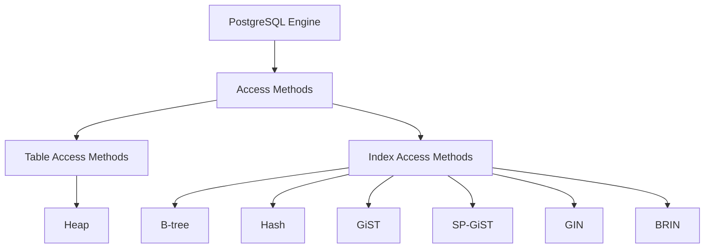

# PostgreSQL Access Methods

## Introduction

Access methods in PostgreSQL define how data is physically stored, indexed, and retrieved from the database. They are the foundation of PostgreSQL's storage architecture and play a crucial role in query performance. Understanding access methods helps you make informed decisions about indexing strategies and optimize your database performance.

In this guide, we'll explore PostgreSQL's access methods, their types, use cases, and how to leverage them effectively in your applications.

## What Are Access Methods?

Access methods are infrastructures within PostgreSQL that determine:

1. How data is physically organized on disk
2. How indexes are structured
3. How the database engine finds and retrieves data

Think of access methods as the "filing systems" that PostgreSQL uses to organize and retrieve your data efficiently.



## Types of Access Methods

PostgreSQL access methods fall into two main categories:

### 1. Table Access Methods

Table access methods define how table data is physically stored on disk.

#### Heap Tables

The default table access method is the **heap**, which stores rows in blocks or pages on disk without any inherent ordering.

Key characteristics:
- Rows are stored in the order they are inserted
- Good for most general-purpose applications
- Efficient for tables that undergo frequent updates and inserts
- Requires indexes for optimized retrieval of specific rows

Let's create a simple heap table:

```sql
CREATE TABLE employees (
    id SERIAL PRIMARY KEY,
    name VARCHAR(100),
    department VARCHAR(50),
    salary NUMERIC(10,2)
);

-- Insert some data
INSERT INTO employees (name, department, salary) 
VALUES 
    ('John Doe', 'Engineering', 85000),
    ('Jane Smith', 'Marketing', 75000),
    ('Bob Johnson', 'HR', 65000);
```

### 2. Index Access Methods

Index access methods determine how indexes are structured and how they help locate rows in tables. PostgreSQL supports several index types, each optimized for different data types and query patterns.

#### B-tree Indexes

B-tree (Balanced tree) is the default and most common index type. It's ideal for data that can be sorted and for queries involving equality and range conditions.

```sql
-- Create a B-tree index on the name column
CREATE INDEX idx_employee_name ON employees USING btree (name);

-- Query that will use this index
EXPLAIN SELECT * FROM employees WHERE name = 'John Doe';
```

Output:
```
                                  QUERY PLAN                                  
------------------------------------------------------------------------------
 Index Scan using idx_employee_name on employees
   Index Cond: (name = 'John Doe'::character varying)
```

#### Hash Indexes

Hash indexes are optimized for equality comparisons only. They use a hash function to map key values to bucket locations.

```sql
-- Create a hash index on department
CREATE INDEX idx_employee_department ON employees USING hash (department);

-- Query that will use this index
EXPLAIN SELECT * FROM employees WHERE department = 'Engineering';
```

Output:
```
                                   QUERY PLAN                                   
--------------------------------------------------------------------------------
 Index Scan using idx_employee_department on employees
   Index Cond: (department = 'Engineering'::character varying)
```

#### GiST Indexes (Generalized Search Tree)

GiST provides a flexible framework for implementing various indexing strategies. It's particularly useful for complex data types like geometric data, full-text search, and custom data types.

```sql
-- First, let's add PostGIS extension for geometric data support
CREATE EXTENSION IF NOT EXISTS postgis;

-- Create a table with geographic data
CREATE TABLE stores (
    id SERIAL PRIMARY KEY,
    name VARCHAR(100),
    location GEOMETRY(Point, 4326)
);

-- Create a GiST index on the location column
CREATE INDEX idx_stores_location ON stores USING gist (location);

-- Insert some data
INSERT INTO stores (name, location)
VALUES 
    ('Downtown Store', ST_SetSRID(ST_MakePoint(-122.4194, 37.7749), 4326)),
    ('Riverside Shop', ST_SetSRID(ST_MakePoint(-122.3892, 37.7833), 4326));

-- Query that will use this index to find stores within a certain distance
EXPLAIN SELECT name FROM stores 
WHERE ST_DWithin(location, ST_SetSRID(ST_MakePoint(-122.4194, 37.7749), 4326), 1000);
```

#### SP-GiST Indexes (Space-Partitioned GiST)

SP-GiST is designed for non-balanced data structures and is useful for data that naturally divides into non-overlapping regions, such as quadtrees or k-d trees.

```sql
-- Create an SP-GiST index on a range of network addresses
CREATE TABLE network_devices (
    id SERIAL PRIMARY KEY,
    name VARCHAR(100),
    ip_address INET
);

CREATE INDEX idx_network_ip ON network_devices USING spgist (ip_address);

-- Insert some data
INSERT INTO network_devices (name, ip_address)
VALUES 
    ('Router', '192.168.1.1'),
    ('Server', '192.168.1.10'),
    ('Printer', '192.168.1.50');

-- Query that will use this index
EXPLAIN SELECT * FROM network_devices WHERE ip_address << '192.168.1.0/24';
```

#### GIN Indexes (Generalized Inverted Indexes)

GIN indexes are optimized for composite values where you need to search for elements within the composite value, such as arrays, JSON, or full-text search.

```sql
-- Create a table with array data
CREATE TABLE products (
    id SERIAL PRIMARY KEY,
    name VARCHAR(100),
    tags TEXT[]
);

-- Create a GIN index on the tags array
CREATE INDEX idx_product_tags ON products USING gin (tags);

-- Insert some data
INSERT INTO products (name, tags)
VALUES 
    ('Laptop', ARRAY['electronics', 'computers', 'portable']),
    ('Smartphone', ARRAY['electronics', 'mobile', 'communication']),
    ('Desk Chair', ARRAY['furniture', 'office', 'ergonomic']);

-- Query that will use this index to find products with specific tags
EXPLAIN SELECT * FROM products WHERE tags @> ARRAY['electronics'];
```

Output:
```
                              QUERY PLAN                              
----------------------------------------------------------------------
 Bitmap Heap Scan on products
   Recheck Cond: (tags @> '{electronics}'::text[])
   ->  Bitmap Index Scan on idx_product_tags
         Index Cond: (tags @> '{electronics}'::text[])
```

#### BRIN Indexes (Block Range INdexes)

BRIN indexes are designed for very large tables where data has a natural correlation with physical location on disk, such as timestamps or sequential IDs.

```sql
-- Create a table with time-series data
CREATE TABLE sensor_readings (
    id SERIAL,
    sensor_id INT,
    reading_time TIMESTAMP,
    temperature DECIMAL(5,2)
);

-- Create a BRIN index on the timestamp column
CREATE INDEX idx_readings_time ON sensor_readings USING brin (reading_time);

-- Generate some sample data (in a real application, this would be millions of rows)
INSERT INTO sensor_readings (sensor_id, reading_time, temperature)
SELECT 
    (random() * 10)::int, 
    '2023-01-01'::timestamp + (i || ' minutes')::interval, 
    (random() * 100)::decimal(5,2)
FROM generate_series(1, 1000) as i;

-- Query that will benefit from the BRIN index
EXPLAIN SELECT * FROM sensor_readings 
WHERE reading_time BETWEEN '2023-01-01' AND '2023-01-02';
```

## Practical Applications

Let's explore some practical scenarios where choosing the right access method can significantly impact performance:

### 1. Full-Text Search with GIN

Let's implement a basic full-text search system using GIN indexes:

```sql
-- Create a table for blog posts
CREATE TABLE blog_posts (
    id SERIAL PRIMARY KEY,
    title TEXT,
    content TEXT,
    published_date TIMESTAMP DEFAULT CURRENT_TIMESTAMP
);

-- Insert some sample data
INSERT INTO blog_posts (title, content) VALUES
    ('PostgreSQL Indexing Strategies', 'Learn about B-tree, GiST, GIN and other index types in PostgreSQL...'),
    ('Database Performance Tuning', 'Tips and tricks for optimizing your database queries and structure...'),
    ('Introduction to PostgreSQL', 'Get started with PostgreSQL, an advanced open-source database...');

-- Add a column for the text search vector
ALTER TABLE blog_posts 
ADD COLUMN search_vector tsvector;

-- Update the column with the search vector
UPDATE blog_posts 
SET search_vector = to_tsvector('english', title || ' ' || content);

-- Create a GIN index on the search vector
CREATE INDEX idx_blog_search ON blog_posts USING gin (search_vector);

-- Create a trigger to automatically update the search vector when content changes
CREATE OR REPLACE FUNCTION blog_posts_search_trigger() RETURNS trigger AS $$
BEGIN
    NEW.search_vector := to_tsvector('english', NEW.title || ' ' || NEW.content);
    RETURN NEW;
END;
$$ LANGUAGE plpgsql;

CREATE TRIGGER blog_posts_search_update
BEFORE INSERT OR UPDATE ON blog_posts
FOR EACH ROW EXECUTE FUNCTION blog_posts_search_trigger();

-- Now search for posts containing 'index' or related words
EXPLAIN ANALYZE
SELECT title, ts_headline('english', content, to_tsquery('index:*')) AS excerpt
FROM blog_posts
WHERE search_vector @@ to_tsquery('index:*')
ORDER BY ts_rank(search_vector, to_tsquery('index:*')) DESC;
```

### 2. Geographic Data with GiST

Let's find all coffee shops within 500 meters of a user's location:

```sql
-- Create a table for coffee shops
CREATE TABLE coffee_shops (
    id SERIAL PRIMARY KEY,
    name VARCHAR(100),
    location GEOMETRY(Point, 4326),
    rating DECIMAL(3,1)
);

-- Create a GiST index on the location column
CREATE INDEX idx_coffee_location ON coffee_shops USING gist (location);

-- Insert sample data (coordinates are in WGS84)
INSERT INTO coffee_shops (name, location, rating)
VALUES 
    ('Espresso Express', ST_SetSRID(ST_MakePoint(-122.431, 37.773), 4326), 4.5),
    ('Bean Brew', ST_SetSRID(ST_MakePoint(-122.425, 37.775), 4326), 4.2),
    ('Coffee Corner', ST_SetSRID(ST_MakePoint(-122.418, 37.769), 4326), 3.8);

-- User's current location (San Francisco Ferry Building)
WITH user_location AS (
    SELECT ST_SetSRID(ST_MakePoint(-122.4194, 37.7749), 4326) AS geom
)
SELECT 
    cs.name, 
    cs.rating,
    ST_Distance(
        ST_Transform(cs.location, 3857),
        ST_Transform((SELECT geom FROM user_location), 3857)
    ) / 1000 AS distance_km
FROM 
    coffee_shops cs
WHERE 
    ST_DWithin(
        ST_Transform(cs.location, 3857),
        ST_Transform((SELECT geom FROM user_location), 3857),
        500  -- 500 meters
    )
ORDER BY 
    distance_km;
```

### 3. Time-Series Data with BRIN

For a large IoT application tracking temperature readings:

```sql
-- Create a table for temperature readings (this would typically contain millions of rows)
CREATE TABLE temperature_readings (
    id BIGSERIAL PRIMARY KEY,
    device_id INT,
    timestamp TIMESTAMP,
    temperature DECIMAL(5,2),
    humidity DECIMAL(5,2)
);

-- Create a BRIN index on the timestamp (efficient for time-ordered data)
CREATE INDEX idx_temp_timestamp ON temperature_readings USING brin (timestamp);

-- Query to find average temperatures by day for a specific device
-- In a real database with millions of rows, this would be much faster with BRIN
SELECT 
    date_trunc('day', timestamp) AS day,
    AVG(temperature) AS avg_temperature,
    MIN(temperature) AS min_temperature,
    MAX(temperature) AS max_temperature
FROM 
    temperature_readings
WHERE 
    device_id = 123 AND
    timestamp BETWEEN '2023-01-01' AND '2023-01-31'
GROUP BY 
    date_trunc('day', timestamp)
ORDER BY 
    day;
```

## Choosing the Right Access Method

Here's a quick reference for selecting the appropriate index type:

| Access Method | Best For | Example Use Case |
|---------------|----------|-----------------|
| B-tree | Ordered data, equality and range queries | Customer IDs, dates, names |
| Hash | Equality comparisons only | Session tokens, exact matches |
| GiST | Geometric data, full-text search | Maps, spatial data, fuzzy search |
| SP-GiST | Non-balanced data structures | IP addresses, phone numbers |
| GIN | Composite values (arrays, JSON) | Tags, JSON properties, full-text |
| BRIN | Very large tables with ordered data | Time-series data, logs |

When deciding which access method to use, consider:

1. **Data characteristics**: What type of data are you storing?
2. **Query patterns**: How will you query the data most frequently?
3. **Update frequency**: How often will the data change?
4. **Storage requirements**: How much space can you allocate to indexes?

## Performance Analysis and Tuning

To analyze how your access methods are performing:

```sql
-- Check index usage statistics
SELECT 
    schemaname,
    relname,
    indexrelname,
    idx_scan,
    idx_tup_read,
    idx_tup_fetch
FROM 
    pg_stat_user_indexes
ORDER BY 
    idx_scan DESC;

-- Find unused indexes
SELECT 
    schemaname,
    relname,
    indexrelname
FROM 
    pg_stat_user_indexes
WHERE 
    idx_scan = 0;
```

To tune your access methods:

1. **VACUUM and ANALYZE**: Run these regularly to update statistics and reclaim space
   ```sql
   VACUUM ANALYZE employees;
   ```

2. **Reindex**: Rebuild fragmented indexes
   ```sql
   REINDEX INDEX idx_employee_name;
   ```

3. **Consider partial indexes** for improved performance
   ```sql
   -- Index only active users (saving space and improving performance)
   CREATE INDEX idx_active_users ON users USING btree (username) WHERE active = true;
   ```

## Summary

PostgreSQL's access methods provide powerful tools for optimizing data storage and retrieval. By understanding and properly implementing these methods, you can significantly improve your database's performance.

Key takeaways:
- Choose the right table access method for your data storage needs
- Select appropriate index access methods based on your query patterns
- Regularly monitor and maintain your indexes for optimal performance
- Consider the trade-offs between query speed, storage space, and write performance

## Further Learning

### Exercises

1. Create a table with at least 100,000 rows and experiment with different index types to see which performs best for your specific queries.
2. Implement a full-text search system using GIN indexes and tsvector data type.
3. Create a spatial database using PostGIS and GiST indexes to perform proximity searches.

### PostgreSQL Commands to Explore

```sql
-- View all indexes in your database
\di+

-- Check the size of your indexes
SELECT
    indexrelname AS index_name,
    pg_size_pretty(pg_relation_size(indexrelid)) AS index_size
FROM
    pg_stat_user_indexes
ORDER BY
    pg_relation_size(indexrelid) DESC;

-- View the structure of an index
\d+ idx_employee_name
```

With a solid understanding of PostgreSQL's access methods, you're now equipped to make better decisions about database design and optimization, leading to more efficient and responsive applications.