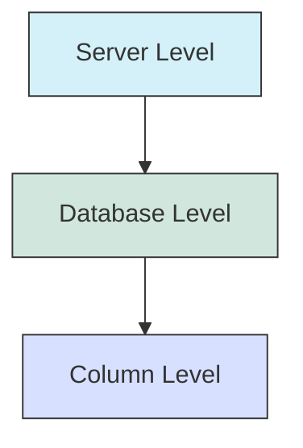

# PostgreSQL Character Sets

## Introduction

When working with text data in PostgreSQL, understanding character sets is crucial, especially when your application needs to handle multiple languages or special characters. Character sets (also called encodings) determine how PostgreSQL stores and interprets text data. Using the right encoding ensures your data remains consistent and displays correctly across different systems and languages.

In this guide, we'll explore PostgreSQL's character set support, how to configure encodings, and best practices for managing multilingual data.

## What Are Character Sets?

A character set is a collection of symbols and characters, along with encoding rules that map these characters to numeric values that computers can store and process. Different character sets support different ranges of characters:

- **ASCII**: Basic English characters (128 characters)
- **Latin1/ISO-8859-1**: Western European languages (256 characters)
- **UTF-8**: Universal encoding supporting virtually all world languages and symbols

PostgreSQL supports numerous character sets, with UTF-8 being the recommended encoding for most modern applications.

## PostgreSQL's Character Set Architecture

PostgreSQL handles character sets at three levels:



1. **Server Level**: The default encoding used when creating new databases
2. **Database Level**: Each database can have its own encoding
3. **Column Level**: Specific text columns can be defined with different encodings (using character set conversion functions)

## Checking Current Encoding Settings

To view the current server, database, and client encoding settings:

```sql
-- Check server encoding
SHOW server_encoding;

-- Check database encoding
SELECT datname, pg_encoding_to_char(encoding) 
FROM pg_database
WHERE datname = current_database();

-- Check client encoding
SHOW client_encoding;
```

Sample output:

```
 server_encoding 
-----------------
 UTF8
(1 row)

   datname    | pg_encoding_to_char 
--------------+---------------------
 my_database  | UTF8
(1 row)

 client_encoding 
-----------------
 UTF8
(1 row)
```

## Setting Up Character Encodings

### Creating a Database with Specific Encoding

When creating a new database, you can specify the encoding:

```sql
CREATE DATABASE multilingual_app
WITH ENCODING 'UTF8'
LC_COLLATE = 'en_US.UTF-8'
LC_CTYPE = 'en_US.UTF-8';
```

The `LC_COLLATE` parameter determines string sorting order, while `LC_CTYPE` defines character classification rules (like which characters are considered letters, digits, etc.).

### Changing Client Encoding

You can change the client encoding for the current session:

```sql
SET client_encoding = 'UTF8';
```

This affects how the client application interprets data from the server.

## Common PostgreSQL Character Sets

PostgreSQL supports many encodings, but the most commonly used ones are:

| Encoding Name | Description | Use Case |
|--------------|-------------|----------|
| UTF8 | Unicode, 8-bit encoding | Modern applications, multilingual support |
| LATIN1 | ISO 8859-1 | Legacy Western European applications |
| LATIN9 | ISO 8859-15 | Like LATIN1 but with Euro symbol (€) |
| SQL_ASCII | ASCII only, no encoding validation | Legacy systems (not recommended) |
| WIN1252 | Windows Latin encoding | Windows legacy applications |

## Working with Unicode Data (UTF-8)

UTF-8 is the recommended encoding for new applications as it supports virtually all characters from all writing systems.

### Storing Multilingual Data Example

```sql
-- Create a table to store multilingual content
CREATE TABLE multilingual_content (
    id SERIAL PRIMARY KEY,
    language_code VARCHAR(5),
    content TEXT,
    description TEXT
);

-- Insert multilingual data
INSERT INTO multilingual_content (language_code, content, description) VALUES
('en', 'Hello, world!', 'English greeting'),
('es', '¡Hola, mundo!', 'Spanish greeting'),
('fr', 'Bonjour le monde!', 'French greeting'),
('de', 'Hallo, Welt!', 'German greeting'),
('ru', 'Привет, мир!', 'Russian greeting'),
('zh', '你好，世界！', 'Chinese greeting'),
('ja', 'こんにちは世界！', 'Japanese greeting'),
('ar', 'مرحبا بالعالم!', 'Arabic greeting');
```

With UTF-8 encoding, PostgreSQL properly stores and retrieves all these different scripts.

## Character Set Conversion Functions

PostgreSQL provides functions to convert between different encodings:

```sql
-- Convert a string from one encoding to another
SELECT convert('Hello', 'UTF8', 'LATIN1');

-- Convert from the database encoding to another encoding
SELECT convert_to('こんにちは', 'EUC_JP');

-- Convert from another encoding to the database encoding
SELECT convert_from(convert_to('こんにちは', 'EUC_JP'), 'EUC_JP');
```

## Collation Support

Collation determines the sorting order of text data. PostgreSQL supports different collations for different languages and locales:

```sql
-- Create a table with a specific collation for a column
CREATE TABLE products (
    id SERIAL PRIMARY KEY,
    name TEXT COLLATE "en_US"
);

-- Insert some data
INSERT INTO products (name) VALUES ('apple'), ('Apple'), ('Äpple'), ('banana');

-- Query sorting data according to the collation rules
SELECT * FROM products ORDER BY name;
```

This ensures text is sorted according to language-specific rules.

## Real-World Example: Building a Multilingual Application

Let's build a simple multilingual product catalog:

```sql
-- Create tables for a multilingual product catalog
CREATE TABLE product_categories (
    category_id SERIAL PRIMARY KEY,
    category_code VARCHAR(50) UNIQUE NOT NULL
);

CREATE TABLE category_translations (
    category_id INTEGER REFERENCES product_categories(category_id),
    language_code VARCHAR(5),
    name TEXT NOT NULL,
    description TEXT,
    PRIMARY KEY (category_id, language_code)
);

CREATE TABLE products (
    product_id SERIAL PRIMARY KEY,
    category_id INTEGER REFERENCES product_categories(category_id),
    product_code VARCHAR(50) UNIQUE NOT NULL,
    price NUMERIC(10, 2) NOT NULL
);

CREATE TABLE product_translations (
    product_id INTEGER REFERENCES products(product_id),
    language_code VARCHAR(5),
    name TEXT NOT NULL,
    description TEXT,
    PRIMARY KEY (product_id, language_code)
);

-- Insert some sample data
INSERT INTO product_categories (category_code) VALUES ('electronics');
INSERT INTO category_translations VALUES 
(1, 'en', 'Electronics', 'Electronic devices and gadgets'),
(1, 'es', 'Electrónica', 'Dispositivos electrónicos y gadgets'),
(1, 'fr', 'Électronique', 'Appareils électroniques et gadgets');

INSERT INTO products (category_id, product_code, price) VALUES (1, 'laptop-pro', 1299.99);
INSERT INTO product_translations VALUES 
(1, 'en', 'Professional Laptop', '15-inch high-performance laptop'),
(1, 'es', 'Portátil Profesional', 'Portátil de alto rendimiento de 15 pulgadas'),
(1, 'fr', 'Ordinateur Portable Professionnel', 'Ordinateur portable haute performance de 15 pouces');

-- Query to retrieve products in a specific language
SELECT p.product_id, p.price, pt.name, pt.description, ct.name as category
FROM products p
JOIN product_translations pt ON p.product_id = pt.product_id
JOIN product_categories pc ON p.category_id = pc.category_id
JOIN category_translations ct ON pc.category_id = ct.category_id
WHERE pt.language_code = 'es' AND ct.language_code = 'es';
```

Output (for Spanish):

```
 product_id |  price  |        name         |              description               |  category   
------------+---------+---------------------+----------------------------------------+-------------
          1 | 1299.99 | Portátil Profesional| Portátil de alto rendimiento de 15 pu... | Electrónica
```

This design allows you to store and retrieve product information in multiple languages while maintaining data integrity.

## Common Issues and Best Practices

### Issues to Watch For

1. **Encoding Mismatch**: When client and server encodings don't match, characters may display incorrectly or cause errors.
2. **Length Limitations**: Multi-byte characters take more storage space, potentially exceeding VARCHAR limits.
3. **Sorting Inconsistencies**: Different collations produce different sorting orders.

### Best Practices

1. **Always Use UTF-8**: For new applications, use UTF-8 encoding to support all languages.
2. **Be Consistent**: Use the same encoding throughout your application stack.
3. **Consider Collations**: Choose appropriate collation for text comparison and sorting.
4. **Test With Real Data**: Test your application with actual multilingual data.
5. **Plan for Length**: When designing VARCHAR fields, remember that UTF-8 characters can take up to 4 bytes.

## Working with Character Sets in PostgreSQL Clients

Different PostgreSQL clients might require specific configuration:

### psql

```bash
# Set client encoding in psql
\encoding UTF8
```

### PostgreSQL JDBC Driver

```java
// Set client encoding in Java
String url = "jdbc:postgresql://localhost/mydb?characterEncoding=UTF-8";
Connection conn = DriverManager.getConnection(url, "username", "password");
```

### Python (psycopg2)

```python
# Set client encoding in Python
conn = psycopg2.connect("dbname=mydb")
conn.set_client_encoding('UTF8')
```

## Summary

PostgreSQL offers robust support for character sets, allowing you to work with text data in virtually any language. By using UTF-8 encoding and understanding how to properly configure and use character sets, you can build applications that seamlessly handle international data.

Key takeaways:
- UTF-8 is the recommended encoding for modern applications
- PostgreSQL supports character encoding at server, database, and column levels
- Proper collation settings ensure correct text sorting and comparison
- For multilingual applications, structure your database to separate language-specific content

## Additional Resources and Exercises

### Resources

- [PostgreSQL Documentation: Character Set Support](https://www.postgresql.org/docs/current/multibyte.html)
- [PostgreSQL Documentation: Collation Support](https://www.postgresql.org/docs/current/collation.html)

### Exercises

1. Create a database with UTF-8 encoding and experiment with inserting and retrieving text in different languages.
2. Build a simple translator application that stores phrases in multiple languages using the database structure shown in the multilingual example.
3. Experiment with different collations to see how they affect text sorting in your language.
4. Create a function that validates if a string contains only characters from a specific script (e.g., Latin, Cyrillic, or Han).