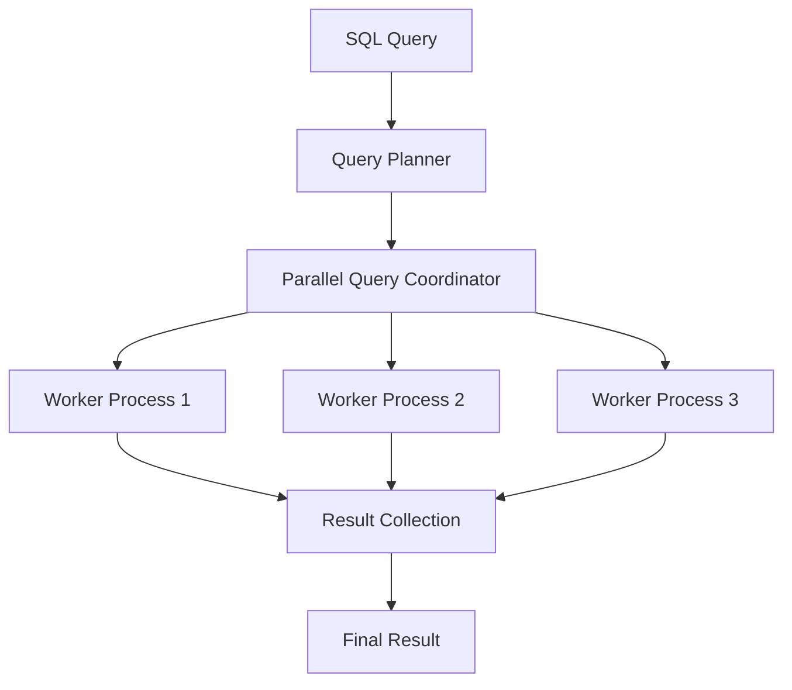

# PostgreSQL Parallel Query

## Introduction

In today's world of large datasets and complex data processing requirements, query performance has become a critical factor in database operations. PostgreSQL, being one of the most advanced open-source relational database systems, introduced parallel query execution capabilities in version 9.6 and has been enhancing this feature in subsequent releases.

Parallel query processing allows PostgreSQL to divide a single query into multiple parts that can be executed simultaneously by different CPU cores. This can significantly reduce query execution time for operations on large tables, particularly those involving full table scans, joins, and aggregations.

In this tutorial, we'll explore how PostgreSQL implements parallel queries, when they are used, how to configure and optimize them, and examine real-world examples to demonstrate their benefits.

## Understanding Parallel Query Processing

### What is Parallel Query Processing?

Parallel query processing is a technique where a single database operation is divided into multiple worker processes that run concurrently. Instead of a single process handling the entire query, multiple CPU cores work together to complete the task faster.



### When Does PostgreSQL Use Parallel Queries?

PostgreSQL does not use parallel query execution for all operations. The query planner determines whether parallelism would be beneficial based on several factors:

1. Query type - Operations like sequential scans, index scans, nested loops, hash joins, and certain aggregations can be parallelized
2. Table size - Parallel query is typically only used for large tables
3. Cost estimate - The query must have an estimated cost above a certain threshold
4. Configuration settings - Various settings control when and how parallel queries are used

## Configuring Parallel Query in PostgreSQL

### Key Configuration Parameters

PostgreSQL provides several parameters to control parallel query execution:

1. `max_parallel_workers_per_gather` - Sets the maximum number of workers that can be started by a single Gather or Gather Merge node
2. `max_parallel_workers` - Sets the maximum number of workers that the system can support for parallel operations
3. `max_worker_processes` - Sets the maximum number of background processes the system can support
4. `parallel_setup_cost` - Controls the planner's estimate of the cost of starting worker processes
5. `parallel_tuple_cost` - Controls the planner's estimate of the cost of transferring tuples from parallel workers to the leader process

Let's see how to check and modify these parameters:

```sql
-- Check current parallel query settings
SHOW max_parallel_workers_per_gather;
SHOW max_parallel_workers;
SHOW max_worker_processes;

-- Modify settings (temporary, for current session only)
SET max_parallel_workers_per_gather = 4;

-- For permanent changes, edit postgresql.conf or use ALTER SYSTEM
ALTER SYSTEM SET max_parallel_workers_per_gather = 4;
ALTER SYSTEM SET max_parallel_workers = 8;
-- Remember to reload configuration after ALTER SYSTEM
SELECT pg_reload_conf();
```

## Analyzing Parallel Query Execution

### EXPLAIN ANALYZE - Understanding Parallel Query Plans

To see whether PostgreSQL is using parallel query execution for a specific query, you can use the `EXPLAIN` command:

```sql
EXPLAIN SELECT AVG(amount) FROM large_transactions;
```

When parallel query is used, you'll see nodes like `Gather` or `Gather Merge` in the execution plan. For a more detailed view, use `EXPLAIN ANALYZE`:

```sql
EXPLAIN ANALYZE SELECT AVG(amount) FROM large_transactions;
```

Example output with parallel execution:

```
                                                QUERY PLAN
----------------------------------------------------------------------------------------------------------
 Gather  (cost=1000.00..217018.52 rows=1 width=32) (actual time=248.771..468.742 rows=1 loops=1)
   Workers Planned: 4
   Workers Launched: 4
   ->  Partial Aggregate  (cost=0.00..215018.42 rows=1 width=32) (actual time=214.411..214.412 rows=1 loops=5)
         ->  Parallel Seq Scan on large_transactions  (cost=0.00..206683.67 rows=3333667 width=8) (actual time=0.014..114.159 rows=2000000 loops=5)
 Planning Time: 0.108 ms
 Execution Time: 468.789 ms
```

In this example:
- PostgreSQL planned and launched 4 worker processes
- Each worker performed a partial scan and aggregation on a portion of the table
- The results were gathered and combined by the coordinator

## Practical Examples

Let's explore some real-world examples where parallel queries can significantly improve performance.

### Example 1: Parallel Sequential Scan

First, let's create a large table for testing:

```sql
-- Create a test table with 10 million rows
CREATE TABLE large_table AS
SELECT 
    generate_series(1, 10000000) AS id,
    md5(random()::text)::varchar(10) AS data,
    random() * 1000 AS value;

-- Add an index on id
CREATE INDEX idx_large_table_id ON large_table(id);

-- Analyze the table to update statistics
ANALYZE large_table;
```

Now, let's compare a sequential scan with and without parallelism:

```sql
-- Disable parallel query
SET max_parallel_workers_per_gather = 0;
EXPLAIN ANALYZE SELECT AVG(value) FROM large_table;

-- Enable parallel query with 4 workers
SET max_parallel_workers_per_gather = 4;
EXPLAIN ANALYZE SELECT AVG(value) FROM large_table;
```

With parallelism disabled, you might see execution times of several seconds. With parallelism enabled, the same query should complete significantly faster, often 3-4x quicker depending on your hardware.

### Example 2: Parallel Joins

Joins between large tables can particularly benefit from parallelism:

```sql
-- Create another table for join testing
CREATE TABLE large_table_2 AS
SELECT 
    generate_series(1, 5000000) AS id,
    md5(random()::text)::varchar(10) AS data,
    random() * 500 AS value;

-- Add an index
CREATE INDEX idx_large_table_2_id ON large_table_2(id);
ANALYZE large_table_2;

-- Compare join performance
SET max_parallel_workers_per_gather = 0;
EXPLAIN ANALYZE
SELECT lt1.id, lt1.data, lt2.data 
FROM large_table lt1 
JOIN large_table_2 lt2 ON lt1.id = lt2.id
WHERE lt1.value BETWEEN 400 AND 500
LIMIT 1000;

-- With parallelism
SET max_parallel_workers_per_gather = 4;
EXPLAIN ANALYZE
SELECT lt1.id, lt1.data, lt2.data 
FROM large_table lt1 
JOIN large_table_2 lt2 ON lt1.id = lt2.id
WHERE lt1.value BETWEEN 400 AND 500
LIMIT 1000;
```

### Example 3: Parallel Aggregations

Aggregation operations across large tables are also excellent candidates for parallelism:

```sql
-- Disable parallelism
SET max_parallel_workers_per_gather = 0;
EXPLAIN ANALYZE
SELECT 
    CASE 
        WHEN value < 250 THEN 'Low'
        WHEN value < 500 THEN 'Medium'
        WHEN value < 750 THEN 'High'
        ELSE 'Very High'
    END AS value_category,
    COUNT(*) as count,
    AVG(value) as avg_value,
    MIN(value) as min_value,
    MAX(value) as max_value
FROM large_table
GROUP BY value_category;

-- Enable parallelism
SET max_parallel_workers_per_gather = 4;
EXPLAIN ANALYZE
SELECT 
    CASE 
        WHEN value < 250 THEN 'Low'
        WHEN value < 500 THEN 'Medium'
        WHEN value < 750 THEN 'High'
        ELSE 'Very High'
    END AS value_category,
    COUNT(*) as count,
    AVG(value) as avg_value,
    MIN(value) as min_value,
    MAX(value) as max_value
FROM large_table
GROUP BY value_category;
```

## Common Issues and Optimization Tips

### When Parallel Query Might Not Be Used

Even when enabled, PostgreSQL might choose not to use parallel query execution in certain situations:

1. The table is too small (less than `min_parallel_table_scan_size` or `min_parallel_index_scan_size`)
2. The query is estimated to complete quickly enough without parallelism
3. There are too many parallel operations already running in the database
4. The query contains operations that cannot be parallelized

### Tips for Optimizing Parallel Query Performance

1. **Adjust worker settings appropriately**: More workers aren't always better. Set `max_parallel_workers_per_gather` based on your CPU cores and workload.

2. **Ensure statistics are up to date**: Run `ANALYZE` regularly to keep statistics current, which helps the planner make good decisions about parallelism.

3. **Consider work_mem settings**: Parallel workers each get their own work memory allocation, so you might need to adjust `work_mem` when using parallel queries.

   ```sql
   -- Check current work_mem setting
   SHOW work_mem;
   
   -- Adjust work_mem (keeping in mind it applies to each worker)
   SET work_mem = '50MB';
   ```

4. **Monitor for diminishing returns**: Adding more workers increases coordination overhead. Test to find the optimal number for your specific queries.

5. **Consider partitioning**: Table partitioning can work well with parallel queries, allowing workers to focus on specific partitions.

## Controlling Parallel Execution at the Query Level

You can control parallel execution for specific queries:

```sql
-- Force disable parallel query for a specific query
SELECT /*+ MAX_PARALLEL_WORKERS(0) */ AVG(value) FROM large_table;

-- Suggest using up to 8 workers for this query
SELECT /*+ PARALLEL(large_table, 8) */ AVG(value) FROM large_table;
```

## Real-world Use Cases

### Data Warehousing and Analytics

Parallel queries shine in analytical workloads where large tables need to be scanned and aggregated. For example, calculating monthly sales metrics across years of transaction data.

### Reporting Systems

Generating complex reports that involve multiple joins and aggregations across large datasets can be significantly accelerated with parallel execution.

### Batch Processing

Data migration, ETL processes, and batch updates that process large volumes of data can benefit from parallel execution.

```sql
-- Example of a batch update that can benefit from parallelism
UPDATE large_table
SET value = value * 1.1
WHERE data LIKE 'A%';
```

## Summary

PostgreSQL's parallel query capability is a powerful feature that can dramatically improve performance for operations on large tables. Key points to remember:

- Parallel queries divide work among multiple CPU cores to speed up execution
- Not all queries benefit from parallelism—it's most effective for CPU-intensive operations on large tables
- Configuration parameters like `max_parallel_workers_per_gather` control parallel execution behavior
- Use `EXPLAIN ANALYZE` to verify whether queries are using parallelism and how effective it is
- Regular table analysis and proper hardware resources are important to get the most benefit

By understanding when and how to use parallel queries, you can significantly enhance the performance of your PostgreSQL database for large-scale data processing tasks.

## Additional Resources and Exercises

### Exercises

1. Create a large table (at least 1 million rows) and experiment with different values for `max_parallel_workers_per_gather` to find the optimal setting for your hardware.

2. Compare the performance of various aggregation functions (COUNT, AVG, SUM, etc.) with and without parallel query enabled.

3. Investigate how the LIMIT clause affects the use of parallel queries. At what point does adding a LIMIT make parallel execution less advantageous?

4. Create tables of different sizes and determine at what size parallelism begins to show significant benefits on your system.

### Resources for Further Learning

- The [PostgreSQL documentation on parallel query](https://www.postgresql.org/docs/current/parallel-query.html) offers detailed information about implementation and configuration
- The `pg_stat_activity` view can show you active parallel workers in your database
- Performance testing tools like pgbench can help benchmark different parallel configurations

Remember that optimal settings will vary based on your specific hardware, workload, and database design. Regular testing and monitoring are key to getting the most out of PostgreSQL's parallel query capabilities.