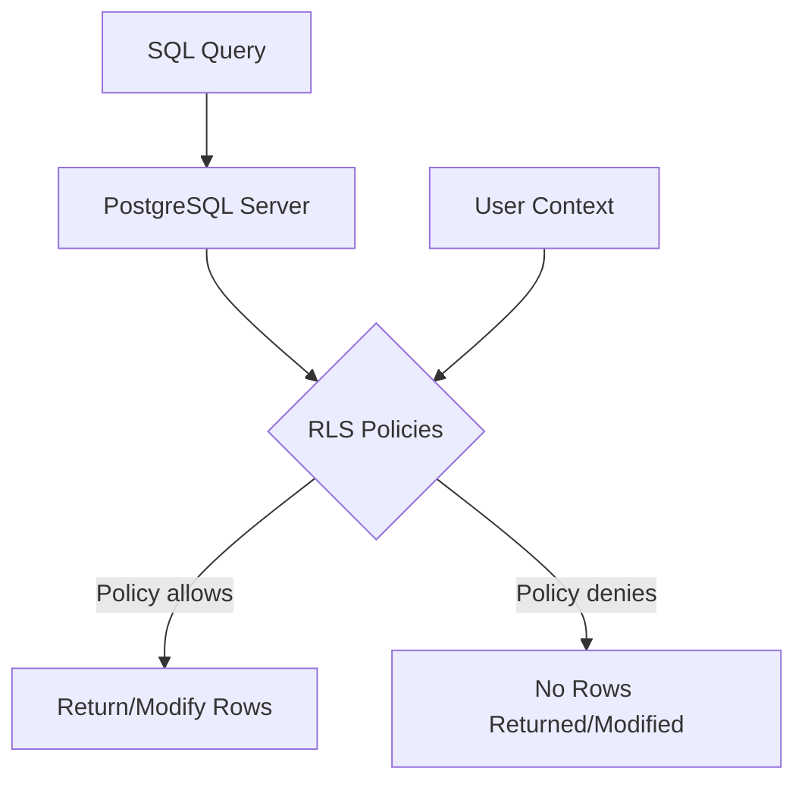

# PostgreSQL Row Level Security

## Introduction

Database security is a critical aspect of application development. While most database systems offer table-level permissions, real-world applications often require more granular control. PostgreSQL Row Level Security (RLS) solves this problem by allowing you to control access to rows in a table based on the user executing the query.

Row Level Security enables you to implement powerful security policies directly in your database that restrict which rows a user can see or modify. This feature is especially useful for multi-tenant applications, applications with complex permission systems, or any situation where different users should have access to different subsets of data within the same table.

## What is Row Level Security?

Row Level Security is a PostgreSQL feature that allows database administrators to define security policies that restrict, on a per-user basis, which rows can be returned by normal queries or inserted, updated, or deleted by data modification commands.

In simpler terms, RLS lets you add conditions to determine which rows a user can access based on who they are or what role they have.



## Prerequisites

To follow along with this tutorial, you should have:

1. PostgreSQL 9.5 or later installed
2. Basic knowledge of SQL and PostgreSQL
3. Access to a PostgreSQL database with administrative privileges

## Enabling Row Level Security

To use Row Level Security, you need to:

1. Create a table with the data you want to secure
2. Enable RLS on the table
3. Create one or more security policies

Let's walk through a practical example.

### Step 1: Create a Sample Table

First, let's create a simple `documents` table to demonstrate RLS:

```sql
CREATE TABLE documents (
    id SERIAL PRIMARY KEY,
    title TEXT,
    content TEXT,
    owner TEXT
);

-- Insert some sample data
INSERT INTO documents (title, content, owner)
VALUES 
    ('HR Guidelines', 'Company HR policies and procedures', 'hr_dept'),
    ('Financial Report 2023', 'Annual financial results', 'finance_dept'),
    ('Marketing Strategy', 'Q3 marketing campaign details', 'marketing_dept'),
    ('Public Announcement', 'New product launch details', 'public');
```

### Step 2: Create Database Roles

Let's create roles for our different departments:

```sql
CREATE ROLE hr_dept;
CREATE ROLE finance_dept;
CREATE ROLE marketing_dept;
CREATE ROLE public_user;

-- Create a normal user who belongs to HR department
CREATE ROLE alice LOGIN PASSWORD 'secure_password';
GRANT hr_dept TO alice;

-- Create another user for finance department
CREATE ROLE bob LOGIN PASSWORD 'secure_password';
GRANT finance_dept TO bob;
```

### Step 3: Enable Row Level Security

Now, let's enable RLS on our table:

```sql
ALTER TABLE documents ENABLE ROW LEVEL SECURITY;
```

By default, with RLS enabled but no policies defined, no rows will be visible to normal users. Let's fix that with policies.

### Step 4: Create Security Policies

Now, we'll create security policies that define which rows each role can access:

```sql
-- Allow users to see only documents they own (based on their department)
CREATE POLICY department_document_access ON documents
    FOR SELECT
    USING (owner = current_user OR owner IN (SELECT rolname FROM pg_roles WHERE pg_has_role(current_user, oid, 'member')));

-- Public documents are visible to everyone
CREATE POLICY public_document_access ON documents
    FOR SELECT
    USING (owner = 'public');

-- Only document owners can update their documents
CREATE POLICY department_document_update ON documents
    FOR UPDATE
    USING (owner = current_user OR owner IN (SELECT rolname FROM pg_roles WHERE pg_has_role(current_user, oid, 'member')));
```

Let's break down what these policies do:

1. `department_document_access`: Allows users to see documents owned by their department
2. `public_document_access`: Makes documents with owner='public' visible to all users
3. `department_document_update`: Only allows updates to documents by their owners

### Step 5: Grant Table Permissions

Even with RLS policies, users need standard PostgreSQL permissions on the table:

```sql
-- Grant SELECT permission to all roles
GRANT SELECT ON documents TO hr_dept, finance_dept, marketing_dept, public_user;

-- Grant UPDATE permission to all roles except public_user
GRANT UPDATE ON documents TO hr_dept, finance_dept, marketing_dept;
```

## Testing Row Level Security

Let's test our policies to see how they work in practice:

### As the database administrator (bypasses RLS)

```sql
-- Connect as superuser or owner of the table
SELECT * FROM documents;
```

**Output:**
```
 id |        title        |             content             |     owner     
----+---------------------+---------------------------------+---------------
  1 | HR Guidelines       | Company HR policies and procedures | hr_dept
  2 | Financial Report 2023 | Annual financial results       | finance_dept
  3 | Marketing Strategy  | Q3 marketing campaign details    | marketing_dept
  4 | Public Announcement | New product launch details       | public
```

### As HR department user (Alice)

```sql
-- Connect as Alice
-- psql -U alice -d your_database

SET ROLE alice;
SELECT * FROM documents;
```

**Output:**
```
 id |     title      |            content             |  owner  
----+----------------+--------------------------------+---------
  1 | HR Guidelines  | Company HR policies and procedures | hr_dept
  4 | Public Announcement | New product launch details | public
```

Notice that Alice can only see HR documents and public documents.

### As Finance department user (Bob)

```sql
-- Connect as Bob
-- psql -U bob -d your_database

SET ROLE bob;
SELECT * FROM documents;
```

**Output:**
```
 id |        title        |        content         |     owner     
----+---------------------+------------------------+---------------
  2 | Financial Report 2023 | Annual financial results | finance_dept
  4 | Public Announcement | New product launch details | public
```

Bob can only see finance documents and public documents.

## Advanced Row Level Security Techniques

Now that we understand the basics, let's explore some more advanced RLS techniques.

### Using Different Policies for Different Operations

RLS policies can be created for specific operations (SELECT, INSERT, UPDATE, DELETE). This allows for fine-grained control over what operations a user can perform on which rows.

```sql
-- Allow departments to see their own documents and public ones
CREATE POLICY read_own_and_public ON documents
    FOR SELECT
    USING (owner = current_user OR owner = 'public');

-- Only allow inserting documents for your own department
CREATE POLICY insert_own ON documents
    FOR INSERT
    WITH CHECK (owner = current_user);

-- Only allow updating your own department's documents
CREATE POLICY update_own ON documents
    FOR UPDATE
    USING (owner = current_user)
    WITH CHECK (owner = current_user);

-- Only allow deleting your own department's documents
CREATE POLICY delete_own ON documents
    FOR DELETE
    USING (owner = current_user);
```

### Using RLS with Application-Level Users

In many applications, you'll have an application-level user system rather than PostgreSQL roles for each user. You can still use RLS by having your application set a session variable:

```sql
-- Create a table with user_id column
CREATE TABLE customer_data (
    id SERIAL PRIMARY KEY,
    user_id INTEGER NOT NULL,
    data TEXT
);

-- Enable RLS
ALTER TABLE customer_data ENABLE ROW LEVEL SECURITY;

-- Create policy using session variable
CREATE POLICY user_data_access ON customer_data
    USING (user_id = current_setting('app.current_user_id')::INTEGER);

-- In your application, set the session variable
-- before executing queries
SET app.current_user_id = '123';

-- Now queries will only show rows where user_id = 123
SELECT * FROM customer_data;
```

### Policies with Complex Conditions

Security policies can contain complex conditions using any valid PostgreSQL expression:

```sql
-- Create a more complex table
CREATE TABLE project_tasks (
    id SERIAL PRIMARY KEY,
    project_id INTEGER,
    title TEXT,
    description TEXT,
    assigned_to TEXT,
    status TEXT,
    created_by TEXT,
    created_at TIMESTAMP DEFAULT CURRENT_TIMESTAMP
);

-- Enable RLS
ALTER TABLE project_tasks ENABLE ROW LEVEL SECURITY;

-- Create a complex policy
CREATE POLICY task_access ON project_tasks
    USING (
        -- Project managers can see all tasks
        EXISTS (SELECT 1 FROM user_roles WHERE user_name = current_user AND role = 'project_manager')
        OR
        -- Users can see tasks assigned to them
        assigned_to = current_user
        OR
        -- Users can see tasks they created
        created_by = current_user
        OR
        -- Everyone can see completed tasks
        status = 'completed'
    );
```

## Common Patterns and Best Practices

### Multi-Tenant Applications

RLS is perfect for multi-tenant applications where each tenant's data should be isolated:

```sql
-- Create a multi-tenant table
CREATE TABLE tenant_data (
    id SERIAL PRIMARY KEY,
    tenant_id INTEGER NOT NULL,
    data TEXT
);

-- Enable RLS
ALTER TABLE tenant_data ENABLE ROW LEVEL SECURITY;

-- Create a policy that restricts access by tenant
CREATE POLICY tenant_isolation ON tenant_data
    USING (tenant_id = current_setting('app.current_tenant_id')::INTEGER);

-- Your application would set this before queries
SET app.current_tenant_id = '42';
```

### Bypassing RLS for Administrative Functions

Sometimes administrators need to bypass RLS for maintenance tasks. This can be done by either:

1. Using a role with the `BYPASSRLS` attribute:

```sql
-- Create an admin role that bypasses RLS
CREATE ROLE admin_user BYPASSRLS;
```

2. Making a role the owner of the table:

```sql
-- The table owner bypasses RLS by default
ALTER TABLE documents OWNER TO admin_user;
```

### Auditing and Logging with RLS

You can implement auditing policies that allow read-only access for auditors:

```sql
-- Create a policy for auditors that allows read-only access
CREATE POLICY audit_access ON financial_records
    FOR SELECT
    USING (pg_has_role(current_user, 'auditor', 'member'));

-- But prevent auditors from modifying data
-- (No INSERT/UPDATE/DELETE policies for auditors)
```

## Performance Considerations

Row Level Security adds conditions to queries, which can impact performance. Here are some tips to minimize the impact:

1. **Index the columns used in policies**: If your policy filters on `owner` or `tenant_id`, make sure these columns are indexed.

```sql
CREATE INDEX ON documents(owner);
```

2. **Keep policies simple**: Complex policies with subqueries can slow down performance.

3. **Monitor query plans**: Use `EXPLAIN ANALYZE` to see how RLS affects your queries.

```sql
EXPLAIN ANALYZE SELECT * FROM documents;
```

4. **Consider materialized views**: For complex reports, consider using materialized views that pre-filter data based on permissions.

## Troubleshooting

### No Rows Returned

If no rows are being returned when you expect some:

1. Verify RLS is enabled on the table:

```sql
SELECT relname, relrowsecurity 
FROM pg_class 
WHERE relname = 'documents';
```

2. Check existing policies:

```sql
SELECT tablename, policyname, roles, cmd, qual, with_check 
FROM pg_policies 
WHERE tablename = 'documents';
```

3. Test as the table owner to bypass RLS and see all rows.

### Policy Not Working as Expected

If a policy isn't working as expected, you can debug by:

1. Simplifying the policy to isolate the issue
2. Testing the policy conditions separately:

```sql
-- If your policy has condition: owner = current_user
-- Test it directly
SELECT id, title, owner = current_user AS policy_allows
FROM documents;
```

## Summary

PostgreSQL Row Level Security provides a powerful way to implement fine-grained access control directly at the database level. By defining security policies, you can control exactly which rows each user can access without having to implement complex filtering logic in your application code.

Key benefits of using RLS include:

1. **Security is enforced at the database level**, minimizing the risk of application-level security bugs
2. **Access control logic is centralized** in one place
3. **Performance optimizations** can be applied directly to the security policies
4. **Simplifies application code** by moving security logic to the database

Remember the key steps to implement RLS:

1. Enable RLS on a table with `ALTER TABLE table_name ENABLE ROW LEVEL SECURITY;`
2. Create policies with `CREATE POLICY policy_name ON table_name USING (condition);`
3. Grant appropriate table permissions with standard PostgreSQL GRANT commands

## Additional Resources

To learn more about PostgreSQL Row Level Security, check out these resources:

- [PostgreSQL Official Documentation on RLS](https://www.postgresql.org/docs/current/ddl-rowsecurity.html)
- [PostgreSQL Security Technical Implementation Guide](https://www.postgresql.org/about/security/)
- [PostgreSQL Wiki on RLS](https://wiki.postgresql.org/wiki/Row_Security_Policies)

## Exercises

1. Create a blog application database schema with tables for posts, comments, and users. Implement RLS so that:
   - Public posts are visible to everyone
   - Draft posts are only visible to their authors
   - Authors can only edit their own posts
   - Administrators can edit all posts

2. Implement a multi-tenant CRM system where:
   - Each sales representative can only see their own customers
   - Sales managers can see all customers in their region
   - The system administrator can see all customers

3. Add RLS to an existing table in your database and write policies that match your application's permission model.

Good luck implementing Row Level Security in your PostgreSQL databases!