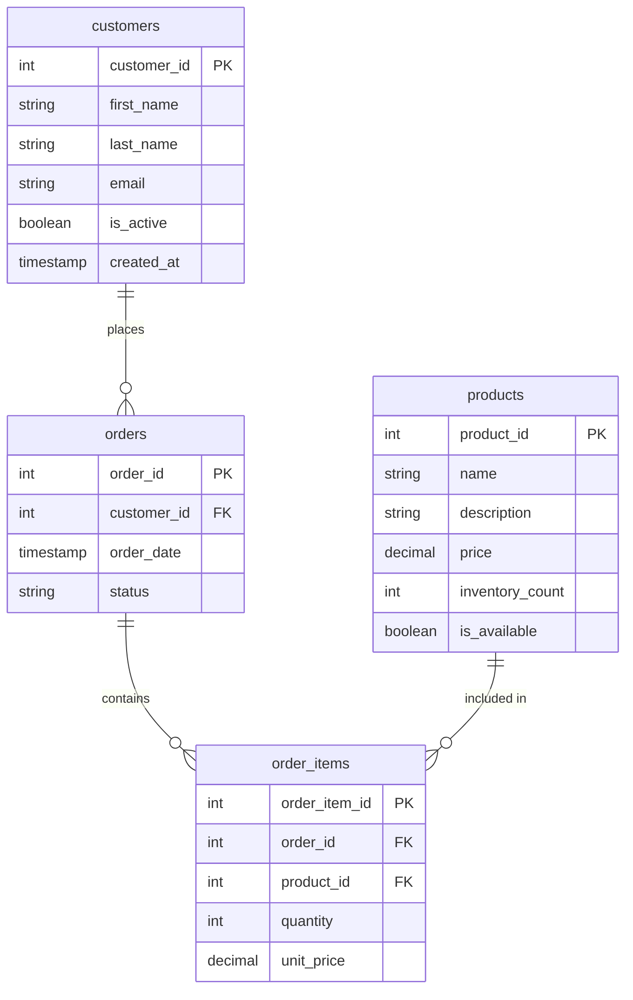

# PostgreSQL Naming Conventions

## Introduction

Consistent naming conventions are a fundamental aspect of maintaining a well-organized PostgreSQL database. Much like how clean code improves software development, clean database design enhances database management. This guide explores essential PostgreSQL naming conventions that will help you create more readable, maintainable, and professional database structures.

Whether you're working solo or as part of a team, following these conventions will reduce confusion, prevent errors, and make your database easier to understand for everyone involved, including your future self when you revisit your work months later.

## Why Naming Conventions Matter

Before diving into specific conventions, let's understand why they're crucial:

1. **Readability** - Clear names make queries easier to understand at a glance
2. **Maintainability** - Consistent patterns help when modifying database structures
3. **Collaboration** - Team members can understand each other's work more easily
4. **Reduced Errors** - Fewer naming conflicts and mistaken identities
5. **Documentation** - Names themselves serve as a form of self-documentation

## General Naming Principles

### Case Sensitivity

PostgreSQL stores all identifiers in lowercase unless they're double-quoted. For consistency:

```sql
-- Recommended (unquoted, will be stored as lowercase)
CREATE TABLE users (
    user_id SERIAL PRIMARY KEY
);

-- Avoid (quoted identifiers are case-sensitive)
CREATE TABLE "Users" (
    "User_ID" SERIAL PRIMARY KEY
);
```

### Character Set

Stick to ASCII letters, numbers, and underscores:

- Use a-z (lowercase letters)
- Use 0-9 (numbers)
- Use _ (underscore)
- Avoid spaces or special characters

### Naming Length

PostgreSQL allows identifiers up to 63 bytes, but for practicality:

- Be descriptive but concise
- Aim for names between 3 and 30 characters
- Use abbreviations only when they're widely understood

## Table Naming Conventions

### Use Plural Nouns

Tables represent collections of entities, so plural forms are most appropriate:

```sql
-- Good
CREATE TABLE users (...);
CREATE TABLE products (...);
CREATE TABLE order_items (...);

-- Avoid
CREATE TABLE user (...);
CREATE TABLE product (...);
```

### Junction Tables

For many-to-many relationships, join both table names with an underscore:

```sql
-- Good (alphabetical order is recommended)
CREATE TABLE products_categories (...); -- Joining products and categories
CREATE TABLE students_courses (...);    -- Joining students and courses

-- Alternative convention (using linking verb)
CREATE TABLE product_has_category (...);
```

### Prefixes and Suffixes

Avoid adding unnecessary type information to table names:

```sql
-- Avoid
CREATE TABLE tbl_users (...);
CREATE TABLE users_table (...);
```

## Column Naming Conventions

### Primary Keys

Use a singular table name with `_id` suffix:

```sql
CREATE TABLE products (
    product_id SERIAL PRIMARY KEY,  -- Good
    -- id SERIAL PRIMARY KEY,       -- Too generic
    -- productid SERIAL PRIMARY KEY -- No underscore reduces readability
);
```

### Foreign Keys

Match the referencing column name to the primary key it references:

```sql
CREATE TABLE orders (
    order_id SERIAL PRIMARY KEY,
    customer_id INTEGER REFERENCES customers(customer_id)  -- Good
    -- customer INTEGER REFERENCES customers(customer_id)  -- Avoid
);
```

### Boolean Columns

Use prefixes like `is_`, `has_`, or `can_`:

```sql
CREATE TABLE users (
    user_id SERIAL PRIMARY KEY,
    is_active BOOLEAN DEFAULT TRUE,
    is_admin BOOLEAN DEFAULT FALSE,
    has_verified_email BOOLEAN DEFAULT FALSE
);
```

### Date and Time Columns

Use suffixes like `_date`, `_time`, or `_at`:

```sql
CREATE TABLE orders (
    order_id SERIAL PRIMARY KEY,
    created_at TIMESTAMP DEFAULT CURRENT_TIMESTAMP,
    updated_at TIMESTAMP,
    delivery_date DATE,
    processing_time INTERVAL
);
```

### Avoid Reserved Words

Don't use PostgreSQL [reserved words](https://www.postgresql.org/docs/current/sql-keywords-appendix.html) as identifiers:

```sql
-- Avoid these column names
CREATE TABLE products (
    order INTEGER,    -- "order" is a reserved word
    user VARCHAR(50), -- "user" is a reserved word
    group INTEGER     -- "group" is a reserved word
);

-- Better alternatives
CREATE TABLE products (
    order_number INTEGER,
    username VARCHAR(50),
    group_id INTEGER
);
```

## Schema Naming Conventions

Schemas help organize database objects. Common conventions include:

```sql
-- Application modules
CREATE SCHEMA accounting;
CREATE SCHEMA inventory;
CREATE SCHEMA hr;

-- Function or purpose
CREATE SCHEMA api;     -- Tables/functions exposed via API
CREATE SCHEMA staging; -- Temporary data processing
CREATE SCHEMA audit;   -- Audit logging

-- Versioning (for API changes)
CREATE SCHEMA v1;
CREATE SCHEMA v2;
```

## Index Naming Conventions

Clear index names help with maintenance. A common pattern is:

```
idx_[tablename]_[columnname(s)]
```

Examples:

```sql
-- Single-column index
CREATE INDEX idx_users_email ON users (email);

-- Multi-column index
CREATE INDEX idx_products_category_name ON products (category_id, name);

-- Unique index
CREATE UNIQUE INDEX idx_users_username_unique ON users (username);
```

## Constraint Naming Conventions

Explicit constraint names make error messages more helpful and simplify maintenance:

### Primary Keys

```
pk_[tablename]
```

```sql
CREATE TABLE products (
    product_id SERIAL,
    CONSTRAINT pk_products PRIMARY KEY (product_id)
);
```

### Foreign Keys

```
fk_[tablename]_[referenced_tablename]
```

```sql
CREATE TABLE orders (
    order_id SERIAL PRIMARY KEY,
    customer_id INTEGER,
    CONSTRAINT fk_orders_customers FOREIGN KEY (customer_id) 
        REFERENCES customers (customer_id)
);
```

### Unique Constraints

```
uq_[tablename]_[columnname(s)]
```

```sql
CREATE TABLE users (
    user_id SERIAL PRIMARY KEY,
    email VARCHAR(255),
    CONSTRAINT uq_users_email UNIQUE (email)
);
```

### Check Constraints

```
ck_[tablename]_[constraint_description]
```

```sql
CREATE TABLE products (
    product_id SERIAL PRIMARY KEY,
    price NUMERIC(10,2),
    CONSTRAINT ck_products_positive_price CHECK (price > 0)
);
```

## Function and Procedure Naming

Use verbs to indicate action:

```sql
-- Functions by purpose
CREATE FUNCTION get_customer_balance(customer_id INTEGER) RETURNS NUMERIC AS $$
    -- Function body
$$ LANGUAGE SQL;

CREATE FUNCTION calculate_order_total(order_id INTEGER) RETURNS NUMERIC AS $$
    -- Function body
$$ LANGUAGE SQL;

-- Triggers typically use trigger purpose followed by table
CREATE FUNCTION update_modified_timestamp() RETURNS TRIGGER AS $$
    -- Function body
$$ LANGUAGE plpgsql;
```

## Naming in Practice: Complete Example

Let's see these conventions applied to a simple e-commerce database:

```sql
-- Schemas
CREATE SCHEMA store;
CREATE SCHEMA reporting;

-- Tables with properly named columns
CREATE TABLE store.customers (
    customer_id SERIAL PRIMARY KEY,
    first_name VARCHAR(50) NOT NULL,
    last_name VARCHAR(50) NOT NULL,
    email VARCHAR(255) NOT NULL,
    is_active BOOLEAN DEFAULT TRUE,
    created_at TIMESTAMP DEFAULT CURRENT_TIMESTAMP,
    CONSTRAINT uq_customers_email UNIQUE (email)
);

CREATE TABLE store.products (
    product_id SERIAL PRIMARY KEY,
    name VARCHAR(100) NOT NULL,
    description TEXT,
    price NUMERIC(10,2) NOT NULL,
    inventory_count INTEGER NOT NULL DEFAULT 0,
    is_available BOOLEAN DEFAULT TRUE,
    CONSTRAINT ck_products_positive_price CHECK (price > 0)
);

CREATE TABLE store.orders (
    order_id SERIAL PRIMARY KEY,
    customer_id INTEGER NOT NULL,
    order_date TIMESTAMP DEFAULT CURRENT_TIMESTAMP,
    status VARCHAR(20) DEFAULT 'pending',
    CONSTRAINT fk_orders_customers FOREIGN KEY (customer_id)
        REFERENCES store.customers (customer_id)
);

CREATE TABLE store.order_items (
    order_item_id SERIAL PRIMARY KEY,
    order_id INTEGER NOT NULL,
    product_id INTEGER NOT NULL,
    quantity INTEGER NOT NULL,
    unit_price NUMERIC(10,2) NOT NULL,
    CONSTRAINT fk_order_items_orders FOREIGN KEY (order_id)
        REFERENCES store.orders (order_id),
    CONSTRAINT fk_order_items_products FOREIGN KEY (product_id)
        REFERENCES store.products (product_id),
    CONSTRAINT ck_order_items_positive_quantity CHECK (quantity > 0)
);

-- Indexes
CREATE INDEX idx_customers_last_name ON store.customers (last_name);
CREATE INDEX idx_orders_customer_id ON store.orders (customer_id);
CREATE INDEX idx_order_items_order_id ON store.order_items (order_id);
CREATE INDEX idx_order_items_product_id ON store.order_items (product_id);

-- Function
CREATE FUNCTION store.calculate_order_total(order_id_param INTEGER) 
RETURNS NUMERIC AS $$
    SELECT SUM(quantity * unit_price)
    FROM store.order_items
    WHERE order_id = order_id_param;
$$ LANGUAGE SQL;
```

## Visual Database Schema Representation

Here's a visual representation of our example database schema:



## Common Naming Anti-patterns

Avoid these common naming issues:

1. **Inconsistent pluralization**
   ```sql
   CREATE TABLE person (...);  -- Singular
   CREATE TABLE products (...); -- Plural
   ```

2. **Ambiguous abbreviations**
   ```sql
   CREATE TABLE cust (...);  -- What does "cust" mean?
   ```

3. **Including data types in names**
   ```sql
   CREATE TABLE users (
       user_id_int SERIAL,
       user_name_str VARCHAR(50)
   );
   ```

4. **Using PostgreSQL reserved words**
   ```sql
   CREATE TABLE order (...);  -- "order" is a reserved word
   ```

5. **Inconsistent letter case**
   ```sql
   CREATE TABLE UserData (...);
   CREATE TABLE product_info (...);
   ```

## Summary

Well-designed naming conventions provide significant benefits for PostgreSQL database design:

- They improve readability and self-documentation
- They reduce maintenance overhead and errors
- They facilitate collaboration among team members
- They create a more professional and polished database structure

The conventions outlined in this guide represent common best practices, but the most important principle is consistency. Choose conventions that work for your team and project, document them clearly, and apply them uniformly throughout your database.

## Additional Resources

To continue learning about PostgreSQL best practices:

1. PostgreSQL's official documentation on [Identifiers and Key Words](https://www.postgresql.org/docs/current/sql-syntax-lexical.html#SQL-SYNTAX-IDENTIFIERS)
2. [SQL Style Guide](https://www.sqlstyle.guide/) by Simon Holywell
3. [Database Naming Standards](https://launchbylunch.com/posts/2014/Feb/16/sql-naming-conventions/) by Launch by Lunch

## Exercises

1. Review an existing database schema and identify any naming inconsistencies
2. Rewrite the following table creation script using proper naming conventions:
   ```sql
   CREATE TABLE Customer (
       ID SERIAL PRIMARY KEY,
       CustomerName VARCHAR(100),
       EMAIL VARCHAR(255),
       isActive BOOLEAN,
       created TIMESTAMP
   );
   ```
3. Design a database schema for a library management system using the naming conventions discussed in this guide