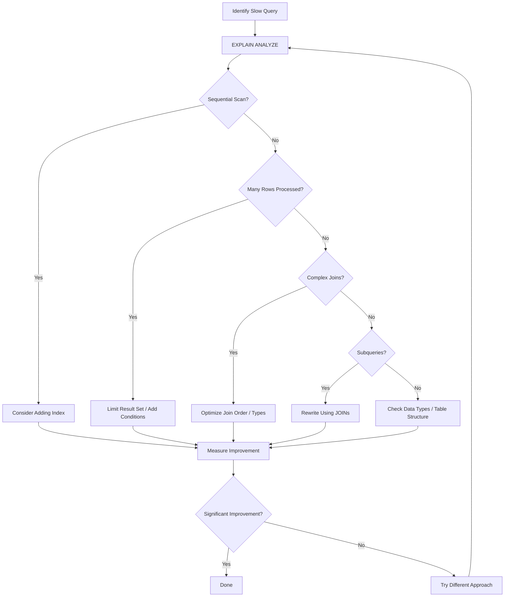

# PostgreSQL Query Optimization

## Introduction

Query optimization is the process of improving the performance and efficiency of database queries. In PostgreSQL, optimizing your queries can dramatically reduce execution time, decrease server load, and improve overall application responsiveness. This guide will walk you through the fundamentals of PostgreSQL query optimization, providing practical examples and techniques that you can apply to your own database applications.

Whether you're dealing with a small dataset or managing gigabytes of information, understanding how to write efficient queries is an essential skill for any database developer.

## Why Query Optimization Matters

Unoptimized queries can lead to several problems:

- Slow application response times
- Excessive CPU and memory usage
- Database server overload
- Poor user experience
- Higher hosting costs

Let's explore how to identify and solve these problems through effective query optimization.

## Understanding the PostgreSQL Query Planner

Before diving into optimization techniques, it's important to understand how PostgreSQL processes queries. PostgreSQL uses a query planner/optimizer to determine the most efficient way to execute a query.

### EXPLAIN Command

The `EXPLAIN` command is your best friend for query optimization. It shows the execution plan generated by the PostgreSQL planner.

```sql
EXPLAIN SELECT * FROM users WHERE email = 'user@example.com';
```

Sample output:

```
                        QUERY PLAN
----------------------------------------------------------
 Seq Scan on users  (cost=0.00..25.88 rows=1 width=140)
   Filter: (email = 'user@example.com'::text)
```

For more detailed information, use `EXPLAIN ANALYZE`, which actually executes the query:

```sql
EXPLAIN ANALYZE SELECT * FROM users WHERE email = 'user@example.com';
```

Sample output:

```
                          QUERY PLAN
---------------------------------------------------------------
 Seq Scan on users  (cost=0.00..25.88 rows=1 width=140)
                    (actual time=0.028..0.029 rows=1 loops=1)
   Filter: (email = 'user@example.com'::text)
   Rows Removed by Filter: 99
 Planning Time: 0.181 ms
 Execution Time: 0.049 ms
```

The output shows that PostgreSQL performed a sequential scan (Seq Scan) on the users table, checking each row to find the matching email. This is inefficient for large tables!

## Essential Query Optimization Techniques

### 1. Proper Indexing

Indexes are perhaps the most powerful optimization tool. They allow PostgreSQL to find data without scanning the entire table.

#### Creating Basic Indexes

```sql
-- Create an index on the email column
CREATE INDEX idx_users_email ON users(email);
```

After creating this index, let's run our query again:

```sql
EXPLAIN ANALYZE SELECT * FROM users WHERE email = 'user@example.com';
```

New output:

```
                                  QUERY PLAN
----------------------------------------------------------------------------
 Index Scan using idx_users_email on users  (cost=0.29..8.30 rows=1 width=140)
                                           (actual time=0.009..0.010 rows=1 loops=1)
   Index Cond: (email = 'user@example.com'::text)
 Planning Time: 0.103 ms
 Execution Time: 0.026 ms
```

Notice how PostgreSQL now uses an Index Scan instead of a Sequential Scan, making the query much faster.

#### Types of Indexes

PostgreSQL supports several index types:

1. **B-tree** (default): Good for equality and range queries
2. **Hash**: Optimized for equality comparisons only
3. **GiST**: For geometric data and full-text search
4. **GIN**: Good for composite types and arrays
5. **BRIN**: Efficient for very large tables with naturally ordered data

For most cases, B-tree indexes are sufficient.

#### Composite Indexes

When your queries filter on multiple columns, consider a composite index:

```sql
-- Create a composite index on first_name and last_name
CREATE INDEX idx_users_names ON users(first_name, last_name);
```

This is effective for queries like:

```sql
SELECT * FROM users WHERE first_name = 'John' AND last_name = 'Doe';
```

Remember that the order of columns in composite indexes matters. In the example above, the index is useful for filtering on `first_name` alone, but not for filtering only on `last_name`.

### 2. Optimizing JOINs

JOINs can be resource-intensive operations. Here are some strategies to optimize them:

#### Join Order

PostgreSQL's query planner usually determines the best join order, but sometimes it needs help:

```sql
-- This might not use the most efficient join order
SELECT u.username, p.title 
FROM users u
JOIN posts p ON u.id = p.user_id
JOIN comments c ON p.id = c.post_id
WHERE c.created_at > '2023-01-01';

-- Rewriting to help the planner
SELECT u.username, p.title 
FROM comments c
JOIN posts p ON p.id = c.post_id
JOIN users u ON u.id = p.user_id
WHERE c.created_at > '2023-01-01';
```

The second query starts with filtering comments by date, potentially reducing the number of rows before joining with other tables.

#### Using Proper Join Types

Choose the appropriate join type for your query:

- `INNER JOIN`: Returns matching rows from both tables
- `LEFT JOIN`: Returns all rows from the left table and matching rows from the right table
- `RIGHT JOIN`: Returns all rows from the right table and matching rows from the left table
- `FULL JOIN`: Returns all rows when there's a match in either table

Using the right join type can improve performance by reducing unnecessary processing.

### 3. Limiting Result Sets

Always limit your result sets to what you actually need:

```sql
-- Avoid this when you don't need all columns
SELECT * FROM large_table;

-- Better approach
SELECT id, name, email FROM large_table WHERE status = 'active';
```

#### Using LIMIT and OFFSET

For pagination:

```sql
-- Get 20 records, skipping the first 40
SELECT id, title FROM posts ORDER BY created_at DESC LIMIT 20 OFFSET 40;
```

Note that large `OFFSET` values can be inefficient. For better pagination performance, consider using keyset pagination:

```sql
-- More efficient pagination using a reference point
SELECT id, title FROM posts 
WHERE created_at < '2023-06-01 12:34:56' 
ORDER BY created_at DESC 
LIMIT 20;
```

### 4. Query Rewriting

Sometimes, rewriting a query can dramatically improve performance.

#### Avoid Subqueries When Possible

```sql
-- Subquery (may be slower)
SELECT * FROM users 
WHERE id IN (SELECT user_id FROM orders WHERE amount > 1000);

-- Alternative using JOIN (often faster)
SELECT DISTINCT u.* FROM users u
JOIN orders o ON u.id = o.user_id
WHERE o.amount > 1000;
```

#### Use EXISTS Instead of COUNT When Checking Existence

```sql
-- Less efficient way to check if any records exist
SELECT COUNT(*) > 0 FROM orders WHERE user_id = 123;

-- More efficient approach
SELECT EXISTS (SELECT 1 FROM orders WHERE user_id = 123);
```

### 5. Optimizing Database Structure

#### Normalize Only When Necessary

While normalization reduces data redundancy, it can lead to more JOINs. Consider denormalizing certain frequently accessed data if it improves query performance.

#### Use Appropriate Data Types

Using proper data types saves storage space and improves performance:

```sql
-- Less efficient
CREATE TABLE products (
    id SERIAL PRIMARY KEY,
    name VARCHAR(100),
    price VARCHAR(10)  -- Storing numbers as strings is inefficient
);

-- More efficient
CREATE TABLE products (
    id SERIAL PRIMARY KEY,
    name VARCHAR(100),
    price DECIMAL(10,2)  -- Proper numeric type
);
```

## Measuring and Monitoring Performance

### Using pg_stat_statements

The `pg_stat_statements` extension tracks query execution statistics:

```sql
-- Enable the extension
CREATE EXTENSION pg_stat_statements;

-- View the most time-consuming queries
SELECT query, calls, total_time, mean_time
FROM pg_stat_statements
ORDER BY total_time DESC
LIMIT 10;
```

This helps identify problematic queries for optimization.

### Regular VACUUM and ANALYZE

PostgreSQL's VACUUM process reclaims storage and updates statistics:

```sql
-- Basic vacuum
VACUUM;

-- Analyze to update statistics
ANALYZE;

-- Combine both operations
VACUUM ANALYZE;
```

Consider automating these operations using PostgreSQL's `autovacuum` feature.

## Real-World Query Optimization Example

Let's walk through optimizing a real-world query step by step:

### Initial Query

Imagine we have a blog application with the following schema:

```sql
CREATE TABLE users (
    id SERIAL PRIMARY KEY,
    username VARCHAR(50) UNIQUE,
    email VARCHAR(100) UNIQUE,
    created_at TIMESTAMP DEFAULT CURRENT_TIMESTAMP
);

CREATE TABLE posts (
    id SERIAL PRIMARY KEY,
    user_id INTEGER REFERENCES users(id),
    title VARCHAR(200),
    content TEXT,
    created_at TIMESTAMP DEFAULT CURRENT_TIMESTAMP
);

CREATE TABLE comments (
    id SERIAL PRIMARY KEY,
    post_id INTEGER REFERENCES posts(id),
    user_id INTEGER REFERENCES users(id),
    content TEXT,
    created_at TIMESTAMP DEFAULT CURRENT_TIMESTAMP
);

CREATE TABLE tags (
    id SERIAL PRIMARY KEY,
    name VARCHAR(50) UNIQUE
);

CREATE TABLE post_tags (
    post_id INTEGER REFERENCES posts(id),
    tag_id INTEGER REFERENCES tags(id),
    PRIMARY KEY (post_id, tag_id)
);
```

Our initial query retrieves all posts with their author information, comment counts, and tags for posts created in the last month:

```sql
SELECT 
    p.id, 
    p.title, 
    p.content, 
    p.created_at,
    u.username,
    (SELECT COUNT(*) FROM comments c WHERE c.post_id = p.id) AS comment_count,
    (SELECT string_agg(t.name, ', ') 
     FROM tags t 
     JOIN post_tags pt ON t.id = pt.tag_id 
     WHERE pt.post_id = p.id) AS tags
FROM posts p
JOIN users u ON p.user_id = u.id
WHERE p.created_at >= CURRENT_DATE - INTERVAL '30 days'
ORDER BY p.created_at DESC;
```

### Optimization Process

#### Step 1: Analyze the query

```sql
EXPLAIN ANALYZE SELECT [the query above];
```

Let's assume we notice several issues:
- Sequential scans on multiple tables
- Subqueries executed for each row
- Inefficient string aggregation

#### Step 2: Add appropriate indexes

```sql
-- For filtering posts by date
CREATE INDEX idx_posts_created_at ON posts(created_at);

-- For joining posts and users
CREATE INDEX idx_posts_user_id ON posts(user_id);

-- For the comments subquery
CREATE INDEX idx_comments_post_id ON comments(post_id);

-- For the tags subquery
CREATE INDEX idx_post_tags_post_id ON post_tags(post_id);
```

#### Step 3: Rewrite the query to eliminate subqueries

```sql
SELECT 
    p.id, 
    p.title, 
    p.content, 
    p.created_at,
    u.username,
    COALESCE(c.comment_count, 0) AS comment_count,
    COALESCE(t.tags, '') AS tags
FROM posts p
JOIN users u ON p.user_id = u.id
LEFT JOIN (
    SELECT post_id, COUNT(*) AS comment_count
    FROM comments
    GROUP BY post_id
) c ON p.id = c.post_id
LEFT JOIN (
    SELECT pt.post_id, string_agg(t.name, ', ') AS tags
    FROM post_tags pt
    JOIN tags t ON pt.tag_id = t.id
    GROUP BY pt.post_id
) t ON p.id = t.post_id
WHERE p.created_at >= CURRENT_DATE - INTERVAL '30 days'
ORDER BY p.created_at DESC;
```

#### Step 4: Analyze again and measure improvement

Running `EXPLAIN ANALYZE` on the optimized query should show significant performance improvements, with index scans replacing sequential scans and better join strategies.

## Common Optimization Pitfalls

1. **Over-indexing**: Too many indexes can slow down write operations and increase storage requirements.
2. **Premature optimization**: Focus on optimizing the queries that actually cause performance issues.
3. **Not updating statistics**: Regular `ANALYZE` commands help PostgreSQL make better query plans.
4. **One-size-fits-all approach**: Different queries may require different optimization strategies.

## Query Optimization Flowchart



## Summary

Query optimization in PostgreSQL involves:

1. Understanding the query planner with `EXPLAIN ANALYZE`
2. Creating appropriate indexes
3. Optimizing JOIN operations
4. Limiting result sets to only what's needed
5. Rewriting queries for better performance
6. Structuring your database appropriately
7. Regular monitoring and maintenance

By applying these techniques, you can significantly improve the performance of your PostgreSQL database, leading to faster applications and better user experience.

## Further Resources

- PostgreSQL Official Documentation on Performance Tips: [https://www.postgresql.org/docs/current/performance-tips.html](https://www.postgresql.org/docs/current/performance-tips.html)
- PostgreSQL Indexing Strategies: [https://www.postgresql.org/docs/current/indexes-strategies.html](https://www.postgresql.org/docs/current/indexes-strategies.html)
- PostgreSQL Query Planning: [https://www.postgresql.org/docs/current/planner-optimizer.html](https://www.postgresql.org/docs/current/planner-optimizer.html)

## Exercises

1. Take a slow query from your own project and analyze it using `EXPLAIN ANALYZE`.
2. Identify tables in your database that would benefit from additional indexes.
3. Find a query with a subquery and try rewriting it using JOINs. Compare the performance.
4. Create a test database with at least 10,000 rows and experiment with different query optimization techniques.
5. Practice interpreting `EXPLAIN` output for different types of queries to understand how the planner works.