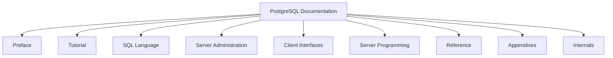

# PostgreSQL Documentation

## Introduction

PostgreSQL documentation is a valuable resource for developers working with this powerful open-source relational database system. Whether you're troubleshooting an issue, learning new features, or optimizing your database operations, knowing how to navigate and utilize the official documentation effectively is an essential skill.

In this guide, we'll explore how to access, understand, and apply PostgreSQL documentation to solve real-world problems. We'll cover the structure of the documentation, how to find information quickly, and how to interpret the technical information presented.

## Understanding PostgreSQL Documentation Structure

PostgreSQL maintains extensive documentation that is logically organized to help you find information quickly. The documentation is divided into several main sections:



### Main Documentation Sections

- **Preface**: Contains information about PostgreSQL itself, including version history and contribution guidelines.
- **Tutorial**: A step-by-step introduction to PostgreSQL for beginners.
- **SQL Language**: Comprehensive coverage of SQL syntax and commands as implemented in PostgreSQL.
- **Server Administration**: Guidance on installation, configuration, and maintenance.
- **Client Interfaces**: Information about client programming interfaces.
- **Server Programming**: Details on extending PostgreSQL functionality.
- **Reference**: Complete reference for SQL commands, client commands, and server applications.
- **Appendixes**: Additional information including data types, operators, functions, and more.
- **Internals**: Information about PostgreSQL's internal architecture for advanced users.

## How to Access PostgreSQL Documentation

### Online Documentation

The official PostgreSQL documentation is available online at [https://www.postgresql.org/docs/](https://www.postgresql.org/docs/). This is often the most up-to-date source.

### Local Documentation

If you've installed PostgreSQL on your system, documentation might be included locally:

```bash
# On Linux/macOS, you might find it at:
/usr/share/doc/postgresql/

# On Windows:
C:\Program Files\PostgreSQL\<version>\doc\
```

### Command Line Access

PostgreSQL provides the `\h` and `\?` meta-commands in the `psql` client for quick reference:

```sql
-- Get help on SQL commands
\h

-- Get help on a specific command
\h SELECT

-- Get help on psql commands
\?
```

## Navigating Documentation Effectively

### Using the Search Function

The online documentation includes a powerful search function. When looking for specific information:

1. Use quotation marks for exact phrases
2. Include version numbers if relevant
3. Try both technical terms and plain language descriptions

### Version-Specific Documentation

Always make sure you're consulting documentation for your specific PostgreSQL version. Features, syntax, and behavior can change between versions.

```bash
# Check your PostgreSQL version
psql -c "SELECT version();"
```

Then navigate to the matching documentation version online.

## Understanding Documentation Conventions

PostgreSQL documentation uses specific conventions to present information clearly:

### SQL Syntax Notation

```
[ ] square brackets denote optional parts
{ } curly braces denote required choices
| vertical bar separates alternatives
... indicates repetition
```

For example, the `SELECT` statement syntax is shown as:

```sql
SELECT [ ALL | DISTINCT [ ON ( expression [, ...] ) ] ]
    * | expression [ [ AS ] output_name ] [, ...]
    [ FROM from_item [, ...] ]
    [ WHERE condition ]
    [ GROUP BY [ ALL | DISTINCT ] grouping_element [, ...] ]
    [ HAVING condition ]
    ...
```

This notation tells you which parts are optional and where you have choices.

## Practical Examples: Using Documentation to Solve Problems

Let's walk through some common scenarios where documentation can help:

### Example 1: Finding the Right Data Type

Suppose you need to store geographical coordinates in your database.

1. Navigate to the "Data Types" section in the documentation
2. Look for spatial data types
3. Find the `point` data type documentation:

```sql
-- Creating a table with a point data type
CREATE TABLE locations (
    id SERIAL PRIMARY KEY,
    name TEXT,
    coordinates POINT
);

-- Inserting a point
INSERT INTO locations (name, coordinates) 
VALUES ('Central Park', '(40.785091, -73.968285)');

-- Querying by distance
SELECT name, coordinates 
FROM locations 
WHERE coordinates <-> point '(40.7, -74.0)' < 0.1;
```

By consulting the documentation, you learned not only about the data type but also about operators like `<->` for calculating distances.

### Example 2: Troubleshooting Connection Issues

If you're having trouble connecting to your PostgreSQL database, the documentation can guide you:

1. Navigate to "Server Administration" > "Client Authentication"
2. Review the `pg_hba.conf` file documentation
3. Apply the knowledge to modify your configuration:

```bash
# Example pg_hba.conf line allowing local connections
# TYPE  DATABASE        USER            ADDRESS                 METHOD
host    all             all             127.0.0.1/32            md5
```

The documentation explains each field in detail, helping you understand and fix authentication problems.

### Example 3: Optimizing Query Performance

When your queries are running slowly, the documentation can help you optimize them:

1. Navigate to "Performance Tips" in the documentation
2. Learn about the `EXPLAIN` command
3. Apply it to analyze your query:

```sql
-- Using EXPLAIN to analyze query performance
EXPLAIN ANALYZE
SELECT customers.name, SUM(orders.amount) 
FROM customers 
JOIN orders ON customers.id = orders.customer_id
WHERE orders.created_at > '2023-01-01'
GROUP BY customers.name;
```

The documentation helps you interpret the output and make informed decisions about indexes or query restructuring.

## Essential Documentation Sections for Beginners

If you're new to PostgreSQL, focus on these documentation sections first:

1. **Tutorial**: Provides a hands-on introduction to basic concepts
2. **SQL Commands**: Reference for the most commonly used SQL commands
3. **Data Types**: Information about available data types and their usage
4. **Functions and Operators**: Common functions for data manipulation and calculation
5. **Indexes**: Understanding how to optimize query performance

## Documentation for Common Tasks

### Creating and Managing Databases

```sql
-- Create a new database
CREATE DATABASE my_database;

-- Connect to the database
\c my_database

-- List all databases
\l
```

### Creating Tables and Defining Relationships

```sql
-- Create a table
CREATE TABLE products (
    id SERIAL PRIMARY KEY,
    name VARCHAR(100) NOT NULL,
    price DECIMAL(10, 2),
    category_id INTEGER REFERENCES categories(id)
);

-- Create an index
CREATE INDEX idx_product_name ON products(name);
```

### Querying Data

```sql
-- Basic SELECT query
SELECT * FROM products WHERE price < 100;

-- JOIN example
SELECT products.name, categories.name AS category
FROM products
JOIN categories ON products.category_id = categories.id;

-- Aggregation example
SELECT category_id, AVG(price) AS avg_price
FROM products
GROUP BY category_id
HAVING AVG(price) > 50;
```

## Advanced Documentation Topics

As you become more experienced with PostgreSQL, explore these advanced documentation topics:

### Stored Procedures and Functions

```sql
-- Creating a simple function
CREATE OR REPLACE FUNCTION get_product_count(category_id_param INTEGER)
RETURNS INTEGER AS $$
DECLARE
    product_count INTEGER;
BEGIN
    SELECT COUNT(*) INTO product_count
    FROM products
    WHERE category_id = category_id_param;
    
    RETURN product_count;
END;
$$ LANGUAGE plpgsql;

-- Using the function
SELECT get_product_count(5);
```

### Triggers

```sql
-- Creating a trigger to update a timestamp
CREATE OR REPLACE FUNCTION update_modified_column()
RETURNS TRIGGER AS $$
BEGIN
    NEW.updated_at = NOW();
    RETURN NEW;
END;
$$ LANGUAGE plpgsql;

CREATE TRIGGER update_product_modtime
BEFORE UPDATE ON products
FOR EACH ROW
EXECUTE FUNCTION update_modified_column();
```

### Full-Text Search

```sql
-- Creating a text search configuration
CREATE TEXT SEARCH CONFIGURATION my_config (
    COPY = english
);

-- Searching using text search
SELECT title
FROM articles
WHERE to_tsvector('my_config', content) @@ to_tsquery('postgresql & database');
```

## Tips for Effective Documentation Use

1. **Bookmark frequently accessed sections**: Save links to documentation pages you reference often.
2. **Use the version selector**: Ensure you're viewing documentation for your specific PostgreSQL version.
3. **Read related sections**: Documentation often has "See Also" links that provide valuable context.
4. **Check examples**: The documentation includes practical examples that demonstrate concepts.
5. **Explore community resources**: The official documentation is complemented by community tutorials and forums.

## Summary

PostgreSQL documentation is a comprehensive and essential resource for developers at all skill levels. By understanding how to navigate and utilize this documentation effectively, you can solve problems more efficiently, learn about PostgreSQL's capabilities, and improve your database design and performance.

Regular reference to the documentation helps you follow best practices and make the most of PostgreSQL's powerful features. As you grow more comfortable with the documentation structure, you'll find it easier to discover new capabilities and apply them to your projects.

## Additional Resources

- **PostgreSQL Wiki**: Contains additional information and community contributions
- **PostgreSQL Mailing Lists**: Archive of discussions that often cover advanced topics
- **Official PostgreSQL Tutorial**: Step-by-step introduction to using PostgreSQL
- **Community Extensions**: Documentation for popular extensions like PostGIS, pgAdmin, and more

## Practice Exercises

1. Use the documentation to find three string manipulation functions and write example queries using each.
2. Navigate to the indexing section of the documentation and determine which type of index would be best for a column containing email addresses.
3. Find the documentation for the `COPY` command and use it to write a statement that would import data from a CSV file.
4. Use the documentation to learn about PostgreSQL's JSON capabilities and write a query that extracts a value from a JSON column.
5. Review the documentation on connection pooling and write a summary of the available options and their trade-offs.