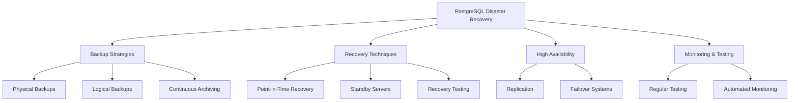

# PostgreSQL Disaster Recovery

## Introduction

Disaster recovery is a critical aspect of database management that ensures business continuity when unexpected events occur. For PostgreSQL databases, having a well-planned disaster recovery strategy can mean the difference between minor disruption and catastrophic data loss.

In this guide, we'll explore the fundamentals of PostgreSQL disaster recovery, covering backup strategies, recovery techniques, and best practices to help you protect your valuable data against various failure scenarios.

## Understanding Disaster Recovery

Disaster recovery (DR) involves a set of policies, tools, and procedures designed to enable the recovery of database infrastructure and data after a disruptive event. These events can range from hardware failures and data corruption to natural disasters and cyberattacks.

### Why Disaster Recovery Matters

For PostgreSQL databases, effective disaster recovery planning is essential because:

- **Data Protection**: Safeguards critical business information
- **Business Continuity**: Minimizes downtime during disruptions
- **Compliance**: Meets regulatory requirements for data protection
- **Risk Mitigation**: Reduces the impact of unplanned outages

## Key Components of PostgreSQL Disaster Recovery



## 1. Backup Strategies

### Physical Backups with `pg_basebackup`

Physical backups capture the raw database files, providing a complete snapshot of your database cluster at a specific moment.

```bash
# Basic pg_basebackup command
pg_basebackup -h localhost -D /backup/path -U postgres -P -Ft -z

# Output:
# 24152/24152 kB (100%), 1/1 tablespace
# pg_basebackup: base backup completed
```

**Key parameters explained:**
- `-h`: Database server hostname
- `-D`: Destination directory for the backup
- `-U`: PostgreSQL username
- `-P`: Show progress
- `-Ft`: Output in tar format
- `-z`: Enable compression

### Logical Backups with `pg_dump`

Logical backups export database objects and data in a format that can be used to recreate the database.

```bash
# Backup a single database
pg_dump -h localhost -U postgres -d mydatabase -F c -f /backup/path/mydatabase.dump

# Backup all databases
pg_dumpall -h localhost -U postgres -f /backup/path/all_databases.sql
```

### Continuous Archiving and Write-Ahead Logs (WAL)

PostgreSQL's Write-Ahead Log (WAL) records all changes made to the database, enabling point-in-time recovery.

To set up WAL archiving, modify your `postgresql.conf`:

```
# Enable WAL archiving
wal_level = replica
archive_mode = on
archive_command = 'cp %p /archive/path/%f'
```

## 2. Recovery Techniques

### Point-in-Time Recovery (PITR)

PITR allows you to restore a database to any specific moment in time using a base backup and WAL archives.

**Step 1**: Create a recovery configuration file (`recovery.conf` or PostgreSQL 12+ settings in `postgresql.conf`):

```
# For PostgreSQL 12+
restore_command = 'cp /archive/path/%f %p'
recovery_target_time = '2023-06-15 14:30:00'
```

**Step 2**: Start the recovery process:

```bash
# Start PostgreSQL to begin recovery
pg_ctl -D /data/directory start
```

### Recovery from Logical Backups

Restoring from a logical backup:

```bash
# Restore from a custom-format dump
pg_restore -h localhost -U postgres -d mydatabase -v /backup/path/mydatabase.dump

# Output:
# pg_restore: creating TABLE "public.users"
# pg_restore: processing data for table "public.users"
# ...
```

## 3. High Availability Solutions

### Streaming Replication

Streaming replication creates a standby server that continuously applies WAL records from the primary server.

**Primary server configuration** (`postgresql.conf`):

```
listen_addresses = '*'
wal_level = replica
max_wal_senders = 10
wal_keep_size = 1GB
```

**Primary server authentication** (`pg_hba.conf`):

```
host replication replica_user 192.168.1.0/24 md5
```

**Standby server configuration** (`postgresql.conf` + `postgresql.auto.conf` or `recovery.conf` for older versions):

```
# For PostgreSQL 12+
primary_conninfo = 'host=primary_server_ip port=5432 user=replica_user password=password'
promotion_trigger_file = '/var/lib/postgresql/data/trigger'
```

### Using `pg_rewind` for Failed Primary Recovery

After a failover, you can use `pg_rewind` to resynchronize a failed primary server:

```bash
pg_rewind --target-pgdata=/path/to/failed/primary --source-server="host=new_primary port=5432 user=postgres" -P
```

## 4. Real-world Disaster Recovery Scenarios

### Scenario 1: Hardware Failure

When a database server experiences hardware failure:

```bash
# 1. Set up a new server
# 2. Restore the latest base backup
pg_basebackup -h backup_server -D /var/lib/postgresql/data -U postgres

# 3. Create a recovery configuration for PITR
echo "restore_command = 'cp /archive/path/%f %p'" > /var/lib/postgresql/data/recovery.signal

# 4. Start PostgreSQL to begin recovery
pg_ctl -D /var/lib/postgresql/data start
```

### Scenario 2: Data Corruption

If data corruption is detected:

```bash
# 1. Stop the PostgreSQL server
pg_ctl -D /var/lib/postgresql/data stop

# 2. Identify the time before corruption occurred
# 3. Restore using PITR
echo "restore_command = 'cp /archive/path/%f %p'" > /var/lib/postgresql/data/recovery.signal
echo "recovery_target_time = '2023-06-15 10:30:00'" >> /var/lib/postgresql/data/postgresql.conf

# 4. Start PostgreSQL to begin recovery
pg_ctl -D /var/lib/postgresql/data start
```

## 5. Disaster Recovery Best Practices

### Automate Backup Procedures

Use scripts and scheduling tools to automate regular backups:

```bash
#!/bin/bash
# Simple backup script for daily PostgreSQL backups

# Variables
BACKUP_DIR=/backup/postgresql
DATE=$(date +%Y-%m-%d)
DB_USER=postgres

# Create backup directory for today
mkdir -p $BACKUP_DIR/$DATE

# Perform a base backup
pg_basebackup -h localhost -U $DB_USER -D $BACKUP_DIR/$DATE/base -Ft -z -P

# Backup individual databases
for DB in $(psql -U $DB_USER -t -c "SELECT datname FROM pg_database WHERE datname NOT IN ('template0', 'template1', 'postgres')")
do
    pg_dump -U $DB_USER -Fc -f $BACKUP_DIR/$DATE/${DB}.dump $DB
done

# Cleanup old backups (keep for 30 days)
find $BACKUP_DIR -type d -mtime +30 -exec rm -rf {} \;
```

### Regular Recovery Testing

Schedule periodic recovery tests to validate your backup integrity and recovery procedures:

```bash
# Create a test environment
mkdir -p /test/recovery
cd /test/recovery

# Copy the latest backup
cp /backup/path/latest.dump .

# Create a test database
createdb -U postgres test_recovery

# Restore the backup to test environment
pg_restore -U postgres -d test_recovery latest.dump

# Verify data integrity with key queries
psql -U postgres -d test_recovery -c "SELECT count(*) FROM important_table;"
```

### Document Your Disaster Recovery Plan

Create a comprehensive disaster recovery document that includes:

1. Backup schedule and retention policy
2. Recovery procedures for different scenarios
3. Contact information for responsible team members
4. Recovery time objectives (RTO) and recovery point objectives (RPO)
5. Testing schedule and validation procedures

## 6. PostgreSQL Recovery Tools

### pgBackRest

pgBackRest is a powerful backup and restore solution with advanced features:

```bash
# Install pgBackRest
apt-get install pgbackrest

# Create a simple configuration
cat > /etc/pgbackrest.conf << EOF
[global]
repo1-path=/var/lib/pgbackrest

[postgres]
pg1-path=/var/lib/postgresql/data
EOF

# Create a full backup
pgbackrest --stanza=postgres backup --type=full

# Restore a backup
pgbackrest --stanza=postgres restore
```

### Barman (Backup and Recovery Manager)

Barman is another popular backup and recovery tool for PostgreSQL:

```bash
# Install Barman
apt-get install barman

# Configure Barman
cat > /etc/barman.d/main.conf << EOF
[main]
description = "Main PostgreSQL Server"
conninfo = host=postgres user=barman dbname=postgres
ssh_command = ssh postgres@postgres
backup_method = rsync
archiver = on
EOF

# Take a backup
barman backup main

# Recover to a specific point in time
barman recover --target-time "2023-06-15 14:30:00" main 20230615T123000 /var/lib/postgresql/data
```

## Summary

A robust PostgreSQL disaster recovery strategy is essential for maintaining data integrity and business continuity. By implementing proper backup procedures, establishing high availability solutions, and regularly testing recovery processes, you can minimize downtime and data loss when disasters strike.

Remember that disaster recovery is not a one-time setup but an ongoing process that requires regular maintenance, testing, and updates to remain effective as your database environment evolves.

## Additional Resources

- [PostgreSQL Documentation: Backup and Restore](https://www.postgresql.org/docs/current/backup.html)
- [PostgreSQL Documentation: High Availability, Load Balancing, and Replication](https://www.postgresql.org/docs/current/high-availability.html)
- [pgBackRest Documentation](https://pgbackrest.org/)
- [Barman Documentation](https://pgbarman.org/)

## Practice Exercises

1. Set up WAL archiving on a test PostgreSQL database.
2. Perform a point-in-time recovery to a specific timestamp.
3. Configure streaming replication between two PostgreSQL instances.
4. Create an automated backup script that includes both physical and logical backups.
5. Simulate a disaster scenario and perform a complete recovery using your backups.