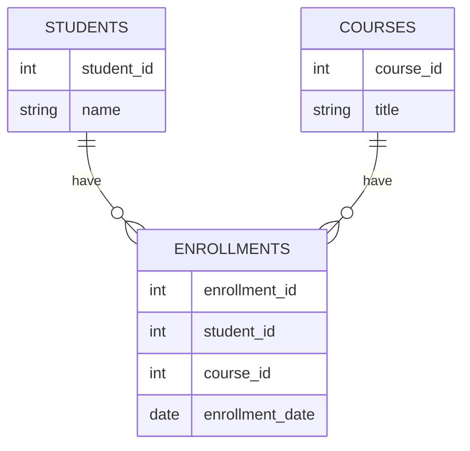
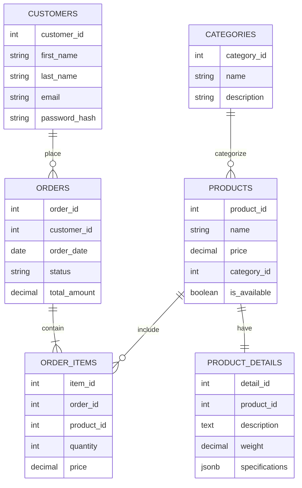

# PostgreSQL Schema Design

## Introduction

A well-designed database schema serves as the foundation for any robust application. In PostgreSQL, schema design involves planning the structure of your database to ensure data integrity, optimize performance, and make your database maintainable as your application evolves. This guide will walk you through the essential concepts of PostgreSQL schema design, from basic principles to practical implementation.

## What is a Schema in PostgreSQL?

In PostgreSQL, a schema is a namespace that contains named database objects such as tables, views, indexes, data types, functions, and operators. Schemas help organize database objects and allow multiple users to use a database without interfering with each other.

Think of a schema as a folder within your database that groups related objects:

```sql
-- Creating a new schema
CREATE SCHEMA inventory;

-- Creating a table within that schema
CREATE TABLE inventory.products (
    product_id SERIAL PRIMARY KEY,
    name VARCHAR(100) NOT NULL,
    price DECIMAL(10, 2) NOT NULL
);
```

By default, all objects are created in the `public` schema if not specified otherwise.

## Core Schema Design Principles

### Normalization

Normalization is a database design technique that reduces data redundancy and improves data integrity. Let's look at the common normalization forms:

#### First Normal Form (1NF)
- Each table has a primary key
- Each column contains atomic values
- No repeating groups

**Before 1NF:**
```
| order_id | customer_name | products                      |
|----------|---------------|-------------------------------|
| 1        | John Smith    | Laptop, Mouse, Keyboard       |
```

**After 1NF:**
```
| order_id | customer_name | product    |
|----------|---------------|------------|
| 1        | John Smith    | Laptop     |
| 1        | John Smith    | Mouse      |
| 1        | John Smith    | Keyboard   |
```

#### Second Normal Form (2NF)
- Must be in 1NF
- All non-key attributes are fully dependent on the primary key

#### Third Normal Form (3NF)
- Must be in 2NF
- No transitive dependencies (non-key attributes depend only on the primary key)

### Data Types

PostgreSQL offers a rich set of data types. Choosing the appropriate data type is crucial for both storage efficiency and query performance:

```sql
CREATE TABLE products (
    id SERIAL PRIMARY KEY,
    name VARCHAR(100) NOT NULL,
    description TEXT,
    price DECIMAL(10, 2) NOT NULL,
    created_at TIMESTAMP WITH TIME ZONE DEFAULT CURRENT_TIMESTAMP,
    is_available BOOLEAN DEFAULT TRUE,
    category_id INTEGER REFERENCES categories(id),
    tags JSONB -- For flexible, schema-less data
);
```

Some commonly used PostgreSQL data types:

| Data Type                | Use Case                                |
|--------------------------|----------------------------------------|
| INTEGER, BIGINT          | Whole numbers                          |
| DECIMAL, NUMERIC         | Precise decimal numbers (e.g., money)  |
| VARCHAR(n)               | Variable-length text with limit        |
| TEXT                     | Unlimited length text                  |
| TIMESTAMP                | Date and time                          |
| BOOLEAN                  | True/false values                      |
| JSONB                    | JSON data with binary storage          |
| UUID                     | Universally unique identifiers         |
| ARRAY                    | Array of values                        |

## Relationships in PostgreSQL

### Primary Keys

A primary key uniquely identifies each record in a table:

```sql
CREATE TABLE customers (
    customer_id SERIAL PRIMARY KEY,
    first_name VARCHAR(50) NOT NULL,
    last_name VARCHAR(50) NOT NULL,
    email VARCHAR(100) UNIQUE NOT NULL
);
```

### Foreign Keys

Foreign keys establish relationships between tables:

```sql
CREATE TABLE orders (
    order_id SERIAL PRIMARY KEY,
    customer_id INTEGER REFERENCES customers(customer_id),
    order_date TIMESTAMP DEFAULT CURRENT_TIMESTAMP,
    status VARCHAR(20) CHECK (status IN ('pending', 'processing', 'shipped', 'delivered'))
);
```

### Types of Relationships

#### One-to-One Relationship

One record in the first table corresponds to exactly one record in the second table.

```sql
CREATE TABLE users (
    user_id SERIAL PRIMARY KEY,
    username VARCHAR(50) UNIQUE NOT NULL,
    password_hash VARCHAR(100) NOT NULL
);

CREATE TABLE user_profiles (
    profile_id SERIAL PRIMARY KEY,
    user_id INTEGER REFERENCES users(user_id) UNIQUE,
    avatar_url VARCHAR(255),
    bio TEXT
);
```

#### One-to-Many Relationship

One record in the first table corresponds to multiple records in the second table.

```sql
CREATE TABLE authors (
    author_id SERIAL PRIMARY KEY,
    name VARCHAR(100) NOT NULL
);

CREATE TABLE books (
    book_id SERIAL PRIMARY KEY,
    title VARCHAR(255) NOT NULL,
    author_id INTEGER REFERENCES authors(author_id),
    published_date DATE
);
```

#### Many-to-Many Relationship

Multiple records in the first table correspond to multiple records in the second table, requiring a junction table.

```sql
CREATE TABLE students (
    student_id SERIAL PRIMARY KEY,
    name VARCHAR(100) NOT NULL
);

CREATE TABLE courses (
    course_id SERIAL PRIMARY KEY,
    title VARCHAR(100) NOT NULL
);

CREATE TABLE enrollments (
    enrollment_id SERIAL PRIMARY KEY,
    student_id INTEGER REFERENCES students(student_id),
    course_id INTEGER REFERENCES courses(course_id),
    enrollment_date DATE DEFAULT CURRENT_DATE,
    UNIQUE(student_id, course_id)  -- Each student can enroll in a course only once
);
```

Let's visualize this relationship with a diagram:



## Constraints for Data Integrity

Constraints ensure the accuracy and reliability of the data in your database:

### NOT NULL Constraint

Ensures that a column cannot have NULL values:

```sql
CREATE TABLE products (
    product_id SERIAL PRIMARY KEY,
    name VARCHAR(100) NOT NULL,
    price DECIMAL(10, 2) NOT NULL
);
```

### UNIQUE Constraint

Ensures that all values in a column are different:

```sql
CREATE TABLE users (
    user_id SERIAL PRIMARY KEY,
    email VARCHAR(100) UNIQUE NOT NULL,
    username VARCHAR(50) UNIQUE NOT NULL
);
```

### CHECK Constraint

Ensures that values in a column satisfy a specific condition:

```sql
CREATE TABLE employees (
    employee_id SERIAL PRIMARY KEY,
    first_name VARCHAR(50) NOT NULL,
    last_name VARCHAR(50) NOT NULL,
    salary DECIMAL(10, 2) CHECK (salary > 0),
    age INTEGER CHECK (age >= 18)
);
```

### DEFAULT Values

Provides a default value for a column when none is specified:

```sql
CREATE TABLE comments (
    comment_id SERIAL PRIMARY KEY,
    user_id INTEGER REFERENCES users(user_id),
    content TEXT NOT NULL,
    created_at TIMESTAMP DEFAULT CURRENT_TIMESTAMP,
    is_approved BOOLEAN DEFAULT FALSE
);
```

## Schema Evolution and Migrations

As your application evolves, your database schema will need to change. Here's how to manage schema changes:

### Adding a New Column

```sql
ALTER TABLE products ADD COLUMN weight DECIMAL(8, 2);
```

### Modifying a Column

```sql
-- Change data type
ALTER TABLE users ALTER COLUMN username TYPE VARCHAR(100);

-- Add a constraint
ALTER TABLE products ADD CONSTRAINT price_check CHECK (price > 0);
```

### Removing a Column

```sql
ALTER TABLE users DROP COLUMN middle_name;
```

### Using Migrations

For production applications, use a migration tool (like Flyway or Liquibase) to track and apply schema changes:

```sql
-- V1__Create_initial_tables.sql
CREATE TABLE categories (
    category_id SERIAL PRIMARY KEY,
    name VARCHAR(50) NOT NULL
);

-- V2__Add_products_table.sql
CREATE TABLE products (
    product_id SERIAL PRIMARY KEY,
    name VARCHAR(100) NOT NULL,
    category_id INTEGER REFERENCES categories(category_id),
    price DECIMAL(10, 2) NOT NULL
);
```

## Practical Schema Design Example

Let's design a schema for a simple e-commerce application:



Implementation in SQL:

```sql
-- Create schemas for better organization
CREATE SCHEMA shop;
CREATE SCHEMA customer;

-- Categories table
CREATE TABLE shop.categories (
    category_id SERIAL PRIMARY KEY,
    name VARCHAR(50) NOT NULL,
    description TEXT
);

-- Products table
CREATE TABLE shop.products (
    product_id SERIAL PRIMARY KEY,
    name VARCHAR(100) NOT NULL,
    price DECIMAL(10, 2) NOT NULL CHECK (price > 0),
    category_id INTEGER REFERENCES shop.categories(category_id),
    is_available BOOLEAN DEFAULT TRUE,
    created_at TIMESTAMP WITH TIME ZONE DEFAULT CURRENT_TIMESTAMP
);

-- Product details table (one-to-one with products)
CREATE TABLE shop.product_details (
    detail_id SERIAL PRIMARY KEY,
    product_id INTEGER REFERENCES shop.products(product_id) UNIQUE,
    description TEXT,
    weight DECIMAL(8, 2),
    specifications JSONB
);

-- Customers table
CREATE TABLE customer.customers (
    customer_id SERIAL PRIMARY KEY,
    first_name VARCHAR(50) NOT NULL,
    last_name VARCHAR(50) NOT NULL,
    email VARCHAR(100) UNIQUE NOT NULL,
    password_hash VARCHAR(100) NOT NULL,
    created_at TIMESTAMP WITH TIME ZONE DEFAULT CURRENT_TIMESTAMP
);

-- Orders table
CREATE TABLE customer.orders (
    order_id SERIAL PRIMARY KEY,
    customer_id INTEGER REFERENCES customer.customers(customer_id),
    order_date TIMESTAMP WITH TIME ZONE DEFAULT CURRENT_TIMESTAMP,
    status VARCHAR(20) CHECK (status IN ('pending', 'processing', 'shipped', 'delivered')),
    total_amount DECIMAL(12, 2)
);

-- Order items table
CREATE TABLE customer.order_items (
    item_id SERIAL PRIMARY KEY,
    order_id INTEGER REFERENCES customer.orders(order_id),
    product_id INTEGER REFERENCES shop.products(product_id),
    quantity INTEGER NOT NULL CHECK (quantity > 0),
    price DECIMAL(10, 2) NOT NULL CHECK (price > 0),
    UNIQUE(order_id, product_id)  -- Each product appears only once per order
);

-- Add indexes for better performance
CREATE INDEX idx_products_category ON shop.products(category_id);
CREATE INDEX idx_orders_customer ON customer.orders(customer_id);
CREATE INDEX idx_order_items_order ON customer.order_items(order_id);
CREATE INDEX idx_order_items_product ON customer.order_items(product_id);
```

## Performance Considerations

### Indexing Strategies

Indexes speed up queries but slow down writes. Add indexes on columns frequently used in WHERE clauses, JOIN conditions, and ORDER BY statements:

```sql
-- Create an index on a single column
CREATE INDEX idx_products_name ON products(name);

-- Create a composite index for queries that filter on multiple columns
CREATE INDEX idx_orders_customer_date ON orders(customer_id, order_date);

-- Create a unique index
CREATE UNIQUE INDEX idx_users_email ON users(email);
```

### Partitioning Large Tables

For very large tables, consider partitioning to improve query performance:

```sql
-- Create a partitioned table by range
CREATE TABLE customer.orders (
    order_id SERIAL,
    customer_id INTEGER,
    order_date TIMESTAMP WITH TIME ZONE,
    status VARCHAR(20),
    total_amount DECIMAL(12, 2),
    PRIMARY KEY (order_id, order_date)
) PARTITION BY RANGE (order_date);

-- Create partitions
CREATE TABLE customer.orders_2023 PARTITION OF customer.orders
    FOR VALUES FROM ('2023-01-01') TO ('2024-01-01');

CREATE TABLE customer.orders_2024 PARTITION OF customer.orders
    FOR VALUES FROM ('2024-01-01') TO ('2025-01-01');
```

## Best Practices for Schema Design

1. **Use Schema Namespaces**: Organize related tables into schemas for better management.

2. **Follow Naming Conventions**: Use consistent, descriptive names for database objects.
   ```sql
   -- Good
   CREATE TABLE customer_orders (...)
   
   -- Avoid
   CREATE TABLE cust_ord (...)
   ```

3. **Document Your Schema**: Add comments to tables and columns.
   ```sql
   COMMENT ON TABLE products IS 'All products available in the store';
   COMMENT ON COLUMN products.price IS 'Current retail price in USD';
   ```

4. **Use UUIDs for Distributed Systems**: Consider UUIDs for primary keys in distributed environments.
   ```sql
   CREATE EXTENSION IF NOT EXISTS "uuid-ossp";
   
   CREATE TABLE sessions (
       session_id UUID PRIMARY KEY DEFAULT uuid_generate_v4(),
       user_id INTEGER REFERENCES users(user_id),
       created_at TIMESTAMP WITH TIME ZONE DEFAULT CURRENT_TIMESTAMP,
       expires_at TIMESTAMP WITH TIME ZONE NOT NULL
   );
   ```

5. **Implement Soft Deletes**: For data you might need later, use a deleted flag instead of DELETE.
   ```sql
   ALTER TABLE customers ADD COLUMN is_deleted BOOLEAN DEFAULT FALSE;
   
   -- Instead of DELETE FROM customers WHERE customer_id = 123;
   UPDATE customers SET is_deleted = TRUE WHERE customer_id = 123;
   
   -- Then filter in queries
   SELECT * FROM customers WHERE is_deleted = FALSE;
   ```

6. **Use Check Constraints**: Enforce business rules at the database level.
   ```sql
   CREATE TABLE products (
       product_id SERIAL PRIMARY KEY,
       name VARCHAR(100) NOT NULL,
       price DECIMAL(10, 2) CHECK (price > 0),
       discount_price DECIMAL(10, 2),
       CHECK (discount_price IS NULL OR discount_price < price)
   );
   ```

7. **Consider Using Views**: Create views for commonly used complex queries.
   ```sql
   CREATE VIEW shop.active_products AS
   SELECT p.product_id, p.name, p.price, c.name AS category
   FROM shop.products p
   JOIN shop.categories c ON p.category_id = c.category_id
   WHERE p.is_available = TRUE;
   ```

8. **Use Junction Tables Properly**: For many-to-many relationships, ensure junction tables have meaningful columns.
   ```sql
   CREATE TABLE product_tags (
       product_id INTEGER REFERENCES products(product_id),
       tag_id INTEGER REFERENCES tags(tag_id),
       added_by INTEGER REFERENCES users(user_id),
       added_at TIMESTAMP WITH TIME ZONE DEFAULT CURRENT_TIMESTAMP,
       PRIMARY KEY (product_id, tag_id)
   );
   ```

## Common Schema Design Patterns

### Hierarchical Data (Tree Structures)

For representing categories, organizational charts, or any hierarchical data:

```sql
CREATE TABLE categories (
    category_id SERIAL PRIMARY KEY,
    name VARCHAR(50) NOT NULL,
    parent_id INTEGER REFERENCES categories(category_id),
    path ltree -- Using the ltree extension for hierarchical data
);

-- Create an index on the path column
CREATE INDEX idx_categories_path ON categories USING GIST (path);
```

### Temporal Data

For tracking changes over time:

```sql
CREATE TABLE product_prices (
    product_id INTEGER REFERENCES products(product_id),
    valid_from DATE NOT NULL,
    valid_to DATE,
    price DECIMAL(10, 2) NOT NULL,
    PRIMARY KEY (product_id, valid_from),
    CHECK (valid_to IS NULL OR valid_from < valid_to)
);

-- Current price has NULL in valid_to
INSERT INTO product_prices (product_id, valid_from, valid_to, price)
VALUES (1, '2023-01-01', '2023-03-31', 19.99);

INSERT INTO product_prices (product_id, valid_from, valid_to, price)
VALUES (1, '2023-04-01', NULL, 24.99);
```

### Event Sourcing

For applications that need a complete history of changes:

```sql
CREATE TABLE order_events (
    event_id SERIAL PRIMARY KEY,
    order_id INTEGER NOT NULL,
    event_type VARCHAR(50) NOT NULL,
    event_data JSONB NOT NULL,
    created_at TIMESTAMP WITH TIME ZONE DEFAULT CURRENT_TIMESTAMP
);

-- Record an order creation
INSERT INTO order_events (order_id, event_type, event_data)
VALUES (101, 'order_created', '{"customer_id": 42, "total": 99.99}');

-- Record a status change
INSERT INTO order_events (order_id, event_type, event_data)
VALUES (101, 'status_changed', '{"from": "pending", "to": "processing"}');
```

## Summary

A well-designed PostgreSQL schema is essential for building scalable, maintainable applications. Key takeaways include:

1. **Normalize your data** to reduce redundancy and improve integrity
2. **Choose appropriate data types** for each column
3. **Define relationships** between tables using primary and foreign keys
4. **Enforce constraints** to maintain data quality
5. **Add indexes** strategically to improve query performance
6. **Use schemas** to organize database objects
7. **Document your design** for better maintainability
8. **Plan for evolution** with a migration strategy

By following these principles and practices, you'll build a solid foundation for your PostgreSQL database that can adapt and scale with your application's needs.

## Additional Resources

- [PostgreSQL Official Documentation](https://www.postgresql.org/docs/)
- [Database Normalization](https://en.wikipedia.org/wiki/Database_normalization)
- [PostgreSQL Schema Design Tools](https://www.pgadmin.org/)

## Exercises

1. Design a schema for a blog with users, posts, comments, and categories.
2. Normalize the following table: Orders (order_id, customer_name, customer_email, product_name, product_price, quantity, order_date).
3. Create a schema for a library management system with books, authors, members, and loans.
4. Implement a temporal table design to track employee salary changes over time.
5. Design an event sourcing schema for a banking application to track all account transactions.