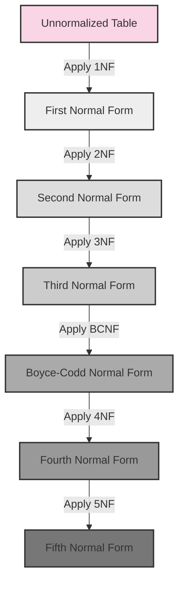

# PostgreSQL Normalization

## Introduction

Database normalization is a systematic approach to organizing data in a relational database like PostgreSQL. It's a fundamental design technique that helps eliminate data redundancy, avoid update anomalies, and ensure data integrity. For beginners working with PostgreSQL, understanding normalization is crucial for building efficient, maintainable, and scalable database systems.

In this guide, we'll explore the concept of normalization in PostgreSQL, walk through the different normal forms, and provide practical examples to demonstrate how proper normalization can significantly improve your database design.

## Why Normalize Your PostgreSQL Database?

Before diving into the specifics, let's understand why normalization matters:

- **Reduce data redundancy**: Store data in one place to avoid duplication
- **Improve data integrity**: Prevent inconsistencies when updating, inserting, or deleting data
- **Optimize query performance**: Well-normalized databases often perform better for complex queries
- **Simplify database maintenance**: Make your schema easier to understand and modify

## Understanding Database Normalization Forms

Normalization follows a series of steps called "normal forms." Each form builds upon the previous one to further refine your database structure.

### First Normal Form (1NF)

A table is in First Normal Form when:

1. It has a primary key (a column or set of columns that uniquely identifies each row)
2. All columns contain atomic (indivisible) values
3. No repeating groups of columns exist

#### Example: Before 1NF

Let's say we're building an e-commerce database and start with this problematic table:

```sql
CREATE TABLE orders_unnormalized (
  order_id INT,
  customer_name VARCHAR(100),
  products TEXT, -- contains comma-separated product IDs
  quantities TEXT, -- contains comma-separated quantities
  order_date DATE
);

INSERT INTO orders_unnormalized VALUES 
  (1, 'John Smith', '101,102,103', '2,1,3', '2023-05-10'),
  (2, 'Jane Doe', '102,104', '1,2', '2023-05-11');
```

This design violates 1NF because:
- The `products` and `quantities` columns contain multiple values
- We can't easily query individual products within an order

#### Example: After 1NF

```sql
CREATE TABLE orders_1nf (
  order_id INT,
  customer_name VARCHAR(100),
  product_id INT,
  quantity INT,
  order_date DATE,
  PRIMARY KEY (order_id, product_id)
);

INSERT INTO orders_1nf VALUES 
  (1, 'John Smith', 101, 2, '2023-05-10'),
  (1, 'John Smith', 102, 1, '2023-05-10'),
  (1, 'John Smith', 103, 3, '2023-05-10'),
  (2, 'Jane Doe', 102, 1, '2023-05-11'),
  (2, 'Jane Doe', 104, 2, '2023-05-11');
```

Now each row represents a single order-product combination, and every field contains atomic values.

### Second Normal Form (2NF)

A table is in Second Normal Form when:

1. It is already in 1NF
2. All non-key attributes are fully functionally dependent on the entire primary key

This means removing attributes that depend only on part of the composite primary key.

#### Example: Before 2NF

Our `orders_1nf` table violates 2NF because:
- `customer_name` and `order_date` depend only on `order_id`, not on the full primary key (`order_id`, `product_id`)

#### Example: After 2NF

```sql
-- Table for order headers
CREATE TABLE orders_2nf (
  order_id INT PRIMARY KEY,
  customer_name VARCHAR(100),
  order_date DATE
);

-- Table for order details
CREATE TABLE order_items_2nf (
  order_id INT,
  product_id INT,
  quantity INT,
  PRIMARY KEY (order_id, product_id),
  FOREIGN KEY (order_id) REFERENCES orders_2nf(order_id)
);

-- Insert data
INSERT INTO orders_2nf VALUES 
  (1, 'John Smith', '2023-05-10'),
  (2, 'Jane Doe', '2023-05-11');

INSERT INTO order_items_2nf VALUES 
  (1, 101, 2),
  (1, 102, 1),
  (1, 103, 3),
  (2, 102, 1),
  (2, 104, 2);
```

Now we have two tables:
- `orders_2nf` contains data dependent on the order
- `order_items_2nf` contains data dependent on the specific product within an order

### Third Normal Form (3NF)

A table is in Third Normal Form when:

1. It is already in 2NF
2. All attributes depend directly on the primary key, not on other non-key attributes

This means removing transitive dependencies.

#### Example: Before 3NF

Let's expand our example by adding customer address information directly to the orders table:

```sql
CREATE TABLE orders_not_3nf (
  order_id INT PRIMARY KEY,
  customer_id INT,
  customer_name VARCHAR(100),
  customer_email VARCHAR(100),
  customer_address TEXT,
  order_date DATE
);
```

This violates 3NF because `customer_name`, `customer_email`, and `customer_address` depend on `customer_id`, not directly on `order_id`.

#### Example: After 3NF

```sql
-- Customers table
CREATE TABLE customers_3nf (
  customer_id INT PRIMARY KEY,
  customer_name VARCHAR(100),
  customer_email VARCHAR(100),
  customer_address TEXT
);

-- Orders table (now in 3NF)
CREATE TABLE orders_3nf (
  order_id INT PRIMARY KEY,
  customer_id INT,
  order_date DATE,
  FOREIGN KEY (customer_id) REFERENCES customers_3nf(customer_id)
);

-- Order items table (unchanged from 2NF)
CREATE TABLE order_items_3nf (
  order_id INT,
  product_id INT,
  quantity INT,
  PRIMARY KEY (order_id, product_id),
  FOREIGN KEY (order_id) REFERENCES orders_3nf(order_id)
);
```

Now customer information is stored once in the `customers_3nf` table, eliminating redundancy.

### Boyce-Codd Normal Form (BCNF)

BCNF is a slightly stronger version of 3NF. A table is in BCNF when:

1. It is in 3NF
2. For every non-trivial functional dependency X → Y, X must be a superkey

This means that every determinant (a column that determines other columns) must be a candidate key.

Let's see an example where 3NF isn't enough:

#### Example: Before BCNF

Consider a database tracking which professors teach which subjects in which rooms:

```sql
CREATE TABLE class_schedule (
  student_id INT,
  subject_id INT,
  professor_id INT,
  room_id INT,
  PRIMARY KEY (student_id, subject_id)
);
```

Assume each subject is taught by exactly one professor, and each professor teaches in exactly one room. This creates dependencies:
- `subject_id → professor_id` (a subject determines the professor)
- `professor_id → room_id` (a professor determines the room)

This violates BCNF because `subject_id` and `professor_id` are determinants but not candidate keys.

#### Example: After BCNF

```sql
-- Table for professor-subject assignments
CREATE TABLE subject_professors (
  subject_id INT PRIMARY KEY,
  professor_id INT,
  UNIQUE (professor_id, subject_id)
);

-- Table for professor-room assignments
CREATE TABLE professor_rooms (
  professor_id INT PRIMARY KEY,
  room_id INT
);

-- Table for student enrollments
CREATE TABLE enrollments (
  student_id INT,
  subject_id INT,
  PRIMARY KEY (student_id, subject_id),
  FOREIGN KEY (subject_id) REFERENCES subject_professors(subject_id)
);
```

This design eliminates the transitive dependencies and achieves BCNF.

## Visualizing Database Normalization

Let's visualize the transformation from an unnormalized database to a fully normalized one:



## Real-World PostgreSQL Normalization Example

Let's walk through a complete example of normalizing a database for a small blog application.

### Step 1: Identify the Initial Requirements

We need to store:
- Blog posts with title, content, publish date
- Authors with name, email, bio
- Categories for posts
- Tags for posts
- Comments on posts

### Step 2: Create an Unnormalized Design

```sql
CREATE TABLE blog_unnormalized (
  post_id INT,
  title VARCHAR(200),
  content TEXT,
  publish_date TIMESTAMP,
  author_name VARCHAR(100),
  author_email VARCHAR(100),
  author_bio TEXT,
  categories TEXT, -- comma-separated category names
  tags TEXT, -- comma-separated tag names
  comment_ids TEXT, -- comma-separated comment IDs
  comment_authors TEXT, -- comma-separated comment author names
  comment_texts TEXT, -- comma-separated comment texts
  comment_dates TEXT -- comma-separated comment dates
);
```

### Step 3: Apply Normalization

#### First Normal Form (1NF)

First, let's eliminate the comma-separated values:

```sql
CREATE TABLE posts_1nf (
  post_id INT,
  title VARCHAR(200),
  content TEXT,
  publish_date TIMESTAMP,
  author_name VARCHAR(100),
  author_email VARCHAR(100),
  author_bio TEXT
);

CREATE TABLE post_categories_1nf (
  post_id INT,
  category_name VARCHAR(50),
  PRIMARY KEY (post_id, category_name)
);

CREATE TABLE post_tags_1nf (
  post_id INT,
  tag_name VARCHAR(50),
  PRIMARY KEY (post_id, tag_name)
);

CREATE TABLE comments_1nf (
  comment_id INT PRIMARY KEY,
  post_id INT,
  author_name VARCHAR(100),
  comment_text TEXT,
  comment_date TIMESTAMP
);
```

#### Second Normal Form (2NF)

The tables are already in 2NF because they don't have composite primary keys with partial dependencies.

#### Third Normal Form (3NF)

Let's extract the author information to eliminate transitive dependencies:

```sql
CREATE TABLE authors_3nf (
  author_id INT PRIMARY KEY,
  name VARCHAR(100),
  email VARCHAR(100) UNIQUE,
  bio TEXT
);

CREATE TABLE posts_3nf (
  post_id INT PRIMARY KEY,
  title VARCHAR(200),
  content TEXT,
  publish_date TIMESTAMP,
  author_id INT,
  FOREIGN KEY (author_id) REFERENCES authors_3nf(author_id)
);

CREATE TABLE categories_3nf (
  category_id INT PRIMARY KEY,
  name VARCHAR(50) UNIQUE
);

CREATE TABLE post_categories_3nf (
  post_id INT,
  category_id INT,
  PRIMARY KEY (post_id, category_id),
  FOREIGN KEY (post_id) REFERENCES posts_3nf(post_id),
  FOREIGN KEY (category_id) REFERENCES categories_3nf(category_id)
);

CREATE TABLE tags_3nf (
  tag_id INT PRIMARY KEY,
  name VARCHAR(50) UNIQUE
);

CREATE TABLE post_tags_3nf (
  post_id INT,
  tag_id INT,
  PRIMARY KEY (post_id, tag_id),
  FOREIGN KEY (post_id) REFERENCES posts_3nf(post_id),
  FOREIGN KEY (tag_id) REFERENCES tags_3nf(tag_id)
);

CREATE TABLE comments_3nf (
  comment_id INT PRIMARY KEY,
  post_id INT,
  author_name VARCHAR(100),
  comment_text TEXT,
  comment_date TIMESTAMP,
  FOREIGN KEY (post_id) REFERENCES posts_3nf(post_id)
);
```

This fully normalized schema is now in 3NF (and also satisfies BCNF requirements).

### Step 4: Create the Final Schema with PostgreSQL Data Types and Constraints

```sql
-- Authors table
CREATE TABLE authors (
  author_id SERIAL PRIMARY KEY,
  name VARCHAR(100) NOT NULL,
  email VARCHAR(100) UNIQUE NOT NULL,
  bio TEXT,
  created_at TIMESTAMP DEFAULT CURRENT_TIMESTAMP
);

-- Posts table
CREATE TABLE posts (
  post_id SERIAL PRIMARY KEY,
  title VARCHAR(200) NOT NULL,
  slug VARCHAR(200) UNIQUE NOT NULL,
  content TEXT NOT NULL,
  excerpt TEXT,
  publish_date TIMESTAMP,
  status VARCHAR(20) DEFAULT 'draft' CHECK (status IN ('draft', 'published', 'archived')),
  author_id INT NOT NULL,
  created_at TIMESTAMP DEFAULT CURRENT_TIMESTAMP,
  updated_at TIMESTAMP DEFAULT CURRENT_TIMESTAMP,
  FOREIGN KEY (author_id) REFERENCES authors(author_id)
);

-- Categories table
CREATE TABLE categories (
  category_id SERIAL PRIMARY KEY,
  name VARCHAR(50) UNIQUE NOT NULL,
  slug VARCHAR(50) UNIQUE NOT NULL,
  description TEXT
);

-- Post-Category relationship table
CREATE TABLE post_categories (
  post_id INT NOT NULL,
  category_id INT NOT NULL,
  PRIMARY KEY (post_id, category_id),
  FOREIGN KEY (post_id) REFERENCES posts(post_id) ON DELETE CASCADE,
  FOREIGN KEY (category_id) REFERENCES categories(category_id) ON DELETE CASCADE
);

-- Tags table
CREATE TABLE tags (
  tag_id SERIAL PRIMARY KEY,
  name VARCHAR(50) UNIQUE NOT NULL,
  slug VARCHAR(50) UNIQUE NOT NULL
);

-- Post-Tag relationship table
CREATE TABLE post_tags (
  post_id INT NOT NULL,
  tag_id INT NOT NULL,
  PRIMARY KEY (post_id, tag_id),
  FOREIGN KEY (post_id) REFERENCES posts(post_id) ON DELETE CASCADE,
  FOREIGN KEY (tag_id) REFERENCES tags(tag_id) ON DELETE CASCADE
);

-- Comments table
CREATE TABLE comments (
  comment_id SERIAL PRIMARY KEY,
  post_id INT NOT NULL,
  author_name VARCHAR(100) NOT NULL,
  author_email VARCHAR(100),
  comment_text TEXT NOT NULL,
  is_approved BOOLEAN DEFAULT FALSE,
  parent_comment_id INT,
  created_at TIMESTAMP DEFAULT CURRENT_TIMESTAMP,
  FOREIGN KEY (post_id) REFERENCES posts(post_id) ON DELETE CASCADE,
  FOREIGN KEY (parent_comment_id) REFERENCES comments(comment_id) ON DELETE SET NULL
);
```

This final schema incorporates PostgreSQL-specific features:
- `SERIAL` for auto-incrementing IDs
- Appropriate constraints (`NOT NULL`, `UNIQUE`, `CHECK`)
- Timestamps for tracking creation and updates
- `ON DELETE CASCADE` for maintaining referential integrity
- Self-referencing foreign key in the comments table for threaded comments

## Common Denormalization Scenarios

While normalization is generally recommended, there are cases where controlled denormalization can improve performance:

### When to Consider Denormalization

1. **Read-heavy workloads**: If your application mostly reads data and seldom updates it
2. **Performance bottlenecks**: When joins between normalized tables become too expensive
3. **Reporting and analytics**: For complex aggregations and historical data

### Example: Denormalized Post View Count

```sql
-- Add a denormalized view count to the posts table
ALTER TABLE posts ADD COLUMN view_count INT DEFAULT 0;

-- Instead of maintaining a separate table of views:
-- CREATE TABLE post_views (
--   post_id INT,
--   viewer_ip VARCHAR(45),
--   view_timestamp TIMESTAMP,
--   FOREIGN KEY (post_id) REFERENCES posts(post_id)
-- );

-- Update the view count with a simple UPDATE
UPDATE posts SET view_count = view_count + 1 WHERE post_id = 42;
```

## PostgreSQL Tools for Maintaining Normalized Data

PostgreSQL offers several features that help maintain data integrity in normalized databases:

### Foreign Keys

As shown in our examples, foreign keys enforce relationships between tables:

```sql
CREATE TABLE orders (
  order_id SERIAL PRIMARY KEY,
  customer_id INT NOT NULL,
  FOREIGN KEY (customer_id) REFERENCES customers(customer_id)
);
```

### Constraints

PostgreSQL supports various constraints to enforce data integrity:

```sql
CREATE TABLE products (
  product_id SERIAL PRIMARY KEY,
  name VARCHAR(100) NOT NULL,
  price NUMERIC(10,2) CHECK (price > 0),
  sku VARCHAR(50) UNIQUE NOT NULL
);
```

### Triggers

Triggers can automate complex integrity rules:

```sql
CREATE OR REPLACE FUNCTION update_post_updated_at()
RETURNS TRIGGER AS $$
BEGIN
  NEW.updated_at = CURRENT_TIMESTAMP;
  RETURN NEW;
END;
$$ LANGUAGE plpgsql;

CREATE TRIGGER set_updated_at
BEFORE UPDATE ON posts
FOR EACH ROW
EXECUTE FUNCTION update_post_updated_at();
```

### Views

Views can simplify working with normalized data:

```sql
CREATE VIEW post_details AS
SELECT 
  p.post_id,
  p.title,
  p.content,
  p.publish_date,
  a.name AS author_name,
  a.email AS author_email,
  string_agg(DISTINCT c.name, ', ') AS categories,
  string_agg(DISTINCT t.name, ', ') AS tags,
  COUNT(DISTINCT cm.comment_id) AS comment_count
FROM posts p
JOIN authors a ON p.author_id = a.author_id
LEFT JOIN post_categories pc ON p.post_id = pc.post_id
LEFT JOIN categories c ON pc.category_id = c.category_id
LEFT JOIN post_tags pt ON p.post_id = pt.post_id
LEFT JOIN tags t ON pt.tag_id = t.tag_id
LEFT JOIN comments cm ON p.post_id = cm.post_id
WHERE p.status = 'published'
GROUP BY p.post_id, a.author_id;
```

## Common Normalization Mistakes and How to Avoid Them

### Overengineering

Don't split tables unnecessarily if there isn't a clear dependency issue.

### Underestimating Performance Impact

Heavily normalized databases may require complex joins, which can impact performance.

### Ignoring Concurrency

When using PostgreSQL, consider how concurrent access affects your normalized structure.

### Not Using Proper Indexing

In normalized databases, proper indexes are crucial:

```sql
-- Add index to foreign keys for better join performance
CREATE INDEX idx_posts_author_id ON posts(author_id);
CREATE INDEX idx_comments_post_id ON comments(post_id);
```

## Summary

Database normalization is a foundational concept for designing efficient PostgreSQL databases:

1. **First Normal Form (1NF)**: Eliminate repeating groups and ensure atomic values
2. **Second Normal Form (2NF)**: Remove partial dependencies on the primary key
3. **Third Normal Form (3NF)**: Remove transitive dependencies
4. **BCNF and beyond**: Further refinement for specific cases

By following these normalization principles, you'll create PostgreSQL databases that are:
- Easier to maintain and update
- More resilient against data inconsistencies
- Better structured for complex queries
- More flexible for future changes

Remember that while normalization is generally recommended, strategic denormalization might be appropriate in specific performance-critical scenarios.

## Exercises

1. Take an unnormalized table containing customer orders with repeated customer information and normalize it to 3NF.
2. Identify normalization problems in this table design:
   ```sql
   CREATE TABLE products (
     product_id INT PRIMARY KEY,
     name VARCHAR(100),
     category VARCHAR(50),
     category_description TEXT,
     supplier_name VARCHAR(100),
     supplier_contact VARCHAR(100)
   );
   ```
3. Design a normalized database schema for a library management system with books, authors, borrowers, and loans.

## Additional Resources

- [PostgreSQL Documentation on Constraints](https://www.postgresql.org/docs/current/ddl-constraints.html)
- [Database Design for Mere Mortals](https://www.informit.com/store/database-design-for-mere-mortals-a-hands-on-guide-to-9780134449425) by Michael J. Hernandez
- [Practical PostgreSQL](https://www.postgresql.org/docs/books/practical-postgresql/) by Joshua D. Drake and John C. Worsley