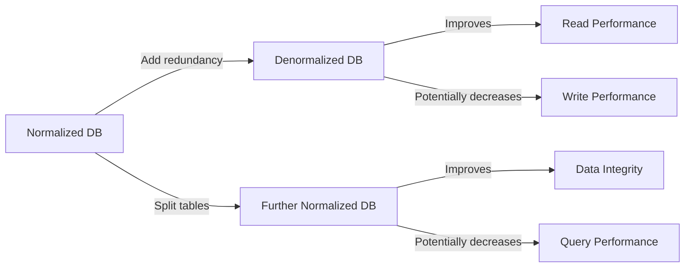

# PostgreSQL Denormalization

## Introduction

In the world of relational databases, normalization is a fundamental principle that helps organize data efficiently, eliminate redundancy, and maintain data integrity. However, there are scenarios where strictly following normalization rules can lead to performance issues, especially when dealing with complex queries or large datasets.

This is where **denormalization** comes in - a strategic approach that deliberately introduces some redundancy into database design to optimize query performance. In this guide, we'll explore how and when to apply denormalization techniques in PostgreSQL databases, balancing performance gains against potential drawbacks.

## What is Denormalization?

Denormalization is the process of adding redundant data to one or more tables to improve read performance at the expense of write performance and some data integrity. Unlike normalization (which splits data into multiple tables to reduce redundancy), denormalization combines or duplicates data to reduce the need for complex JOINs.



## When to Consider Denormalization

Before introducing redundancy into your database, consider whether denormalization is appropriate:

✅ **Good candidates for denormalization:**
- Read-heavy applications with relatively infrequent writes
- Reporting systems and data warehouses
- Data that changes infrequently but is queried often
- Performance-critical queries involving multiple JOINs
- Applications where query speed is more critical than write speed

❌ **Poor candidates for denormalization:**
- Write-heavy applications with frequent data changes
- Systems where data consistency is absolutely critical
- Small datasets where performance gains would be negligible
- Applications where storage space is severely limited

## Common Denormalization Techniques in PostgreSQL

Let's explore several denormalization techniques with practical examples.

### 1. Redundant Columns

Adding redundant columns to avoid JOINs is one of the simplest denormalization techniques.

**Example scenario:** An e-commerce application where orders need to show customer information.

**Normalized approach** (two separate tables):

```sql
-- Normalized schema
CREATE TABLE customers (
    customer_id SERIAL PRIMARY KEY,
    name VARCHAR(100),
    email VARCHAR(100),
    phone VARCHAR(20)
);

CREATE TABLE orders (
    order_id SERIAL PRIMARY KEY,
    customer_id INTEGER REFERENCES customers(customer_id),
    order_date TIMESTAMP,
    total_amount DECIMAL(10, 2)
);

-- Query requires a JOIN
SELECT o.order_id, o.order_date, o.total_amount, c.name, c.email
FROM orders o
JOIN customers c ON o.customer_id = c.customer_id
WHERE o.order_date > '2023-01-01';
```

**Denormalized approach** (redundant customer data in orders):

```sql
-- Denormalized schema
CREATE TABLE customers (
    customer_id SERIAL PRIMARY KEY,
    name VARCHAR(100),
    email VARCHAR(100),
    phone VARCHAR(20)
);

CREATE TABLE orders (
    order_id SERIAL PRIMARY KEY,
    customer_id INTEGER REFERENCES customers(customer_id),
    customer_name VARCHAR(100),   -- Redundant column
    customer_email VARCHAR(100),  -- Redundant column
    order_date TIMESTAMP,
    total_amount DECIMAL(10, 2)
);

-- Simpler query without JOIN
SELECT order_id, order_date, total_amount, customer_name, customer_email
FROM orders
WHERE order_date > '2023-01-01';
```

**Implementation considerations:**
- You'll need triggers to keep the redundant data in sync:

```sql
CREATE OR REPLACE FUNCTION update_customer_info_in_orders()
RETURNS TRIGGER AS $$
BEGIN
    UPDATE orders
    SET customer_name = NEW.name,
        customer_email = NEW.email
    WHERE customer_id = NEW.customer_id;
    RETURN NEW;
END;
$$ LANGUAGE plpgsql;

CREATE TRIGGER after_customer_update
AFTER UPDATE ON customers
FOR EACH ROW
EXECUTE FUNCTION update_customer_info_in_orders();
```

### 2. Pre-calculated Aggregates

Storing pre-calculated values that would normally require aggregate functions.

**Example scenario:** A product review system that displays average ratings.

**Normalized approach:**

```sql
CREATE TABLE product_reviews (
    review_id SERIAL PRIMARY KEY,
    product_id INTEGER REFERENCES products(product_id),
    user_id INTEGER REFERENCES users(user_id),
    rating INTEGER CHECK (rating BETWEEN 1 AND 5),
    review_text TEXT,
    created_at TIMESTAMP DEFAULT CURRENT_TIMESTAMP
);

-- Query to get average rating requires calculation
SELECT product_id, AVG(rating) as avg_rating, COUNT(*) as review_count
FROM product_reviews
WHERE product_id = 123
GROUP BY product_id;
```

**Denormalized approach:** Store the aggregate values in the products table.

```sql
CREATE TABLE products (
    product_id SERIAL PRIMARY KEY,
    name VARCHAR(100),
    price DECIMAL(10, 2),
    avg_rating DECIMAL(3, 2) DEFAULT 0,  -- Pre-calculated average
    review_count INTEGER DEFAULT 0       -- Pre-calculated count
);

-- Create a trigger to update the aggregates
CREATE OR REPLACE FUNCTION update_product_rating()
RETURNS TRIGGER AS $$
BEGIN
    -- When a review is added or updated
    IF (TG_OP = 'INSERT') OR (TG_OP = 'UPDATE') THEN
        UPDATE products
        SET avg_rating = (
            SELECT AVG(rating) FROM product_reviews WHERE product_id = NEW.product_id
        ),
        review_count = (
            SELECT COUNT(*) FROM product_reviews WHERE product_id = NEW.product_id
        )
        WHERE product_id = NEW.product_id;
    -- When a review is deleted
    ELSIF (TG_OP = 'DELETE') THEN
        UPDATE products
        SET avg_rating = COALESCE((
            SELECT AVG(rating) FROM product_reviews WHERE product_id = OLD.product_id
        ), 0),
        review_count = (
            SELECT COUNT(*) FROM product_reviews WHERE product_id = OLD.product_id
        )
        WHERE product_id = OLD.product_id;
    END IF;
    RETURN NULL;
END;
$$ LANGUAGE plpgsql;

CREATE TRIGGER update_product_rating_trigger
AFTER INSERT OR UPDATE OR DELETE ON product_reviews
FOR EACH ROW
EXECUTE FUNCTION update_product_rating();
```

Now, retrieving a product with its rating is simple:

```sql
SELECT product_id, name, price, avg_rating, review_count
FROM products
WHERE product_id = 123;
```

### 3. Materialized Views

PostgreSQL's materialized views provide an excellent way to denormalize data for complex queries.

**Example scenario:** A reporting system that needs to analyze sales data by region, product, and time.

```sql
-- Create a materialized view for sales reporting
CREATE MATERIALIZED VIEW sales_report AS
SELECT 
    r.region_name,
    p.category,
    p.product_name,
    EXTRACT(YEAR FROM s.sale_date) AS year,
    EXTRACT(MONTH FROM s.sale_date) AS month,
    SUM(s.quantity) AS total_quantity,
    SUM(s.quantity * s.unit_price) AS total_sales
FROM 
    sales s
    JOIN products p ON s.product_id = p.product_id
    JOIN stores st ON s.store_id = st.store_id
    JOIN regions r ON st.region_id = r.region_id
GROUP BY 
    r.region_name, p.category, p.product_name,
    EXTRACT(YEAR FROM s.sale_date), EXTRACT(MONTH FROM s.sale_date);

-- Create an index to speed up common queries
CREATE INDEX idx_sales_report_region_year_month 
ON sales_report(region_name, year, month);

-- To refresh the data periodically:
REFRESH MATERIALIZED VIEW sales_report;
```

Queries that would normally require complex JOINs and aggregations now become simple:

```sql
-- Query the materialized view
SELECT region_name, SUM(total_sales) AS regional_sales
FROM sales_report
WHERE year = 2023 AND month BETWEEN 1 AND 3
GROUP BY region_name
ORDER BY regional_sales DESC;
```

### 4. Flattening Hierarchies

For hierarchical data that requires recursive queries, denormalization can significantly improve performance.

**Example scenario:** An organization chart with employees and their managers.

**Normalized approach:**

```sql
CREATE TABLE employees (
    employee_id SERIAL PRIMARY KEY,
    name VARCHAR(100),
    manager_id INTEGER REFERENCES employees(employee_id),
    department VARCHAR(100),
    hire_date DATE
);

-- Finding all reports (direct and indirect) requires a recursive query
WITH RECURSIVE subordinates AS (
    SELECT employee_id, name, manager_id
    FROM employees
    WHERE employee_id = 5  -- Starting manager
    
    UNION ALL
    
    SELECT e.employee_id, e.name, e.manager_id
    FROM employees e
    JOIN subordinates s ON e.manager_id = s.employee_id
)
SELECT * FROM subordinates;
```

**Denormalized approach:** Store the management path.

```sql
CREATE TABLE employees (
    employee_id SERIAL PRIMARY KEY,
    name VARCHAR(100),
    manager_id INTEGER REFERENCES employees(employee_id),
    department VARCHAR(100),
    hire_date DATE,
    management_path INTEGER[] -- Array of manager IDs from top down
);

-- Finding all reports becomes a simple query
SELECT * FROM employees
WHERE management_path @> ARRAY[5];  -- Contains manager ID 5
```

You'll need triggers to maintain the `management_path` array whenever a manager changes.

## Performance Considerations

When implementing denormalization, consider these performance aspects:

1. **Indexes:** Properly index your denormalized tables to maximize query performance
2. **Update overhead:** Consider the additional writes required to maintain redundant data
3. **Storage requirements:** Evaluate the additional storage needed for redundant data
4. **Transaction isolation:** Ensure your transactions maintain ACID properties despite redundancy

## Real-world Case Study: E-commerce Product Catalog

Let's walk through a practical example of denormalizing a product catalog system:

**Original normalized schema:**

```sql
CREATE TABLE categories (
    category_id SERIAL PRIMARY KEY,
    name VARCHAR(100),
    parent_id INTEGER REFERENCES categories(category_id)
);

CREATE TABLE products (
    product_id SERIAL PRIMARY KEY,
    name VARCHAR(200),
    description TEXT,
    price DECIMAL(10, 2),
    category_id INTEGER REFERENCES categories(category_id)
);

CREATE TABLE product_attributes (
    attribute_id SERIAL PRIMARY KEY,
    product_id INTEGER REFERENCES products(product_id),
    attribute_name VARCHAR(100),
    attribute_value TEXT
);

CREATE TABLE inventory (
    inventory_id SERIAL PRIMARY KEY,
    product_id INTEGER REFERENCES products(product_id),
    warehouse_id INTEGER REFERENCES warehouses(warehouse_id),
    quantity INTEGER
);
```

**Performance issue:** Category pages show products with their attributes and availability status, requiring multiple JOINs.

**Denormalized solution:**

```sql
-- Create a denormalized product view for the catalog
CREATE MATERIALIZED VIEW product_catalog AS
SELECT 
    p.product_id,
    p.name,
    p.description,
    p.price,
    c.name AS category_name,
    CASE 
        WHEN c.parent_id IS NOT NULL THEN (
            SELECT name FROM categories WHERE category_id = c.parent_id
        )
        ELSE NULL
    END AS parent_category_name,
    (
        SELECT jsonb_object_agg(attribute_name, attribute_value)
        FROM product_attributes
        WHERE product_id = p.product_id
    ) AS attributes,
    (
        SELECT SUM(quantity) > 0
        FROM inventory
        WHERE product_id = p.product_id
    ) AS in_stock
FROM 
    products p
    JOIN categories c ON p.category_id = c.category_id;

-- Create indexes for common query patterns
CREATE INDEX idx_product_catalog_category ON product_catalog(category_name);
CREATE INDEX idx_product_catalog_parent_category ON product_catalog(parent_category_name);
CREATE INDEX idx_product_catalog_in_stock ON product_catalog(in_stock);
```

**Refresh strategy:**

```sql
-- Set up a function to refresh the view
CREATE OR REPLACE FUNCTION refresh_product_catalog()
RETURNS VOID AS $$
BEGIN
    REFRESH MATERIALIZED VIEW CONCURRENTLY product_catalog;
END;
$$ LANGUAGE plpgsql;

-- Call this function periodically or trigger it after relevant updates
```

## Best Practices for Denormalization

To make the most of denormalization while minimizing the drawbacks:

1. **Start normalized:** Begin with a properly normalized design, then denormalize selectively based on performance needs.

2. **Document everything:** Keep detailed documentation of all denormalization decisions, including the original normalized structure.

3. **Test thoroughly:** Measure performance before and after denormalization to ensure real benefits.

4. **Maintain data integrity:** Use triggers, constraints, and application logic to keep redundant data synchronized.

5. **Consider CQRS patterns:** For complex applications, consider using Command Query Responsibility Segregation, where write operations use a normalized model and read operations use a denormalized model.

6. **Use database features:** Leverage PostgreSQL-specific features like materialized views, triggers, and functions rather than managing redundancy at the application level.

## Common Pitfalls to Avoid

Be aware of these common denormalization mistakes:

1. **Premature optimization:** Don't denormalize before identifying real performance bottlenecks.

2. **Over-denormalization:** Adding too much redundancy can make the database harder to maintain.

3. **Inconsistent data:** Failing to properly synchronize redundant data leads to inconsistencies.

4. **Ignoring write patterns:** Denormalization can severely impact write-heavy workloads.

5. **Neglecting indexing:** Proper indexing might solve performance issues without requiring denormalization.

## Summary

Denormalization in PostgreSQL is a powerful technique for optimizing read performance when used judiciously. By strategically introducing redundancy, you can significantly improve query speed for complex operations, especially in read-heavy applications.

Remember that denormalization involves trade-offs:

- ✅ Improved read performance
- ✅ Reduced JOIN complexity
- ✅ Better query response times
- ❌ Increased storage requirements
- ❌ More complex write operations
- ❌ Data synchronization challenges

Start with proper normalization, identify specific performance bottlenecks, and then apply targeted denormalization techniques where they provide measurable benefits.

## Further Learning

To deepen your understanding of PostgreSQL denormalization:

- Experiment with PostgreSQL's materialized views for complex reporting queries
- Learn about the CQRS (Command Query Responsibility Segregation) pattern
- Study PostgreSQL's trigger system for maintaining redundant data
- Practice analyzing query plans to identify when JOINs become performance bottlenecks

## Practice Exercises

1. Take a normalized database schema and identify potential candidates for denormalization based on query patterns.

2. Implement a materialized view for a complex reporting query and measure the performance difference.

3. Create a trigger system to maintain redundant data across multiple tables.

4. Design a hybrid approach where some data is normalized for writes but denormalized for reads.