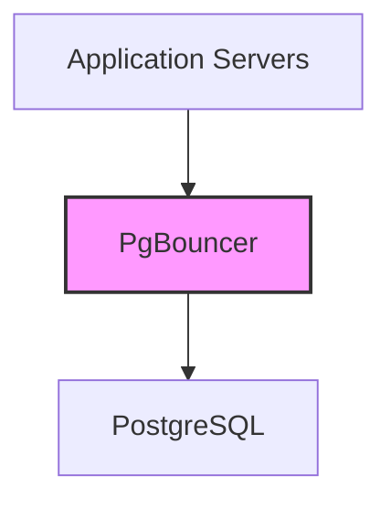

# PostgreSQL Performance Tips

## Introduction

Performance optimization is a critical aspect of working with databases, especially as your applications grow and data volumes increase. PostgreSQL, being a powerful and feature-rich database system, offers numerous ways to improve query performance and overall system efficiency.

This guide will walk you through essential PostgreSQL performance tips that can help you identify bottlenecks and optimize your database operations. Whether you're just starting with PostgreSQL or looking to improve an existing setup, these techniques will help your applications run faster and more efficiently.

## Why Performance Matters

Before diving into specific techniques, let's understand why database performance is crucial:

- **Better user experience**: Faster queries mean more responsive applications
- **Reduced costs**: Efficient databases require less hardware resources
- **Higher scalability**: Optimized databases can handle more users and data
- **Improved reliability**: Well-tuned databases are less likely to crash under load

## Essential Performance Tips

### 1. Use Appropriate Indexes

Indexes are one of the most powerful tools for improving query performance in PostgreSQL.

#### When to Use Indexes

- Columns frequently used in WHERE clauses
- Columns used in JOIN conditions
- Columns used in ORDER BY or GROUP BY clauses

#### Basic Index Creation

```sql
-- Creating a basic B-tree index
CREATE INDEX idx_user_email ON users(email);

-- Creating a compound index (multiple columns)
CREATE INDEX idx_user_name ON users(last_name, first_name);
```

#### Index Types

PostgreSQL offers several specialized index types:

```sql
-- B-tree (default): Good for equality and range queries
CREATE INDEX idx_product_price ON products(price);

-- Hash: Optimized for equality comparisons only
CREATE INDEX idx_user_id_hash ON users USING HASH (user_id);

-- GiST: Useful for full-text search and geometric data
CREATE INDEX idx_document_search ON documents USING GIST (search_vector);

-- GIN: Great for arrays and JSON data
CREATE INDEX idx_product_tags ON products USING GIN (tags);
```

#### Monitoring Index Usage

```sql
-- Check if indexes are being used
EXPLAIN ANALYZE SELECT * FROM users WHERE email = 'user@example.com';

-- Find unused indexes
SELECT 
    indexrelid::regclass AS index_name,
    relid::regclass AS table_name,
    idx_scan AS index_scans
FROM pg_stat_user_indexes
ORDER BY idx_scan ASC;
```

### 2. Optimize Queries

#### Use EXPLAIN ANALYZE

The `EXPLAIN ANALYZE` command helps you understand how PostgreSQL executes your queries:

```sql
EXPLAIN ANALYZE SELECT u.name, o.order_date 
FROM users u 
JOIN orders o ON u.id = o.user_id 
WHERE u.signup_date > '2023-01-01';
```

Example output:

```
                                                QUERY PLAN                                                 
-----------------------------------------------------------------------------------------------------------
 Hash Join  (cost=18.38..42.38 rows=267 width=40) (actual time=0.323..0.328 rows=25 loops=1)
   Hash Cond: (o.user_id = u.id)
   ->  Seq Scan on orders o  (cost=0.00..21.30 rows=1130 width=12) (actual time=0.011..0.014 rows=100 loops=1)
   ->  Hash  (cost=17.50..17.50 rows=70 width=36) (actual time=0.298..0.298 rows=50 loops=1)
         Buckets: 1024  Batches: 1  Memory Usage: 9kB
         ->  Seq Scan on users u  (cost=0.00..17.50 rows=70 width=36) (actual time=0.008..0.280 rows=50 loops=1)
               Filter: (signup_date > '2023-01-01'::date)
               Rows Removed by Filter: 50
 Planning Time: 0.152 ms
 Execution Time: 0.356 ms
```

#### Avoid SELECT *

Only select the columns you need:

```sql
-- Bad
SELECT * FROM large_table WHERE created_at > '2023-01-01';

-- Good
SELECT id, name, email FROM large_table WHERE created_at > '2023-01-01';
```

#### Use Prepared Statements

For frequently executed queries with different parameters:

```sql
-- Prepare the statement once
PREPARE user_orders AS
  SELECT * FROM orders 
  WHERE user_id = $1 AND order_date > $2;

-- Execute multiple times with different values
EXECUTE user_orders(123, '2023-01-01');
EXECUTE user_orders(456, '2023-02-15');
```

### 3. Optimize Table Structure

#### Use Appropriate Data Types

Choose the most efficient data types for your data:

```sql
-- Bad (using larger types than needed)
CREATE TABLE products (
    id BIGINT PRIMARY KEY,
    name VARCHAR(1000),
    price NUMERIC(10,2),
    is_available BOOLEAN
);

-- Better (using appropriate sizes)
CREATE TABLE products (
    id INT PRIMARY KEY,
    name VARCHAR(100),
    price NUMERIC(6,2),
    is_available BOOLEAN
);
```

#### Partitioning Large Tables

For very large tables, partitioning can improve performance:

```sql
-- Create a partitioned table
CREATE TABLE logs (
    id SERIAL,
    log_time TIMESTAMP,
    message TEXT
) PARTITION BY RANGE (log_time);

-- Create partitions
CREATE TABLE logs_2023_q1 PARTITION OF logs
    FOR VALUES FROM ('2023-01-01') TO ('2023-04-01');
    
CREATE TABLE logs_2023_q2 PARTITION OF logs
    FOR VALUES FROM ('2023-04-01') TO ('2023-07-01');
```

### 4. Database Configuration Tuning

PostgreSQL's configuration parameters can dramatically affect performance. Here are some key settings to consider:

#### Memory-Related Parameters

```
# Memory allocation for PostgreSQL
shared_buffers = 1GB         # 25% of available RAM, up to 8GB
work_mem = 50MB              # For complex sorts and hash operations
maintenance_work_mem = 256MB # For maintenance operations like VACUUM
effective_cache_size = 3GB   # Estimate of OS cache (50-75% of RAM)
```

#### Write-Ahead Log Settings

```
# WAL configuration
wal_buffers = 16MB           # Related to shared_buffers
checkpoint_timeout = 15min   # Time between automatic checkpoints
max_wal_size = 2GB           # Maximum WAL size between checkpoints
```

#### Connection Settings

```
# Connection settings
max_connections = 100        # Maximum concurrent connections
```

### 5. Regular Maintenance

#### VACUUM and ANALYZE

Regular maintenance prevents performance degradation:

```sql
-- Basic vacuum to reclaim space
VACUUM VERBOSE table_name;

-- Full vacuum (rewrites the entire table)
VACUUM FULL table_name;

-- Update statistics for the query planner
ANALYZE table_name;

-- Both vacuum and analyze
VACUUM ANALYZE table_name;
```

#### Automate with autovacuum

Ensure autovacuum is properly configured:

```
# Autovacuum settings
autovacuum = on
autovacuum_vacuum_scale_factor = 0.1
autovacuum_analyze_scale_factor = 0.05
```

### 6. Connection Pooling

For applications with many short-lived connections, consider using connection pooling tools like PgBouncer:



Basic PgBouncer configuration example:

```ini
[databases]
mydb = host=127.0.0.1 port=5432 dbname=mydb

[pgbouncer]
listen_port = 6432
listen_addr = 0.0.0.0
auth_type = md5
auth_file = /etc/pgbouncer/userlist.txt
pool_mode = transaction
max_client_conn = 1000
default_pool_size = 20
```

### 7. Monitoring and Profiling

#### Key Statistics Views

```sql
-- Check for slow queries
SELECT query, calls, total_time, rows, mean_time
FROM pg_stat_statements
ORDER BY total_time DESC
LIMIT 10;

-- Check for table statistics
SELECT schemaname, relname, seq_scan, idx_scan, 
       n_tup_ins, n_tup_upd, n_tup_del, n_live_tup, n_dead_tup
FROM pg_stat_user_tables
ORDER BY n_live_tup DESC;
```

#### External Monitoring Tools

Consider using specialized tools like:
- pg_stat_monitor
- pgBadger
- Prometheus with postgres_exporter
- Datadog PostgreSQL integration

## Practical Example: Optimizing a Common Query Pattern

Let's walk through optimizing a real-world query scenario:

### Initial Query

```sql
-- Original slow query
SELECT 
    c.name AS customer_name,
    p.name AS product_name,
    SUM(o.quantity) AS total_quantity,
    SUM(o.quantity * p.price) AS total_amount
FROM 
    orders o
JOIN 
    customers c ON o.customer_id = c.id
JOIN 
    products p ON o.product_id = p.id
WHERE 
    o.order_date BETWEEN '2023-01-01' AND '2023-12-31'
GROUP BY 
    c.name, p.name
ORDER BY 
    total_amount DESC;
```

### Step 1: Analyze the Query

```sql
EXPLAIN ANALYZE SELECT 
    c.name AS customer_name,
    p.name AS product_name,
    SUM(o.quantity) AS total_quantity,
    SUM(o.quantity * p.price) AS total_amount
FROM 
    orders o
JOIN 
    customers c ON o.customer_id = c.id
JOIN 
    products p ON o.product_id = p.id
WHERE 
    o.order_date BETWEEN '2023-01-01' AND '2023-12-31'
GROUP BY 
    c.name, p.name
ORDER BY 
    total_amount DESC;
```

### Step 2: Create Appropriate Indexes

```sql
-- Index for the date range filter
CREATE INDEX idx_orders_date ON orders(order_date);

-- Indexes for the join conditions
CREATE INDEX idx_orders_customer ON orders(customer_id);
CREATE INDEX idx_orders_product ON orders(product_id);
```

### Step 3: Consider Materialized Views for Frequent Aggregations

```sql
-- Create a materialized view for frequently-needed aggregated data
CREATE MATERIALIZED VIEW monthly_sales AS
SELECT 
    DATE_TRUNC('month', o.order_date) AS month,
    p.category,
    SUM(o.quantity) AS total_quantity,
    SUM(o.quantity * p.price) AS total_amount
FROM 
    orders o
JOIN 
    products p ON o.product_id = p.id
GROUP BY 
    month, p.category;

-- Create an index on the materialized view
CREATE INDEX idx_monthly_sales_month ON monthly_sales(month);

-- Refresh when needed
REFRESH MATERIALIZED VIEW monthly_sales;
```

## Summary

Optimizing PostgreSQL performance involves multiple aspects:

1. **Indexing Strategy**: Create and maintain appropriate indexes
2. **Query Optimization**: Write efficient queries and use EXPLAIN ANALYZE
3. **Schema Design**: Choose appropriate data types and consider partitioning
4. **Server Configuration**: Tune PostgreSQL settings for your hardware
5. **Regular Maintenance**: Set up proper VACUUM and ANALYZE routines
6. **Connection Management**: Implement connection pooling for busy applications
7. **Monitoring**: Track performance metrics and identify bottlenecks

By applying these techniques, you can significantly improve your PostgreSQL database performance, resulting in faster applications and better user experiences.

## Additional Resources

Here are some exercises to help you practice these performance optimization techniques:

1. Take a slow query from your application and optimize it using EXPLAIN ANALYZE
2. Review your database schema and identify opportunities for better indexing
3. Set up a testing environment to experiment with different PostgreSQL configuration parameters
4. Implement a monitoring solution to track your database performance over time

For further learning, explore these advanced PostgreSQL performance topics:

- Parallel queries
- Custom index types
- Table inheritance and partitioning strategies
- Function-based indexes
- Query optimization using Common Table Expressions (CTEs)