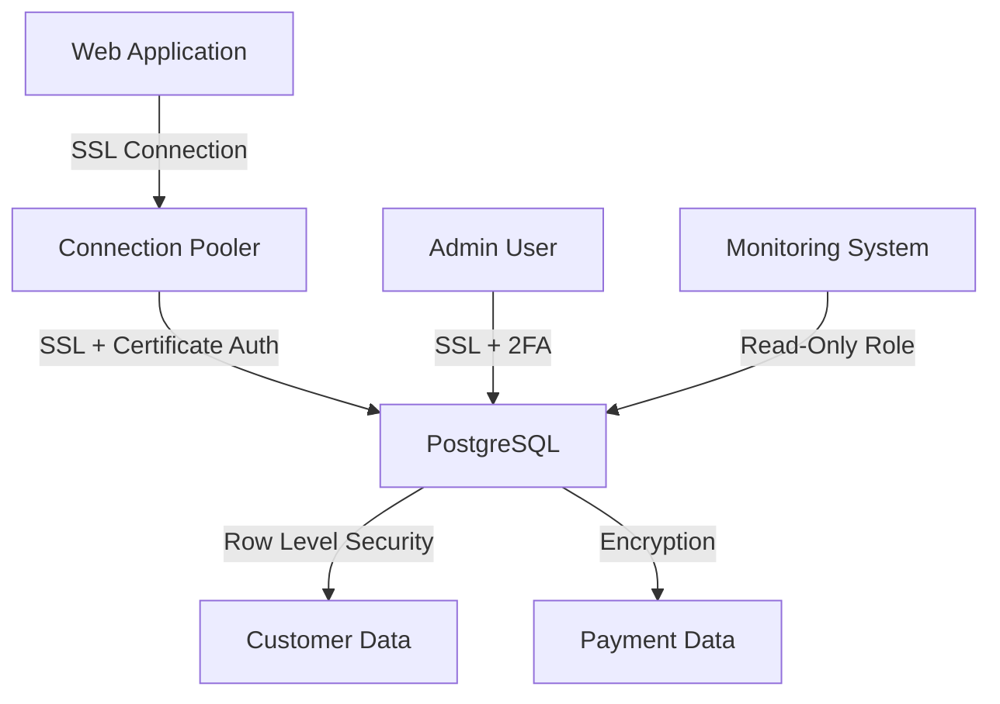

# PostgreSQL Security Practices

## Introduction

Security is a critical aspect of database management, especially when handling sensitive data. PostgreSQL, being a powerful and feature-rich database system, offers various security mechanisms to protect your data. This guide explores essential security practices for PostgreSQL that every developer should implement, even when just starting out.

Security isn't just for production environments - developing good security habits from the beginning makes your transition to production smoother and reduces the risk of security issues later on.

## Core Security Concepts in PostgreSQL

Before diving into specific practices, let's understand the key security concepts in PostgreSQL:

1. **Authentication** - Verifying the identity of users connecting to the database
2. **Authorization** - Controlling what authenticated users can do within the database
3. **Encryption** - Protecting data in transit and at rest
4. **Monitoring** - Tracking database activities to detect suspicious behavior
5. **Updates** - Keeping your PostgreSQL installation patched against known vulnerabilities

Let's explore each of these concepts with practical examples.

## Authentication Best Practices

Authentication is your first line of defense. PostgreSQL offers several authentication methods configured in the `pg_hba.conf` file.

### Strong Password Policies

Always use strong passwords for database users, especially the postgres superuser.

```sql
-- Create a user with a strong password
CREATE USER app_user WITH PASSWORD 'complex-password-here';

-- Change an existing user's password
ALTER USER app_user WITH PASSWORD 'new-complex-password';
```

### Using Password Encryption

Make sure passwords are encrypted in the database:

```sql
-- Check if passwords are encrypted (should be 'scram-sha-256' for modern deployments)
SHOW password_encryption;

-- Set password encryption to scram-sha-256 (in postgresql.conf)
-- password_encryption = 'scram-sha-256'
```

### Configuring pg_hba.conf

The `pg_hba.conf` file controls how clients authenticate. Here's an example of a secure configuration:

```
# TYPE  DATABASE        USER            ADDRESS                 METHOD
local   all             postgres                                peer
host    all             all             127.0.0.1/32            scram-sha-256
host    all             all             ::1/128                 scram-sha-256
host    production      app_user        192.168.1.0/24          scram-sha-256
```

This configuration:
- Allows local connections from the postgres user using peer authentication
- Requires password authentication for local network connections
- Restricts the app_user to only connect from specific IP addresses

### Using Client Certificate Authentication

For high-security environments, consider using client certificates:

```
# In pg_hba.conf
hostssl all             all             0.0.0.0/0               cert
```

### Connection Attempt Limitation

To protect against brute force attacks, you can limit connection attempts:

```
# In postgresql.conf
authentication_timeout = 30s  # Timeout for client authentication
```

## Authorization and Access Control

Once users are authenticated, control what they can do with proper permissions.

### Role-Based Access Control

Create specific roles with only the necessary permissions:

```sql
-- Create a read-only role
CREATE ROLE readonly;
GRANT CONNECT ON DATABASE my_database TO readonly;
GRANT USAGE ON SCHEMA public TO readonly;
GRANT SELECT ON ALL TABLES IN SCHEMA public TO readonly;

-- Create an application role with more permissions
CREATE ROLE app_role;
GRANT CONNECT ON DATABASE my_database TO app_role;
GRANT USAGE ON SCHEMA public TO app_role;
GRANT SELECT, INSERT, UPDATE, DELETE ON ALL TABLES IN SCHEMA public TO app_role;

-- Assign roles to users
GRANT readonly TO reporting_user;
GRANT app_role TO app_user;
```

### Row-Level Security

For fine-grained access control, use Row-Level Security (RLS):

```sql
-- Enable RLS on a table
ALTER TABLE customer ENABLE ROW LEVEL SECURITY;

-- Create a policy that users can only see their own organization's data
CREATE POLICY org_isolation ON customer
    USING (org_id = current_setting('app.current_org_id')::integer);

-- In your application, set the appropriate context
SET app.current_org_id = '42';
```

### Schema Separation

Use schemas to separate data and control access:

```sql
-- Create separate schemas
CREATE SCHEMA app_data;
CREATE SCHEMA app_private;

-- Grant access appropriately
GRANT USAGE ON SCHEMA app_data TO app_role;
GRANT USAGE ON SCHEMA app_private TO admin_role;
```

## Data Encryption

Protect your data both in transit and at rest.

### Encrypting Connections with SSL/TLS

Configure PostgreSQL to use SSL/TLS for all connections:

```
# In postgresql.conf
ssl = on
ssl_cert_file = 'server.crt'
ssl_key_file = 'server.key'
ssl_ca_file = 'root.crt'
```

Then require SSL connections in `pg_hba.conf`:

```
hostssl all             all             0.0.0.0/0               scram-sha-256
```

### Encrypting Sensitive Data

For sensitive data columns, consider using encryption:

```sql
-- Create extension for encryption functions
CREATE EXTENSION pgcrypto;

-- Insert encrypted data
INSERT INTO users (username, credit_card)
VALUES (
  'john_doe',
  pgp_sym_encrypt('4111-1111-1111-1111', 'encryption_key')
);

-- Query encrypted data
SELECT username, pgp_sym_decrypt(credit_card::bytea, 'encryption_key') 
FROM users;
```

## Regular Auditing and Monitoring

Keep track of database activities to detect suspicious behavior.

### Enable Query Logging

Configure PostgreSQL to log queries:

```
# In postgresql.conf
log_statement = 'all'  # Log all statements
log_min_duration_statement = 1000  # Log queries taking more than 1 second
```

### Audit Triggers

Create audit triggers to track changes:

```sql
CREATE TABLE audit_log (
  id SERIAL PRIMARY KEY,
  table_name TEXT NOT NULL,
  user_name TEXT NOT NULL,
  action TEXT NOT NULL,
  old_data JSONB,
  new_data JSONB,
  query TEXT,
  timestamp TIMESTAMPTZ NOT NULL DEFAULT NOW()
);

CREATE OR REPLACE FUNCTION audit_trigger_function()
RETURNS TRIGGER AS $$
BEGIN
  IF (TG_OP = 'DELETE') THEN
    INSERT INTO audit_log(table_name, user_name, action, old_data, query)
    VALUES (TG_TABLE_NAME, current_user, TG_OP, row_to_json(OLD), current_query());
    RETURN OLD;
  ELSIF (TG_OP = 'UPDATE') THEN
    INSERT INTO audit_log(table_name, user_name, action, old_data, new_data, query)
    VALUES (TG_TABLE_NAME, current_user, TG_OP, row_to_json(OLD), row_to_json(NEW), current_query());
    RETURN NEW;
  ELSIF (TG_OP = 'INSERT') THEN
    INSERT INTO audit_log(table_name, user_name, action, new_data, query)
    VALUES (TG_TABLE_NAME, current_user, TG_OP, row_to_json(NEW), current_query());
    RETURN NEW;
  END IF;
  RETURN NULL;
END;
$$ LANGUAGE plpgsql;

-- Apply the trigger to a table
CREATE TRIGGER users_audit_trigger
AFTER INSERT OR UPDATE OR DELETE ON users
FOR EACH ROW EXECUTE PROCEDURE audit_trigger_function();
```

### Using pgAudit Extension

For more comprehensive auditing, use the pgAudit extension:

```sql
-- Install the extension
CREATE EXTENSION pgaudit;

-- Configure in postgresql.conf
-- pgaudit.log = 'write,ddl'
```

## Database Hardening

Apply these additional hardening measures to protect your PostgreSQL installation:

### Restrict File System Access

Configure PostgreSQL to run with minimal privileges:

```
# Set appropriate ownership
chown postgres:postgres /var/lib/postgresql/data
chmod 700 /var/lib/postgresql/data
```

### Network Security

Restrict network access:

```
# In postgresql.conf
listen_addresses = 'localhost'  # Only listen on localhost

# Or specify IP addresses
listen_addresses = '10.0.0.1'  # Only listen on specific IP
```

### Regular Updates and Patching

Keep your PostgreSQL installation updated:

```bash
# For Debian/Ubuntu
sudo apt update
sudo apt upgrade postgresql

# For Red Hat/CentOS
sudo yum update postgresql
```

## Real-World Example: Securing a Web Application Database

Let's put everything together with a real-world example of securing a database for a web application:



### Implementation Steps:

1. **Create dedicated users and roles:**

```sql
-- Create application user with limited permissions
CREATE ROLE web_app_role;
GRANT CONNECT ON DATABASE app_db TO web_app_role;
GRANT USAGE ON SCHEMA public TO web_app_role;
GRANT SELECT, INSERT, UPDATE, DELETE ON ALL TABLES IN SCHEMA public TO web_app_role;
GRANT USAGE, SELECT ON ALL SEQUENCES IN SCHEMA public TO web_app_role;

CREATE USER web_app_user WITH PASSWORD 'strong-password-here';
GRANT web_app_role TO web_app_user;

-- Create monitoring user with read-only access
CREATE ROLE monitoring_role;
GRANT CONNECT ON DATABASE app_db TO monitoring_role;
GRANT USAGE ON SCHEMA public TO monitoring_role;
GRANT SELECT ON ALL TABLES IN SCHEMA public TO monitoring_role;

CREATE USER monitoring_user WITH PASSWORD 'another-strong-password';
GRANT monitoring_role TO monitoring_user;
```

2. **Enable encryption for sensitive data:**

```sql
CREATE EXTENSION pgcrypto;

CREATE TABLE customers (
  id SERIAL PRIMARY KEY,
  name TEXT NOT NULL,
  email TEXT NOT NULL,
  org_id INTEGER NOT NULL
);

CREATE TABLE payments (
  id SERIAL PRIMARY KEY,
  customer_id INTEGER REFERENCES customers(id),
  card_number TEXT,
  amount DECIMAL(10,2) NOT NULL,
  processed_at TIMESTAMPTZ DEFAULT NOW()
);

-- Function to encrypt card data
CREATE OR REPLACE FUNCTION encrypt_card_number()
RETURNS TRIGGER AS $$
BEGIN
  NEW.card_number = pgp_sym_encrypt(NEW.card_number, current_setting('app.encryption_key'));
  RETURN NEW;
END;
$$ LANGUAGE plpgsql;

CREATE TRIGGER encrypt_payment_data
BEFORE INSERT OR UPDATE ON payments
FOR EACH ROW EXECUTE PROCEDURE encrypt_card_number();
```

3. **Implement Row-Level Security:**

```sql
ALTER TABLE customers ENABLE ROW LEVEL SECURITY;
ALTER TABLE payments ENABLE ROW LEVEL SECURITY;

-- Organizations can only see their own customers
CREATE POLICY org_customers ON customers
    USING (org_id = current_setting('app.current_org_id')::integer);

-- Can only see payments for customers in your organization
CREATE POLICY org_payments ON payments
    USING (customer_id IN (
        SELECT id FROM customers 
        WHERE org_id = current_setting('app.current_org_id')::integer
    ));
```

4. **Configure secure connections:**

```
# pg_hba.conf
hostssl app_db         web_app_user    10.0.0.0/24             scram-sha-256
hostssl app_db         monitoring_user 10.0.0.0/24             scram-sha-256
```

5. **Set up monitoring and auditing:**

```sql
CREATE EXTENSION pgaudit;

-- Add audit triggers to sensitive tables
CREATE TRIGGER customers_audit_trigger
AFTER INSERT OR UPDATE OR DELETE ON customers
FOR EACH ROW EXECUTE PROCEDURE audit_trigger_function();

CREATE TRIGGER payments_audit_trigger
AFTER INSERT OR UPDATE OR DELETE ON payments
FOR EACH ROW EXECUTE PROCEDURE audit_trigger_function();
```

6. **Application connection code:**

```python
import psycopg2
import os

def get_db_connection():
    conn = psycopg2.connect(
        host="db.example.com",
        database="app_db",
        user="web_app_user",
        password=os.environ.get("DB_PASSWORD"),
        sslmode="require"
    )
    
    # Set the organization context for RLS
    cursor = conn.cursor()
    cursor.execute("SET app.current_org_id = %s", (get_user_org_id(),))
    cursor.close()
    
    # Set encryption key from secure environment variable
    cursor = conn.cursor()
    cursor.execute("SET app.encryption_key = %s", (os.environ.get("ENCRYPTION_KEY"),))
    cursor.close()
    
    return conn
```

## Summary

Implementing proper security measures in PostgreSQL is essential for protecting your data. Key practices include:

1. Strong authentication with encrypted passwords and secure connection methods
2. Proper authorization with role-based access control and row-level security
3. Data encryption both in transit (SSL/TLS) and at rest (column encryption)
4. Regular monitoring, auditing, and logging of database activities
5. Keeping your PostgreSQL installation updated and properly configured

By following these best practices, you can significantly improve the security posture of your PostgreSQL databases and protect your sensitive data from unauthorized access or breaches.

## Additional Resources

- [PostgreSQL Documentation on Security](https://www.postgresql.org/docs/current/security.html)
- [pgAudit Extension Documentation](https://github.com/pgaudit/pgaudit)
- [pgcrypto Extension Documentation](https://www.postgresql.org/docs/current/pgcrypto.html)

## Exercises

1. Set up a local PostgreSQL database with SSL/TLS encryption and verify the connection is secure.
2. Create a table with sensitive data and implement column-level encryption using pgcrypto.
3. Implement row-level security on a multi-tenant database to ensure data isolation.
4. Configure audit logging and create a report of all modification activities.
5. Perform a security assessment of your PostgreSQL configuration and identify potential improvements.