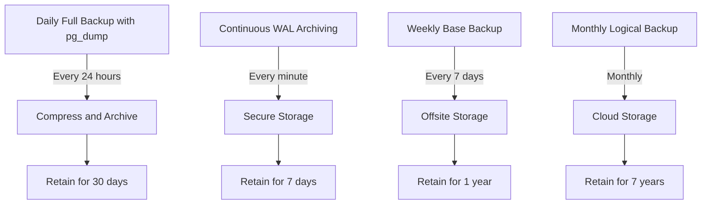

# PostgreSQL Backup Strategies

Database backups are a critical aspect of any production system. In this guide, we'll explore various PostgreSQL backup strategies to help you implement a robust data protection plan for your databases.

## Introduction

No matter how reliable your hardware or how skilled your team, data loss can happen to anyone. Hardware failures, human errors, software bugs, or even natural disasters can compromise your data. Having a solid backup strategy isn't just good practice—it's essential for business continuity and data protection.

PostgreSQL offers several built-in tools and approaches for creating backups, each with its own advantages and use cases. Let's explore these options to help you choose the right strategy for your needs.

## Understanding Backup Types

Before diving into specific tools, let's understand the main types of PostgreSQL backups:

### Logical vs Physical Backups

**Logical backups** extract database content into a script file or other format that contains SQL commands. These backups are portable, flexible, and version-independent but generally slower for large databases.

**Physical backups** (also called binary backups) copy the raw database files directly. They're typically faster and produce exact replicas of your database but are often version-specific and less flexible.

### Full vs Incremental Backups

**Full backups** contain your entire database and can be restored independently.

**Incremental backups** only contain data that has changed since the previous backup, making them faster and smaller but dependent on previous backups for restoration.

## Backup Methods in PostgreSQL

Let's explore the primary tools and methods for backing up PostgreSQL databases.

### 1. pg_dump: Logical Backups of a Single Database

`pg_dump` is PostgreSQL's built-in utility for creating logical backups of a single database. It generates a file containing SQL commands that, when executed, will recreate the database in the same state as it was at the time of the backup.

#### Basic Usage

```bash
pg_dump -U username -d database_name -f backup_file.sql
```

#### Example with Options

```bash
# Create a compressed backup in custom format
pg_dump -U postgres -d myapp_production -F c -f myapp_backup.dump

# Create a plain SQL backup excluding the large_data_table
pg_dump -U postgres -d myapp_production -T large_data_table -f myapp_backup.sql
```

#### Key Features and Options

- **Format options** (-F):
  - Plain text (default): SQL commands
  - Custom (-F c): PostgreSQL-specific format that allows selective restores
  - Directory (-F d): Directory format for parallel restore
  - Archive (-F a): Compressed archive format

- **Compression** (-Z): Specify compression level (0-9)
- **Table inclusion/exclusion** (-t/-T): Specify tables to include or exclude
- **Schema inclusion/exclusion** (-n/-N): Specify schemas to include or exclude
- **Data-only or schema-only** (-a/-s): Backup just data or just schema

### 2. pg_dumpall: Backup Multiple Databases

While `pg_dump` handles a single database, `pg_dumpall` can back up an entire PostgreSQL instance, including all databases and global objects like roles and tablespaces.

```bash
# Backup all databases and global objects
pg_dumpall -U postgres -f full_backup.sql

# Backup only global objects (roles, tablespaces)
pg_dumpall -U postgres --globals-only -f globals_backup.sql
```

### 3. Continuous Archiving & Point-in-Time Recovery (PITR)

For production systems requiring minimal data loss, PostgreSQL offers Continuous Archiving using Write-Ahead Log (WAL) files, enabling Point-in-Time Recovery.

#### How it Works

1. PostgreSQL continuously records all changes in WAL files
2. These WAL files are archived to a safe location
3. Periodically, a base backup (physical backup) is taken
4. Recovery combines the base backup with WAL files to restore to any point in time

#### Setting Up WAL Archiving

First, configure your `postgresql.conf` file:

```
# Enable WAL archiving
wal_level = replica
archive_mode = on
archive_command = 'cp %p /path/to/archive/%f'
```

Then take a base backup:

```bash
# Create a base backup
pg_basebackup -D /backup/base/directory -Ft -z
```

#### Recovery Process

To recover using PITR:

1. Create a recovery.conf file in your data directory:
```
restore_command = 'cp /path/to/archive/%f %p'
recovery_target_time = '2023-04-15 10:30:00'
```

2. Start PostgreSQL, which will recover to the specified point in time

### 4. File System Level Backup

File system backups involve copying PostgreSQL's data directory directly. This method requires that PostgreSQL be shut down or put in backup mode to ensure consistency.

```bash
# First, stop PostgreSQL or use pg_start_backup()
sudo systemctl stop postgresql

# Copy the data directory
sudo cp -R /var/lib/postgresql/data /backup/location

# Restart PostgreSQL
sudo systemctl start postgresql
```

### 5. Logical Replication for Online Backups

Logical replication allows you to replicate specific tables or databases to another server, which can serve as a hot backup.

```sql
-- On the publisher (source) server
CREATE PUBLICATION my_publication FOR TABLE customers, orders;

-- On the subscriber (backup) server
CREATE SUBSCRIPTION my_subscription
    CONNECTION 'host=publisher dbname=mydb user=postgres'
    PUBLICATION my_publication;
```

## Implementing a Comprehensive Backup Strategy

A robust backup strategy typically combines multiple methods. Here's an example approach:



### Example Implementation Plan

1. **Daily Logical Backups**
   ```bash
   # Create a backup script
   cat > /etc/cron.daily/pg_backup.sh << 'EOF'
   #!/bin/bash
   TIMESTAMP=$(date +%Y%m%d_%H%M%S)
   BACKUP_DIR="/var/backups/postgresql"
   DB_USER="postgres"
   DB_NAME="myapp_production"
   
   # Create backup directory if it doesn't exist
   mkdir -p ${BACKUP_DIR}
   
   # Perform the backup
   pg_dump -U ${DB_USER} -d ${DB_NAME} -F c -f ${BACKUP_DIR}/${DB_NAME}_${TIMESTAMP}.dump
   
   # Delete backups older than 30 days
   find ${BACKUP_DIR} -name "*.dump" -type f -mtime +30 -delete
   EOF
   
   # Make it executable
   chmod +x /etc/cron.daily/pg_backup.sh
   ```

2. **Continuous WAL Archiving**
   Edit `postgresql.conf`:
   ```
   wal_level = replica
   archive_mode = on
   archive_command = 'test ! -f /var/lib/postgresql/archive/%f && cp %p /var/lib/postgresql/archive/%f'
   ```

3. **Weekly Base Backup**
   ```bash
   # Create a weekly backup script
   cat > /etc/cron.weekly/pg_base_backup.sh << 'EOF'
   #!/bin/bash
   TIMESTAMP=$(date +%Y%m%d)
   BACKUP_DIR="/var/backups/postgresql/basebackups"
   
   # Create backup directory if it doesn't exist
   mkdir -p ${BACKUP_DIR}
   
   # Perform base backup
   pg_basebackup -D ${BACKUP_DIR}/${TIMESTAMP} -Ft -z -U postgres
   
   # Delete backups older than 8 weeks
   find ${BACKUP_DIR} -type d -mtime +56 -exec rm -rf {} \;
   EOF
   
   # Make it executable
   chmod +x /etc/cron.weekly/pg_base_backup.sh
   ```

## Backup Verification and Testing

A backup is only as good as your ability to restore from it. Regular testing of your backups is crucial.

```bash
# Script to test pg_dump restoration
cat > test_restore.sh << 'EOF'
#!/bin/bash
BACKUP_FILE=$1
TEST_DB="restore_test"

# Drop test database if it exists
dropdb --if-exists -U postgres ${TEST_DB}

# Create test database
createdb -U postgres ${TEST_DB}

# Restore backup
pg_restore -U postgres -d ${TEST_DB} ${BACKUP_FILE}

# Run simple test query
psql -U postgres -d ${TEST_DB} -c "SELECT COUNT(*) FROM users;"

# Clean up
dropdb -U postgres ${TEST_DB}
EOF

chmod +x test_restore.sh
```

## Monitoring Backup Operations

Implement monitoring to ensure your backups complete successfully:

```bash
# Script to check backup status
cat > check_backup.sh << 'EOF'
#!/bin/bash
BACKUP_DIR="/var/backups/postgresql"
ALERT_EMAIL="dba@example.com"

# Check if any backups were created in the last 24 hours
if [ $(find ${BACKUP_DIR} -name "*.dump" -type f -mtime -1 | wc -l) -eq 0 ]; then
  echo "WARNING: No PostgreSQL backups found in the last 24 hours!" | mail -s "Backup Alert" ${ALERT_EMAIL}
  exit 1
fi

# Check backup size
LATEST_BACKUP=$(find ${BACKUP_DIR} -name "*.dump" -type f -mtime -1 | sort | tail -1)
if [ -f "${LATEST_BACKUP}" ]; then
  SIZE=$(du -k "${LATEST_BACKUP}" | cut -f1)
  if [ ${SIZE} -lt 1000 ]; then  # Less than 1MB
    echo "WARNING: Latest backup file is suspiciously small (${SIZE}KB)!" | mail -s "Backup Alert" ${ALERT_EMAIL}
    exit 1
  fi
fi

exit 0
EOF

chmod +x check_backup.sh
```

## Best Practices for PostgreSQL Backups

1. **Diversify backup methods**: Combine logical and physical backups
2. **Follow the 3-2-1 rule**: Keep 3 copies, on 2 different media, with 1 offsite
3. **Automate everything**: Backup creation, testing, and cleanup
4. **Document procedures**: Include both backup and restoration procedures
5. **Monitor and alert**: Be notified of backup failures
6. **Test restores regularly**: Schedule monthly restore drills
7. **Balance backup frequency with impact**: Consider performance impacts on production
8. **Encrypt sensitive backups**: Protect data in transit and at rest
9. **Version control backup scripts**: Track changes to backup procedures
10. **Backup configuration too**: Save `postgresql.conf` and `pg_hba.conf`

## Restoration Procedures

Knowing how to restore is as important as taking backups. Here are the basic restoration commands:

### Restoring a pg_dump Backup

```bash
# For SQL format
psql -U postgres -d database_name -f backup_file.sql

# For custom format
pg_restore -U postgres -d database_name backup_file.dump

# For directory format
pg_restore -U postgres -d database_name -j 4 backup_directory
```

### Restoring from a Base Backup with WAL

```bash
# Stop PostgreSQL
sudo systemctl stop postgresql

# Clear data directory
sudo rm -rf /var/lib/postgresql/data/*

# Restore base backup
sudo tar -xzf /path/to/base_backup.tar.gz -C /var/lib/postgresql/data

# Create recovery.conf
cat > /var/lib/postgresql/data/recovery.conf << EOF
restore_command = 'cp /path/to/archive/%f %p'
recovery_target_time = '2023-04-15 10:30:00'
EOF

# Fix permissions
sudo chown -R postgres:postgres /var/lib/postgresql/data
sudo chmod 700 /var/lib/postgresql/data

# Start PostgreSQL
sudo systemctl start postgresql
```

## Summary

PostgreSQL offers multiple backup strategies to meet different recovery needs:

1. **pg_dump/pg_dumpall**: Logical backups suitable for smaller databases and when portability matters
2. **Continuous Archiving (PITR)**: For minimal data loss in production environments
3. **File System Backups**: Simple but requires database downtime
4. **Replication**: For high-availability and online backups

A comprehensive backup strategy should include a combination of these methods, regular testing, and proper monitoring. By implementing the practices outlined in this guide, you'll be well-prepared to recover from potential data loss scenarios.

## Additional Resources and Exercises

### Resources

- [PostgreSQL Official Documentation on Backup and Restore](https://www.postgresql.org/docs/current/backup.html)
- [PostgreSQL Wiki on Backup and Recovery](https://wiki.postgresql.org/wiki/Backup_and_Recovery)

### Exercises

1. **Exercise 1**: Set up daily pg_dump backups for a test database
   - Create a simple database with a few tables
   - Write a script to automate backups
   - Test the restoration process

2. **Exercise 2**: Configure WAL archiving
   - Modify your PostgreSQL configuration to enable archiving
   - Test recovery to a specific point in time

3. **Exercise 3**: Design a complete backup strategy
   - Based on a scenario (e.g., e-commerce site with 100GB database)
   - Include backup frequency, retention, and testing procedures
   - Document the restoration process for different failure scenarios