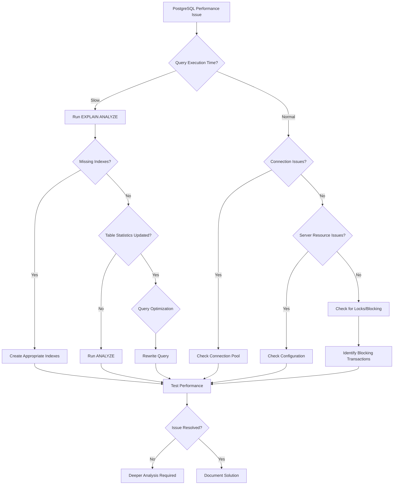

# PostgreSQL Common Pitfalls

## Introduction

PostgreSQL is a powerful open-source relational database system with over 30 years of active development. While it offers robust features and reliability, newcomers often encounter challenges that can lead to performance issues, security vulnerabilities, or unexpected behavior. This guide identifies the most common PostgreSQL pitfalls and provides practical solutions to help you avoid them.

## Connection Management Issues

### Connection Pooling Neglect

One of the most common mistakes in PostgreSQL deployments is failing to implement connection pooling.

#### The Problem

Each PostgreSQL connection consumes server resources (approximately 10MB of RAM). Applications that create new connections for each database operation can quickly exhaust server resources.

```sql
// Bad practice: Creating new connections for each operation
const { Pool, Client } = require('pg')

// In a web application handling requests
app.get('/data', async (req, res) => {
  // Creating a new client for each request!
  const client = new Client({
    user: 'dbuser',
    host: 'database.server.com',
    database: 'mydb',
    password: 'secretpassword',
    port: 5432,
  })
  await client.connect()
  
  const result = await client.query('SELECT * FROM users')
  await client.end()
  
  res.json(result.rows)
})
```

#### The Solution

Implement connection pooling to reuse database connections across requests:

```sql
// Good practice: Using a connection pool
const { Pool } = require('pg')

// Create a single pool for your application
const pool = new Pool({
  user: 'dbuser',
  host: 'database.server.com',
  database: 'mydb',
  password: 'secretpassword',
  port: 5432,
  max: 20, // Set maximum pool size based on your needs
})

app.get('/data', async (req, res) => {
  // Get a client from the pool
  const client = await pool.connect()
  
  try {
    const result = await client.query('SELECT * FROM users')
    res.json(result.rows)
  } finally {
    // Return the client to the pool
    client.release()
  }
})
```

### Unclosed Connections

Failing to properly close database connections is another common pitfall.

#### The Problem

Unclosed connections can lead to connection leaks, where the server eventually runs out of available connections.

#### The Solution

Always ensure connections are closed, preferably using try/finally blocks or similar error-handling patterns.

## Query Performance Issues

### Missing Indexes

Failing to create proper indexes is one of the most common causes of poor PostgreSQL performance.

#### The Problem

Without appropriate indexes, PostgreSQL must perform sequential scans on entire tables, which becomes increasingly slow as data grows.

```sql
-- A query that will be slow without proper indexing
SELECT * FROM orders WHERE customer_id = 12345;
```

#### The Solution

Identify frequently used query patterns and create appropriate indexes:

```sql
-- Create an index for faster customer order lookups
CREATE INDEX idx_orders_customer_id ON orders(customer_id);
```

You can verify the effectiveness of your indexes with the `EXPLAIN ANALYZE` command:

```sql
-- Check how the query is executed
EXPLAIN ANALYZE SELECT * FROM orders WHERE customer_id = 12345;
```

Before indexing:
```
Seq Scan on orders  (cost=0.00..458.00 rows=23 width=97) (actual time=0.028..8.312 rows=21 loops=1)
  Filter: (customer_id = 12345)
  Rows Removed by Filter: 9979
Planning Time: 0.082 ms
Execution Time: 8.338 ms
```

After indexing:
```
Index Scan using idx_orders_customer_id on orders  (cost=0.29..8.31 rows=23 width=97) (actual time=0.023..0.063 rows=21 loops=1)
  Index Cond: (customer_id = 12345)
Planning Time: 0.103 ms
Execution Time: 0.091 ms
```

### N+1 Query Problems

The N+1 query problem occurs when an application executes N additional queries to fetch related data for N results from an initial query.

#### The Problem

```sql
// Pseudocode example of N+1 problem
// First query gets all users
const users = await db.query('SELECT * FROM users LIMIT 100');

// Then for each user, we query their orders (this is the +1 queries)
for (let user of users) {
  user.orders = await db.query('SELECT * FROM orders WHERE user_id = $1', [user.id]);
}
```

This approach leads to significant performance issues as it creates many small, separate database calls.

#### The Solution

Use JOINs or the `IN` operator to batch related data retrieval:

```sql
// Using JOIN to fetch users with their orders in one query
const usersWithOrders = await db.query(`
  SELECT users.*, orders.* 
  FROM users 
  LEFT JOIN orders ON users.id = orders.user_id 
  WHERE users.id IN (SELECT id FROM users LIMIT 100)
`);

// Or using a separate efficient query with IN clause
const users = await db.query('SELECT * FROM users LIMIT 100');
const userIds = users.map(user => user.id);
const orders = await db.query('SELECT * FROM orders WHERE user_id = ANY($1)', [userIds]);

// Then map orders to users in your application code
```

### Improper Use of LIKE Queries

Using `LIKE` patterns with leading wildcards prevents PostgreSQL from using indexes effectively.

#### The Problem

```sql
-- This query cannot use indexes efficiently
SELECT * FROM products WHERE name LIKE '%keyboard%';
```

#### The Solution

For text search functionality, use PostgreSQL's full-text search capabilities instead:

```sql
-- Create a text search index
CREATE INDEX idx_products_name_tsv ON products USING GIN (to_tsvector('english', name));

-- Query using text search
SELECT * FROM products 
WHERE to_tsvector('english', name) @@ to_tsquery('english', 'keyboard');
```

## Data Integrity Issues

### Improper Constraint Usage

Not utilizing PostgreSQL's constraint features can lead to data integrity problems.

#### The Problem

Without proper constraints, invalid data can enter your database:

```sql
-- Table without proper constraints
CREATE TABLE users (
  id SERIAL,
  email TEXT,
  age INTEGER
);

-- This allows duplicate emails and negative ages
INSERT INTO users (email, age) VALUES ('user@example.com', -10);
INSERT INTO users (email, age) VALUES ('user@example.com', 25);
```

#### The Solution

Use appropriate constraints to enforce data integrity:

```sql
-- Table with proper constraints
CREATE TABLE users (
  id SERIAL PRIMARY KEY,
  email TEXT NOT NULL UNIQUE,
  age INTEGER CHECK (age >= 0)
);

-- Now these invalid inserts will be rejected
INSERT INTO users (email, age) VALUES ('user@example.com', -10);
-- ERROR:  new row for relation "users" violates check constraint "users_age_check"

INSERT INTO users (email, age) VALUES ('user@example.com', 25);
-- First one succeeds
INSERT INTO users (email, age) VALUES ('user@example.com', 30);
-- ERROR:  duplicate key value violates unique constraint "users_email_key"
```

### Inconsistent Data Types

Using inconsistent data types across tables can lead to unexpected behavior.

#### The Problem

```sql
CREATE TABLE orders (
  id SERIAL PRIMARY KEY,
  customer_id INTEGER,
  total NUMERIC(10, 2)
);

CREATE TABLE customers (
  id BIGINT PRIMARY KEY,
  name TEXT
);

-- This foreign key relationship will have issues because of different integer types
ALTER TABLE orders ADD CONSTRAINT fk_customer 
FOREIGN KEY (customer_id) REFERENCES customers(id);
```

#### The Solution

Be consistent with your data types across related tables:

```sql
CREATE TABLE orders (
  id SERIAL PRIMARY KEY,
  customer_id BIGINT,  -- Changed to match customers.id
  total NUMERIC(10, 2)
);

CREATE TABLE customers (
  id BIGINT PRIMARY KEY,
  name TEXT
);

-- Now the foreign key will work correctly
ALTER TABLE orders ADD CONSTRAINT fk_customer 
FOREIGN KEY (customer_id) REFERENCES customers(id);
```

## Security Pitfalls

### SQL Injection Vulnerabilities

SQL injection remains one of the most dangerous security issues in database applications.

#### The Problem

Concatenating user input directly into SQL queries:

```sql
// Dangerous - vulnerable to SQL injection
const userId = req.params.id;
const query = `SELECT * FROM users WHERE id = ${userId}`;
const result = await client.query(query);

// An attacker could set userId to "1; DROP TABLE users;" and cause damage
```

#### The Solution

Always use parameterized queries:

```sql
// Safe - using parameterized query
const userId = req.params.id;
const query = 'SELECT * FROM users WHERE id = $1';
const result = await client.query(query, [userId]);
```

### Overly Permissive Privileges

Giving database users more privileges than they need is a common security mistake.

#### The Problem

Using a single database user with full privileges for all application operations:

```sql
-- Giving too many privileges
GRANT ALL PRIVILEGES ON DATABASE myapp TO webuser;
```

#### The Solution

Follow the principle of least privilege by creating role-specific database users:

```sql
-- Create a read-only user for reporting functions
CREATE ROLE reporting_user WITH LOGIN PASSWORD 'secure_password';
GRANT CONNECT ON DATABASE myapp TO reporting_user;
GRANT USAGE ON SCHEMA public TO reporting_user;
GRANT SELECT ON ALL TABLES IN SCHEMA public TO reporting_user;

-- Create an application user with more limited privileges
CREATE ROLE app_user WITH LOGIN PASSWORD 'different_secure_password';
GRANT CONNECT ON DATABASE myapp TO app_user;
GRANT USAGE ON SCHEMA public TO app_user;
GRANT SELECT, INSERT, UPDATE, DELETE ON specific_tables TO app_user;
```

## Transaction Management Issues

### Improper Transaction Handling

Mismanaging transactions can lead to data inconsistency or locking issues.

#### The Problem

Not properly committing or rolling back transactions:

```sql
// Problematic transaction handling
const client = await pool.connect();

await client.query('BEGIN');
try {
  await client.query('UPDATE accounts SET balance = balance - 100 WHERE id = 1');
  // If an error occurs here, the transaction is neither committed nor rolled back
  await client.query('UPDATE accounts SET balance = balance + 100 WHERE id = 2');
  // Forgot to commit!
} catch (e) {
  // No rollback handling
  console.error(e);
} finally {
  client.release();
}
```

#### The Solution

Ensure proper transaction management with explicit commits and rollbacks:

```sql
// Proper transaction handling
const client = await pool.connect();

try {
  await client.query('BEGIN');
  await client.query('UPDATE accounts SET balance = balance - 100 WHERE id = 1');
  await client.query('UPDATE accounts SET balance = balance + 100 WHERE id = 2');
  await client.query('COMMIT');
} catch (e) {
  await client.query('ROLLBACK');
  console.error('Transaction failed:', e);
  throw e; // Re-throw the error after rollback
} finally {
  client.release();
}
```

### Long-Running Transactions

Keeping transactions open for extended periods can lead to database locking problems.

#### The Problem

Long-running transactions can block other operations, causing performance degradation:

```sql
// Problematic: Long-running transaction
BEGIN;

-- Do some initial work
UPDATE large_table SET status = 'processing';

-- Perform external API call or long computation
// ... lengthy operation that could take minutes ...

-- Finalize the transaction
UPDATE large_table SET status = 'completed';
COMMIT;
```

#### The Solution

Keep transactions short and focused:

```sql
// Better: Split into smaller transactions
// Transaction 1: Mark items for processing
BEGIN;
UPDATE large_table SET status = 'processing' WHERE id IN (
  SELECT id FROM large_table WHERE status = 'pending' LIMIT 100
) RETURNING id;
COMMIT;

// Process items outside of a transaction
// ... lengthy operation ...

// Transaction 2: Update processed items
BEGIN;
UPDATE large_table SET status = 'completed' WHERE id IN (list_of_processed_ids);
COMMIT;
```

## Configuration Pitfalls

### Default Configuration Settings

PostgreSQL's default configuration settings are conservative and not optimized for performance.

#### The Problem

Using default settings can lead to suboptimal performance, especially for larger databases.

#### The Solution

Tune important configuration parameters for your specific workload:

```sql
-- Example configuration adjustments in postgresql.conf

# Memory settings
shared_buffers = 2GB        # 25% of RAM for dedicated servers
work_mem = 64MB             # Helps with complex sorts and joins
maintenance_work_mem = 256MB # Helps with VACUUM, CREATE INDEX, etc.

# Checkpoints
max_wal_size = 2GB
checkpoint_completion_target = 0.9

# Planner settings
random_page_cost = 1.1      # Lower if using SSDs
effective_cache_size = 6GB  # 75% of RAM for dedicated servers

# Parallel query
max_parallel_workers_per_gather = 4
max_parallel_workers = 8
```

### Not Using WAL Archiving

Failing to set up WAL (Write-Ahead Log) archiving can lead to inadequate backup strategies.

#### The Problem

Without WAL archiving, point-in-time recovery isn't possible, and you're limited to full backups.

#### The Solution

Configure WAL archiving for comprehensive backup strategy:

```sql
-- In postgresql.conf
wal_level = replica           # Minimum level for WAL archiving
archive_mode = on             # Enable WAL archiving
archive_command = 'cp %p /path/to/archive/%f'  # Command to archive WAL segments
```

## Monitoring and Maintenance Pitfalls

### Lack of Regular VACUUM

Failing to run VACUUM regularly can lead to bloated tables and degraded performance.

#### The Problem

Without VACUUM, PostgreSQL can't reclaim space from deleted rows, leading to table bloat.

#### The Solution

Ensure autovacuum is properly configured and monitor its activity:

```sql
-- Check current autovacuum settings
SHOW autovacuum;
SHOW autovacuum_vacuum_threshold;
SHOW autovacuum_vacuum_scale_factor;

-- Adjust autovacuum settings in postgresql.conf
autovacuum = on
autovacuum_vacuum_threshold = 50
autovacuum_vacuum_scale_factor = 0.1

-- For large tables, consider table-specific settings
ALTER TABLE large_table SET (
  autovacuum_vacuum_threshold = 1000,
  autovacuum_vacuum_scale_factor = 0.05
);
```

### Ignoring Database Statistics

Not updating statistics can lead to poor query planning.

#### The Problem

The query planner relies on up-to-date statistics to choose efficient execution plans.

#### The Solution

Ensure statistics are regularly updated:

```sql
-- Run ANALYZE manually when needed
ANALYZE table_name;

-- Check when ANALYZE was last run
SELECT relname, last_analyze, last_autoanalyze
FROM pg_stat_user_tables;

-- Ensure autovacuum is also handling ANALYZE
-- In postgresql.conf
autovacuum_analyze_threshold = 50
autovacuum_analyze_scale_factor = 0.05
```

## Schema Design Pitfalls

### Entity-Attribute-Value (EAV) Anti-Pattern

Using EAV schema design is often a performance and maintainability mistake.

#### The Problem

```sql
-- EAV design example
CREATE TABLE entities (
  entity_id SERIAL PRIMARY KEY,
  entity_type VARCHAR(50)
);

CREATE TABLE attributes (
  attribute_id SERIAL PRIMARY KEY,
  entity_type VARCHAR(50),
  attribute_name VARCHAR(100)
);

CREATE TABLE values (
  value_id SERIAL PRIMARY KEY,
  entity_id INTEGER REFERENCES entities(entity_id),
  attribute_id INTEGER REFERENCES attributes(attribute_id),
  value_text TEXT
);

-- Querying is complex and inefficient
SELECT e.entity_id, a.attribute_name, v.value_text
FROM entities e
JOIN values v ON e.entity_id = v.entity_id
JOIN attributes a ON v.attribute_id = a.attribute_id
WHERE e.entity_type = 'product'
AND e.entity_id = 123;
```

#### The Solution

Use proper relational design with appropriate JSON/JSONB columns for flexible attributes:

```sql
-- Better schema design
CREATE TABLE products (
  product_id SERIAL PRIMARY KEY,
  name VARCHAR(100),
  price NUMERIC(10, 2),
  -- Use JSONB for flexible attributes
  attributes JSONB
);

-- Easy to query specific attributes
SELECT product_id, name, price, attributes->>'color' AS color
FROM products
WHERE attributes->>'color' = 'red';

-- Create indexes for commonly queried JSON paths
CREATE INDEX idx_products_color ON products USING GIN ((attributes->'color'));
```

### Overuse of JOINs

Designing schemas that require too many JOINs can lead to performance issues.

#### The Problem

Queries that join many tables can be slow and difficult to optimize:

```sql
-- A query with excessive joins
SELECT o.order_id, c.customer_name, p.product_name, 
       d.quantity, p.price, d.quantity * p.price AS subtotal,
       a.street, a.city, a.postal_code, a.country,
       s.status_name, pm.method_name
FROM orders o
JOIN customers c ON o.customer_id = c.customer_id
JOIN order_details d ON o.order_id = d.order_id
JOIN products p ON d.product_id = p.product_id
JOIN addresses a ON o.shipping_address_id = a.address_id
JOIN order_statuses s ON o.status_id = s.status_id
JOIN payment_methods pm ON o.payment_method_id = pm.method_id
WHERE o.order_date > '2023-01-01';
```

#### The Solution

Consider denormalization for read-heavy workloads or use materialized views:

```sql
-- Create a materialized view for common reporting queries
CREATE MATERIALIZED VIEW order_reports AS
SELECT o.order_id, c.customer_name, p.product_name, 
       d.quantity, p.price, d.quantity * p.price AS subtotal,
       a.street, a.city, a.postal_code, a.country,
       s.status_name, pm.method_name
FROM orders o
JOIN customers c ON o.customer_id = c.customer_id
JOIN order_details d ON o.order_id = d.order_id
JOIN products p ON d.product_id = p.product_id
JOIN addresses a ON o.shipping_address_id = a.address_id
JOIN order_statuses s ON o.status_id = s.status_id
JOIN payment_methods pm ON o.payment_method_id = pm.method_id;

-- Create an index on commonly filtered columns
CREATE INDEX idx_order_reports_date ON order_reports(order_date);

-- Refresh the materialized view periodically
REFRESH MATERIALIZED VIEW order_reports;

-- Now queries can be much simpler and faster
SELECT * FROM order_reports WHERE order_date > '2023-01-01';
```

## Common Workflow for Troubleshooting PostgreSQL Issues

The following diagram illustrates a systematic approach to identifying and resolving PostgreSQL performance issues:



## Summary

PostgreSQL is a powerful database system, but avoiding common pitfalls requires attention to detail and best practices. Key points to remember include:

1. **Connection Management**: Implement connection pooling and ensure connections are properly closed.
2. **Query Performance**: Create appropriate indexes, avoid N+1 queries, and use query optimization techniques.
3. **Data Integrity**: Use constraints effectively and maintain consistent data types.
4. **Security**: Prevent SQL injection with parameterized queries and implement the principle of least privilege.
5. **Transaction Management**: Keep transactions short and ensure proper commit/rollback handling.
6. **Configuration**: Tune PostgreSQL settings for your specific workload.
7. **Maintenance**: Regular VACUUM and statistics updates are essential.
8. **Schema Design**: Avoid anti-patterns like EAV and excessive JOINs.

By addressing these common pitfalls, you'll build more robust, efficient, and maintainable PostgreSQL-based applications.

## Additional Resources

- [PostgreSQL Official Documentation](https://www.postgresql.org/docs/)
- [The PostgreSQL Performance Tuning Guide](https://www.postgresql.org/docs/current/performance-tips.html)
- [PGTune](https://pgtune.leopard.in.ua/) - A web tool for generating optimized PostgreSQL configuration
- [pg_stat_statements](https://www.postgresql.org/docs/current/pgstatstatements.html) - For monitoring query performance
- [PostgreSQL Exercises](https://pgexercises.com/) - For practicing SQL skills

## Practice Exercises

1. **Index Analysis**: Take a slow query from your application and use `EXPLAIN ANALYZE` to identify missing indexes. Create the appropriate index and measure the performance improvement.

2. **Connection Pool Implementation**: Implement a connection pool in your application and benchmark the performance difference before and after implementation.

3. **Security Audit**: Review your database users and permissions. Implement role-based access control following the principle of least privilege.

4. **Transaction Optimization**: Identify long-running transactions in your application and refactor them to be shorter and more focused.

5. **Configuration Tuning**: Use PGTune to generate optimized PostgreSQL configuration settings for your server's specifications and workload type.