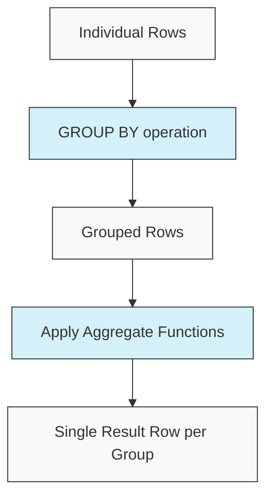

# PostgreSQL Aggregate Functions

## Introduction

Aggregate functions are a powerful feature in PostgreSQL that allow you to perform calculations across multiple rows of a query result and return a single output value. They're essential for data analysis, reporting, and summarizing large datasets.

Unlike regular functions that operate on each row individually, aggregate functions work on groups of rows to compute statistics like averages, sums, counts, and more. These functions are fundamental to analytical queries and form the backbone of business intelligence applications.

## Basic Aggregate Functions

Let's explore the most commonly used aggregate functions in PostgreSQL:

### COUNT()

The `COUNT()` function returns the number of rows that match a specified condition.

```sql
-- Count all rows in a table
SELECT COUNT(*) FROM employees;

-- Count non-null values in a specific column
SELECT COUNT(email) FROM employees;

-- Count employees by department
SELECT department_id, COUNT(*) 
FROM employees
GROUP BY department_id;
```

Example output:

```
 count 
-------
    25
```

### SUM()

The `SUM()` function calculates the total sum of a numeric column.

```sql
-- Calculate total salary budget
SELECT SUM(salary) FROM employees;

-- Calculate sum of salaries by department
SELECT department_id, SUM(salary) 
FROM employees 
GROUP BY department_id;
```

Example output:

```
   sum   
---------
 1582500
```

### AVG()

The `AVG()` function calculates the average value of a numeric column.

```sql
-- Calculate average salary
SELECT AVG(salary) FROM employees;

-- Calculate average salary by department
SELECT department_id, AVG(salary) 
FROM employees 
GROUP BY department_id;
```

Example output:

```
          avg          
-----------------------
 63300.0000000000000000
```

### MIN() and MAX()

These functions return the minimum and maximum values in a column.

```sql
-- Find lowest and highest salaries
SELECT MIN(salary), MAX(salary) FROM employees;

-- Find salary range by department
SELECT department_id, MIN(salary), MAX(salary) 
FROM employees 
GROUP BY department_id;
```

Example output:

```
  min  |  max  
-------+-------
 42000 | 95000
```

## Advanced Aggregate Functions

PostgreSQL offers several advanced aggregate functions for more complex analyses:

### ARRAY_AGG()

The `ARRAY_AGG()` function aggregates values into an array.

```sql
-- Collect all employee names in a department into an array
SELECT department_id, ARRAY_AGG(employee_name) 
FROM employees 
GROUP BY department_id;
```

Example output:

```
 department_id |                array_agg                
---------------+----------------------------------------
             1 | {John,Mary,Robert,Susan}
             2 | {James,Patricia,Michael,Jennifer,David}
```

### STRING_AGG()

The `STRING_AGG()` function concatenates values into a string with a delimiter.

```sql
-- Create a comma-separated list of employees in each department
SELECT department_id, STRING_AGG(employee_name, ', ') 
FROM employees 
GROUP BY department_id;
```

Example output:

```
 department_id |              string_agg              
---------------+-------------------------------------
             1 | John, Mary, Robert, Susan
             2 | James, Patricia, Michael, Jennifer, David
```

### JSON_AGG() and JSONB_AGG()

These functions aggregate values into JSON or JSONB arrays.

```sql
-- Create JSON array of employee records
SELECT department_id, JSON_AGG(ROW_TO_JSON(e)) 
FROM employees e
GROUP BY department_id;
```

Example output:

```
 department_id |                                 json_agg
---------------+--------------------------------------------------------------------------
             1 | [{"id":1,"name":"John","salary":65000}, {"id":2,"name":"Mary","salary":72000}]
```

## Statistical Aggregate Functions

PostgreSQL includes several statistical aggregate functions:

### STDDEV(), VARIANCE()

Calculate the standard deviation and variance of a dataset.

```sql
-- Calculate salary standard deviation
SELECT STDDEV(salary), VARIANCE(salary) FROM employees;
```

Example output:

```
       stddev       |     variance     
--------------------+------------------
 12456.7890123456   | 155171543.21
```

### PERCENTILE_CONT() and PERCENTILE_DISC()

These functions calculate percentiles of a dataset.

```sql
-- Find median salary (50th percentile)
SELECT PERCENTILE_CONT(0.5) WITHIN GROUP (ORDER BY salary) 
FROM employees;

-- Find 25th, 50th and 75th percentiles
SELECT 
  PERCENTILE_CONT(0.25) WITHIN GROUP (ORDER BY salary) AS "25th",
  PERCENTILE_CONT(0.5) WITHIN GROUP (ORDER BY salary) AS "50th",
  PERCENTILE_CONT(0.75) WITHIN GROUP (ORDER BY salary) AS "75th"
FROM employees;
```

Example output:

```
 50th  
-------
 62500
```

## Using Aggregate Functions with GROUP BY

The `GROUP BY` clause is often used with aggregate functions to group rows that have the same values in specified columns:

```sql
-- Count employees and average salary by department and job title
SELECT 
  department_id,
  job_title,
  COUNT(*) AS employee_count,
  AVG(salary) AS avg_salary
FROM 
  employees
GROUP BY 
  department_id, 
  job_title
ORDER BY 
  department_id, 
  job_title;
```

Example output:

```
 department_id |   job_title   | employee_count |    avg_salary    
---------------+---------------+----------------+------------------
             1 | Developer     |              3 | 72000.00000000
             1 | Manager       |              1 | 85000.00000000
             2 | Analyst       |              4 | 65000.00000000
             2 | Designer      |              2 | 68000.00000000
```

## Filtering Groups with HAVING

The `HAVING` clause allows you to filter the results of aggregate functions:

```sql
-- Find departments with average salary greater than 70000
SELECT 
  department_id, 
  AVG(salary) AS avg_salary
FROM 
  employees
GROUP BY 
  department_id
HAVING 
  AVG(salary) > 70000;
```

Example output:

```
 department_id |    avg_salary    
---------------+------------------
             1 | 75666.66666666667
             4 | 82500.00000000000
```

## Common Use Cases

Here are some real-world applications of aggregate functions:

### Sales Reporting

```sql
-- Monthly sales totals
SELECT 
  EXTRACT(YEAR FROM order_date) AS year,
  EXTRACT(MONTH FROM order_date) AS month,
  SUM(order_total) AS monthly_sales
FROM 
  orders
GROUP BY 
  EXTRACT(YEAR FROM order_date),
  EXTRACT(MONTH FROM order_date)
ORDER BY 
  year, month;
```

### Customer Analysis

```sql
-- Top 5 customers by total purchase amount
SELECT 
  customer_id,
  COUNT(order_id) AS order_count,
  SUM(order_total) AS total_spent
FROM 
  orders
GROUP BY 
  customer_id
ORDER BY 
  total_spent DESC
LIMIT 5;
```

### Product Performance

```sql
-- Product sales statistics
SELECT 
  product_id,
  COUNT(*) AS times_sold,
  SUM(quantity) AS units_sold,
  AVG(price) AS avg_price,
  SUM(quantity * price) AS total_revenue
FROM 
  order_items
GROUP BY 
  product_id
ORDER BY 
  total_revenue DESC;
```

## Handling NULL Values

Aggregate functions typically ignore NULL values in their calculations:

```sql
-- Table: employees(id, name, department, bonus)
-- Where some employees have NULL bonus values

-- This counts only employees with non-NULL bonus values
SELECT COUNT(bonus) FROM employees;  

-- To count all rows including NULL values
SELECT COUNT(*) FROM employees;

-- To handle NULL values in calculations
SELECT 
  AVG(COALESCE(bonus, 0)) AS avg_bonus_including_nulls
FROM 
  employees;
```

## Window Functions vs. Aggregate Functions

While related to aggregate functions, window functions (like `ROW_NUMBER()`, `RANK()`, etc.) calculate results across a set of table rows related to the current row. Unlike regular aggregate functions, window functions don't collapse rows:

```sql
-- Regular aggregate - returns 1 row per department
SELECT 
  department_id, 
  AVG(salary) 
FROM employees 
GROUP BY department_id;

-- Window function - returns all rows, with department average for each
SELECT 
  employee_id,
  name,
  department_id,
  salary,
  AVG(salary) OVER (PARTITION BY department_id) AS dept_avg_salary
FROM 
  employees;
```

## Combining Multiple Aggregate Functions

You can use multiple aggregate functions in a single query:

```sql
-- Comprehensive department statistics
SELECT 
  department_id,
  COUNT(*) AS employee_count,
  MIN(salary) AS min_salary,
  MAX(salary) AS max_salary,
  AVG(salary) AS avg_salary,
  SUM(salary) AS salary_budget
FROM 
  employees
GROUP BY 
  department_id;
```

## Aggregate Function Flow

Here's a visual representation of how aggregate functions work:



## Performance Considerations

When using aggregate functions, keep these performance tips in mind:

1. **Indexing**: Ensure columns used in `GROUP BY` clauses are indexed.
2. **Materialized Views**: For frequently run aggregation queries, consider using materialized views.
3. **LIMIT after aggregation**: Apply `LIMIT` after aggregation is complete.
4. **Filter first**: Apply `WHERE` conditions before grouping to reduce the amount of data processed.

```sql
-- Less efficient (processes all rows before filtering)
SELECT 
  department_id, 
  AVG(salary) 
FROM 
  employees 
GROUP BY 
  department_id 
HAVING 
  department_id IN (1, 2, 3);

-- More efficient (filters rows before grouping)
SELECT 
  department_id, 
  AVG(salary) 
FROM 
  employees 
WHERE 
  department_id IN (1, 2, 3)
GROUP BY 
  department_id;
```

## Summary

PostgreSQL aggregate functions are powerful tools for data analysis that allow you to:

- Summarize data across multiple rows
- Perform statistical calculations
- Group data by common attributes
- Filter grouped results
- Combine with other SQL features for complex analyses

Mastering aggregate functions is essential for anyone working with databases, especially in data analysis, business intelligence, or reporting applications.

## Exercises

To practice your understanding of aggregate functions, try these exercises:

1. Calculate the total, average, minimum, and maximum sales amount by product category.
2. Find the departments where the average salary is higher than the company-wide average.
3. Generate a report showing monthly order counts and revenue for the past year.
4. Create a list of customers with their total number of orders and average order value.
5. Find products that have sold more than 100 units in total.

## Additional Resources

- [PostgreSQL Official Documentation on Aggregate Functions](https://www.postgresql.org/docs/current/functions-aggregate.html)
- [PostgreSQL Tutorial on GROUP BY](https://www.postgresqltutorial.com/postgresql-tutorial/postgresql-group-by/)
- [Advanced SQL: Window Functions and Analytics](https://www.postgresql.org/docs/current/tutorial-window.html)