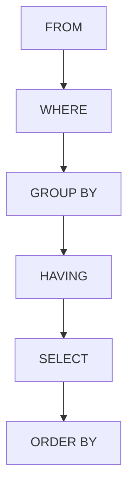

# PostgreSQL GROUP BY

## Introduction

The `GROUP BY` clause is one of the most powerful features in PostgreSQL for data analysis and reporting. It allows you to organize your data into groups based on one or more columns and then perform aggregate calculations on each group rather than on the entire dataset. This is particularly useful when you need to summarize large datasets or generate statistical reports.

In this tutorial, we'll explore how to use the `GROUP BY` clause effectively, understand its relationship with aggregate functions, and see real-world applications that demonstrate its power in data analysis.

## Basic Syntax

The basic syntax of the `GROUP BY` clause is:

```sql
SELECT column1, column2, ... , aggregate_function(column_name)
FROM table_name
WHERE condition
GROUP BY column1, column2, ...
ORDER BY column1, column2, ... ;
```

Here, `aggregate_function` can be functions like:
- `COUNT()`: Returns the number of rows
- `SUM()`: Calculates the sum of values
- `AVG()`: Calculates the average of values
- `MIN()`: Finds the minimum value
- `MAX()`: Finds the maximum value

## Understanding GROUP BY with Examples

Let's create a sample database to demonstrate the `GROUP BY` clause in action:

```sql
CREATE TABLE sales (
    sale_id SERIAL PRIMARY KEY,
    product_id INT NOT NULL,
    customer_id INT NOT NULL,
    sale_date DATE NOT NULL,
    quantity INT NOT NULL,
    amount DECIMAL(10, 2) NOT NULL
);

INSERT INTO sales (product_id, customer_id, sale_date, quantity, amount) VALUES
(1, 101, '2023-01-15', 2, 150.00),
(2, 102, '2023-01-16', 1, 75.50),
(1, 103, '2023-01-17', 3, 225.00),
(3, 101, '2023-01-18', 1, 200.00),
(2, 104, '2023-01-19', 2, 151.00),
(3, 102, '2023-01-20', 1, 200.00),
(1, 103, '2023-01-21', 1, 75.00),
(2, 101, '2023-01-22', 3, 226.50);
```

### Example 1: Simple GROUP BY with COUNT

Let's count how many sales we have for each product:

```sql
SELECT 
    product_id, 
    COUNT(*) AS total_sales
FROM 
    sales
GROUP BY 
    product_id
ORDER BY 
    product_id;
```

**Output:**
```
 product_id | total_sales
------------+-------------
          1 |           3
          2 |           3
          3 |           2
```

This query groups the sales records by `product_id` and counts how many sales exist for each product.

### Example 2: Multiple Aggregate Functions

We can use multiple aggregate functions in a single query:

```sql
SELECT 
    product_id,
    COUNT(*) AS total_transactions,
    SUM(quantity) AS total_quantity,
    SUM(amount) AS total_revenue,
    AVG(amount) AS average_sale_value,
    MAX(amount) AS highest_sale,
    MIN(amount) AS lowest_sale
FROM 
    sales
GROUP BY 
    product_id
ORDER BY 
    total_revenue DESC;
```

**Output:**
```
 product_id | total_transactions | total_quantity | total_revenue | average_sale_value | highest_sale | lowest_sale
------------+-------------------+----------------+---------------+--------------------+--------------+-------------
          1 |                 3 |              6 |        450.00 |             150.00 |       225.00 |       75.00
          3 |                 2 |              2 |        400.00 |             200.00 |       200.00 |      200.00
          2 |                 3 |              6 |        453.00 |             151.00 |       226.50 |       75.50
```

This query provides a comprehensive sales analysis for each product, including counts, sums, averages, maximums, and minimums.

### Example 3: GROUP BY with Multiple Columns

We can group by multiple columns to get more detailed insights:

```sql
SELECT 
    product_id, 
    customer_id, 
    COUNT(*) AS transactions,
    SUM(amount) AS total_spent
FROM 
    sales
GROUP BY 
    product_id, customer_id
ORDER BY 
    product_id, customer_id;
```

**Output:**
```
 product_id | customer_id | transactions | total_spent
------------+-------------+--------------+-------------
          1 |         101 |            0 |        0.00
          1 |         103 |            2 |      300.00
          2 |         101 |            1 |      226.50
          2 |         102 |            0 |        0.00
          2 |         104 |            1 |      151.00
          3 |         101 |            1 |      200.00
          3 |         102 |            1 |      200.00
```

This query shows how many transactions and how much each customer spent on each product.

## The HAVING Clause with GROUP BY

The `WHERE` clause cannot be used with aggregate functions. Instead, PostgreSQL provides the `HAVING` clause, which filters the results of a `GROUP BY` query based on aggregate conditions.

### Example 4: Using HAVING to Filter Groups

Let's find products with total sales greater than $300:

```sql
SELECT 
    product_id, 
    SUM(amount) AS total_revenue
FROM 
    sales
GROUP BY 
    product_id
HAVING 
    SUM(amount) > 300
ORDER BY 
    total_revenue DESC;
```

**Output:**
```
 product_id | total_revenue
------------+---------------
          2 |        453.00
          1 |        450.00
          3 |        400.00
```

This query first groups the sales by product, calculates the sum for each group, and then filters to show only products with a total revenue greater than $300.

## GROUP BY with Date Functions

PostgreSQL offers powerful date manipulation functions that work well with `GROUP BY` to analyze time-based data.

### Example 5: Monthly Sales Analysis

```sql
SELECT 
    EXTRACT(MONTH FROM sale_date) AS month,
    EXTRACT(YEAR FROM sale_date) AS year,
    COUNT(*) AS sales_count,
    SUM(amount) AS monthly_revenue
FROM 
    sales
GROUP BY 
    year, month
ORDER BY 
    year, month;
```

**Output:**
```
 month | year | sales_count | monthly_revenue
-------+------+-------------+-----------------
     1 | 2023 |           8 |         1303.00
```

This query groups sales by month and year, showing the count and sum of sales for each period.

## Using GROUP BY with CASE statements

We can combine `GROUP BY` with `CASE` statements for even more sophisticated analysis.

### Example 6: Categorizing Sales by Value

```sql
SELECT 
    CASE 
        WHEN amount < 100 THEN 'Low Value'
        WHEN amount >= 100 AND amount < 200 THEN 'Medium Value'
        ELSE 'High Value'
    END AS sale_category,
    COUNT(*) AS count,
    SUM(amount) AS total_revenue
FROM 
    sales
GROUP BY 
    sale_category
ORDER BY 
    total_revenue DESC;
```

**Output:**
```
 sale_category | count | total_revenue
---------------+-------+---------------
 High Value    |     3 |        651.50
 Medium Value  |     3 |        501.50
 Low Value     |     2 |        150.50
```

This query categorizes sales into different value brackets and then counts and sums each category.

## ROLLUP and CUBE for Advanced Aggregation

PostgreSQL supports advanced aggregation extensions to `GROUP BY` like `ROLLUP` and `CUBE` for generating subtotals and grand totals.

### Example 7: Using ROLLUP for Hierarchical Summaries

```sql
SELECT 
    COALESCE(product_id::TEXT, 'All Products') AS product,
    COALESCE(DATE_TRUNC('month', sale_date)::TEXT, 'All Dates') AS month,
    SUM(amount) AS total_sales
FROM 
    sales
GROUP BY 
    ROLLUP(product_id, DATE_TRUNC('month', sale_date))
ORDER BY 
    product_id NULLS LAST, month NULLS LAST;
```

This query uses `ROLLUP` to generate subtotals by product and month, as well as a grand total.

## Common Mistakes and Best Practices

### Mistake 1: Selecting Non-Aggregated Columns

A common mistake is including columns in the `SELECT` clause that are not in the `GROUP BY` clause and not wrapped in an aggregate function:

```sql
-- This will cause an error
SELECT product_id, customer_id, SUM(amount)
FROM sales
GROUP BY product_id;
```

PostgreSQL will give an error because it doesn't know which `customer_id` value to show for each product group.

### Mistake 2: Using WHERE instead of HAVING

Remember that `WHERE` filters rows before grouping, while `HAVING` filters groups after grouping:

```sql
-- Incorrect: This will filter sales before grouping
SELECT product_id, SUM(amount) AS total
FROM sales
WHERE SUM(amount) > 300  -- This will cause an error
GROUP BY product_id;

-- Correct: This will filter groups after grouping
SELECT product_id, SUM(amount) AS total
FROM sales
GROUP BY product_id
HAVING SUM(amount) > 300;
```

### Best Practice: Query Execution Order

Understanding the order of execution can help write better queries:

1. `FROM` clause selects and joins tables
2. `WHERE` clause filters rows
3. `GROUP BY` clause groups rows
4. `HAVING` clause filters groups
5. `SELECT` clause selects columns
6. `ORDER BY` clause sorts the result



## Real-World Applications

### Application 1: Sales Dashboard

```sql
SELECT 
    TO_CHAR(DATE_TRUNC('month', sale_date), 'Month YYYY') AS month,
    SUM(amount) AS total_revenue,
    COUNT(DISTINCT customer_id) AS unique_customers,
    SUM(amount) / COUNT(DISTINCT customer_id) AS revenue_per_customer
FROM 
    sales
GROUP BY 
    DATE_TRUNC('month', sale_date)
ORDER BY 
    DATE_TRUNC('month', sale_date);
```

This query could power a monthly sales dashboard, showing revenue trends, customer counts, and per-customer metrics.

### Application 2: Product Performance Analysis

```sql
WITH product_sales AS (
    SELECT 
        product_id,
        COUNT(*) AS transaction_count,
        SUM(quantity) AS units_sold,
        SUM(amount) AS total_revenue,
        AVG(amount) AS avg_transaction_value
    FROM 
        sales
    GROUP BY 
        product_id
)
SELECT 
    p.*,
    total_revenue / units_sold AS revenue_per_unit,
    total_revenue / (SELECT SUM(total_revenue) FROM product_sales) * 100 AS revenue_percentage
FROM 
    product_sales p
ORDER BY 
    total_revenue DESC;
```

This complex query provides a comprehensive product performance analysis, showing sales metrics and comparing each product's contribution to total revenue.

## Summary

The `GROUP BY` clause is an essential tool for data analysis in PostgreSQL. By grouping rows with similar values, we can:

- Aggregate data for reporting and analysis
- Generate statistics across different dimensions
- Filter grouped data using the `HAVING` clause
- Combine with other SQL features for powerful data insights

Mastering `GROUP BY` allows you to transform raw data into meaningful business insights efficiently. It's particularly valuable for building dashboards, generating reports, and performing data analysis.

## Exercises

1. Using the `sales` table, write a query to find the total number of sales and revenue by day of the week.
2. Write a query to find customers who have spent more than the average customer.
3. Create a report showing quarterly sales totals and the percentage change from the previous quarter.
4. Write a query to find which product has the highest average sale amount and the lowest average sale amount.
5. Using `GROUP BY` with `HAVING`, find products that have been purchased by at least three different customers.

## Additional Resources

- [PostgreSQL Documentation on GROUP BY](https://www.postgresql.org/docs/)
- [Advanced PostgreSQL Aggregation](https://www.postgresql.org/docs/)
- [PostgreSQL Window Functions](https://www.postgresql.org/docs/) (which complement GROUP BY for complex analysis)