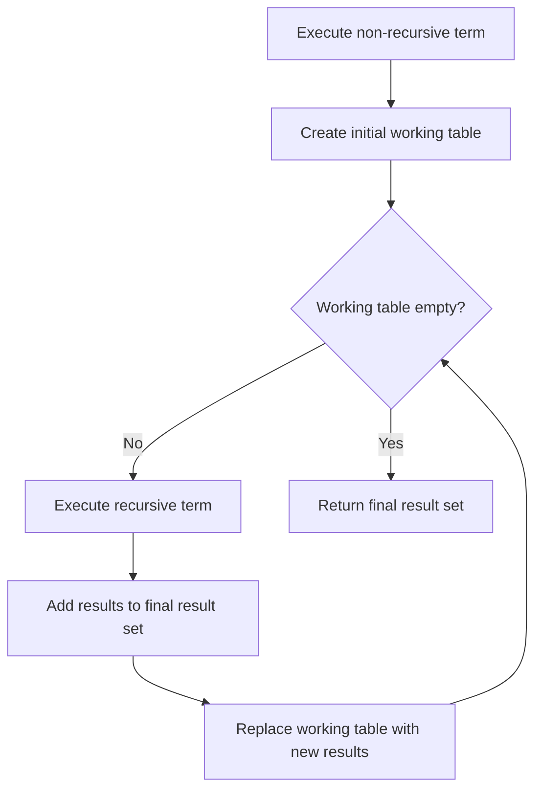

# PostgreSQL Recursive Queries

## Introduction

Have you ever needed to query hierarchical data like an organizational chart, file system, or category tree? Or perhaps traverse a graph of relationships? These tasks can be challenging with standard SQL queries, but PostgreSQL makes them elegant and efficient with **recursive queries**.

Recursive queries allow you to start with a base result set and then repeatedly apply additional queries to that result until you've retrieved all the data you need. They're implemented in PostgreSQL using a special form of Common Table Expressions (CTEs) and are incredibly powerful for working with hierarchical or graph-structured data.

In this tutorial, we'll explore:
- What recursive queries are and when to use them
- The syntax and structure of recursive CTEs
- Step-by-step examples with real-world applications
- Best practices and optimization techniques

## Understanding Recursive CTEs

A recursive Common Table Expression (CTE) has two main parts:

1. A **non-recursive term**: The initial query that forms the base result set
2. A **recursive term**: A query that references the CTE itself and is applied repeatedly

The syntax follows this pattern:

```sql
WITH RECURSIVE cte_name AS (
    -- non-recursive term: initial query to get base result
    SELECT ... 
    
    UNION [ALL]
    
    -- recursive term: query that references cte_name
    SELECT ... FROM ... JOIN cte_name ON ...
)
SELECT * FROM cte_name;
```

The query execution works like this:

1. Execute the non-recursive term to create the initial working table
2. While the working table is not empty:
   - Execute the recursive term, substituting the current working table for the recursive self-reference
   - Append results to the result set
   - Replace the working table with the new results

Let's visualize this process:



## Basic Example: Generating a Sequence

Let's start with a simple example to generate a sequence of numbers from 1 to 10:

```sql
WITH RECURSIVE numbers AS (
    -- non-recursive term: start with 1
    SELECT 1 AS n
    
    UNION
    
    -- recursive term: add 1 to previous number, stop at 10
    SELECT n + 1 FROM numbers WHERE n < 10
)
SELECT * FROM numbers;
```

**Output:**
```
 n
---
 1
 2
 3
 4
 5
 6
 7
 8
 9
10
```

In this example:
- The non-recursive term returns a single row with the value 1
- The recursive term adds 1 to each number and includes it if less than 10
- The process continues until no more rows are returned (when n reaches 10)

## Real-World Example 1: Employee Hierarchy

Let's explore a practical example with an organizational hierarchy. Consider this `employees` table:

```sql
CREATE TABLE employees (
    employee_id INT PRIMARY KEY,
    name VARCHAR(100),
    manager_id INT NULL,
    FOREIGN KEY (manager_id) REFERENCES employees(employee_id)
);

INSERT INTO employees VALUES
(1, 'Sarah Johnson', NULL),  -- CEO
(2, 'Michael Chen', 1),      -- CTO, reports to CEO
(3, 'Emily Davis', 1),       -- CFO, reports to CEO
(4, 'Alex Rodriguez', 2),    -- Dev Manager, reports to CTO
(5, 'Lisa Wang', 2),         -- QA Manager, reports to CTO
(6, 'David Kim', 4),         -- Developer, reports to Dev Manager
(7, 'Priya Patel', 4),       -- Developer, reports to Dev Manager
(8, 'James Wilson', 5);      -- QA Tester, reports to QA Manager
```

Now, let's write a recursive query to display all employees under a specific manager, including their reporting level:

```sql
WITH RECURSIVE org_hierarchy AS (
    -- non-recursive term: start with the selected manager
    SELECT employee_id, name, manager_id, 0 AS level
    FROM employees
    WHERE employee_id = 2  -- Michael Chen (CTO)
    
    UNION ALL
    
    -- recursive term: find all employees who report to someone in the current result
    SELECT e.employee_id, e.name, e.manager_id, h.level + 1
    FROM employees e
    JOIN org_hierarchy h ON e.manager_id = h.employee_id
)
SELECT 
    level,
    REPEAT('    ', level) || name AS employee,
    employee_id,
    manager_id
FROM org_hierarchy
ORDER BY level, name;
```

**Output:**
```
 level | employee             | employee_id | manager_id
-------|-----------------------|-------------|------------
     0 | Michael Chen         | 2           | 1
     1 | Alex Rodriguez       | 4           | 2
     1 | Lisa Wang            | 5           | 2
     2 | David Kim            | 6           | 4
     2 | James Wilson         | 8           | 5
     2 | Priya Patel          | 7           | 4
```

This query:
1. Starts with Michael Chen (the CTO)
2. Finds all employees who report directly to Michael
3. Then finds all employees who report to those direct reports
4. Continues until all levels of the hierarchy are found
5. Uses the `level` field to track the depth in the organization

## Real-World Example 2: Category Hierarchy

Another common use case for recursive queries is working with category hierarchies, like product categories in an e-commerce system:

```sql
CREATE TABLE categories (
    category_id INT PRIMARY KEY,
    name VARCHAR(100),
    parent_id INT NULL,
    FOREIGN KEY (parent_id) REFERENCES categories(category_id)
);

INSERT INTO categories VALUES
(1, 'Electronics', NULL),
(2, 'Computers', 1),
(3, 'Laptops', 2),
(4, 'Gaming Laptops', 3),
(5, 'Business Laptops', 3),
(6, 'Desktop Computers', 2),
(7, 'Smartphones', 1),
(8, 'Android Phones', 7),
(9, 'iOS Phones', 7);
```

Let's write a query to display the full category path for each category:

```sql
WITH RECURSIVE category_paths AS (
    -- non-recursive term: start with top-level categories
    SELECT 
        category_id,
        name,
        parent_id,
        name AS path
    FROM categories
    WHERE parent_id IS NULL
    
    UNION ALL
    
    -- recursive term: join each category with its parent's path
    SELECT 
        c.category_id,
        c.name,
        c.parent_id,
        cp.path || ' > ' || c.name
    FROM categories c
    JOIN category_paths cp ON c.parent_id = cp.category_id
)
SELECT category_id, name, path FROM category_paths
ORDER BY path;
```

**Output:**
```
 category_id | name            | path
-------------|-----------------|--------------------------------
           1 | Electronics     | Electronics
           2 | Computers       | Electronics > Computers
           7 | Smartphones     | Electronics > Smartphones
           3 | Laptops         | Electronics > Computers > Laptops
           6 | Desktop Computers | Electronics > Computers > Desktop Computers
           8 | Android Phones  | Electronics > Smartphones > Android Phones
           9 | iOS Phones      | Electronics > Smartphones > iOS Phones
           4 | Gaming Laptops  | Electronics > Computers > Laptops > Gaming Laptops
           5 | Business Laptops | Electronics > Computers > Laptops > Business Laptops
```

This query:
1. Starts with top-level categories (those with NULL parent_id)
2. For each category, joins with its parent to build the full path
3. Continues recursively until all categories have been processed

## Real-World Example 3: Graph Traversal

Recursive queries can also be used for graph traversal problems, such as finding all possible routes between cities:

```sql
CREATE TABLE routes (
    departure_city VARCHAR(100),
    arrival_city VARCHAR(100),
    distance INT,
    PRIMARY KEY (departure_city, arrival_city)
);

INSERT INTO routes VALUES
('New York', 'Boston', 215),
('New York', 'Washington', 225),
('Boston', 'Chicago', 960),
('Boston', 'Toronto', 550),
('Washington', 'Miami', 1095),
('Washington', 'Chicago', 700),
('Chicago', 'Los Angeles', 2015),
('Toronto', 'Vancouver', 3370),
('Miami', 'Los Angeles', 2735);
```

Now, let's find all possible routes from New York to Los Angeles, with a maximum of 3 connections:

```sql
WITH RECURSIVE possible_routes AS (
    -- non-recursive term: direct flights from New York
    SELECT 
        departure_city,
        arrival_city,
        ARRAY[departure_city, arrival_city] AS route,
        distance,
        1 AS connections
    FROM routes
    WHERE departure_city = 'New York'
    
    UNION ALL
    
    -- recursive term: add connections where possible
    SELECT 
        r.departure_city,
        r.arrival_city,
        pr.route || r.arrival_city,
        pr.distance + r.distance,
        pr.connections + 1
    FROM routes r
    JOIN possible_routes pr ON r.departure_city = pr.arrival_city
    WHERE 
        pr.connections < 3 AND  -- limit to 3 connections
        NOT r.arrival_city = ANY(pr.route)  -- avoid cycles
)
SELECT 
    route,
    distance,
    connections
FROM possible_routes
WHERE arrival_city = 'Los Angeles'
ORDER BY distance;
```

**Output:**
```
 route                                      | distance | connections
-------------------------------------------|----------|------------
 {New York,Washington,Chicago,Los Angeles}  |     2940 |          3
 {New York,Boston,Chicago,Los Angeles}      |     3190 |          3
```

This query:
1. Starts with all direct flights from New York
2. Recursively adds connections where the departure city matches the previous arrival city
3. Tracks the complete route using an array
4. Avoids cycles by ensuring we don't revisit cities
5. Limits to a maximum of 3 connections
6. Finally filters for routes ending in Los Angeles

## Advanced Techniques and Optimizations

### 1. Cycle Detection

In graph traversal queries, you might encounter cycles where you revisit the same node. The example above used the `NOT x = ANY(array)` technique, but PostgreSQL also provides a built-in cycle detection mechanism:

```sql
WITH RECURSIVE search_graph(id, link, path, cycle) AS (
    SELECT g.id, g.link, ARRAY[g.id], false
    FROM graph g
    WHERE id = 'start_node'
    
    UNION ALL
    
    SELECT g.id, g.link, path || g.id, g.id = ANY(path)
    FROM graph g, search_graph sg
    WHERE g.id = sg.link AND NOT cycle
)
SELECT * FROM search_graph;
```

The `cycle` column becomes true if we revisit a node, allowing us to stop recursion.

### 2. Limiting Recursion Depth

The `connections < 3` condition in our routes example limits recursion depth. This is crucial for performance in large graphs:

```sql
WITH RECURSIVE limited_recursion AS (
    SELECT ..., 1 AS depth
    FROM ...
    
    UNION ALL
    
    SELECT ..., lr.depth + 1
    FROM ... JOIN limited_recursion lr ON ...
    WHERE lr.depth < 10  -- maximum recursion depth
)
```

### 3. Using UNION vs. UNION ALL

- `UNION` eliminates duplicates but requires additional sorting and comparison
- `UNION ALL` keeps all rows including duplicates but is faster
- Use `UNION ALL` when you're sure duplicates won't occur or don't matter
- Use `UNION` when you need to ensure unique results

### 4. Optimizing Join Operations

Join operations in the recursive term can be performance-intensive. Consider:
- Adding appropriate indexes
- Limiting the working set size early
- Using more specific join conditions

## Common Pitfalls and Solutions

### 1. Infinite Recursion

Without proper termination conditions, recursive queries can run indefinitely:

```sql
-- Dangerous! No termination condition
WITH RECURSIVE infinite AS (
    SELECT 1 AS n
    
    UNION ALL
    
    SELECT n + 1 FROM infinite
)
SELECT * FROM infinite;  -- Will run until hitting resource limits
```

Always include a termination condition:

```sql
WITH RECURSIVE safe AS (
    SELECT 1 AS n
    
    UNION ALL
    
    SELECT n + 1 FROM safe WHERE n < 100  -- Clear termination
)
SELECT * FROM safe;
```

### 2. Performance Issues with Deep Recursion

For very deep hierarchies, performance can degrade. Consider:
- Limiting recursion depth
- Using materialized paths or nested set models for truly large hierarchies
- Breaking complex queries into multiple simpler recursive queries

### 3. Order of Operations

The order of operations in recursive queries can affect both results and performance. Be careful with:
- WHERE clauses (apply them early)
- JOIN operations (choose the right join type)
- Aggregations (usually need to be outside the recursive CTE)

## Summary

Recursive queries in PostgreSQL are a powerful tool for working with hierarchical and graph-structured data. They allow you to:

- Navigate parent-child relationships
- Build paths through complex data structures
- Generate sequences and series
- Solve problems that would be difficult or impossible with standard SQL

Key concepts to remember:
1. A recursive CTE consists of a non-recursive term and a recursive term connected by UNION or UNION ALL
2. The non-recursive term forms the base result set
3. The recursive term refers to the CTE itself and expands the result set
4. Always include a termination condition to prevent infinite recursion
5. Consider performance implications for large or deeply nested data

## Exercises

1. **Basic**: Write a recursive query to generate Fibonacci numbers up to 100.
2. **Intermediate**: Using the employees table from our example, write a query to find all employees at exactly level 2 under the CEO.
3. **Advanced**: Extend the routes example to find all possible routes between two cities with the fewest connections, regardless of distance.

## Additional Resources

- [PostgreSQL Documentation on Recursive Queries](https://www.postgresql.org/docs/current/queries-with.html#QUERIES-WITH-RECURSIVE)
- [PostgreSQL: Introduction to WITH Queries (CTEs)](https://www.postgresql.org/docs/current/queries-with.html)
- [PostgreSQL Wiki: Recursive Queries](https://wiki.postgresql.org/wiki/Recursive_query)

By mastering recursive queries in PostgreSQL, you'll be able to solve complex data problems with elegant, efficient SQL - a valuable skill for any database developer!