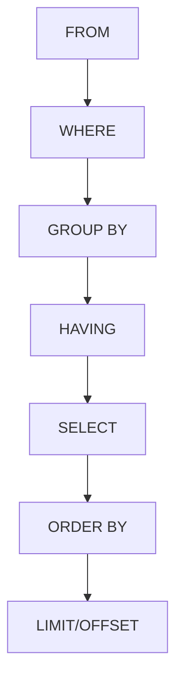

# PostgreSQL HAVING

## Introduction

When working with databases, you'll often need to analyze grouped data - like finding average sales by product category, identifying departments with high employee turnover, or determining customers who have placed multiple orders. While PostgreSQL's `GROUP BY` clause allows you to organize data into groups, the `HAVING` clause gives you the power to filter those groups based on aggregate conditions.

In this tutorial, you'll learn:
- What the `HAVING` clause is and why it's necessary
- How `HAVING` differs from `WHERE`
- Syntax and usage patterns
- Practical real-world examples
- Common mistakes and how to avoid them

## Understanding the HAVING Clause

The `HAVING` clause works in conjunction with `GROUP BY` to filter grouped data based on aggregate functions like `COUNT()`, `SUM()`, `AVG()`, `MAX()`, or `MIN()`.

### Basic Syntax

```sql
SELECT column1, aggregate_function(column2)
FROM table_name
GROUP BY column1
HAVING condition;
```

The key difference between `WHERE` and `HAVING` is:
- `WHERE` filters individual rows **before** they are grouped
- `HAVING` filters groups **after** the `GROUP BY` operation

## WHERE vs. HAVING: Key Differences

Let's examine this crucial distinction with a simple example:

```sql
-- Using WHERE (filters rows before grouping)
SELECT department_id, AVG(salary) 
FROM employees
WHERE salary > 50000
GROUP BY department_id;

-- Using HAVING (filters groups after grouping)
SELECT department_id, AVG(salary) 
FROM employees
GROUP BY department_id
HAVING AVG(salary) > 50000;
```

These queries produce different results:
- The first query calculates the average salary only for employees who individually earn more than $50,000
- The second query calculates the average salary for all employees in each department, then shows only departments where that average exceeds $50,000

## Basic HAVING Examples

Let's explore some basic examples to understand how `HAVING` works:

### Example 1: Finding Products with Multiple Orders

```sql
SELECT product_id, COUNT(order_id) AS order_count
FROM order_items
GROUP BY product_id
HAVING COUNT(order_id) > 10;
```

**Output:**
```
 product_id | order_count 
------------+-------------
 156        | 24
 42         | 15
 107        | 12
 88         | 11
```

This query shows products that appear in more than 10 orders.

### Example 2: Identifying High-Value Customer Segments

```sql
SELECT customer_segment, SUM(purchase_amount) AS total_sales
FROM sales
GROUP BY customer_segment
HAVING SUM(purchase_amount) > 100000;
```

**Output:**
```
 customer_segment | total_sales  
------------------+--------------
 Enterprise       | 345621.50
 Small Business   | 124500.75
```

This query identifies customer segments that have generated more than $100,000 in total sales.

## Working with Multiple Aggregates in HAVING

You can use multiple aggregate functions in your `HAVING` clause to create more complex filtering conditions:

```sql
SELECT category, 
       COUNT(*) AS product_count,
       AVG(price) AS avg_price
FROM products
GROUP BY category
HAVING COUNT(*) >= 5 AND AVG(price) < 50;
```

**Output:**
```
 category    | product_count | avg_price 
-------------+---------------+-----------
 Electronics | 8             | 42.75
 Kitchen     | 12            | 28.50
 Books       | 15            | 15.25
```

This query finds product categories that have at least 5 products with an average price below $50.

## Using HAVING with Joins

The `HAVING` clause works seamlessly with joined tables, allowing you to filter grouped data across relationships:

```sql
SELECT c.customer_name, 
       COUNT(o.order_id) AS order_count,
       SUM(o.order_total) AS total_spent
FROM customers c
JOIN orders o ON c.customer_id = o.customer_id
GROUP BY c.customer_name
HAVING COUNT(o.order_id) >= 3 AND SUM(o.order_total) > 1000;
```

**Output:**
```
 customer_name    | order_count | total_spent 
------------------+-------------+-------------
 Johnson Company  | 5           | 2450.50
 Smith Industries | 3           | 1850.75
 Tech Solutions   | 7           | 5320.25
```

This query identifies valuable repeat customers who have placed at least 3 orders and spent more than $1,000 in total.

## Practical Applications

Let's explore some real-world applications of the `HAVING` clause:

### Finding Anomalies in Data

```sql
SELECT department, AVG(salary) as avg_salary
FROM employees
GROUP BY department
HAVING AVG(salary) > 2 * (SELECT AVG(salary) FROM employees);
```

This query identifies departments with an average salary more than twice the company-wide average - potentially highlighting budget allocation issues.

### Analyzing Product Performance

```sql
SELECT p.product_name, 
       COUNT(s.sale_id) AS sale_count,
       SUM(s.quantity) AS units_sold
FROM products p
JOIN sales s ON p.product_id = s.product_id
GROUP BY p.product_name
HAVING COUNT(s.sale_id) < 5 AND SUM(s.quantity) > 100;
```

This query finds products with few sales transactions but high quantities per order - potentially indicating bulk purchasing patterns.

### Identifying Active Users

```sql
SELECT user_id, 
       COUNT(DISTINCT date(login_time)) AS active_days
FROM user_logins
WHERE login_time >= current_date - interval '30 days'
GROUP BY user_id
HAVING COUNT(DISTINCT date(login_time)) >= 20;
```

This query finds power users who have logged in on at least 20 different days in the past month.

## Query Execution Order

Understanding the execution order of SQL clauses helps in writing effective queries:



Note that:
1. `WHERE` filters rows before grouping
2. `GROUP BY` creates groups
3. `HAVING` filters groups after they're created
4. `SELECT` determines which columns appear in the results

## Common Mistakes and How to Avoid Them

### Mistake 1: Using HAVING Without GROUP BY

```sql
-- This will cause an error
SELECT product_name
FROM products
HAVING price > 100;
```

**Correct approach:**
```sql
-- Use WHERE instead
SELECT product_name
FROM products
WHERE price > 100;
```

### Mistake 2: Using HAVING for Non-Aggregate Filtering

```sql
-- Inefficient approach
SELECT category, COUNT(*) AS count
FROM products
GROUP BY category
HAVING category != 'Accessories';
```

**Better approach:**
```sql
-- Filter non-aggregated columns with WHERE
SELECT category, COUNT(*) AS count
FROM products
WHERE category != 'Accessories'
GROUP BY category;
```

### Mistake 3: Forgetting That HAVING Works on Grouped Data

```sql
-- This won't work as expected
SELECT department, AVG(salary) as avg_salary
FROM employees
GROUP BY department
HAVING salary > 50000;
```

**Correct approach:**
```sql
-- Use aggregate functions in HAVING
SELECT department, AVG(salary) as avg_salary
FROM employees
GROUP BY department
HAVING AVG(salary) > 50000;
```

## Summary

The PostgreSQL `HAVING` clause is a powerful tool for filtering grouped data based on aggregate conditions. Remember these key points:

- Use `WHERE` to filter individual rows before grouping
- Use `HAVING` to filter groups after the `GROUP BY` operation
- `HAVING` works with aggregate functions like `COUNT()`, `SUM()`, and `AVG()`
- `HAVING` is executed after `GROUP BY` but before `SELECT`

By mastering the `HAVING` clause, you can create sophisticated queries that answer complex business questions about your data.

## Exercises

To reinforce your understanding, try these exercises:

1. Write a query to find departments with more than 10 employees and an average tenure greater than 5 years.

2. Create a query to identify products that have been ordered by at least 5 different customers with a total quantity exceeding 100 units.

3. Develop a query to find customer segments that have both high average order values (>$200) and high repeat purchase rates (>3 orders per customer on average).

## Additional Resources

- [PostgreSQL Official Documentation on GROUP BY](https://www.postgresql.org/docs/current/queries-table-expressions.html#QUERIES-GROUP)
- [SQL Aggregate Functions](https://www.postgresql.org/docs/current/functions-aggregate.html)
- [Advanced PostgreSQL Query Optimization](https://www.postgresql.org/docs/current/performance-tips.html)