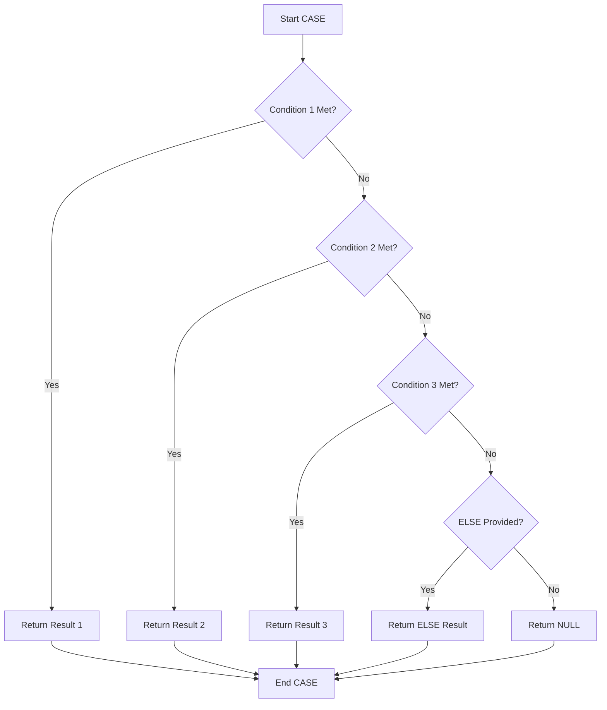

# PostgreSQL CASE Expressions

## Introduction

When writing SQL queries, you'll often need to implement conditional logic - similar to the `if-else` statements you may have encountered in programming languages. This is where PostgreSQL's powerful `CASE` expression comes in. The `CASE` expression evaluates conditions and returns a value when the first condition is met.

Think of `CASE` as SQL's version of an `if-then-else` statement or a switch-case statement in traditional programming languages. It allows you to add conditional logic directly within your SQL queries, making them more flexible and powerful.

## Basic Syntax

PostgreSQL supports two forms of `CASE` expressions:

### 1. Simple CASE Expression

```sql
CASE expression
    WHEN value1 THEN result1
    WHEN value2 THEN result2
    ...
    [ELSE default_result]
END
```

### 2. Searched CASE Expression

```sql
CASE
    WHEN condition1 THEN result1
    WHEN condition2 THEN result2
    ...
    [ELSE default_result]
END
```

The `ELSE` clause is optional in both forms. If you omit it and no condition matches, PostgreSQL will return `NULL`.

## Simple CASE Examples

Let's start with some basic examples using the simple form:

```sql
SELECT product_name,
       price,
       CASE category
           WHEN 'Electronics' THEN price * 0.9
           WHEN 'Clothing' THEN price * 0.8
           WHEN 'Books' THEN price * 0.95
           ELSE price
       END AS discounted_price
FROM products;
```

In this example:
- If a product is in the 'Electronics' category, it gets a 10% discount
- If it's 'Clothing', it gets a 20% discount
- If it's 'Books', it gets a 5% discount
- Other categories receive no discount

Here's how the results might look:

| product_name    | price | discounted_price |
|-----------------|-------|------------------|
| Smartphone      | 500   | 450              |
| T-shirt         | 25    | 20               |
| Programming Book| 40    | 38               |
| Coffee Mug      | 12    | 12               |

## Searched CASE Examples

The searched form gives you more flexibility since you can use different types of conditions:

```sql
SELECT customer_name,
       order_total,
       CASE
           WHEN order_total >= 1000 THEN 'Platinum'
           WHEN order_total >= 500 THEN 'Gold'
           WHEN order_total >= 100 THEN 'Silver'
           ELSE 'Bronze'
       END AS customer_tier
FROM orders;
```

This query categorizes customers based on their order total:

| customer_name | order_total | customer_tier |
|---------------|-------------|---------------|
| John Smith    | 1200        | Platinum      |
| Jane Doe      | 750         | Gold          |
| Bob Johnson   | 300         | Silver        |
| Alice Brown   | 50          | Bronze        |

Notice how the conditions are evaluated in order from top to bottom. Once a condition is met, the corresponding result is returned, and any remaining conditions are not evaluated.

## Using CASE in Different Parts of a Query

A key advantage of `CASE` expressions is their versatility - you can use them almost anywhere in your SQL queries:

### In the SELECT Clause

We've already seen examples of this above.

### In the ORDER BY Clause

```sql
SELECT product_name, category, price
FROM products
ORDER BY 
    CASE 
        WHEN category = 'Electronics' THEN 1
        WHEN category = 'Books' THEN 2
        ELSE 3
    END,
    price DESC;
```

This query orders results by category (with Electronics first, then Books, then others) and within each category, items are ordered by price in descending order.

### In the WHERE Clause

```sql
SELECT * 
FROM orders
WHERE 
    CASE 
        WHEN EXTRACT(MONTH FROM order_date) BETWEEN 6 AND 8 THEN order_total > 500
        ELSE order_total > 300
    END;
```

This retrieves orders with higher thresholds during summer months (June to August).

### In the GROUP BY Clause

```sql
SELECT 
    CASE 
        WHEN age < 18 THEN 'Under 18'
        WHEN age BETWEEN 18 AND 30 THEN '18-30'
        WHEN age BETWEEN 31 AND 50 THEN '31-50'
        ELSE 'Over 50'
    END AS age_group,
    COUNT(*) AS count
FROM customers
GROUP BY 
    CASE 
        WHEN age < 18 THEN 'Under 18'
        WHEN age BETWEEN 18 AND 30 THEN '18-30'
        WHEN age BETWEEN 31 AND 50 THEN '31-50'
        ELSE 'Over 50'
    END;
```

This query groups customers by age ranges and counts how many fall into each group.

## Nested CASE Expressions

You can also nest `CASE` expressions for more complex logic:

```sql
SELECT product_name, price, category, stock_level,
    CASE 
        WHEN stock_level = 0 THEN 'Out of Stock'
        WHEN stock_level < 10 THEN 
            CASE category
                WHEN 'Electronics' THEN 'Low Stock - Order Soon'
                WHEN 'Clothing' THEN 'Few Items Left'
                ELSE 'Limited Availability'
            END
        ELSE 'In Stock'
    END AS stock_status
FROM products;
```

This creates a detailed stock status message based on both the stock level and product category.

## Practical Applications

### Data Transformation

```sql
SELECT 
    user_id,
    CASE 
        WHEN subscription_type = 'free' THEN 0
        WHEN subscription_type = 'basic' THEN 1
        WHEN subscription_type = 'premium' THEN 2
        WHEN subscription_type = 'enterprise' THEN 3
    END AS subscription_level
FROM users;
```

This transforms textual subscription types into numerical values that might be easier to work with in certain applications.

### Data Aggregation

```sql
SELECT 
    department,
    SUM(CASE WHEN performance_rating >= 4 THEN 1 ELSE 0 END) AS high_performers,
    SUM(CASE WHEN performance_rating BETWEEN 2 AND 3.9 THEN 1 ELSE 0 END) AS average_performers,
    SUM(CASE WHEN performance_rating < 2 THEN 1 ELSE 0 END) AS low_performers
FROM employees
GROUP BY department;
```

This query creates a breakdown of employee performance ratings by department.

### Dynamic Pivot Tables

`CASE` expressions are excellent for creating dynamic pivot tables:

```sql
SELECT 
    product_category,
    SUM(CASE WHEN EXTRACT(MONTH FROM order_date) = 1 THEN order_amount ELSE 0 END) AS jan_sales,
    SUM(CASE WHEN EXTRACT(MONTH FROM order_date) = 2 THEN order_amount ELSE 0 END) AS feb_sales,
    SUM(CASE WHEN EXTRACT(MONTH FROM order_date) = 3 THEN order_amount ELSE 0 END) AS mar_sales
FROM sales
GROUP BY product_category;
```

This creates a pivot table showing sales by product category for each month in the first quarter.

## Best Practices

1. **Include an ELSE clause**: Always include an `ELSE` clause to handle unexpected values, even if it just returns `NULL`.

2. **Mind the order**: Remember that conditions are evaluated in order from top to bottom. Place more specific conditions before more general ones.

3. **Keep it readable**: For complex `CASE` expressions, format your code with proper indentation to make it more readable.

4. **Avoid excessive nesting**: While nesting is possible, too many levels can make your query hard to understand and maintain.

5. **Test performance**: Complex `CASE` expressions might impact query performance. Test and optimize as needed.

## SQL Flow Control Alternatives

PostgreSQL offers several alternatives to `CASE` for specific scenarios:

### COALESCE Function

Returns the first non-NULL value from a list:

```sql
SELECT product_name, COALESCE(discount, 0) AS discount
FROM products;
```

### NULLIF Function

Returns NULL if two values are equal:

```sql
SELECT division_name, total_revenue, total_cost,
       total_revenue / NULLIF(total_cost, 0) AS profit_ratio
FROM divisions;
```

This prevents division-by-zero errors.

### GREATEST and LEAST Functions

Return the greatest or least value from a list:

```sql
SELECT product_name, 
       GREATEST(regular_price - discount, minimum_price) AS final_price
FROM products;
```

## Visualizing CASE Logic

Here's a flowchart representing how the `CASE` expression evaluates conditions:



## Summary

PostgreSQL's `CASE` expression is a powerful tool that allows you to implement conditional logic directly within your SQL queries. It comes in two forms:

1. **Simple CASE**: Compares an expression to a set of values.
2. **Searched CASE**: Evaluates a set of boolean conditions.

The ability to use `CASE` expressions in various parts of your query (SELECT, WHERE, ORDER BY, GROUP BY) makes them extremely versatile. They enable data transformation, pivot tables, dynamic conditionals, and much more.

By mastering `CASE` expressions, you'll significantly enhance your PostgreSQL query capabilities and be able to solve complex data problems more elegantly.

## Exercises

1. Write a query that categorizes products by price range: 'Budget' (under $50), 'Mid-range' ($50-$200), and 'Premium' (over $200).

2. Create a query that displays the percentage of orders in each status category (Pending, Processing, Shipped, Delivered, Cancelled).

3. Write a query that creates a heat map of sales activity, showing 'Low', 'Medium', or 'High' based on daily sales volumes compared to monthly averages.

## Additional Resources

- [PostgreSQL Official Documentation on CASE](https://www.postgresql.org/docs/current/functions-conditional.html)
- [Advanced SQL Techniques with CASE](https://mode.com/sql-tutorial/sql-case/)
- [PostgreSQL Conditional Expressions](https://www.tutorialspoint.com/postgresql/postgresql_expressions.htm)