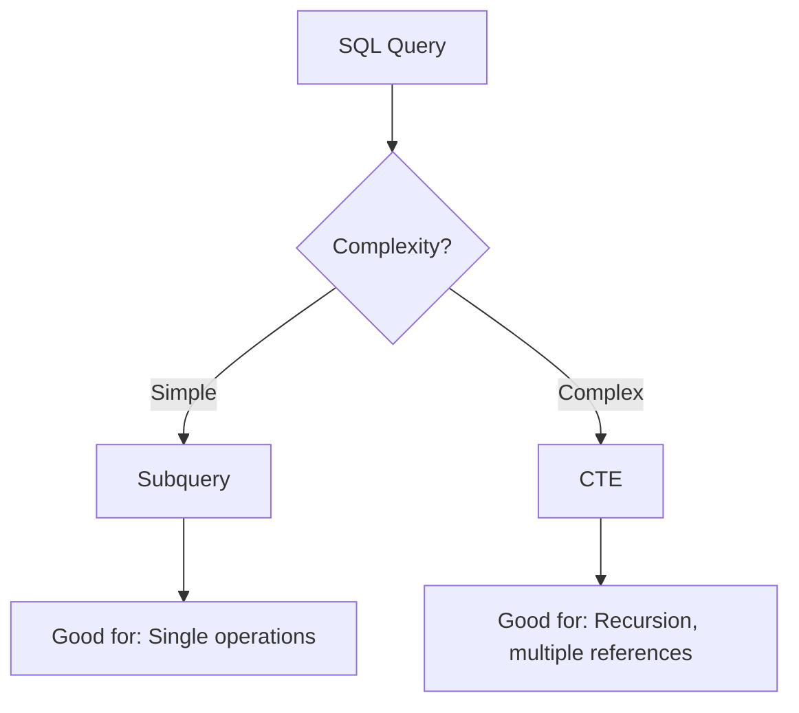

# PostgreSQL Subqueries

## Introduction

Subqueries (also known as nested queries or inner queries) are a powerful feature in PostgreSQL that allow you to use the result of one query within another query. They enable you to perform complex operations that might otherwise require multiple separate queries or complex joins.

Think of subqueries as queries within queries - like nesting one SQL statement inside another. This capability allows you to break down complex problems into smaller, more manageable pieces, making your SQL code more readable and often more efficient.

In this tutorial, we'll explore how subqueries work in PostgreSQL, when to use them, and practical examples to demonstrate their power.

## Understanding Subqueries

A subquery is enclosed in parentheses and can appear in various parts of a SQL statement:

- In the `SELECT` clause
- In the `FROM` clause
- In the `WHERE` clause
- In the `HAVING` clause

Let's start with a simple example. Imagine we have two tables: `employees` and `departments`:

```sql
CREATE TABLE departments (
    department_id SERIAL PRIMARY KEY,
    department_name VARCHAR(100) NOT NULL
);

CREATE TABLE employees (
    employee_id SERIAL PRIMARY KEY,
    name VARCHAR(100) NOT NULL,
    salary NUMERIC(10, 2) NOT NULL,
    department_id INTEGER REFERENCES departments(department_id)
);
```

## Types of Subqueries

There are several types of subqueries in PostgreSQL:

### 1. Scalar Subqueries

A scalar subquery returns a single value and can be used wherever a single value expression is expected.

**Example**: Find employees who earn more than the average salary:

```sql
SELECT name, salary
FROM employees
WHERE salary > (
    SELECT AVG(salary) 
    FROM employees
);
```

**Output:**
```
    name    |  salary  
------------+----------
 John Smith | 85000.00
 Lisa Wong  | 78500.00
 David Kim  | 92000.00
```

In this example, the subquery `(SELECT AVG(salary) FROM employees)` calculates the average salary, and the outer query finds all employees with salaries higher than that average.

### 2. Row Subqueries

A row subquery returns a single row with multiple columns.

**Example**: Find an employee who has the same department and salary as employee 'John Smith':

```sql
SELECT name
FROM employees
WHERE (department_id, salary) = (
    SELECT department_id, salary
    FROM employees
    WHERE name = 'John Smith'
) AND name != 'John Smith';
```

**Output:**
```
    name    
------------
 Emily Chen
```

### 3. Table Subqueries

A table subquery returns multiple rows and multiple columns. It's typically used in the FROM clause.

**Example**: Calculating department statistics:

```sql
SELECT d.department_name, stats.avg_salary, stats.employee_count
FROM departments d
JOIN (
    SELECT department_id, 
           AVG(salary) as avg_salary, 
           COUNT(*) as employee_count
    FROM employees
    GROUP BY department_id
) stats ON d.department_id = stats.department_id;
```

**Output:**
```
 department_name | avg_salary | employee_count 
-----------------+------------+----------------
 Engineering     | 78333.33   | 3
 Marketing       | 65000.00   | 2
 Finance         | 72500.00   | 2
 Human Resources | 58000.00   | 1
```

### 4. Correlated Subqueries

A correlated subquery refers to columns from the outer query. The subquery is executed once for each row processed by the outer query.

**Example**: Find employees who earn the highest salary in their department:

```sql
SELECT name, department_id, salary
FROM employees e1
WHERE salary = (
    SELECT MAX(salary)
    FROM employees e2
    WHERE e2.department_id = e1.department_id
);
```

**Output:**
```
    name    | department_id |  salary  
------------+---------------+----------
 John Smith | 1             | 85000.00
 Lisa Wong  | 2             | 78500.00
 David Kim  | 3             | 92000.00
 Alex Park  | 4             | 58000.00
```

## Subqueries with Operators

### EXISTS Operator

The `EXISTS` operator checks if a subquery returns any rows.

**Example**: Find departments that have at least one employee with a salary over $70,000:

```sql
SELECT department_name
FROM departments d
WHERE EXISTS (
    SELECT 1
    FROM employees e
    WHERE e.department_id = d.department_id
    AND e.salary > 70000
);
```

**Output:**
```
 department_name 
-----------------
 Engineering
 Marketing
 Finance
```

### IN Operator

The `IN` operator checks if a value matches any value in a list returned by a subquery.

**Example**: Find employees who work in the Engineering or Marketing departments:

```sql
SELECT name
FROM employees
WHERE department_id IN (
    SELECT department_id
    FROM departments
    WHERE department_name IN ('Engineering', 'Marketing')
);
```

**Output:**
```
    name    
------------
 John Smith
 Emily Chen
 Michael Lee
 Lisa Wong
 Sarah Johnson
```

### ANY and ALL Operators

The `ANY` operator compares a value to each value returned by a subquery. The `ALL` operator compares a value to all values returned by a subquery.

**Example with ANY**: Find employees whose salary is greater than ANY of the Marketing department salaries:

```sql
SELECT name, salary
FROM employees
WHERE salary > ANY (
    SELECT salary
    FROM employees
    WHERE department_id = (
        SELECT department_id
        FROM departments
        WHERE department_name = 'Marketing'
    )
);
```

**Output:**
```
    name    |  salary  
------------+----------
 John Smith | 85000.00
 David Kim  | 92000.00
 Robert Lee | 73000.00
```

**Example with ALL**: Find employees whose salary is greater than ALL of the Marketing department salaries:

```sql
SELECT name, salary
FROM employees
WHERE salary > ALL (
    SELECT salary
    FROM employees
    WHERE department_id = (
        SELECT department_id
        FROM departments
        WHERE department_name = 'Marketing'
    )
);
```

**Output:**
```
    name    |  salary  
------------+----------
 John Smith | 85000.00
 David Kim  | 92000.00
```

## Common Table Expressions (CTEs) vs. Subqueries

While subqueries are powerful, PostgreSQL also offers Common Table Expressions (CTEs) as an alternative approach. Let's compare:



**Example using a CTE instead of a subquery**:

```sql
WITH dept_stats AS (
    SELECT department_id, 
           AVG(salary) as avg_salary, 
           COUNT(*) as employee_count
    FROM employees
    GROUP BY department_id
)
SELECT d.department_name, s.avg_salary, s.employee_count
FROM departments d
JOIN dept_stats s ON d.department_id = s.department_id;
```

CTEs are often more readable for complex queries, especially when you need to reference the same subquery multiple times.

## Practical Real-World Examples

### Example 1: Finding Outliers

Identifying employees whose salaries are significantly above the average for their department:

```sql
SELECT e.name, e.salary, d.department_name
FROM employees e
JOIN departments d ON e.department_id = d.department_id
WHERE e.salary > (
    SELECT AVG(salary) * 1.5
    FROM employees
    WHERE department_id = e.department_id
);
```

### Example 2: Report Generation

Creating a department performance report:

```sql
SELECT 
    d.department_name,
    (SELECT COUNT(*) FROM employees WHERE department_id = d.department_id) as employee_count,
    (SELECT MAX(salary) FROM employees WHERE department_id = d.department_id) as max_salary,
    (SELECT MIN(salary) FROM employees WHERE department_id = d.department_id) as min_salary,
    (SELECT AVG(salary) FROM employees WHERE department_id = d.department_id) as avg_salary
FROM departments d
ORDER BY avg_salary DESC;
```

### Example 3: Data Cleanup

Finding duplicate employee records:

```sql
SELECT e1.employee_id, e1.name
FROM employees e1
WHERE EXISTS (
    SELECT 1
    FROM employees e2
    WHERE e2.employee_id != e1.employee_id
    AND e2.name = e1.name
    AND e2.department_id = e1.department_id
);
```

## Performance Considerations

Subqueries are powerful but can impact performance. Here are some tips:

1. **Avoid correlated subqueries when possible**: They run once per outer query row
2. **Consider indexes**: Ensure columns used in subqueries are properly indexed
3. **Use CTEs for complex logic**: Sometimes more readable and can be optimized differently
4. **EXPLAIN ANALYZE**: Use PostgreSQL's EXPLAIN ANALYZE to check query execution plans

For example, compare these two approaches:

```sql
-- Using a correlated subquery (potentially slower)
SELECT e.name, 
       (SELECT department_name FROM departments WHERE department_id = e.department_id) as department
FROM employees e;

-- Using a JOIN (often faster)
SELECT e.name, d.department_name as department
FROM employees e
JOIN departments d ON e.department_id = d.department_id;
```

The JOIN approach is typically more efficient for this scenario.

## Summary

PostgreSQL subqueries are a powerful tool that allows you to:

- Break down complex queries into smaller, more manageable pieces
- Use the results of one query inside another
- Create more flexible and dynamic database operations
- Solve problems that would be difficult to express with simple joins

Key points to remember:
- Subqueries can appear in SELECT, FROM, WHERE, and HAVING clauses
- They can return single values, rows, or tables
- Correlated subqueries reference columns from the outer query
- Common operators used with subqueries include EXISTS, IN, ANY, and ALL
- Consider performance implications when using subqueries

## Practice Exercises

1. Write a query to find employees who earn more than the average salary of their department.
2. Find departments that have no employees.
3. List employees who have the same salary as at least one employee in a different department.
4. Find the department with the highest average salary.
5. Create a query that returns each employee's name along with their salary percentile within their department.

## Additional Resources

- [PostgreSQL Official Documentation on Subqueries](https://www.postgresql.org/docs/current/queries-subqueries.html)
- [PostgreSQL Query Planning](https://www.postgresql.org/docs/current/performance-tips.html)
- [Advanced SQL Techniques](https://www.postgresql.org/docs/current/tutorial-advanced.html)

Remember that mastering subqueries takes practice, so experiment with different approaches and analyze query performance to become proficient in writing efficient PostgreSQL queries.