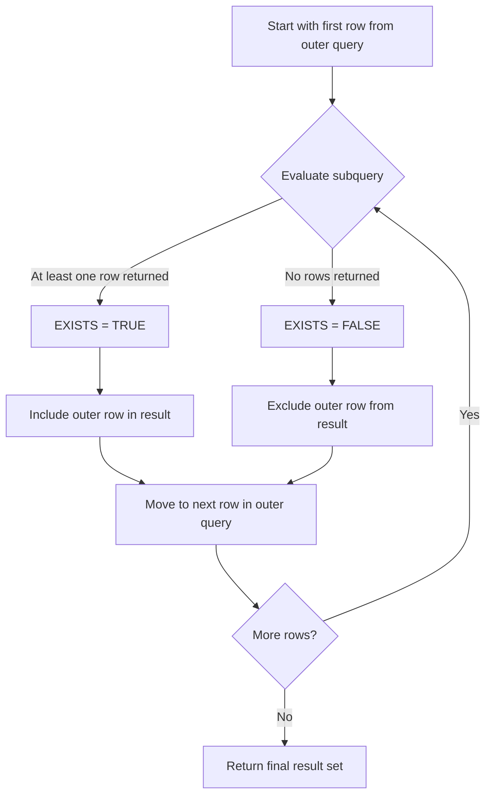

# PostgreSQL EXISTS

## Introduction

The `EXISTS` operator is a powerful SQL feature that allows you to test for the existence of rows in a subquery. Rather than returning actual data, the `EXISTS` operator returns a boolean value (`TRUE` or `FALSE`) based on whether the subquery returns any rows at all. This makes it particularly useful for writing efficient queries where you only need to know if certain criteria are met, without actually retrieving all matching data.

In this tutorial, we'll explore how to use the `EXISTS` operator in PostgreSQL, understand its performance characteristics, and see practical examples of when and how to apply it in real-world scenarios.

## Basic Syntax

The basic syntax of the `EXISTS` operator is:

```sql
SELECT column1, column2, ...
FROM table1
WHERE EXISTS (subquery);
```

The `EXISTS` condition evaluates to:
- `TRUE` if the subquery returns at least one row
- `FALSE` if the subquery returns no rows

## How EXISTS Works

When PostgreSQL processes a query with an `EXISTS` operator:

1. For each row in the outer query, the subquery is evaluated
2. If the subquery returns at least one row, `EXISTS` returns `TRUE`
3. If the subquery returns no rows, `EXISTS` returns `FALSE`
4. The outer query continues based on this boolean result

`EXISTS` is optimized to stop evaluating as soon as the first matching row is found, making it potentially more efficient than other approaches for certain types of queries.

## Basic Examples

### Finding Customers with Orders

Let's start with a common use case: finding all customers who have placed at least one order.

```sql
SELECT customer_id, customer_name
FROM customers
WHERE EXISTS (
    SELECT 1
    FROM orders
    WHERE orders.customer_id = customers.customer_id
);
```

In this example:
- We select from the `customers` table
- The `EXISTS` subquery checks the `orders` table
- We only return customers who have at least one matching order

Notice the correlation between the tables with `orders.customer_id = customers.customer_id`. This is a key aspect of using `EXISTS` effectively.

### Finding Products That Have Never Been Ordered

We can also use `NOT EXISTS` to find records that don't have matching entries:

```sql
SELECT product_id, product_name
FROM products
WHERE NOT EXISTS (
    SELECT 1
    FROM order_items
    WHERE order_items.product_id = products.product_id
);
```

This query returns all products that have never been ordered.

## Performance Considerations

One important aspect of `EXISTS` is its performance characteristics:

1. **Early Termination**: The subquery stops processing as soon as it finds a match, not needing to return all matching rows.

2. **Use of Index**: If the correlation condition in the subquery involves indexed columns, PostgreSQL can often use the index to efficiently check for existence.

3. **Comparison with IN**: While `IN` and `EXISTS` can often be used interchangeably, `EXISTS` is typically more efficient when:
   - The outer table is large and the subquery result is small
   - You're checking for existence only, not needing actual returned values

## Practical Applications

Let's explore some real-world applications of the `EXISTS` operator.

### Finding Departments with Employees Earning Above Average

Imagine you need to identify departments that have at least one employee with a salary above the company average:

```sql
SELECT department_id, department_name
FROM departments d
WHERE EXISTS (
    SELECT 1
    FROM employees e
    WHERE e.department_id = d.department_id
    AND e.salary > (SELECT AVG(salary) FROM employees)
);
```

### Filtering Stores That Sell Specific Products

If you want to find all stores that sell a particular category of products:

```sql
SELECT store_id, store_name
FROM stores s
WHERE EXISTS (
    SELECT 1
    FROM inventory i
    JOIN products p ON i.product_id = p.product_id
    WHERE i.store_id = s.store_id
    AND p.category = 'Electronics'
);
```

### Identifying Inactive Users

You can use `NOT EXISTS` to find users who haven't logged in within the last 30 days:

```sql
SELECT user_id, username
FROM users u
WHERE NOT EXISTS (
    SELECT 1
    FROM login_history lh
    WHERE lh.user_id = u.user_id
    AND lh.login_date > (CURRENT_DATE - INTERVAL '30 days')
);
```

## Using EXISTS vs. JOIN

Let's compare `EXISTS` with an equivalent `JOIN` solution to understand when each approach might be preferable.

Consider finding customers who have placed orders:

Using `EXISTS`:
```sql
SELECT c.customer_id, c.customer_name
FROM customers c
WHERE EXISTS (
    SELECT 1
    FROM orders o
    WHERE o.customer_id = c.customer_id
);
```

Using `JOIN`:
```sql
SELECT DISTINCT c.customer_id, c.customer_name
FROM customers c
JOIN orders o ON c.customer_id = o.customer_id;
```

**Key differences:**
1. The `JOIN` approach might return duplicate customers if they have multiple orders (requiring `DISTINCT`)
2. The `EXISTS` approach avoids duplicates naturally and might be more efficient when you only need to check existence
3. If you need data from both tables, `JOIN` is more appropriate
4. If you only need data from one table but filtered based on another, `EXISTS` is often cleaner

## Advanced Usage: Correlated Subqueries with Multiple Conditions

You can create more complex conditions in your `EXISTS` subqueries:

```sql
SELECT employee_id, employee_name
FROM employees e
WHERE EXISTS (
    SELECT 1
    FROM projects p
    JOIN project_assignments pa ON p.project_id = pa.project_id
    WHERE pa.employee_id = e.employee_id
    AND p.status = 'Active'
    AND p.priority = 'High'
);
```

This query finds employees assigned to active, high-priority projects.

## Visualizing EXISTS Logic

Let's visualize how the `EXISTS` operator works:



## Common Pitfalls and Best Practices

When using the `EXISTS` operator, keep these tips in mind:

1. **Column Selection**: In the subquery, use `SELECT 1` or `SELECT *` - it doesn't matter what you select since `EXISTS` only checks if any rows are returned, not what values they contain.

2. **Correlation**: Make sure to properly correlate the subquery with the outer query when needed. Without proper correlation, the subquery might return the same result for every row of the outer query.

3. **Indexing**: Ensure indexes exist on columns used in the correlation condition for optimal performance.

4. **Simplicity**: Using `EXISTS` can sometimes make your queries more readable and maintainable compared to complex joins.

## Summary

The PostgreSQL `EXISTS` operator is a powerful tool for checking the existence of related data without having to return or join that data. Key takeaways include:

- `EXISTS` returns a boolean result (`TRUE` or `FALSE`) based on whether the subquery returns any rows
- It's optimized to stop processing as soon as the first matching row is found
- It's particularly useful for filtering one table based on conditions in another table
- The `NOT EXISTS` operator provides the inverse functionality
- Performance can be superior to `JOIN` or `IN` in many scenarios, especially with proper indexing

## Exercises

To reinforce your learning, try these exercises:

1. Write a query using `EXISTS` to find all suppliers who provide products that are currently out of stock.

2. Create a query using `NOT EXISTS` to identify customers who have never purchased products from a specific category.

3. Write a query to find employees who have skills that no other employee in their department has.

4. Compare the execution plan and performance of an `EXISTS` query versus an equivalent `JOIN` query for a large dataset.

## Further Resources

To deepen your understanding of PostgreSQL and the `EXISTS` operator:

- PostgreSQL's official documentation on subquery expressions
- Books such as "PostgreSQL: Up and Running" or "The Art of PostgreSQL"
- Online PostgreSQL performance tuning guides
- Practice with real datasets to compare `EXISTS` vs. other approaches