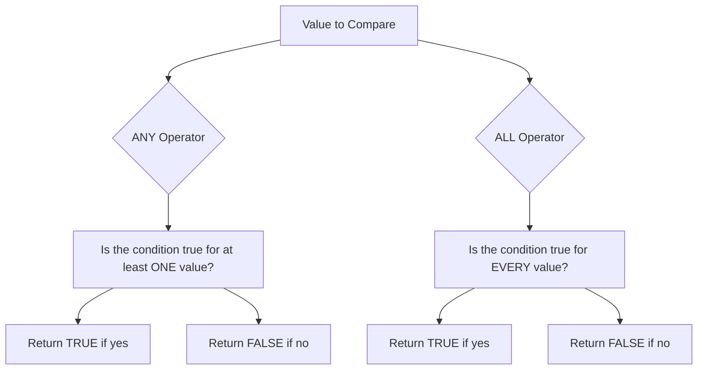

# PostgreSQL ANY and ALL Operators

When writing advanced queries in PostgreSQL, you'll often need to compare values against a set of results from a subquery. The `ANY` and `ALL` operators provide powerful tools for these comparisons, allowing you to write more elegant and efficient SQL queries.

## Introduction

The `ANY` and `ALL` operators work with subqueries that return multiple rows. They allow you to compare a value against every value in the subquery results set using a specified comparison operator (such as `=`, `>`, `<`, etc.).

- `ANY`: Returns true if the comparison is true for at least one value returned by the subquery
- `ALL`: Returns true if the comparison is true for all values returned by the subquery

## Basic Syntax

```sql
expression comparison_operator ANY (subquery)
expression comparison_operator ALL (subquery)
```

Where:
- `expression` is a value you want to compare
- `comparison_operator` can be any of: `=`, `<>`, `!=`, `>`, `>=`, `<`, `<=`
- `subquery` is a query that returns a single column of multiple values

## The ANY Operator

The `ANY` operator returns true if the comparison is true for at least one value in the subquery result.

### Example 1: Basic Usage

Let's create sample tables to demonstrate:

```sql
CREATE TABLE products (
    product_id SERIAL PRIMARY KEY,
    product_name VARCHAR(100),
    price DECIMAL(10, 2),
    category VARCHAR(50)
);

CREATE TABLE orders (
    order_id SERIAL PRIMARY KEY,
    product_id INTEGER REFERENCES products(product_id),
    quantity INTEGER,
    order_date DATE
);

-- Insert sample data
INSERT INTO products (product_name, price, category) VALUES 
('Laptop', 1200.00, 'Electronics'),
('Smartphone', 800.00, 'Electronics'),
('Headphones', 150.00, 'Electronics'),
('Coffee Maker', 90.00, 'Kitchen'),
('Blender', 70.00, 'Kitchen');

INSERT INTO orders (product_id, quantity, order_date) VALUES 
(1, 2, '2023-01-15'),
(2, 1, '2023-01-16'),
(3, 3, '2023-01-20'),
(1, 1, '2023-02-01'),
(4, 2, '2023-02-05');
```

Now, let's find all products that have been ordered at least once:

```sql
SELECT product_name
FROM products
WHERE product_id = ANY (
    SELECT product_id
    FROM orders
);
```

Result:
```
 product_name 
--------------
 Laptop
 Smartphone
 Headphones
 Coffee Maker
```

### Example 2: Using with Other Comparison Operators

Find products that cost more than any Kitchen product:

```sql
SELECT product_name, price
FROM products
WHERE price > ANY (
    SELECT price
    FROM products
    WHERE category = 'Kitchen'
);
```

Result:
```
 product_name | price 
--------------+--------
 Laptop       | 1200.00
 Smartphone   | 800.00
 Headphones   | 150.00
```

## The ALL Operator

The `ALL` operator returns true if the comparison is true for all values in the subquery result.

### Example 1: Basic Usage

Find products that cost more than all Kitchen products:

```sql
SELECT product_name, price
FROM products
WHERE price > ALL (
    SELECT price
    FROM products
    WHERE category = 'Kitchen'
);
```

Result:
```
 product_name | price 
--------------+--------
 Laptop       | 1200.00
 Smartphone   | 800.00
 Headphones   | 150.00
```

In this example, the result is the same as the previous `ANY` example because all the products shown cost more than the most expensive Kitchen product ($90.00).

### Example 2: More Complex Scenario

Let's modify our data to better illustrate the difference between `ANY` and `ALL`:

```sql
-- Update the Headphones price
UPDATE products
SET price = 80.00
WHERE product_name = 'Headphones';
```

Now let's run both queries again:

With `ANY`:
```sql
SELECT product_name, price
FROM products
WHERE price > ANY (
    SELECT price
    FROM products
    WHERE category = 'Kitchen'
);
```

Result:
```
 product_name | price 
--------------+--------
 Laptop       | 1200.00
 Smartphone   | 800.00
 Headphones   | 80.00
```

With `ALL`:
```sql
SELECT product_name, price
FROM products
WHERE price > ALL (
    SELECT price
    FROM products
    WHERE category = 'Kitchen'
);
```

Result:
```
 product_name | price 
--------------+--------
 Laptop       | 1200.00
 Smartphone   | 800.00
```

Note that "Headphones" appears in the `ANY` result but not in the `ALL` result, because:
- `price > ANY` means "greater than at least one Kitchen product price"
- `price > ALL` means "greater than every Kitchen product price"

Since Headphones ($80.00) costs more than the Blender ($70.00) but less than the Coffee Maker ($90.00), it meets the first condition but not the second.

## Practical Applications

### Finding Orders Above Average Quantity

```sql
SELECT order_id, product_id, quantity
FROM orders
WHERE quantity > ALL (
    SELECT AVG(quantity)
    FROM orders
);
```

This finds orders with quantities higher than the average order quantity.

### Finding Products with No Orders

```sql
SELECT product_name
FROM products
WHERE product_id <> ALL (
    SELECT product_id
    FROM orders
);
```

This finds products that have never been ordered.

## The IN Operator: A Specialized Form of ANY

The `IN` operator is actually a shorthand for `= ANY`. These two queries are equivalent:

```sql
-- Using IN
SELECT product_name
FROM products
WHERE product_id IN (
    SELECT product_id
    FROM orders
);

-- Using = ANY
SELECT product_name
FROM products
WHERE product_id = ANY (
    SELECT product_id
    FROM orders
);
```

Similarly, `NOT IN` is equivalent to `<> ALL`:

```sql
-- Using NOT IN
SELECT product_name
FROM products
WHERE product_id NOT IN (
    SELECT product_id
    FROM orders
);

-- Using <> ALL
SELECT product_name
FROM products
WHERE product_id <> ALL (
    SELECT product_id
    FROM orders
);
```

## ANY/ALL vs. EXISTS

While `ANY` and `ALL` compare values, the `EXISTS` operator checks for the existence of rows. Let's compare approaches:

Finding products that have been ordered:

```sql
-- Using = ANY
SELECT product_name
FROM products
WHERE product_id = ANY (
    SELECT product_id
    FROM orders
);

-- Using EXISTS
SELECT product_name
FROM products p
WHERE EXISTS (
    SELECT 1
    FROM orders o
    WHERE o.product_id = p.product_id
);
```

Both produce the same results, but in complex scenarios, one might be more readable or perform better than the other.

## Performance Considerations

- `ANY` and `ALL` can be less efficient than alternatives like `EXISTS` or joins for certain types of queries
- PostgreSQL's query optimizer often transforms `ANY`/`ALL` queries into equivalent forms
- For large data sets, consider testing different approaches to find the most efficient one for your specific case

## Visual Explanation

Here's a visual representation of how `ANY` and `ALL` operators work:



## Summary

The `ANY` and `ALL` operators provide powerful ways to compare values against sets of results from subqueries:

- `ANY` returns true if the comparison is true for at least one value
- `ALL` returns true if the comparison is true for all values
- `IN` is equivalent to `= ANY`, and `NOT IN` is equivalent to `<> ALL`
- These operators can be used with various comparison operators (`=`, `<>`, `>`, `<`, etc.)

Understanding when to use `ANY` and `ALL` can help you write more elegant and efficient PostgreSQL queries, especially when dealing with complex filtering conditions against multiple values.

## Exercises

1. Write a query to find all products that cost more than any Electronics product.
2. Write a query to find orders with a quantity less than all orders placed in January 2023.
3. Compare the performance of `= ANY` vs `EXISTS` for finding products that have been ordered, using the `EXPLAIN ANALYZE` command.
4. Write a query to find products that have a price between the minimum and maximum prices of Electronics products.

## Additional Resources

- [PostgreSQL Official Documentation on Subquery Expressions](https://www.postgresql.org/docs/current/functions-subquery.html)
- [PostgreSQL Comparison Operators](https://www.postgresql.org/docs/current/functions-comparison.html)