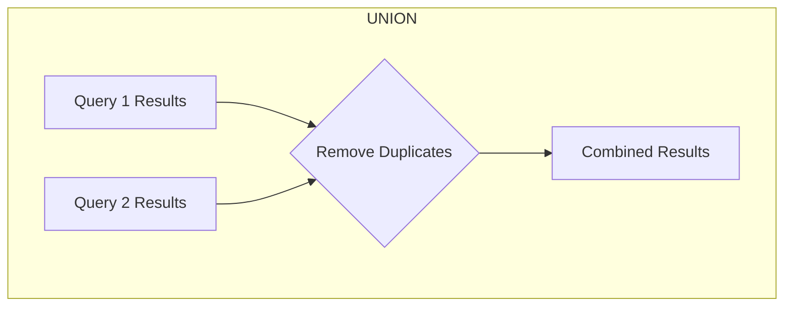
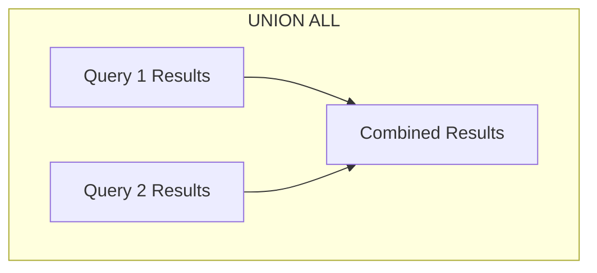

# PostgreSQL UNION

## Introduction

When working with databases, you'll often need to combine results from multiple queries into a single result set. PostgreSQL's `UNION` operator is a powerful tool that allows you to do exactly that - merge the results of two or more `SELECT` statements into one.

The `UNION` operator is particularly useful when you need to:
- Combine data from different tables with similar structures
- Create comprehensive reports from fragmented data
- Generate consolidated views of related information

In this tutorial, we'll explore how to use the `UNION` operator effectively, understand its syntax, and see practical examples of how it can solve real-world problems.

## Basic Syntax

The basic syntax for using the `UNION` operator is:

```sql
SELECT column1, column2, ... FROM table1
UNION
SELECT column1, column2, ... FROM table2;
```

For this to work correctly, there are a few important rules:

1. Both queries must return the same number of columns
2. Corresponding columns must have compatible data types
3. The column names from the first query will be used as the column names in the result set

## UNION vs. UNION ALL

PostgreSQL offers two variants of the union operation:

- `UNION`: Combines the results and removes duplicates (distinct values only)
- `UNION ALL`: Combines the results and keeps all rows, including duplicates

### Example: UNION vs. UNION ALL

Let's create two simple tables to demonstrate:

```sql
CREATE TABLE employees_north (
    id SERIAL PRIMARY KEY,
    name VARCHAR(100),
    department VARCHAR(100)
);

CREATE TABLE employees_south (
    id SERIAL PRIMARY KEY,
    name VARCHAR(100),
    department VARCHAR(100)
);

-- Insert some data
INSERT INTO employees_north (name, department) VALUES 
    ('John Smith', 'Marketing'),
    ('Mary Johnson', 'Finance'),
    ('Robert Davis', 'HR');

INSERT INTO employees_south (name, department) VALUES 
    ('Sarah Miller', 'Engineering'),
    ('James Wilson', 'Sales'),
    ('Mary Johnson', 'Finance'); -- Duplicate entry
```

Now, let's see the difference between `UNION` and `UNION ALL`:

```sql
-- UNION (removes duplicates)
SELECT name, department FROM employees_north
UNION
SELECT name, department FROM employees_south;

-- UNION ALL (keeps duplicates)
SELECT name, department FROM employees_north
UNION ALL
SELECT name, department FROM employees_south;
```

Output with `UNION`:

```
name          | department
--------------+------------
John Smith    | Marketing
Mary Johnson  | Finance
Robert Davis  | HR
Sarah Miller  | Engineering
James Wilson  | Sales
```

Output with `UNION ALL`:

```
name          | department
--------------+------------
John Smith    | Marketing
Mary Johnson  | Finance
Robert Davis  | HR
Sarah Miller  | Engineering
James Wilson  | Sales
Mary Johnson  | Finance
```

Notice that with `UNION`, the duplicate entry for "Mary Johnson" appears only once, while with `UNION ALL`, it appears twice.

## Sorting Results

When using `UNION`, you can sort the combined results using an `ORDER BY` clause at the end:

```sql
SELECT name, department FROM employees_north
UNION
SELECT name, department FROM employees_south
ORDER BY name;
```

Output:

```
name          | department
--------------+------------
James Wilson  | Sales
John Smith    | Marketing
Mary Johnson  | Finance
Robert Davis  | HR
Sarah Miller  | Engineering
```

## Working with Different Column Names

What if your tables have different column names but compatible data types? You can still use `UNION`, but the column names from the first query will be used in the result set:

```sql
SELECT name, department AS division FROM employees_north
UNION
SELECT employee_name, dept FROM employees_other;
```

In this case, the result set would use "name" and "division" as column names.

## Using UNION with Different Tables

A common real-world use case is combining data from different tables with similar structures. Let's look at an example where we have sales data split across multiple tables by year:

```sql
CREATE TABLE sales_2022 (
    id SERIAL PRIMARY KEY,
    product_id INT,
    sale_date DATE,
    amount DECIMAL(10, 2)
);

CREATE TABLE sales_2023 (
    id SERIAL PRIMARY KEY,
    product_id INT,
    sale_date DATE,
    amount DECIMAL(10, 2)
);

-- Insert sample data
INSERT INTO sales_2022 (product_id, sale_date, amount) VALUES 
    (101, '2022-03-15', 499.99),
    (102, '2022-06-22', 299.50),
    (103, '2022-11-05', 1299.99);

INSERT INTO sales_2023 (product_id, sale_date, amount) VALUES 
    (101, '2023-01-10', 449.99),
    (104, '2023-04-30', 799.99),
    (105, '2023-09-12', 599.99);
```

Now, let's say we want to generate a report of all sales across both years:

```sql
SELECT product_id, sale_date, amount, '2022' AS year
FROM sales_2022
UNION ALL
SELECT product_id, sale_date, amount, '2023' AS year
FROM sales_2023
ORDER BY sale_date;
```

Output:

```
product_id | sale_date  | amount  | year
-----------+------------+---------+------
101        | 2022-03-15 | 499.99  | 2022
102        | 2022-06-22 | 299.50  | 2022
103        | 2022-11-05 | 1299.99 | 2022
101        | 2023-01-10 | 449.99  | 2023
104        | 2023-04-30 | 799.99  | 2023
105        | 2023-09-12 | 599.99  | 2023
```

This approach allows you to easily create comprehensive reports that span multiple time periods without having to modify your database structure.

## Practical Application: Creating a Unified View

Let's look at a more complex example where `UNION` helps solve a real business problem. Imagine we have a system with three related tables:

1. `customers` - Regular customers
2. `partners` - Business partners
3. `suppliers` - Product suppliers

We want to create a unified contact list with information from all three tables:

```sql
CREATE TABLE customers (
    id SERIAL PRIMARY KEY,
    name VARCHAR(100),
    email VARCHAR(100),
    phone VARCHAR(20),
    type VARCHAR(10) DEFAULT 'customer'
);

CREATE TABLE partners (
    id SERIAL PRIMARY KEY,
    company_name VARCHAR(100),
    contact_email VARCHAR(100),
    phone_number VARCHAR(20),
    partnership_type VARCHAR(50)
);

CREATE TABLE suppliers (
    id SERIAL PRIMARY KEY,
    supplier_name VARCHAR(100),
    email_address VARCHAR(100),
    contact_number VARCHAR(20),
    product_category VARCHAR(50)
);

-- Insert sample data
INSERT INTO customers (name, email, phone) VALUES 
    ('John Doe', 'john@example.com', '555-1234'),
    ('Jane Smith', 'jane@example.com', '555-5678');

INSERT INTO partners (company_name, contact_email, phone_number, partnership_type) VALUES 
    ('Acme Corp', 'contact@acme.com', '555-9012', 'Reseller'),
    ('TechPro Inc', 'info@techpro.com', '555-3456', 'Integrator');

INSERT INTO suppliers (supplier_name, email_address, contact_number, product_category) VALUES 
    ('Global Goods', 'supply@globalgoods.com', '555-7890', 'Hardware'),
    ('DataSystems', 'orders@datasystems.com', '555-2345', 'Software');
```

Now we can create a unified contact list:

```sql
SELECT 
    name AS contact_name,
    email AS contact_email,
    phone AS contact_phone,
    'Customer' AS contact_type
FROM 
    customers
UNION
SELECT 
    company_name,
    contact_email,
    phone_number,
    'Partner: ' || partnership_type
FROM 
    partners
UNION
SELECT 
    supplier_name,
    email_address,
    contact_number,
    'Supplier: ' || product_category
FROM 
    suppliers
ORDER BY 
    contact_name;
```

Output:

```
contact_name    | contact_email            | contact_phone | contact_type
----------------+-------------------------+---------------+--------------------
Acme Corp       | contact@acme.com        | 555-9012      | Partner: Reseller
DataSystems     | orders@datasystems.com  | 555-2345      | Supplier: Software
Global Goods    | supply@globalgoods.com  | 555-7890      | Supplier: Hardware
Jane Smith      | jane@example.com        | 555-5678      | Customer
John Doe        | john@example.com        | 555-1234      | Customer
TechPro Inc     | info@techpro.com        | 555-3456      | Partner: Integrator
```

This unified view gives us a comprehensive contact list from multiple sources, with additional type information to distinguish the different categories.

## Advanced Usage: Combining with WHERE Clauses

You can apply `WHERE` clauses to each individual `SELECT` statement in a `UNION` query:

```sql
-- Get customers from New York and partners from California
SELECT name, email, 'Customer' AS type FROM customers 
WHERE state = 'NY'
UNION
SELECT company_name, contact_email, 'Partner' AS type FROM partners 
WHERE state = 'CA'
ORDER BY name;
```

## Performance Considerations

When working with `UNION`, keep these performance tips in mind:

1. Use `UNION ALL` when possible, as it's faster than `UNION` (no need to check for duplicates)
2. Add appropriate indexes on columns used in the `WHERE` clauses
3. For large datasets, consider creating temporary tables or materialized views
4. Apply `WHERE` conditions to reduce the result set size before the union operation

## Visualizing UNION Operations

We can visualize how the `UNION` and `UNION ALL` operators work:





## Common Errors and How to Fix Them

When working with `UNION`, you might encounter these common errors:

### 1. Different Number of Columns

Error message: `ERROR: each UNION query must have the same number of columns`

Solution: Ensure both queries return the same number of columns. You can add NULL values or constants if needed:

```sql
-- Incorrect
SELECT name, email FROM customers
UNION
SELECT company_name FROM partners;

-- Correct
SELECT name, email FROM customers
UNION
SELECT company_name, NULL AS email FROM partners;
```

### 2. Incompatible Data Types

Error message: `ERROR: UNION types text and integer cannot be matched`

Solution: Cast values to compatible types:

```sql
-- Incorrect
SELECT id, name FROM customers
UNION
SELECT registration_number, company_name FROM partners;

-- Correct
SELECT id::TEXT, name FROM customers
UNION
SELECT registration_number::TEXT, company_name FROM partners;
```

## Summary

PostgreSQL's `UNION` operator is a versatile tool for combining the results of multiple queries into a single result set. Here's what we've covered:

- Basic syntax and rules for using `UNION`
- The difference between `UNION` and `UNION ALL`
- Sorting combined results with `ORDER BY`
- Working with different column names
- Practical applications in real-world scenarios
- Performance considerations and common errors

With `UNION`, you can create comprehensive reports, build unified views across multiple tables, and consolidate data from different sources — all without having to restructure your database.

## Exercises

To strengthen your understanding of `UNION`, try these exercises:

1. Create two tables: `employees` and `contractors` with similar structures, then use `UNION` to generate a complete personnel list.

2. Write a query that uses `UNION ALL` to combine sales data from different regions, then calculate the total sales amount.

3. Create a query that uses `UNION` to find products that exist in both the `inventory` and `wish_list` tables.

4. Build a report that shows all transactions (purchases, returns, and exchanges) using `UNION` with different transaction tables.

## Additional Resources

For more information on PostgreSQL's `UNION` operator and related topics:

- [PostgreSQL Official Documentation on UNION Clause](https://www.postgresql.org/docs/current/queries-union.html)
- [PostgreSQL: Set Operations with UNION, INTERSECT, and EXCEPT](https://www.postgresql.org/docs/current/queries-union.html)
- [SQL Set Operations: UNION, INTERSECT, and EXCEPT](https://www.postgresql.org/docs/current/sql-select.html#SQL-UNION)