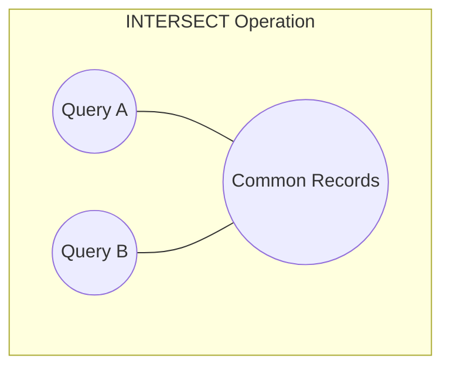

# PostgreSQL INTERSECT

## Introduction

When working with databases, you'll often need to find data that exists in multiple tables or query results. The `INTERSECT` operator in PostgreSQL is a powerful tool that helps you identify common records between two or more query results. It returns only the rows that appear in all of the specified queries.

Think of `INTERSECT` as the database equivalent of a Venn diagram intersection - it gives you the overlapping data between different sets of results.



In this tutorial, we'll explore the PostgreSQL `INTERSECT` operator, understand its syntax, and see practical examples of how it can be used in real-world scenarios.

## Basic Syntax

The basic syntax of the `INTERSECT` operator is:

```sql
SELECT column1, column2, ... FROM table1
INTERSECT
SELECT column1, column2, ... FROM table2;
```

Important rules to remember:
- The number and order of columns must be the same in all queries
- The data types of corresponding columns must be compatible
- By default, duplicate rows are eliminated

## Basic INTERSECT Examples

Let's set up some sample tables to demonstrate how `INTERSECT` works:

```sql
-- Create and populate employees_department_a table
CREATE TABLE employees_department_a (
    employee_id INT PRIMARY KEY,
    name VARCHAR(50),
    position VARCHAR(50)
);

INSERT INTO employees_department_a VALUES 
(1, 'John Smith', 'Developer'),
(2, 'Jane Doe', 'Designer'),
(3, 'Mike Johnson', 'Manager'),
(4, 'Sarah Brown', 'Developer');

-- Create and populate employees_department_b table
CREATE TABLE employees_department_b (
    employee_id INT PRIMARY KEY,
    name VARCHAR(50),
    position VARCHAR(50)
);

INSERT INTO employees_department_b VALUES 
(3, 'Mike Johnson', 'Manager'),
(4, 'Sarah Brown', 'Developer'),
(5, 'Emily Wilson', 'Designer'),
(6, 'David Lee', 'Analyst');
```

Now, let's find employees who work in both departments:

```sql
SELECT employee_id, name, position FROM employees_department_a
INTERSECT
SELECT employee_id, name, position FROM employees_department_b;
```

Result:

```
 employee_id |    name      |  position
-------------|--------------|-----------
      3      | Mike Johnson | Manager
      4      | Sarah Brown  | Developer
```

The result shows that Mike Johnson and Sarah Brown work in both departments.

## INTERSECT with ORDER BY

You can use the `ORDER BY` clause with `INTERSECT` to sort the results:

```sql
SELECT employee_id, name, position FROM employees_department_a
INTERSECT
SELECT employee_id, name, position FROM employees_department_b
ORDER BY name;
```

Result:

```
 employee_id |    name      |  position
-------------|--------------|-----------
      3      | Mike Johnson | Manager
      4      | Sarah Brown  | Developer
```

Note that the `ORDER BY` clause should be placed at the end of the entire query, not within individual `SELECT` statements.

## INTERSECT ALL

By default, `INTERSECT` removes duplicate rows from the result. If you want to keep duplicates, you can use `INTERSECT ALL`:

```sql
-- Create tables with duplicate rows
CREATE TABLE set_a (id INT);
CREATE TABLE set_b (id INT);

INSERT INTO set_a VALUES (1), (2), (2), (3), (4);
INSERT INTO set_b VALUES (2), (2), (3), (5), (6);

-- Using INTERSECT (removes duplicates)
SELECT id FROM set_a
INTERSECT
SELECT id FROM set_b;

-- Result:
-- 2
-- 3

-- Using INTERSECT ALL (preserves duplicates)
SELECT id FROM set_a
INTERSECT ALL
SELECT id FROM set_b;

-- Result:
-- 2
-- 2
-- 3
```

In the `INTERSECT ALL` result, the value `2` appears twice because it occurs at least twice in both tables.

## Multiple INTERSECT Operations

You can chain multiple `INTERSECT` operations to find rows common to more than two queries:

```sql
-- Create a third table
CREATE TABLE employees_department_c (
    employee_id INT PRIMARY KEY,
    name VARCHAR(50),
    position VARCHAR(50)
);

INSERT INTO employees_department_c VALUES 
(3, 'Mike Johnson', 'Manager'),
(6, 'David Lee', 'Analyst'),
(7, 'Lisa Chen', 'Developer');

-- Find employees who work in all three departments
SELECT employee_id, name, position FROM employees_department_a
INTERSECT
SELECT employee_id, name, position FROM employees_department_b
INTERSECT
SELECT employee_id, name, position FROM employees_department_c;
```

Result:

```
 employee_id |    name      | position
-------------|--------------|----------
      3      | Mike Johnson | Manager
```

Mike Johnson is the only employee who works in all three departments.

## Real-World Applications

Let's explore some practical applications of `INTERSECT` in real-world scenarios:

### Finding Common Customers

Suppose you want to identify customers who have purchased both Product A and Product B:

```sql
-- Customers who purchased Product A
SELECT customer_id FROM orders WHERE product_id = 'A'
INTERSECT
-- Customers who purchased Product B
SELECT customer_id FROM orders WHERE product_id = 'B';
```

### Identifying Shared Skills

Find candidates who have all the required skills for a job position:

```sql
-- Required skills for the job
SELECT skill_id FROM job_requirements WHERE job_id = 123
INTERSECT
-- Skills possessed by the candidate
SELECT skill_id FROM candidate_skills WHERE candidate_id = 456;
```

### Finding Overlapping Time Periods

Identify dates when two teams were both available:

```sql
-- Dates when Team A is available
SELECT available_date FROM team_a_availability
INTERSECT
-- Dates when Team B is available
SELECT available_date FROM team_b_availability;
```

## Combining INTERSECT with Other Set Operations

You can combine `INTERSECT` with other set operations like `UNION` and `EXCEPT` in the same query:

```sql
-- Find employees who work in both Department A and B, or only in Department C
(SELECT employee_id FROM employees_department_a
 INTERSECT
 SELECT employee_id FROM employees_department_b)
UNION
SELECT employee_id FROM employees_department_c;
```

Note that when combining set operations, it's important to use parentheses to establish the order of operations.

## Performance Considerations

When using `INTERSECT`, keep these performance tips in mind:

1. **Indexes**: Ensure that columns used in the `INTERSECT` operation are properly indexed
2. **Query Optimization**: PostgreSQL might rewrite your query to use other constructs that are more efficient
3. **Alternative Approaches**: For some queries, using `JOIN` or `IN` might be more efficient than `INTERSECT`

For example, the following queries are equivalent:

```sql
-- Using INTERSECT
SELECT employee_id FROM employees_department_a
INTERSECT
SELECT employee_id FROM employees_department_b;

-- Alternative using JOIN
SELECT DISTINCT a.employee_id
FROM employees_department_a a
JOIN employees_department_b b ON a.employee_id = b.employee_id;

-- Alternative using IN
SELECT DISTINCT employee_id 
FROM employees_department_a
WHERE employee_id IN (SELECT employee_id FROM employees_department_b);
```

Choose the approach that works best for your specific scenario and data volume.

## Common Mistakes and Troubleshooting

Here are some common issues when working with `INTERSECT`:

1. **Column count mismatch**: Ensure that both queries return the same number of columns
   ```sql
   -- This will fail
   SELECT id, name FROM table_a
   INTERSECT
   SELECT id FROM table_b;
   ```

2. **Data type incompatibility**: The data types of corresponding columns must be compatible
   ```sql
   -- This might fail if the data types cannot be implicitly converted
   SELECT id::TEXT FROM table_a
   INTERSECT
   SELECT id FROM table_b;
   ```

3. **Forgetting about case sensitivity**: Remember that string comparisons are case-sensitive
   ```sql
   -- 'John' and 'JOHN' are considered different values
   SELECT name FROM table_a
   INTERSECT
   SELECT name FROM table_b;
   ```

## Summary

The PostgreSQL `INTERSECT` operator is a powerful tool for finding common rows between multiple queries. It helps you identify overlapping data sets, making it useful for a wide range of applications from business analysis to data validation.

Key points to remember:
- `INTERSECT` returns only rows that appear in all of the specified queries
- Column count and data types must match between queries
- Use `INTERSECT ALL` to preserve duplicates
- Consider performance implications and alternative approaches for complex queries
- `INTERSECT` can be combined with other set operations for more complex data analysis

## Exercises

1. Create two tables of your choice and practice using the `INTERSECT` operator to find common records.
2. Experiment with `INTERSECT ALL` to see how it differs from regular `INTERSECT`.
3. Try combining `INTERSECT` with `UNION` and `EXCEPT` to solve a complex data retrieval problem.
4. Compare the performance of `INTERSECT` versus equivalent queries using `JOIN` or `IN` on large datasets.
5. Find a real-world problem in your own projects where `INTERSECT` could be applied.

## Additional Resources

- [PostgreSQL Official Documentation on INTERSECT](https://www.postgresql.org/docs/current/queries-union.html)
- [SQL Set Operations: UNION, INTERSECT, and EXCEPT](https://www.postgresql.org/docs/current/queries-union.html)
- [PostgreSQL Performance Optimization Guide](https://www.postgresql.org/docs/current/performance-tips.html)