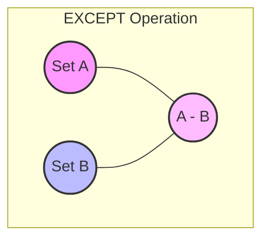
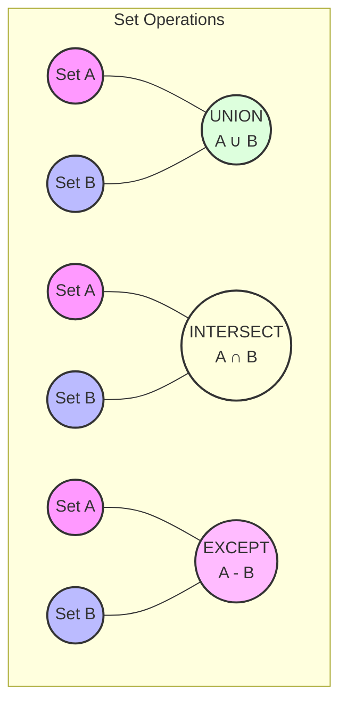

# PostgreSQL EXCEPT Operator

## Introduction

The `EXCEPT` operator is a powerful feature in PostgreSQL that allows you to compare the results of two queries and return rows that appear in the first query but not in the second. It's one of several set operations in SQL (along with `UNION` and `INTERSECT`) that help you perform complex data manipulations and analyses.

Think of `EXCEPT` as the SQL equivalent of set difference or relative complement in set theory. It's particularly useful when you need to identify what exists in one data set but is missing from another.

## Basic Syntax

The basic syntax of the `EXCEPT` operator is:

```sql
SELECT column1, column2, ...
FROM table1
WHERE condition

EXCEPT

SELECT column1, column2, ...
FROM table2
WHERE condition;
```

### Important Rules for EXCEPT

1. The number of columns must be the same in both queries
2. The data types of corresponding columns must be compatible
3. The column names from the first query determine the output column names
4. Duplicate rows are automatically eliminated (unless you use `EXCEPT ALL`)
5. The `ORDER BY` clause, if used, must appear at the end of the last query

## Simple EXCEPT Example

Let's start with a basic example. Imagine we have two tables: `employees` and `managers`.

First, let's create and populate these tables:

```sql
-- Create tables
CREATE TABLE employees (
    id SERIAL PRIMARY KEY,
    name VARCHAR(100),
    department VARCHAR(100)
);

CREATE TABLE managers (
    id SERIAL PRIMARY KEY,
    name VARCHAR(100),
    department VARCHAR(100)
);

-- Insert data into employees
INSERT INTO employees (name, department)
VALUES 
    ('John Doe', 'IT'),
    ('Jane Smith', 'HR'),
    ('Bob Johnson', 'Finance'),
    ('Alice Williams', 'Marketing'),
    ('Charlie Brown', 'IT');

-- Insert data into managers
INSERT INTO managers (name, department)
VALUES 
    ('John Doe', 'IT'),
    ('Jane Smith', 'HR'),
    ('Mike Wilson', 'Sales');
```

Now, let's use `EXCEPT` to find employees who are not managers:

```sql
SELECT name, department FROM employees
EXCEPT
SELECT name, department FROM managers;
```

Result:

```
    name     | department
-------------+------------
 Bob Johnson | Finance
 Alice Williams | Marketing
 Charlie Brown | IT
```

This query returns all employees who don't appear in the managers table, giving us a list of non-manager employees.

## Using EXCEPT ALL

By default, `EXCEPT` removes duplicate rows from the result. If you want to keep duplicates, use `EXCEPT ALL` instead:

```sql
SELECT column1, column2, ...
FROM table1
WHERE condition

EXCEPT ALL

SELECT column1, column2, ...
FROM table2
WHERE condition;
```

Let's see an example with duplicate values:

```sql
-- Create a table with duplicate values
CREATE TABLE products (
    id SERIAL PRIMARY KEY,
    name VARCHAR(100),
    category VARCHAR(100)
);

CREATE TABLE discontinued_products (
    id SERIAL PRIMARY KEY,
    name VARCHAR(100),
    category VARCHAR(100)
);

-- Insert data with duplicates
INSERT INTO products (name, category)
VALUES 
    ('Laptop', 'Electronics'),
    ('Smartphone', 'Electronics'),
    ('Smartphone', 'Electronics'),  -- Duplicate
    ('Headphones', 'Audio'),
    ('Keyboard', 'Computer Accessories');

INSERT INTO discontinued_products (name, category)
VALUES 
    ('Laptop', 'Electronics'),
    ('Smartphone', 'Electronics');
```

Now let's compare `EXCEPT` and `EXCEPT ALL`:

```sql
-- Using EXCEPT (eliminates duplicates)
SELECT name, category FROM products
EXCEPT
SELECT name, category FROM discontinued_products;
```

Result:

```
    name     |       category
-------------+------------------------
 Headphones  | Audio
 Keyboard    | Computer Accessories
```

```sql
-- Using EXCEPT ALL (preserves duplicates)
SELECT name, category FROM products
EXCEPT ALL
SELECT name, category FROM discontinued_products;
```

Result:

```
    name     |       category
-------------+------------------------
 Smartphone  | Electronics
 Headphones  | Audio
 Keyboard    | Computer Accessories
```

Notice that with `EXCEPT ALL`, we get 'Smartphone' in the result because there were two occurrences in the first table and only one in the second table.

## Combining EXCEPT with Other SQL Features

The `EXCEPT` operator can be combined with other SQL features to create more complex queries.

### Using EXCEPT with WHERE Clauses

```sql
SELECT name, department FROM employees
WHERE department = 'IT'
EXCEPT
SELECT name, department FROM managers
WHERE department = 'IT';
```

This query finds IT employees who are not IT managers.

### Ordering EXCEPT Results

You can sort the results of an `EXCEPT` operation using `ORDER BY`:

```sql
SELECT name, department FROM employees
EXCEPT
SELECT name, department FROM managers
ORDER BY name;
```

Result:

```
    name     | department
-------------+------------
 Alice Williams | Marketing
 Bob Johnson | Finance
 Charlie Brown | IT
```

### EXCEPT with Subqueries

You can use `EXCEPT` with subqueries:

```sql
SELECT name FROM
(
    SELECT name, department FROM employees
    EXCEPT
    SELECT name, department FROM managers
) AS non_managers
WHERE name LIKE 'A%';
```

This query finds all non-managers whose names start with 'A'.

## Practical Applications

### Finding Missing Records

One common use of `EXCEPT` is to identify missing records. For example, finding products that exist in inventory but haven't been sold:

```sql
-- Products in inventory but not in sales
SELECT product_id, product_name 
FROM inventory
EXCEPT
SELECT product_id, product_name 
FROM sales;
```

### Auditing Data Consistency

`EXCEPT` can help in auditing data consistency between tables that should contain matching information:

```sql
-- Finding customers in the main database that are missing from the CRM system
SELECT customer_id, customer_name, email 
FROM main_customers
EXCEPT
SELECT customer_id, customer_name, email 
FROM crm_customers;
```

### Identifying Changes Between Time Periods

You can use `EXCEPT` to compare the same table at different points in time:

```sql
-- Items that were in stock last month but not this month
SELECT product_id, product_name 
FROM inventory_april_2023
EXCEPT
SELECT product_id, product_name 
FROM inventory_may_2023;
```

## Visual Representation of EXCEPT

Here's a visual representation of the `EXCEPT` operation:



## Comparison with Other Set Operations

PostgreSQL provides three main set operations:

1. `UNION`: Combines the results of two queries and removes duplicates
2. `INTERSECT`: Returns rows that appear in both queries
3. `EXCEPT`: Returns rows from the first query that don't appear in the second query

Here's how they compare:



## Common Errors and Troubleshooting

### Column Count Mismatch

```sql
-- This will cause an error
SELECT id, name, department FROM employees
EXCEPT
SELECT id, name FROM managers;
```

Error message: `ERROR: each EXCEPT query must have the same number of columns`

**Solution**: Ensure that both queries select the same number of columns.

### Data Type Incompatibility

```sql
-- This will cause an error
SELECT id, name FROM employees
EXCEPT
SELECT department_id, department_name FROM departments;
```

Error message: `ERROR: EXCEPT types integer and character varying cannot be matched`

**Solution**: Make sure the data types of corresponding columns are compatible.

## Performance Considerations

- `EXCEPT` can be resource-intensive for large datasets as it requires PostgreSQL to compare every row from the first result set against the second.
- Consider using indexes on the columns being compared to improve performance.
- For very large tables, sometimes using a `LEFT JOIN` with a `NULL` filter can be more efficient than `EXCEPT`.

## Summary

The PostgreSQL `EXCEPT` operator is a powerful tool for identifying differences between result sets. It follows the principles of set difference from mathematics and helps you find rows that exist in one query result but not in another.

Key points to remember:
- `EXCEPT` requires matching column count and compatible data types
- By default, it removes duplicates (use `EXCEPT ALL` to keep them)
- It can be combined with other SQL features like `WHERE`, `ORDER BY`, and subqueries
- It's particularly useful for data auditing, finding missing records, and comparing datasets

## Exercises

1. Create two tables, `students` and `honor_roll`, and use `EXCEPT` to find students who are not on the honor roll.
2. Write a query using `EXCEPT` to find products that are in the 'inventory' table but have never been ordered (not in the 'order_items' table).
3. Compare `EXCEPT` and `EXCEPT ALL` with tables containing duplicate values. How do the results differ?
4. Practice combining `EXCEPT` with `WHERE` clauses, `ORDER BY`, and subqueries to create more complex queries.

## Additional Resources

- [PostgreSQL Official Documentation on Set Operations](https://www.postgresql.org/docs/current/queries-union.html)
- [PostgreSQL UNION, INTERSECT and EXCEPT](https://www.postgresql.org/docs/current/sql-select.html#SQL-UNION)
- [SQL Set Operations: UNION, INTERSECT, and EXCEPT](https://www.postgresql.org/docs/current/queries-union.html)