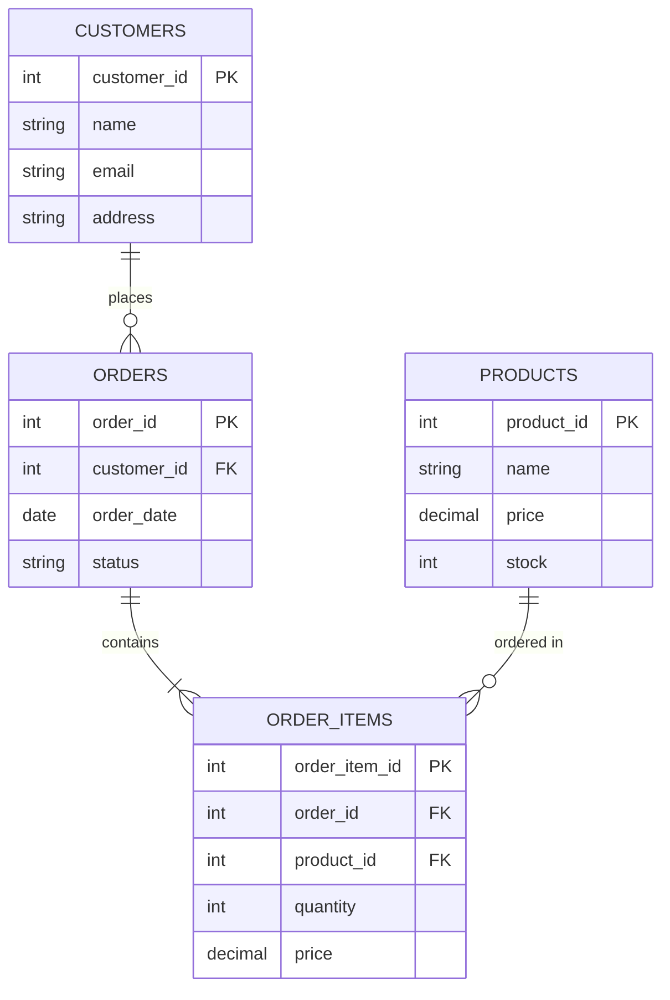

# PostgreSQL CREATE TABLE

## Introduction

Tables are the fundamental structures for storing data in PostgreSQL. They organize data into rows and columns, similar to spreadsheets. Before you can insert, update, or query data in PostgreSQL, you need to create a table with a well-defined structure.

In this tutorial, you'll learn how to use the `CREATE TABLE` statement in PostgreSQL to define tables with various data types and constraints.

## Basic Syntax

The basic syntax for creating a table in PostgreSQL is:

```sql
CREATE TABLE table_name (
    column1_name data_type constraints,
    column2_name data_type constraints,
    ...
    table_constraints
);
```

Let's break down the components:

- `table_name`: The name you want to give your table
- `column_name`: The name of each column in your table
- `data_type`: The type of data the column will store
- `constraints`: Rules that the data must follow
- `table_constraints`: Constraints that apply to the entire table

## Creating a Simple Table

Here's a simple example of creating a table to store information about users:

```sql
CREATE TABLE users (
    user_id SERIAL PRIMARY KEY,
    username VARCHAR(50) UNIQUE NOT NULL,
    email VARCHAR(100) UNIQUE NOT NULL,
    password VARCHAR(100) NOT NULL,
    created_at TIMESTAMP DEFAULT CURRENT_TIMESTAMP
);
```

After executing this command, PostgreSQL will respond with:

```
CREATE TABLE
```

This indicates that the table was created successfully.

## Common Data Types

PostgreSQL supports a wide variety of data types. Here are some commonly used ones:

| Data Type | Description | Example |
|-----------|-------------|---------|
| `INTEGER` or `INT` | Whole numbers | `42`, `-8`, `0` |
| `SERIAL` | Auto-incrementing integer | `1`, `2`, `3` |
| `NUMERIC(p,s)` or `DECIMAL(p,s)` | Exact numeric with precision (p) and scale (s) | `123.45` |
| `VARCHAR(n)` | Variable-length string with maximum length n | `'Hello'` |
| `TEXT` | Variable-length string with unlimited length | `'Long text...'` |
| `BOOLEAN` | True/false values | `TRUE`, `FALSE` |
| `DATE` | Calendar date (year, month, day) | `'2023-10-15'` |
| `TIME` | Time of day | `'14:30:00'` |
| `TIMESTAMP` | Date and time | `'2023-10-15 14:30:00'` |
| `JSON` | JSON data | `'{"name": "John"}'` |
| `JSONB` | Binary JSON data (more efficient) | `'{"name": "John"}'` |
| `UUID` | Universally unique identifier | `'a0eebc99-9c0b-4ef8-bb6d-6bb9bd380a11'` |

## Constraints

Constraints allow you to define rules that the data in your table must follow. Common constraints include:

### PRIMARY KEY

Identifies each row uniquely in a table:

```sql
CREATE TABLE products (
    product_id SERIAL PRIMARY KEY,
    product_name VARCHAR(100) NOT NULL
);
```

### UNIQUE

Ensures all values in a column are different:

```sql
CREATE TABLE customers (
    customer_id SERIAL PRIMARY KEY,
    email VARCHAR(100) UNIQUE,
    phone VARCHAR(20) UNIQUE
);
```

### NOT NULL

Ensures a column cannot have NULL values:

```sql
CREATE TABLE orders (
    order_id SERIAL PRIMARY KEY,
    customer_id INTEGER NOT NULL,
    order_date DATE NOT NULL
);
```

### CHECK

Validates that data meets a specific condition:

```sql
CREATE TABLE products (
    product_id SERIAL PRIMARY KEY,
    product_name VARCHAR(100) NOT NULL,
    price NUMERIC(10,2) CHECK (price > 0),
    stock INTEGER CHECK (stock >= 0)
);
```

### FOREIGN KEY

Creates a relationship between tables:

```sql
CREATE TABLE orders (
    order_id SERIAL PRIMARY KEY,
    customer_id INTEGER REFERENCES customers(customer_id),
    order_date DATE NOT NULL
);
```

## Table Relationships

In relational databases like PostgreSQL, tables are typically related to each other. Here's a diagram showing how tables might be related in a simple e-commerce database:



Let's implement these tables with proper relationships:

```sql
-- Customers table
CREATE TABLE customers (
    customer_id SERIAL PRIMARY KEY,
    name VARCHAR(100) NOT NULL,
    email VARCHAR(100) UNIQUE NOT NULL,
    address TEXT
);

-- Products table
CREATE TABLE products (
    product_id SERIAL PRIMARY KEY,
    name VARCHAR(100) NOT NULL,
    price NUMERIC(10,2) NOT NULL CHECK (price > 0),
    stock INTEGER NOT NULL CHECK (stock >= 0)
);

-- Orders table with foreign key to customers
CREATE TABLE orders (
    order_id SERIAL PRIMARY KEY,
    customer_id INTEGER NOT NULL,
    order_date DATE NOT NULL DEFAULT CURRENT_DATE,
    status VARCHAR(20) NOT NULL DEFAULT 'pending',
    FOREIGN KEY (customer_id) REFERENCES customers(customer_id) ON DELETE CASCADE
);

-- Order items table with foreign keys to orders and products
CREATE TABLE order_items (
    order_item_id SERIAL PRIMARY KEY,
    order_id INTEGER NOT NULL,
    product_id INTEGER NOT NULL,
    quantity INTEGER NOT NULL CHECK (quantity > 0),
    price NUMERIC(10,2) NOT NULL CHECK (price >= 0),
    FOREIGN KEY (order_id) REFERENCES orders(order_id) ON DELETE CASCADE,
    FOREIGN KEY (product_id) REFERENCES products(product_id) ON DELETE RESTRICT
);
```

## Advanced Table Creation Options

### Creating Temporary Tables

Temporary tables exist only during the current database session:

```sql
CREATE TEMPORARY TABLE temp_results (
    id SERIAL,
    result_data TEXT,
    calculated_at TIMESTAMP DEFAULT CURRENT_TIMESTAMP
);
```

### Creating a Table with a Specific Schema

```sql
CREATE TABLE accounting.invoices (
    invoice_id SERIAL PRIMARY KEY,
    amount NUMERIC(10,2) NOT NULL,
    issued_date DATE NOT NULL
);
```

### Creating a Table with Inheritance

PostgreSQL supports table inheritance:

```sql
CREATE TABLE vehicles (
    vehicle_id SERIAL PRIMARY KEY,
    manufacturer VARCHAR(100) NOT NULL,
    model VARCHAR(100) NOT NULL,
    year INTEGER NOT NULL
);

CREATE TABLE cars (
    num_doors INTEGER NOT NULL,
    body_style VARCHAR(50)
) INHERITS (vehicles);
```

### Creating a Table from Query Results

```sql
CREATE TABLE active_users AS
SELECT * FROM users
WHERE last_login > CURRENT_DATE - INTERVAL '30 days';
```

## IF NOT EXISTS Option

To avoid errors when trying to create a table that already exists:

```sql
CREATE TABLE IF NOT EXISTS users (
    user_id SERIAL PRIMARY KEY,
    username VARCHAR(50) UNIQUE NOT NULL
);
```

## Real-World Examples

### Example 1: Blog Platform Database

```sql
-- Users table
CREATE TABLE users (
    user_id SERIAL PRIMARY KEY,
    username VARCHAR(50) UNIQUE NOT NULL,
    email VARCHAR(100) UNIQUE NOT NULL,
    password_hash VARCHAR(100) NOT NULL,
    full_name VARCHAR(100),
    bio TEXT,
    created_at TIMESTAMP DEFAULT CURRENT_TIMESTAMP,
    last_login TIMESTAMP
);

-- Categories table
CREATE TABLE categories (
    category_id SERIAL PRIMARY KEY,
    name VARCHAR(50) UNIQUE NOT NULL,
    slug VARCHAR(50) UNIQUE NOT NULL,
    description TEXT
);

-- Posts table
CREATE TABLE posts (
    post_id SERIAL PRIMARY KEY,
    title VARCHAR(200) NOT NULL,
    slug VARCHAR(200) UNIQUE NOT NULL,
    content TEXT NOT NULL,
    author_id INTEGER NOT NULL REFERENCES users(user_id),
    category_id INTEGER REFERENCES categories(category_id),
    created_at TIMESTAMP DEFAULT CURRENT_TIMESTAMP,
    updated_at TIMESTAMP DEFAULT CURRENT_TIMESTAMP,
    published BOOLEAN DEFAULT FALSE,
    featured BOOLEAN DEFAULT FALSE,
    view_count INTEGER DEFAULT 0
);

-- Comments table
CREATE TABLE comments (
    comment_id SERIAL PRIMARY KEY,
    post_id INTEGER NOT NULL REFERENCES posts(post_id) ON DELETE CASCADE,
    user_id INTEGER NOT NULL REFERENCES users(user_id),
    content TEXT NOT NULL,
    created_at TIMESTAMP DEFAULT CURRENT_TIMESTAMP,
    parent_comment_id INTEGER REFERENCES comments(comment_id)
);

-- Tags table
CREATE TABLE tags (
    tag_id SERIAL PRIMARY KEY,
    name VARCHAR(50) UNIQUE NOT NULL,
    slug VARCHAR(50) UNIQUE NOT NULL
);

-- Post-Tag many-to-many relationship
CREATE TABLE post_tags (
    post_id INTEGER NOT NULL REFERENCES posts(post_id) ON DELETE CASCADE,
    tag_id INTEGER NOT NULL REFERENCES tags(tag_id) ON DELETE CASCADE,
    PRIMARY KEY (post_id, tag_id)
);
```

### Example 2: Inventory Management System

```sql
-- Suppliers table
CREATE TABLE suppliers (
    supplier_id SERIAL PRIMARY KEY,
    name VARCHAR(100) NOT NULL,
    contact_name VARCHAR(100),
    email VARCHAR(100) UNIQUE NOT NULL,
    phone VARCHAR(20),
    address TEXT
);

-- Product categories
CREATE TABLE categories (
    category_id SERIAL PRIMARY KEY,
    name VARCHAR(50) NOT NULL,
    description TEXT
);

-- Products table
CREATE TABLE products (
    product_id SERIAL PRIMARY KEY,
    sku VARCHAR(20) UNIQUE NOT NULL,
    name VARCHAR(100) NOT NULL,
    description TEXT,
    category_id INTEGER REFERENCES categories(category_id),
    supplier_id INTEGER REFERENCES suppliers(supplier_id),
    cost_price NUMERIC(10,2) NOT NULL CHECK (cost_price >= 0),
    selling_price NUMERIC(10,2) NOT NULL CHECK (selling_price >= 0),
    stock_quantity INTEGER NOT NULL DEFAULT 0 CHECK (stock_quantity >= 0),
    reorder_level INTEGER NOT NULL DEFAULT 5,
    discontinued BOOLEAN DEFAULT FALSE
);

-- Warehouses
CREATE TABLE warehouses (
    warehouse_id SERIAL PRIMARY KEY,
    name VARCHAR(100) NOT NULL,
    location TEXT NOT NULL
);

-- Product inventory across warehouses
CREATE TABLE inventory (
    product_id INTEGER NOT NULL REFERENCES products(product_id),
    warehouse_id INTEGER NOT NULL REFERENCES warehouses(warehouse_id),
    quantity INTEGER NOT NULL DEFAULT 0 CHECK (quantity >= 0),
    PRIMARY KEY (product_id, warehouse_id)
);
```

## Best Practices

1. **Use descriptive names**: Choose clear, descriptive names for tables and columns.

2. **Be consistent with naming conventions**: Use either `snake_case` or `camelCase` consistently.

3. **Always define primary keys**: Every table should have a primary key for record identification.

4. **Use appropriate data types**: Choose the most appropriate data type for each column.

5. **Apply constraints**: Use constraints to maintain data integrity.

6. **Consider indexing**: Plan for frequently queried columns.

7. **Document your schema**: Add comments to your table definitions:

```sql
CREATE TABLE users (
    user_id SERIAL PRIMARY KEY,
    username VARCHAR(50) UNIQUE NOT NULL,
    email VARCHAR(100) UNIQUE NOT NULL
);

COMMENT ON TABLE users IS 'Stores user account information';
COMMENT ON COLUMN users.user_id IS 'Unique identifier for each user';
COMMENT ON COLUMN users.username IS 'Username for login, must be unique';
```

## Common Errors and Troubleshooting

### Duplicate Table Error

```
ERROR: relation "users" already exists
```

Solution: Use `IF NOT EXISTS` or drop the table first.

### Invalid Data Type

```
ERROR: type "integer4" does not exist
```

Solution: Verify that you're using valid PostgreSQL data types.

### Column Does Not Exist

```
ERROR: column "user_name" referenced in foreign key constraint does not exist
```

Solution: Make sure referenced columns exist and have matching data types.

## Summary

In this tutorial, you learned how to:

- Create basic and complex tables in PostgreSQL
- Define various data types for columns
- Apply constraints like PRIMARY KEY, UNIQUE, NOT NULL, CHECK, and FOREIGN KEY
- Set up relationships between tables
- Use advanced table creation options
- Follow best practices for table design

Creating well-designed tables is the foundation of a good database schema. With proper table structures in place, you can build reliable and efficient applications that interact with your PostgreSQL database.

## Exercises

1. Create a table to store information about books in a library.
2. Design a schema for a simple social media application with users, posts, and comments.
3. Create a table with at least three different types of constraints.
4. Design and implement a database schema for a school management system with students, teachers, courses, and grades.

## Additional Resources

- [PostgreSQL Official Documentation on CREATE TABLE](https://www.postgresql.org/docs/current/sql-createtable.html)
- [PostgreSQL Data Types](https://www.postgresql.org/docs/current/datatype.html)
- [PostgreSQL Constraints](https://www.postgresql.org/docs/current/ddl-constraints.html)