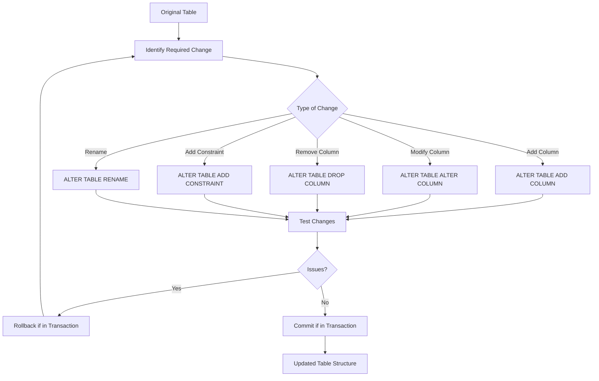

# PostgreSQL ALTER TABLE

## Introduction

The `ALTER TABLE` command is one of the most powerful features in PostgreSQL, allowing you to modify the structure of an existing table without losing your data. As your application evolves, you'll frequently need to make changes to your database schema - adding columns, changing data types, or adding constraints. This is where `ALTER TABLE` becomes invaluable.

In this tutorial, we'll explore how to use the `ALTER TABLE` command to modify existing PostgreSQL tables effectively.

## Basic Syntax

The basic syntax of the `ALTER TABLE` command is:

```sql
ALTER TABLE table_name action;
```

Where `action` can be one of many operations we'll cover in this tutorial.

## Common ALTER TABLE Operations

### Adding a Column

One of the most common table alterations is adding a new column:

```sql
ALTER TABLE table_name 
ADD COLUMN column_name data_type constraints;
```

**Example:**

```sql
-- Create a sample employees table
CREATE TABLE employees (
  employee_id SERIAL PRIMARY KEY,
  first_name VARCHAR(50) NOT NULL,
  last_name VARCHAR(50) NOT NULL
);

-- Add an email column
ALTER TABLE employees
ADD COLUMN email VARCHAR(100) UNIQUE;
```

After executing the above command, the employees table will now have an email column with a UNIQUE constraint.

### Removing a Column

You can remove a column using:

```sql
ALTER TABLE table_name
DROP COLUMN column_name;
```

**Example:**

```sql
ALTER TABLE employees
DROP COLUMN email;
```

If the column has dependencies (like constraints that reference it), you can add the `CASCADE` option to automatically drop those dependencies:

```sql
ALTER TABLE employees
DROP COLUMN email CASCADE;
```

### Renaming a Column

To rename a column:

```sql
ALTER TABLE table_name
RENAME COLUMN old_column_name TO new_column_name;
```

**Example:**

```sql
ALTER TABLE employees
RENAME COLUMN first_name TO given_name;
```

### Changing Column Data Type

You can change a column's data type:

```sql
ALTER TABLE table_name
ALTER COLUMN column_name TYPE new_data_type;
```

**Example:**

```sql
-- Change the length limit of the last_name column
ALTER TABLE employees
ALTER COLUMN last_name TYPE VARCHAR(100);
```

When changing data types, PostgreSQL attempts to convert existing data. If the conversion isn't possible, the command fails. You can add a USING clause to control the conversion:

```sql
ALTER TABLE employees
ALTER COLUMN employee_id TYPE BIGINT
USING employee_id::BIGINT;
```

### Adding Constraints

You can add constraints to existing columns:

```sql
ALTER TABLE table_name
ADD CONSTRAINT constraint_name constraint_definition;
```

**Example:**

```sql
-- Add a check constraint to ensure salary is positive
ALTER TABLE employees
ADD COLUMN salary NUMERIC(10,2);

ALTER TABLE employees
ADD CONSTRAINT positive_salary CHECK (salary > 0);
```

Common constraints include:
- `PRIMARY KEY`
- `FOREIGN KEY`
- `UNIQUE`
- `CHECK`
- `NOT NULL`

### Removing Constraints

To remove a constraint:

```sql
ALTER TABLE table_name
DROP CONSTRAINT constraint_name;
```

**Example:**

```sql
ALTER TABLE employees
DROP CONSTRAINT positive_salary;
```

### Setting Column Default Value

You can add or change a default value for a column:

```sql
ALTER TABLE table_name
ALTER COLUMN column_name SET DEFAULT expression;
```

**Example:**

```sql
ALTER TABLE employees
ALTER COLUMN salary SET DEFAULT 50000;
```

### Removing Column Default Value

To remove a default value:

```sql
ALTER TABLE table_name
ALTER COLUMN column_name DROP DEFAULT;
```

**Example:**

```sql
ALTER TABLE employees
ALTER COLUMN salary DROP DEFAULT;
```

### Setting NOT NULL Constraint

```sql
ALTER TABLE table_name
ALTER COLUMN column_name SET NOT NULL;
```

**Example:**

```sql
ALTER TABLE employees
ALTER COLUMN email SET NOT NULL;
```

### Removing NOT NULL Constraint

```sql
ALTER TABLE table_name
ALTER COLUMN column_name DROP NOT NULL;
```

**Example:**

```sql
ALTER TABLE employees
ALTER COLUMN email DROP NOT NULL;
```

### Renaming a Table

You can also rename an entire table:

```sql
ALTER TABLE table_name
RENAME TO new_table_name;
```

**Example:**

```sql
ALTER TABLE employees
RENAME TO staff;
```

## Real-world Scenario: Evolving a Product Database

Let's work through a real-world example where we manage an e-commerce product database that evolves over time:

```sql
-- Initial product table
CREATE TABLE products (
  product_id SERIAL PRIMARY KEY,
  name VARCHAR(100) NOT NULL,
  price NUMERIC(10,2) NOT NULL
);

-- Insert some initial data
INSERT INTO products (name, price) VALUES
  ('Basic T-shirt', 19.99),
  ('Premium Hoodie', 49.99);
```

Step 1: After some time, we need to track inventory quantities:

```sql
-- Add inventory tracking
ALTER TABLE products
ADD COLUMN stock_quantity INTEGER NOT NULL DEFAULT 0;

-- Update existing products with some stock
UPDATE products SET stock_quantity = 100 WHERE product_id = 1;
UPDATE products SET stock_quantity = 50 WHERE product_id = 2;
```

Step 2: We want to categorize our products:

```sql
-- First create a categories table
CREATE TABLE categories (
  category_id SERIAL PRIMARY KEY,
  name VARCHAR(50) NOT NULL UNIQUE
);

-- Insert some categories
INSERT INTO categories (name) VALUES
  ('Clothing'),
  ('Accessories'),
  ('Footwear');

-- Add category_id to products table
ALTER TABLE products
ADD COLUMN category_id INTEGER;

-- Add foreign key constraint
ALTER TABLE products
ADD CONSTRAINT fk_product_category
FOREIGN KEY (category_id) REFERENCES categories (category_id);

-- Assign categories to existing products
UPDATE products SET category_id = 1; -- Set all existing products to 'Clothing'
```

Step 3: We realize price needs to be adjusted for discounts:

```sql
-- Add discount information
ALTER TABLE products
ADD COLUMN discount_percent NUMERIC(5,2) DEFAULT 0,
ADD COLUMN discounted_price NUMERIC(10,2) GENERATED ALWAYS AS (price * (1 - discount_percent/100)) STORED;
```

Step 4: After deciding to track when products are created and updated:

```sql
-- Add timestamp columns
ALTER TABLE products
ADD COLUMN created_at TIMESTAMP DEFAULT CURRENT_TIMESTAMP,
ADD COLUMN updated_at TIMESTAMP DEFAULT CURRENT_TIMESTAMP;

-- Create a function to automatically update 'updated_at'
CREATE OR REPLACE FUNCTION update_timestamp()
RETURNS TRIGGER AS $$
BEGIN
   NEW.updated_at = CURRENT_TIMESTAMP;
   RETURN NEW;
END;
$$ LANGUAGE plpgsql;

-- Create a trigger to call this function
CREATE TRIGGER update_products_timestamp
BEFORE UPDATE ON products
FOR EACH ROW
EXECUTE FUNCTION update_timestamp();
```

Step 5: As the business grows, we need to rename fields for better clarity:

```sql
-- Rename columns for better clarity
ALTER TABLE products
RENAME COLUMN name TO product_name;

ALTER TABLE products
RENAME COLUMN price TO base_price;
```

This sequence demonstrates how a database schema can evolve over time, with `ALTER TABLE` commands helping adapt the structure to changing business requirements.

## Using ALTER TABLE with Transactions

When making significant changes to tables, especially in production environments, it's a good practice to use transactions:

```sql
BEGIN;

-- Make your table alterations
ALTER TABLE products ADD COLUMN description TEXT;
ALTER TABLE products ADD COLUMN weight NUMERIC(8,2);

-- If everything looks good, commit the changes
COMMIT;

-- If something goes wrong, you could roll back instead
-- ROLLBACK;
```

Transactions ensure that either all changes are applied or none are, maintaining database consistency.

## Performance Considerations

Here are some important considerations when using `ALTER TABLE`:

1. **Table Locking**: Some `ALTER TABLE` operations require exclusive locks on the table, preventing other operations from accessing it during the alteration.

2. **Rebuilding Large Tables**: Operations like changing a column's data type might require rebuilding the entire table, which can be time-consuming for large tables.

3. **Indexes**: When adding constraints like UNIQUE or PRIMARY KEY, PostgreSQL creates indexes which take additional time and space.

For large tables in production environments, consider:

- Performing alterations during low-traffic periods
- Using `CREATE TABLE` with the new structure, copying data, and then renaming tables as an alternative for some operations
- Breaking complex changes into smaller, manageable alterations

## Visualizing Table Alterations

Let's visualize some common table alteration workflows:



## Summary

The PostgreSQL `ALTER TABLE` command is a powerful tool for adapting your database schema to changing requirements. In this tutorial, we covered:

- Adding, removing, and modifying columns
- Adding and removing constraints
- Changing default values and nullability
- Renaming tables and columns
- Real-world scenarios for evolving database schemas
- Performance considerations for table alterations

By mastering `ALTER TABLE`, you can confidently modify your database structure while preserving your existing data, enabling your applications to grow and evolve over time.

## Practice Exercises

To reinforce your learning, try these exercises:

1. Create a `customers` table with basic fields like `customer_id`, `name`, and `email`.
2. Add a `phone_number` column with appropriate constraints.
3. Rename the `name` column to `full_name`.
4. Add a `last_purchase_date` column with a default value of NULL.
5. Add a check constraint to ensure phone numbers match a specific format.
6. Create an `orders` table and add a foreign key from `orders` to `customers`.

## Additional Resources

- [PostgreSQL Official Documentation on ALTER TABLE](https://www.postgresql.org/docs/current/sql-altertable.html)
- [PostgreSQL Data Types](https://www.postgresql.org/docs/current/datatype.html)
- [PostgreSQL Constraints](https://www.postgresql.org/docs/current/ddl-constraints.html)