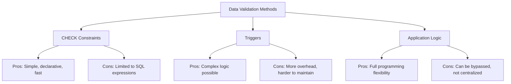

# PostgreSQL Check Constraints

## Introduction

Database integrity is crucial for maintaining reliable and accurate data. PostgreSQL offers several mechanisms to enforce data integrity, and one of the most flexible options is the **CHECK constraint**. 

A CHECK constraint allows you to specify a condition that must be satisfied for data to be inserted or updated in a table. It acts as a gatekeeper, ensuring that only valid data enters your database according to your business rules or data validation requirements.

In this tutorial, we'll explore how to create, use, and manage CHECK constraints in PostgreSQL to maintain the quality of your data.

## What are CHECK Constraints?

A CHECK constraint is a type of integrity constraint that specifies a requirement that values in a column must satisfy. The constraint contains a logical expression that evaluates to TRUE or FALSE for each row in the table. If the expression evaluates to FALSE for any row, the database will reject the operation (INSERT or UPDATE) that would create that row.

Unlike PRIMARY KEY or FOREIGN KEY constraints that enforce relationships between tables, CHECK constraints focus on validating the data itself based on custom conditions you define.

## Basic Syntax

Here's the basic syntax for adding a CHECK constraint to a table:

```sql
CREATE TABLE table_name (
    column1 data_type CONSTRAINT constraint_name CHECK (condition),
    column2 data_type,
    ...
);
```

Or adding it to an existing table:

```sql
ALTER TABLE table_name
ADD CONSTRAINT constraint_name CHECK (condition);
```

## Simple CHECK Constraint Examples

Let's start with some basic examples to understand how CHECK constraints work.

### Example 1: Ensuring Positive Values

```sql
CREATE TABLE products (
    product_id SERIAL PRIMARY KEY,
    product_name VARCHAR(100) NOT NULL,
    price NUMERIC(10,2) CHECK (price > 0),
    stock INTEGER CHECK (stock >= 0)
);
```

This creates a `products` table where:
- `price` must be greater than zero
- `stock` cannot be negative

Let's see what happens if we try to insert invalid data:

```sql
-- This will fail because price is negative
INSERT INTO products (product_name, price, stock)
VALUES ('Laptop', -499.99, 10);
```

Output:
```
ERROR:  new row for relation "products" violates check constraint "products_price_check"
DETAIL:  Failing row contains (1, Laptop, -499.99, 10).
```

```sql
-- This will succeed
INSERT INTO products (product_name, price, stock)
VALUES ('Laptop', 499.99, 10);
```

Output:
```
INSERT 0 1
```

### Example 2: Range Constraints

Let's create a table for student grades with a valid range:

```sql
CREATE TABLE student_grades (
    student_id INTEGER,
    course_id INTEGER,
    grade INTEGER,
    PRIMARY KEY (student_id, course_id),
    CONSTRAINT valid_grade CHECK (grade >= 0 AND grade <= 100)
);
```

Now any attempt to insert a grade outside the range 0-100 will be rejected:

```sql
-- This will fail
INSERT INTO student_grades VALUES (1, 101, 120);
```

Output:
```
ERROR:  new row for relation "student_grades" violates check constraint "valid_grade"
DETAIL:  Failing row contains (1, 101, 120).
```

## Advanced CHECK Constraint Examples

Let's explore more complex and practical examples of CHECK constraints.

### Example 3: Date Validation

Ensuring future dates for appointments:

```sql
CREATE TABLE appointments (
    appointment_id SERIAL PRIMARY KEY,
    patient_id INTEGER NOT NULL,
    doctor_id INTEGER NOT NULL,
    appointment_date DATE NOT NULL,
    CONSTRAINT future_date_only CHECK (appointment_date > CURRENT_DATE)
);
```

This ensures appointments can only be scheduled for future dates.

### Example 4: Pattern Matching with LIKE

Ensuring an email column follows a basic pattern:

```sql
CREATE TABLE users (
    user_id SERIAL PRIMARY KEY,
    username VARCHAR(50) UNIQUE NOT NULL,
    email VARCHAR(100) NOT NULL,
    CONSTRAINT valid_email CHECK (email LIKE '%@%.%')
);
```

This simple check ensures the email contains at least an '@' symbol and a period.

### Example 5: Multi-Column Constraints

CHECK constraints can involve multiple columns. Here's an example for a rental service:

```sql
CREATE TABLE rentals (
    rental_id SERIAL PRIMARY KEY,
    customer_id INTEGER NOT NULL,
    start_date DATE NOT NULL,
    end_date DATE NOT NULL,
    total_price NUMERIC(10,2) NOT NULL,
    CONSTRAINT valid_date_range CHECK (end_date >= start_date),
    CONSTRAINT minimum_rental CHECK (
        (end_date - start_date + 1) >= 3 OR total_price >= 100
    )
);
```

This ensures:
1. The end date is always after or equal to the start date
2. Either the rental is for at least 3 days, OR the total price is at least $100

## Real-World Applications

Let's look at practical scenarios where CHECK constraints are valuable:

### Example 6: E-commerce Inventory Management

```sql
CREATE TABLE inventory (
    product_id INTEGER PRIMARY KEY,
    product_name VARCHAR(100) NOT NULL,
    regular_price NUMERIC(10,2) NOT NULL,
    sale_price NUMERIC(10,2),
    stock_quantity INTEGER NOT NULL,
    
    -- Ensure prices are positive
    CONSTRAINT positive_regular_price CHECK (regular_price > 0),
    CONSTRAINT positive_sale_price CHECK (sale_price > 0),
    
    -- Ensure sale price is less than regular price when provided
    CONSTRAINT valid_sale_price CHECK (sale_price IS NULL OR sale_price < regular_price),
    
    -- Ensure stock is never negative
    CONSTRAINT non_negative_stock CHECK (stock_quantity >= 0)
);
```

This table enforces several business rules for an e-commerce inventory system:
- All prices must be positive
- If a sale price exists, it must be lower than the regular price
- Stock quantities cannot go below zero

### Example 7: Employee Salary Management

```sql
CREATE TABLE employees (
    employee_id SERIAL PRIMARY KEY,
    first_name VARCHAR(50) NOT NULL,
    last_name VARCHAR(50) NOT NULL,
    hire_date DATE NOT NULL,
    job_title VARCHAR(100) NOT NULL,
    salary NUMERIC(10,2) NOT NULL,
    department VARCHAR(50) NOT NULL,
    
    -- Validate salary ranges for different job titles
    CONSTRAINT valid_salary CHECK (
        (job_title = 'Intern' AND salary BETWEEN 1500 AND 3000) OR
        (job_title = 'Associate' AND salary BETWEEN 3000 AND 5000) OR
        (job_title = 'Senior' AND salary BETWEEN 5000 AND 8000) OR
        (job_title = 'Manager' AND salary BETWEEN 7000 AND 12000) OR
        (job_title = 'Director' AND salary BETWEEN 10000 AND 20000)
    ),
    
    -- Ensure hire date is not in the future
    CONSTRAINT valid_hire_date CHECK (hire_date <= CURRENT_DATE)
);
```

This demonstrates how to enforce salary ranges based on job titles as well as a sensible constraint on hire dates.

## Managing CHECK Constraints

Once you've created CHECK constraints, you may need to view, modify, or remove them.

### Viewing Existing Constraints

You can list all constraints in a table using:

```sql
SELECT conname, contype, consrc
FROM pg_constraint
WHERE conrelid = 'table_name'::regclass;
```

For CHECK constraints specifically:

```sql
SELECT conname, consrc
FROM pg_constraint
WHERE conrelid = 'table_name'::regclass AND contype = 'c';
```

### Dropping a Constraint

To remove a CHECK constraint:

```sql
ALTER TABLE table_name
DROP CONSTRAINT constraint_name;
```

Example:

```sql
ALTER TABLE products
DROP CONSTRAINT products_price_check;
```

### Adding a Constraint with NOT VALID

When adding a constraint to a table that already contains data, you might want to add it without validating existing data:

```sql
ALTER TABLE products
ADD CONSTRAINT positive_price CHECK (price > 0) NOT VALID;
```

This adds the constraint for future inserts and updates without checking existing rows. Later, you can validate the existing data with:

```sql
ALTER TABLE products
VALIDATE CONSTRAINT positive_price;
```

## Best Practices

1. **Name your constraints**: While PostgreSQL will generate names automatically, custom names make management and debugging easier.

2. **Keep constraints simple**: Complex conditions can impact performance. Consider using triggers for very complex validations.

3. **Document your constraints**: Add comments to explain non-obvious business rules:

```sql
COMMENT ON CONSTRAINT valid_salary ON employees IS 'Enforces salary ranges based on job title hierarchy';
```

4. **Test constraints thoroughly**: Verify both the acceptance of valid data and rejection of invalid data.

5. **Consider error messages**: The default error messages might not be user-friendly. Application-level validation can provide better messages.

## Performance Considerations

CHECK constraints are generally efficient because:

1. They're evaluated only during INSERT and UPDATE operations
2. PostgreSQL can use them for query optimization
3. They provide validation at the database level, which is usually faster than application-level checks

However, very complex CHECK constraints can slow down inserts and updates, especially on high-volume tables.

## Comparing CHECK Constraints with Other Options

Let's compare CHECK constraints with other data validation methods:



## Summary

CHECK constraints are a powerful feature in PostgreSQL for enforcing data integrity rules at the database level. They provide:

- A declarative way to define validation rules
- Protection against invalid data regardless of how it's inserted or updated
- Performance benefits compared to application-level validation

By using CHECK constraints appropriately, you can ensure your data meets your business requirements and maintain consistency across your database.

## Practice Exercises

1. Create a `bank_accounts` table with constraints to ensure balance is never negative.

2. Design a `products` table where discounted prices must be at least 10% lower than regular prices but not below cost price.

3. Create a table for tracking project milestones with constraints ensuring milestone dates are in chronological order.

4. Add CHECK constraints to ensure that shipping addresses in an `orders` table have non-empty required fields (street, city, postal_code).

5. Implement a table structure for a vehicle rental company that enforces business rules about minimum rental duration, pricing, and driver age requirements.

## Additional Resources

- [PostgreSQL Official Documentation on CHECK Constraints](https://www.postgresql.org/docs/current/ddl-constraints.html#DDL-CONSTRAINTS-CHECK-CONSTRAINTS)
- [PostgreSQL Expression Evaluation](https://www.postgresql.org/docs/current/functions.html)
- [SQL Data Integrity](https://www.postgresql.org/docs/current/ddl-constraints.html)