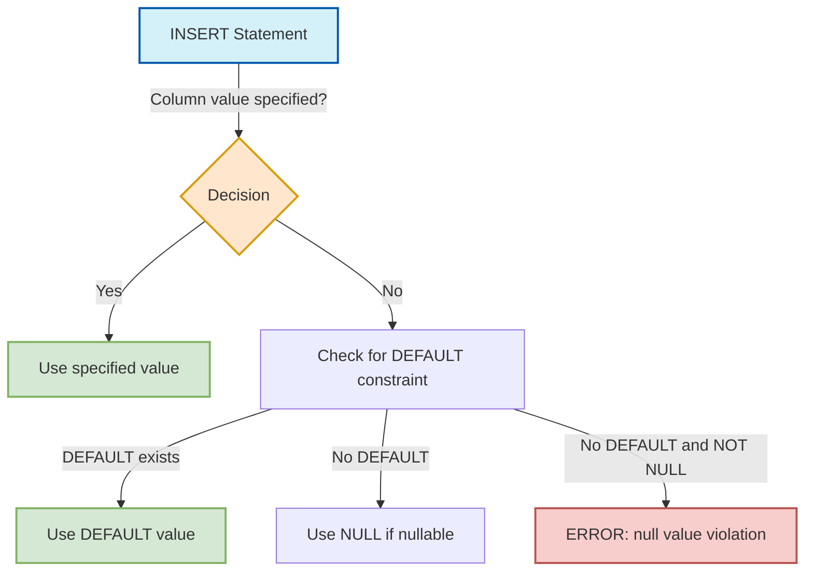

# PostgreSQL Default Values

When designing database tables, you'll often want certain columns to have automatic values if none are explicitly provided. PostgreSQL offers powerful default value capabilities that help maintain data consistency and reduce the amount of code you need to write.

## Introduction

Default values in PostgreSQL are predefined values that get inserted into a column when you don't specify a value for that column in an `INSERT` statement. They serve several important purposes:

- Ensuring data integrity by preventing `NULL` values
- Simplifying data entry by automatically providing common values
- Recording metadata like creation timestamps
- Generating sequential IDs or unique identifiers

Let's explore how to define and use default values in PostgreSQL.

## Basic Default Value Syntax

When creating a table, you can specify default values using the `DEFAULT` keyword:

```sql
CREATE TABLE products (
  product_id SERIAL PRIMARY KEY,
  name VARCHAR(100) NOT NULL,
  price DECIMAL(10, 2) NOT NULL,
  in_stock BOOLEAN DEFAULT TRUE,
  created_at TIMESTAMP DEFAULT CURRENT_TIMESTAMP
);
```

In this example:
- `in_stock` defaults to `TRUE` if no value is provided
- `created_at` defaults to the current timestamp when the record is inserted

## Common Types of Default Values

PostgreSQL supports various types of default values:

### 1. Literal Values

You can use simple literals like numbers, strings, or booleans:

```sql
CREATE TABLE employees (
  employee_id SERIAL PRIMARY KEY,
  name VARCHAR(100) NOT NULL,
  active BOOLEAN DEFAULT TRUE,
  department VARCHAR(50) DEFAULT 'General',
  salary NUMERIC(10, 2) DEFAULT 0.00
);
```

### 2. Functions and Expressions

PostgreSQL allows functions as default values:

```sql
CREATE TABLE logs (
  log_id SERIAL PRIMARY KEY,
  message TEXT NOT NULL,
  created_at TIMESTAMP DEFAULT CURRENT_TIMESTAMP,
  created_by VARCHAR(50) DEFAULT CURRENT_USER,
  session_id UUID DEFAULT gen_random_uuid()
);
```

Common function-based defaults include:
- `CURRENT_TIMESTAMP` - Current date and time
- `CURRENT_DATE` - Current date
- `CURRENT_USER` - Username of current database user
- `gen_random_uuid()` - Generates a random UUID

### 3. Sequences

The `SERIAL` type is actually a shorthand for an integer with a default value from a sequence:

```sql
CREATE TABLE orders (
  order_id SERIAL PRIMARY KEY,
  customer_id INTEGER NOT NULL,
  order_date DATE DEFAULT CURRENT_DATE
);
```

The `SERIAL` type is equivalent to:

```sql
CREATE SEQUENCE orders_order_id_seq;
CREATE TABLE orders (
  order_id INTEGER DEFAULT nextval('orders_order_id_seq') PRIMARY KEY,
  customer_id INTEGER NOT NULL,
  order_date DATE DEFAULT CURRENT_DATE
);
ALTER SEQUENCE orders_order_id_seq OWNED BY orders.order_id;
```

## Practical Examples

Let's look at some real-world applications of default values.

### Example 1: User Registration System

```sql
CREATE TABLE users (
  user_id SERIAL PRIMARY KEY,
  username VARCHAR(50) UNIQUE NOT NULL,
  email VARCHAR(100) UNIQUE NOT NULL,
  password_hash VARCHAR(255) NOT NULL,
  account_status VARCHAR(20) DEFAULT 'active',
  verification_status BOOLEAN DEFAULT FALSE,
  registration_date TIMESTAMP DEFAULT CURRENT_TIMESTAMP,
  last_login TIMESTAMP DEFAULT NULL
);
```

This design:
- Auto-assigns a unique ID to each user
- Sets new accounts to 'active' status by default
- Marks new accounts as unverified (verification_status = FALSE)
- Automatically records when the account was created
- Keeps last_login as NULL until the user logs in

### Example 2: Blog Post System

```sql
CREATE TABLE blog_posts (
  post_id SERIAL PRIMARY KEY,
  title VARCHAR(200) NOT NULL,
  content TEXT NOT NULL,
  author_id INTEGER NOT NULL,
  view_count INTEGER DEFAULT 0,
  is_published BOOLEAN DEFAULT FALSE,
  created_at TIMESTAMP DEFAULT CURRENT_TIMESTAMP,
  updated_at TIMESTAMP DEFAULT CURRENT_TIMESTAMP,
  published_at TIMESTAMP DEFAULT NULL
);
```

This design:
- Starts view count at zero
- Marks new posts as unpublished drafts
- Records creation time automatically
- Sets updated_at to creation time initially
- Leaves published_at as NULL until explicitly published

### Example 3: E-commerce Inventory

```sql
CREATE TABLE inventory (
  item_id SERIAL PRIMARY KEY,
  product_id INTEGER NOT NULL,
  warehouse_id INTEGER NOT NULL,
  quantity INTEGER DEFAULT 0,
  reorder_level INTEGER DEFAULT 10,
  last_restocked TIMESTAMP DEFAULT CURRENT_TIMESTAMP,
  is_active BOOLEAN DEFAULT TRUE
);
```

## Using Default Values in INSERT Statements

When inserting data, you can rely on default values by either:

1. Omitting the column from the column list:

```sql
INSERT INTO users (username, email, password_hash)
VALUES ('johndoe', 'john@example.com', 'hashed_password_here');
```

2. Explicitly using the `DEFAULT` keyword:

```sql
INSERT INTO users (
  username,
  email,
  password_hash,
  account_status,
  verification_status,
  registration_date
)
VALUES (
  'janedoe',
  'jane@example.com',
  'hashed_password_here',
  DEFAULT,
  DEFAULT,
  DEFAULT
);
```

Both approaches will use the default values for the unspecified or `DEFAULT` columns.

## Advanced Default Value Features

### Using SQL Expressions

You can use more complex expressions for default values:

```sql
CREATE TABLE products (
  product_id SERIAL PRIMARY KEY,
  name VARCHAR(100) NOT NULL,
  price DECIMAL(10, 2) NOT NULL,
  discount_price DECIMAL(10, 2) GENERATED ALWAYS AS (price * 0.9) STORED,
  added_on DATE DEFAULT CURRENT_DATE
);
```

### Setting Defaults for Entire Columns During ALTER TABLE

You can add or modify default values for existing columns:

```sql
-- Add a default value to an existing column
ALTER TABLE products
ALTER COLUMN in_stock SET DEFAULT TRUE;

-- Remove a default value
ALTER TABLE products
ALTER COLUMN in_stock DROP DEFAULT;
```

### Complex Default Values with Functions

You can create custom functions for more complex default logic:

```sql
CREATE OR REPLACE FUNCTION set_expiration_date()
RETURNS DATE AS $$
BEGIN
  RETURN CURRENT_DATE + INTERVAL '30 days';
END;
$$ LANGUAGE plpgsql;

CREATE TABLE subscriptions (
  subscription_id SERIAL PRIMARY KEY,
  user_id INTEGER NOT NULL,
  start_date DATE DEFAULT CURRENT_DATE,
  expiration_date DATE DEFAULT set_expiration_date()
);
```

## Best Practices

When working with default values:

1. **Use defaults for consistency** - Apply defaults for columns that should have standard initial values.

2. **Choose sensible defaults** - The default value should be logical and safe for the business context.

3. **Consider NULL vs. empty values** - Sometimes NULL is more appropriate than an empty string or zero.

4. **Document your defaults** - Comment your table definitions to explain default value logic.

5. **Be careful with function defaults** - Functions like `CURRENT_TIMESTAMP` are evaluated at insertion time, not table creation time.

6. **Test default behavior** - Verify that your default values behave as expected in all scenarios.

## Diagram of Default Value Flow



## Summary

Default values in PostgreSQL are a powerful feature that helps maintain data integrity and simplify database operations. They allow you to:

- Automatically populate columns with meaningful values
- Ensure columns are never unintentionally NULL
- Record metadata like timestamps automatically
- Generate unique identifiers and sequential numbers
- Implement complex business logic through function defaults

By effectively using default values, you can create more robust database designs and reduce the amount of application code needed to maintain consistent data.

## Exercises

1. Create a `tasks` table with appropriate default values for a task management system, including status, priority, and creation timestamps.

2. Modify an existing table to add a `last_updated` timestamp column with a default value of the current time.

3. Create a custom function that generates a random coupon code, and use it as a default value in a `coupons` table.

4. Design a `comments` table for a blog with appropriate default values for status, timestamps, and upvote counts.

## Further Reading

- [PostgreSQL Documentation on DEFAULT Clause](https://www.postgresql.org/docs/current/ddl-default.html)
- [PostgreSQL Date/Time Functions](https://www.postgresql.org/docs/current/functions-datetime.html)
- [PostgreSQL UUID Functions](https://www.postgresql.org/docs/current/uuid-ossp.html)
- [PostgreSQL Generated Columns](https://www.postgresql.org/docs/current/ddl-generated-columns.html)