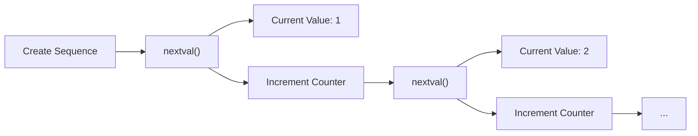

# PostgreSQL Sequences

## Introduction

Sequences in PostgreSQL are special database objects designed to generate unique numeric values automatically. They're most commonly used to create auto-incrementing primary key values, but they can be utilized in many other scenarios where you need unique, sequential numbers.

Think of a sequence as a counter that keeps track of the last number it issued and automatically increments to provide the next value when requested. This is especially useful when multiple users might be inserting data simultaneously, as sequences guarantee uniqueness without requiring complex application logic.

## Understanding Sequences

### What is a Sequence?

A sequence is a database object that generates a series of numbers according to specified rules. Each time you request a value from a sequence, the sequence provides the current value and then increments its internal counter to prepare for the next request.



### Key Characteristics of Sequences

- **Independent Objects**: Sequences exist independently of any table
- **Thread-Safe**: Guaranteed to provide unique values even with concurrent access
- **Configurable**: Can be customized with various parameters (start value, increment, min/max values, etc.)
- **Non-Transactional**: Sequence operations are not rolled back in failed transactions (by default)

## Creating Sequences

### Basic Syntax

The basic syntax for creating a sequence in PostgreSQL is:

```sql
CREATE SEQUENCE sequence_name
    [INCREMENT BY increment]
    [MINVALUE min_value | NO MINVALUE]
    [MAXVALUE max_value | NO MAXVALUE]
    [START WITH start_value]
    [CACHE cache_size]
    [CYCLE | NO CYCLE];
```

Let's break down each parameter:

- **INCREMENT BY**: Specifies how much to increase the value each time (default: 1)
- **MINVALUE/NO MINVALUE**: Sets the minimum value or allows unlimited minimum
- **MAXVALUE/NO MAXVALUE**: Sets the maximum value or allows unlimited maximum
- **START WITH**: Sets the initial value (default: 1 for ascending, -1 for descending)
- **CACHE**: How many sequence numbers to pre-allocate for faster access (default: 1)
- **CYCLE/NO CYCLE**: Determines whether to cycle when limits are reached (default: NO CYCLE)

### Simple Sequence Example

Let's create a basic sequence that starts at 1 and increments by 1:

```sql
CREATE SEQUENCE my_first_sequence;
```

This creates a sequence with all default values, which means it:
- Starts at 1
- Increments by 1
- Has no minimum or maximum value (within integer limits)
- Doesn't cycle when reaching limits

### Custom Sequence Example

Here's a more customized sequence:

```sql
CREATE SEQUENCE product_id_seq
    INCREMENT BY 10
    MINVALUE 1000
    MAXVALUE 9999999
    START WITH 1000
    CACHE 20
    CYCLE;
```

This sequence:
- Starts at 1000
- Increments by 10 each time (1000, 1010, 1020, etc.)
- Has a minimum value of 1000
- Has a maximum value of 9999999
- Pre-allocates 20 values at a time for better performance
- Cycles back to the minimum value when reaching the maximum

## Working with Sequences

### Generating Values

To get the next value from a sequence, use the `nextval()` function:

```sql
SELECT nextval('my_first_sequence');
```

**Output:**
```
 nextval
---------
       1
```

Call it again to get the next value:

```sql
SELECT nextval('my_first_sequence');
```

**Output:**
```
 nextval
---------
       2
```

### Checking Current and Last Values

To see the current value without incrementing it, use `currval()`:

```sql
SELECT currval('my_first_sequence');
```

**Output:**
```
 currval
---------
       2
```

Note: You must call `nextval()` at least once in the current session before you can use `currval()`.

To see what the next value will be without actually incrementing it, use `lastval()`:

```sql
SELECT lastval();
```

**Output:**
```
 lastval
---------
       2
```

### Resetting a Sequence

You can alter a sequence to reset its current value:

```sql
ALTER SEQUENCE my_first_sequence RESTART WITH 100;

SELECT nextval('my_first_sequence');
```

**Output:**
```
 nextval
---------
     100
```

## Using Sequences with Tables

### Manual Association

You can manually associate a sequence with a table column:

```sql
CREATE TABLE products (
    product_id INTEGER DEFAULT nextval('product_id_seq'),
    name VARCHAR(100) NOT NULL,
    price NUMERIC(10, 2) NOT NULL
);

-- Insert without specifying product_id
INSERT INTO products (name, price) VALUES ('Laptop', 999.99);
INSERT INTO products (name, price) VALUES ('Smartphone', 499.99);

-- Check the inserted values
SELECT * FROM products;
```

**Output:**
```
 product_id |    name    | price  
------------+------------+--------
       1000 | Laptop     | 999.99
       1010 | Smartphone | 499.99
```

### The SERIAL Shorthand

PostgreSQL provides a shorthand notation called `SERIAL` which automatically creates a sequence:

```sql
CREATE TABLE employees (
    employee_id SERIAL PRIMARY KEY,
    first_name VARCHAR(50) NOT NULL,
    last_name VARCHAR(50) NOT NULL,
    hire_date DATE NOT NULL
);

-- Insert without specifying employee_id
INSERT INTO employees (first_name, last_name, hire_date) 
VALUES ('John', 'Doe', '2023-01-15');

INSERT INTO employees (first_name, last_name, hire_date) 
VALUES ('Jane', 'Smith', '2023-02-20');

-- Check the inserted values
SELECT * FROM employees;
```

**Output:**
```
 employee_id | first_name | last_name | hire_date  
-------------+------------+-----------+------------
           1 | John       | Doe       | 2023-01-15
           2 | Jane       | Smith     | 2023-02-20
```

When you use `SERIAL`, PostgreSQL automatically:
1. Creates a sequence named `tablename_columnname_seq`
2. Sets the default value of the column to `nextval('tablename_columnname_seq')`
3. Sets a `NOT NULL` constraint on the column

There are several variants of `SERIAL`:
- `SMALLSERIAL`: Uses `smallint` (2-byte integer, range: 1 to 32,767)
- `SERIAL`: Uses `integer` (4-byte integer, range: 1 to 2,147,483,647)
- `BIGSERIAL`: Uses `bigint` (8-byte integer, range: 1 to 9,223,372,036,854,775,807)

## Real-World Applications

### Ticket Numbering System

Let's build a simple ticket numbering system for a help desk:

```sql
-- Create a sequence with a specific format (year + 6 digits)
CREATE SEQUENCE ticket_seq
    START WITH 1
    INCREMENT BY 1
    MINVALUE 1
    NO MAXVALUE
    CACHE 1;

-- Create a tickets table
CREATE TABLE support_tickets (
    ticket_id VARCHAR(15) PRIMARY KEY,
    issue_title VARCHAR(200) NOT NULL,
    description TEXT,
    created_at TIMESTAMP DEFAULT CURRENT_TIMESTAMP,
    status VARCHAR(20) DEFAULT 'Open'
);

-- Function to generate ticket IDs with year prefix
CREATE OR REPLACE FUNCTION generate_ticket_id() RETURNS VARCHAR AS
$$
DECLARE
    next_val INT;
    year_prefix VARCHAR(4);
BEGIN
    next_val := nextval('ticket_seq');
    year_prefix := to_char(CURRENT_DATE, 'YYYY');
    RETURN year_prefix || '-' || LPAD(next_val::TEXT, 6, '0');
END;
$$ LANGUAGE plpgsql;

-- Insert some tickets
INSERT INTO support_tickets (ticket_id, issue_title, description)
VALUES (generate_ticket_id(), 'Login Issue', 'Cannot login to the application');

INSERT INTO support_tickets (ticket_id, issue_title, description)
VALUES (generate_ticket_id(), 'Payment Failed', 'Payment gateway error during checkout');

-- View tickets
SELECT * FROM support_tickets;
```

**Output (Assuming current year is 2023):**
```
   ticket_id   |   issue_title   |          description           |         created_at         |  status  
---------------+-----------------+--------------------------------+----------------------------+----------
 2023-000001   | Login Issue     | Cannot login to the application| 2023-05-15 09:23:11.124813 | Open
 2023-000002   | Payment Failed  | Payment gateway error during...| 2023-05-15 09:23:11.135927 | Open
```

### Order Numbers with Prefix

For an e-commerce application:

```sql
-- Create a sequence for order numbers
CREATE SEQUENCE order_seq
    START WITH 10001
    INCREMENT BY 1;

-- Create orders table
CREATE TABLE customer_orders (
    order_id VARCHAR(20) PRIMARY KEY,
    customer_id INTEGER NOT NULL,
    order_total NUMERIC(10, 2) NOT NULL,
    order_date TIMESTAMP DEFAULT CURRENT_TIMESTAMP
);

-- Insert orders with prefixed order numbers
INSERT INTO customer_orders (order_id, customer_id, order_total)
VALUES ('ORD-' || nextval('order_seq')::TEXT, 101, 245.50);

INSERT INTO customer_orders (order_id, customer_id, order_total)
VALUES ('ORD-' || nextval('order_seq')::TEXT, 102, 125.75);

-- View orders
SELECT * FROM customer_orders;
```

**Output:**
```
   order_id   | customer_id | order_total |         order_date         
--------------+-------------+-------------+----------------------------
 ORD-10001    |         101 |      245.50 | 2023-05-15 09:30:22.457123
 ORD-10002    |         102 |      125.75 | 2023-05-15 09:30:22.463579
```

## Managing Sequences

### Finding Existing Sequences

You can view all sequences in your database:

```sql
SELECT * FROM pg_sequences;
```

Or query the information schema:

```sql
SELECT sequence_schema, sequence_name, start_value, increment, max_value
FROM information_schema.sequences;
```

### Viewing Sequence Details

To see details about a specific sequence:

```sql
SELECT * FROM pg_sequences WHERE sequencename = 'my_first_sequence';
```

### Dropping a Sequence

To remove a sequence:

```sql
DROP SEQUENCE my_first_sequence;
```

Be careful when dropping sequences associated with tables, as this can break the table's functionality.

### Sequence Ownership

Sequences used by `SERIAL` columns are owned by the table column, meaning they are automatically dropped when the column or table is dropped:

```sql
-- Check sequence ownership
SELECT a.attname AS column_name, s.relname AS sequence_name
FROM pg_class s
JOIN pg_depend d ON d.objid = s.oid
JOIN pg_class t ON d.refobjid = t.oid
JOIN pg_attribute a ON (d.refobjid, d.refobjsubid) = (a.attrelid, a.attnum)
WHERE s.relkind = 'S' AND t.relname = 'employees';
```

## Advanced Sequence Usage

### Sequence in a Join

You can use a sequence in a join to generate row numbers:

```sql
SELECT nextval('my_first_sequence') AS row_num, e.first_name, e.last_name
FROM employees e
ORDER BY e.hire_date;
```

### Batch Allocation

For bulk inserts, you can pre-allocate sequence values:

```sql
-- Get 10 sequence values at once
SELECT nextval('my_first_sequence') FROM generate_series(1, 10);
```

## Performance Considerations

### Caching Sequence Values

Sequence caching can significantly improve performance:

```sql
-- Increase cache size for better performance
ALTER SEQUENCE product_id_seq CACHE 100;
```

This pre-allocates 100 sequence values in memory, reducing disk I/O.

### Sequence Gaps

Sequence gaps can occur due to:
- Rolled back transactions
- System crashes
- Cache settings

If your application relies on consecutive numbers without gaps, you may need additional application logic to handle this, as sequences primarily guarantee uniqueness, not gapless sequences.

## Common Pitfalls and Solutions

### Multiple Sequence Calls

Be careful not to call `nextval()` multiple times unintentionally:

```sql
-- Wrong way (calls nextval twice)
INSERT INTO products (product_id, name, price) 
VALUES (nextval('product_id_seq'), 'Headphones', nextval('product_id_seq'));

-- Correct way
INSERT INTO products (product_id, name, price) 
VALUES (nextval('product_id_seq'), 'Headphones', 199.99);
```

### Sequence Exhaustion

Sequences can eventually run out of values:

```sql
-- Create a small sequence
CREATE SEQUENCE tiny_seq
    MINVALUE 1
    MAXVALUE 5
    CYCLE;

-- Use it until exhaustion
SELECT nextval('tiny_seq') FROM generate_series(1, 7);
```

**Output:**
```
 nextval
---------
       1
       2
       3
       4
       5
       1
       2
```

Note how it cycles back to 1 after reaching the maximum value because of the `CYCLE` option.

## Summary

PostgreSQL sequences provide a powerful way to generate unique numeric values automatically. Key points to remember:

- Sequences are independent database objects that generate unique values
- They're thread-safe and optimal for concurrent environments
- The `SERIAL` types offer a convenient shorthand for common use cases
- Sequences can be customized with parameters like start value, increment, and limits
- They're commonly used for primary keys, order numbers, and any scenario requiring unique identifiers
- Understand that sequences may have gaps and are not necessarily consecutive

## Exercises

1. Create a sequence that starts at 100, increments by 5, and doesn't exceed 1000.
2. Create a table with a custom sequence as the default value for its primary key.
3. Write a query to get the next 5 values from a sequence without actually using them in a table.
4. Create a function that generates an alphanumeric ID using a sequence and random characters.
5. Modify an existing sequence to change its increment value and restart it from a specific number.

## Additional Resources

- [PostgreSQL Official Documentation on Sequences](https://www.postgresql.org/docs/current/sql-createsequence.html)
- [PostgreSQL Data Types](https://www.postgresql.org/docs/current/datatype.html)
- [Understanding Serial and Identity Columns](https://www.postgresql.org/docs/current/datatype-numeric.html#DATATYPE-SERIAL)