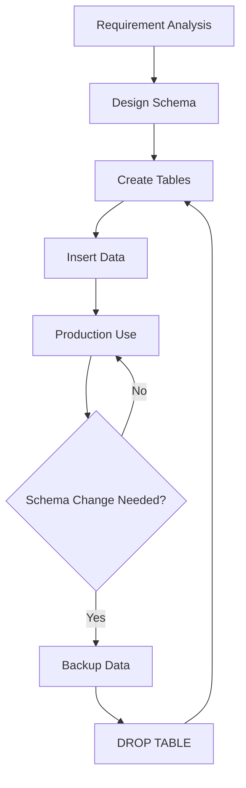

# PostgreSQL DROP TABLE

When working with databases, you'll sometimes need to remove tables that are no longer needed. PostgreSQL provides the `DROP TABLE` command for this purpose, allowing you to delete tables and optionally their associated data from your database.

## Introduction

The `DROP TABLE` statement is a Data Definition Language (DDL) command used to remove a table from a PostgreSQL database. This operation deletes both the table structure and all the data it contains, so it should be used with caution.

## Basic Syntax

The basic syntax for dropping a table in PostgreSQL is:

```sql
DROP TABLE [IF EXISTS] table_name [CASCADE | RESTRICT];
```

Let's break down each component:

- `DROP TABLE`: The command to delete a table
- `IF EXISTS`: Optional clause that prevents an error if the table doesn't exist
- `table_name`: The name of the table you want to drop
- `CASCADE`: Optional parameter that automatically drops objects that depend on the table
- `RESTRICT`: Optional parameter (the default) that refuses to drop the table if any objects depend on it

## Simple Examples

### Dropping a Single Table

```sql
DROP TABLE employees;
```

**Result:**
```
DROP TABLE
```

If the table doesn't exist, PostgreSQL will return an error:

```sql
DROP TABLE nonexistent_table;
```

**Result:**
```
ERROR:  table "nonexistent_table" does not exist
```

### Using IF EXISTS Clause

To prevent errors when dropping tables that might not exist:

```sql
DROP TABLE IF EXISTS employees;
```

**Result:**
```
DROP TABLE
```

If the table doesn't exist, PostgreSQL will issue a notice instead of an error:

```sql
DROP TABLE IF EXISTS nonexistent_table;
```

**Result:**
```
NOTICE:  table "nonexistent_table" does not exist, skipping
DROP TABLE
```

## Dependency Handling

Tables can have dependencies like foreign keys, views, or triggers. PostgreSQL provides two options for handling dependencies:

### RESTRICT Option (Default)

`RESTRICT` prevents the table from being dropped if it has dependencies:

```sql
DROP TABLE departments RESTRICT;
```

If the `employees` table has a foreign key referencing `departments`, you'll get:

**Result:**
```
ERROR:  cannot drop table departments because other objects depend on it
DETAIL:  constraint employees_dept_id_fkey on table employees depends on table departments
HINT:  Use DROP ... CASCADE to drop the dependent objects too.
```

### CASCADE Option

`CASCADE` automatically drops all objects that depend on the table:

```sql
DROP TABLE departments CASCADE;
```

**Result:**
```
NOTICE:  drop cascades to constraint employees_dept_id_fkey on table employees
DROP TABLE
```

Be careful with `CASCADE` as it can have far-reaching effects in your database!

## Real-World Examples

### Dropping Multiple Tables

You can drop multiple tables in a single command:

```sql
DROP TABLE IF EXISTS employees, departments, locations;
```

### Table Cleanup During Development

During development, you might want to recreate tables with updated schemas:

```sql
-- Drop tables if they exist
DROP TABLE IF EXISTS order_items;
DROP TABLE IF EXISTS orders;
DROP TABLE IF EXISTS customers;

-- Create new tables
CREATE TABLE customers (
    customer_id SERIAL PRIMARY KEY,
    name VARCHAR(100) NOT NULL,
    email VARCHAR(100) UNIQUE
);

CREATE TABLE orders (
    order_id SERIAL PRIMARY KEY,
    customer_id INTEGER REFERENCES customers(customer_id),
    order_date TIMESTAMP DEFAULT CURRENT_TIMESTAMP
);

CREATE TABLE order_items (
    item_id SERIAL PRIMARY KEY,
    order_id INTEGER REFERENCES orders(order_id),
    product_name VARCHAR(100),
    quantity INTEGER,
    price DECIMAL(10, 2)
);
```

### Temporary Table Cleanup

Temporary tables are automatically dropped at the end of a session, but you can explicitly drop them:

```sql
-- Create a temporary table
CREATE TEMP TABLE temp_analysis AS
SELECT customer_id, COUNT(*) as order_count
FROM orders
GROUP BY customer_id;

-- Query the temporary table
SELECT * FROM temp_analysis WHERE order_count > 10;

-- Drop when done
DROP TABLE temp_analysis;
```

## Database Design Workflow

The following diagram illustrates where `DROP TABLE` fits in a typical database design workflow:



## Best Practices

1. **Always back up your database** before dropping tables in a production environment.

2. **Use `IF EXISTS` clause** to make your scripts more robust.

3. **Be cautious with `CASCADE`** option, as it can drop more objects than you might expect.

4. **Consider using transactions** for multiple operations:

   ```sql
   BEGIN;
     -- Operations that might fail
     DROP TABLE IF EXISTS old_employees;
     CREATE TABLE new_employees (id SERIAL PRIMARY KEY, name TEXT);
     INSERT INTO new_employees (name) SELECT name FROM temp_employees;
   COMMIT; -- Or ROLLBACK if there's an error
   ```

5. **Check dependencies** before dropping tables:

   ```sql
   SELECT
     dependent_ns.nspname as dependent_schema,
     dependent_view.relname as dependent_view
   FROM pg_depend
   JOIN pg_rewrite ON pg_depend.objid = pg_rewrite.oid
   JOIN pg_class as dependent_view ON pg_rewrite.ev_class = dependent_view.oid
   JOIN pg_class as source_table ON pg_depend.refobjid = source_table.oid
   JOIN pg_namespace dependent_ns ON dependent_ns.oid = dependent_view.relnamespace
   JOIN pg_namespace source_ns ON source_ns.oid = source_table.relnamespace
   WHERE source_table.relname = 'table_name'
   AND source_ns.nspname = 'schema_name'
   AND dependent_view.relkind = 'v';
   ```

## Common Errors and Solutions

### Error: Table Is Being Used

```
ERROR:  cannot drop table table_name because it is being accessed by other users
DETAIL:  There is 1 other session using the table.
```

**Solution:** Identify and close sessions using the table, or connect with administrative privileges.

### Error: Permission Denied

```
ERROR:  permission denied for table table_name
```

**Solution:** Ensure you have the necessary permissions. Only the table owner, schema owner, or users with appropriate privileges can drop tables.

## Summary

The `DROP TABLE` command in PostgreSQL is a powerful tool for removing tables from your database. When used properly with options like `IF EXISTS` and careful consideration of `CASCADE` vs. `RESTRICT`, it becomes an essential part of database management.

Remember that dropping a table permanently deletes all its data, so always ensure you have proper backups before performing this operation in production environments.

## Practice Exercises

1. Create a temporary table named `practice_table` with a few columns and then drop it.

2. Try to drop a table with dependencies using `RESTRICT` and observe the error.

3. Create two related tables, then drop the parent table using `CASCADE`. Observe what happens to the child table.

4. Write a script that checks if a table exists before attempting to drop it without using `IF EXISTS`.

## Additional Resources

- [PostgreSQL Official Documentation on DROP TABLE](https://www.postgresql.org/docs/current/sql-droptable.html)
- [PostgreSQL Transaction Management](https://www.postgresql.org/docs/current/tutorial-transactions.html)
- [PostgreSQL System Catalogs](https://www.postgresql.org/docs/current/catalogs.html) for checking table dependencies