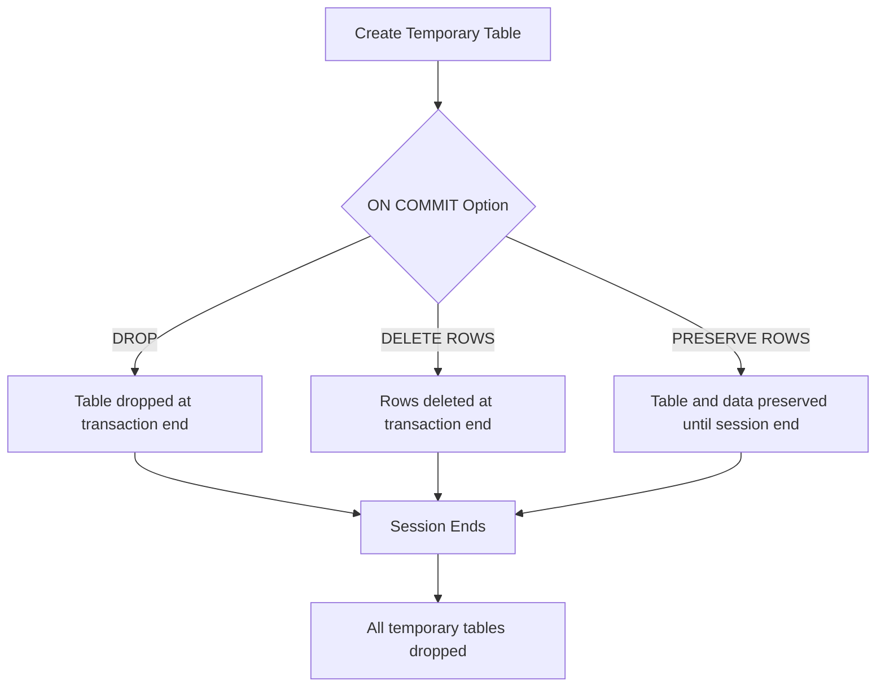

# PostgreSQL Temporary Tables

## Introduction

Temporary tables in PostgreSQL are special tables that exist only for the duration of a database session or transaction. They provide a way to store intermediate results and perform complex operations on data without affecting the permanent database structure. Temporary tables are automatically dropped (deleted) at the end of a session or transaction, making them ideal for operations that require temporary storage of data.

## Why Use Temporary Tables?

Temporary tables are useful in many scenarios:

- Breaking complex queries into simpler steps
- Storing intermediate results for multi-step processing
- Improving query performance by pre-calculating results
- Holding session-specific data that doesn't need to persist
- Performing operations on data without affecting permanent tables

## Creating Temporary Tables

### Basic Syntax

To create a temporary table in PostgreSQL, use the `TEMPORARY` or `TEMP` keyword with the standard `CREATE TABLE` syntax:

```sql
CREATE TEMPORARY TABLE temp_table_name (
    column1 data_type1,
    column2 data_type2,
    ...
);
```

### Example: Creating a Simple Temporary Table

```sql
CREATE TEMP TABLE temp_employees (
    id SERIAL,
    name VARCHAR(100),
    department VARCHAR(50),
    salary NUMERIC(10,2)
);
```

When executed, PostgreSQL will create a temporary table that exists only for your current session.

### Creating a Temporary Table from Query Results

You can also create a temporary table based on the results of a query:

```sql
CREATE TEMP TABLE high_salary_employees AS
SELECT * FROM employees WHERE salary > 75000;
```

This creates a temporary table with the same structure as the source table, but containing only rows that match the WHERE condition.

## Scope and Visibility of Temporary Tables

Temporary tables in PostgreSQL have some important characteristics regarding their scope and visibility:

1. **Session Scope**: By default, temporary tables exist only for the duration of the database session and are automatically dropped when the session ends.

2. **Transaction Scope**: You can create temporary tables that exist only for the duration of the current transaction by using the `ON COMMIT` clause.

3. **Namespace**: Temporary tables exist in a separate schema namespace, which means you can create a temporary table with the same name as an existing permanent table without conflict.

### Session vs. Transaction Scope

```sql
-- Session scope (default)
CREATE TEMP TABLE session_temp_data (id INT, value TEXT);

-- Transaction scope
CREATE TEMP TABLE transaction_temp_data (id INT, value TEXT)
ON COMMIT DROP;
```

With `ON COMMIT DROP`, the temporary table will be automatically dropped at the end of the current transaction (when you COMMIT or ROLLBACK).

You can also use `ON COMMIT PRESERVE ROWS` (the default) or `ON COMMIT DELETE ROWS` (which keeps the table but deletes all rows at commit).



## Working with Temporary Tables

### Inserting Data

Inserting data into temporary tables works the same way as with regular tables:

```sql
INSERT INTO temp_employees (name, department, salary) 
VALUES ('John Doe', 'Engineering', 85000),
       ('Jane Smith', 'Marketing', 72000),
       ('Bob Johnson', 'Engineering', 92000);
```

### Querying Temporary Tables

You can query temporary tables just like any other table:

```sql
SELECT * FROM temp_employees WHERE department = 'Engineering';
```

Result:
```
 id |    name    | department  | salary  
----+------------+-------------+---------
  1 | John Doe   | Engineering | 85000.00
  3 | Bob Johnson | Engineering | 92000.00
```

### Joining with Permanent Tables

One of the powerful features of temporary tables is the ability to join them with permanent tables:

```sql
SELECT t.name, t.salary, p.project_name
FROM temp_employees t
JOIN projects p ON t.id = p.employee_id;
```

### Modifying Temporary Tables

You can update and delete data in temporary tables just like regular tables:

```sql
UPDATE temp_employees
SET salary = salary * 1.1
WHERE department = 'Engineering';

DELETE FROM temp_employees
WHERE salary < 80000;
```

## Practical Examples

### Example 1: Report Generation with Intermediate Steps

Imagine you need to generate a complex report that requires multiple steps of data aggregation. Temporary tables can make this process more manageable:

```sql
-- Step 1: Create a temporary table with summarized sales data
CREATE TEMP TABLE monthly_sales AS
SELECT 
    product_id,
    DATE_TRUNC('month', sale_date) AS month,
    SUM(quantity) AS total_quantity,
    SUM(amount) AS total_amount
FROM sales
GROUP BY product_id, DATE_TRUNC('month', sale_date);

-- Step 2: Join with product information
CREATE TEMP TABLE product_sales_report AS
SELECT 
    p.name AS product_name,
    p.category,
    ms.month,
    ms.total_quantity,
    ms.total_amount
FROM monthly_sales ms
JOIN products p ON ms.product_id = p.id;

-- Step 3: Generate the final report with category summarization
SELECT 
    category,
    product_name,
    month,
    total_quantity,
    total_amount,
    RANK() OVER (PARTITION BY category, month ORDER BY total_amount DESC) AS rank_in_category
FROM product_sales_report
ORDER BY category, month, rank_in_category;
```

This example shows how breaking a complex operation into steps using temporary tables can make your queries more readable and manageable.

### Example 2: Data Cleaning and Transformation

Temporary tables are excellent for data cleaning operations before loading data into permanent tables:

```sql
-- Create a temporary table for imported data
CREATE TEMP TABLE imported_customer_data (
    id TEXT,
    full_name TEXT,
    email TEXT,
    phone TEXT,
    address TEXT
);

-- Import data (assuming data is inserted here)

-- Clean and transform the data
CREATE TEMP TABLE cleaned_customer_data AS
SELECT
    id::INTEGER,
    TRIM(full_name) AS full_name,
    LOWER(TRIM(email)) AS email,
    REGEXP_REPLACE(phone, '[^0-9]', '', 'g') AS phone,
    TRIM(address) AS address
FROM imported_customer_data
WHERE email IS NOT NULL AND email != '';

-- Insert the cleaned data into the permanent table
INSERT INTO customers (id, full_name, email, phone, address)
SELECT * FROM cleaned_customer_data;
```

### Example 3: Temporary Tables for Performance Optimization

When dealing with large data sets, precalculating and storing intermediate results can improve performance:

```sql
-- Precalculate aggregations for a specific time period
CREATE TEMP TABLE daily_metrics AS
SELECT 
    user_id,
    DATE_TRUNC('day', event_time) AS day,
    COUNT(*) AS event_count,
    COUNT(DISTINCT session_id) AS session_count
FROM user_events
WHERE event_time BETWEEN '2023-01-01' AND '2023-01-31'
GROUP BY user_id, DATE_TRUNC('day', event_time);

-- Create index on the temporary table to speed up subsequent queries
CREATE INDEX idx_daily_metrics_user ON daily_metrics(user_id);

-- Now perform multiple analyses using this precalculated data
SELECT 
    user_id,
    AVG(event_count) AS avg_daily_events,
    MAX(event_count) AS max_daily_events,
    SUM(event_count) AS total_events,
    COUNT(day) AS active_days
FROM daily_metrics
GROUP BY user_id
ORDER BY total_events DESC
LIMIT 100;
```

## Limitations and Considerations

When working with temporary tables in PostgreSQL, keep these considerations in mind:

1. **Automatic Cleanup**: Temporary tables are automatically dropped at the end of a session or transaction (depending on how they were created), which means you don't need to worry about cleaning them up.

2. **No Foreign Keys to Temporary Tables**: You cannot create foreign keys that reference temporary tables.

3. **No Replication**: Temporary tables are not replicated to standby servers.

4. **Table Size**: Even though temporary, these tables consume memory and disk space, so be mindful of their size in memory-constrained environments.

5. **Name Conflicts**: While temporary tables exist in their own namespace, using the same name as permanent tables can lead to confusion in code maintenance.

6. **Performance Considerations**: Creating indexes on temporary tables can improve performance for larger datasets.

7. **Concurrency**: Each session has its own set of temporary tables, so they don't affect concurrency or create contention between different users.

## Best Practices

1. **Use Descriptive Names**: Prefix temporary table names with `temp_` or similar to make it clear they are temporary.

2. **Clean Up When Possible**: Although PostgreSQL automatically drops temporary tables, it's a good practice to drop them manually when they're no longer needed to free up resources:

   ```sql
   DROP TABLE temp_employees;
   ```

3. **Consider ON COMMIT Options**: Choose the appropriate ON COMMIT option based on your needs:
   - `ON COMMIT DROP` - Drop the table at transaction end
   - `ON COMMIT DELETE ROWS` - Keep the table structure but delete rows
   - `ON COMMIT PRESERVE ROWS` (default) - Keep both structure and data

4. **Use Indexes for Large Temporary Tables**: If your temporary table will hold a lot of data and you'll be querying it multiple times, consider adding indexes:

   ```sql
   CREATE INDEX idx_temp_employees_dept ON temp_employees(department);
   ```

## Summary

PostgreSQL temporary tables provide a powerful way to manage intermediate data during database sessions or transactions. They allow you to break complex operations into simpler steps, improve query performance, and work with temporary data without affecting permanent tables.

Key points to remember:
- Temporary tables exist only for the duration of a session or transaction
- They are created using the `TEMPORARY` or `TEMP` keyword
- You can create them from scratch or based on query results
- They can be manipulated just like regular tables
- They are automatically dropped when the session or transaction ends

By effectively using temporary tables, you can write more maintainable and efficient PostgreSQL code, especially for complex data manipulation tasks.

## Exercises

1. Create a temporary table that contains employees who have been at the company for more than 5 years and their current projects.

2. Write a query that uses a temporary table to find products that have had sales growth for three consecutive months.

3. Create a reporting query that uses temporary tables to show department performance metrics by quarter, with rankings within each quarter.

4. Compare the performance of a complex query with and without using temporary tables for intermediate results.

5. Create a data migration script that uses temporary tables to transform data from an old schema to a new schema.