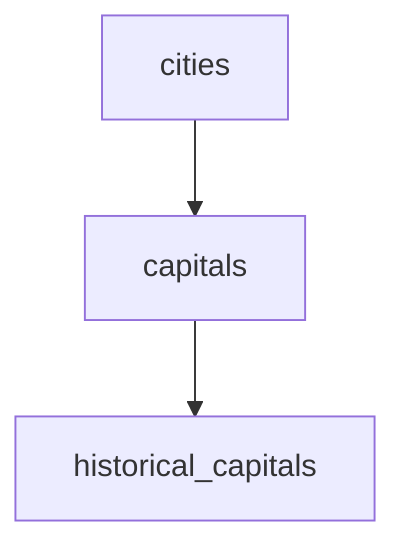

# PostgreSQL Inheritance

## Introduction

PostgreSQL offers a powerful feature called **table inheritance**, which allows one table to inherit columns from another table. This concept resembles object-oriented programming inheritance, where a child class inherits properties and methods from a parent class.

Table inheritance provides several benefits:
- Reduces redundancy by centralizing common columns in a parent table
- Enables hierarchical data modeling
- Simplifies queries across related tables
- Supports polymorphic database designs

In this tutorial, we'll explore PostgreSQL inheritance, understanding its syntax, use cases, and limitations.

## Basic Inheritance Syntax

### Creating Parent and Child Tables

To establish an inheritance relationship, you use the `INHERITS` keyword when creating a child table:

```sql
-- Create the parent table
CREATE TABLE cities (
    id SERIAL PRIMARY KEY,
    name VARCHAR(100) NOT NULL,
    population INTEGER,
    elevation INTEGER
);

-- Create a child table that inherits from cities
CREATE TABLE capitals (
    state VARCHAR(100),
    is_national_capital BOOLEAN
) INHERITS (cities);
```

In this example, the `capitals` table inherits all columns from the `cities` table (`id`, `name`, `population`, `elevation`) while adding its own columns (`state`, `is_national_capital`).

### Inserting Data

You can insert data into both tables using standard INSERT statements:

```sql
-- Insert data into the parent table
INSERT INTO cities (name, population, elevation) 
VALUES ('Denver', 705576, 1609),
       ('Portland', 661217, 15),
       ('San Francisco', 883305, 16);

-- Insert data into the child table
INSERT INTO capitals (name, population, elevation, state, is_national_capital) 
VALUES ('Washington DC', 712816, 7, 'District of Columbia', TRUE),
       ('Sacramento', 524943, 9, 'California', FALSE),
       ('Albany', 99224, 65, 'New York', FALSE);
```

## Querying Inherited Tables

### Standard Queries

By default, when you query a parent table, PostgreSQL returns rows from both the parent table and all its child tables:

```sql
SELECT name, population FROM cities;
```

Output:
```
      name       | population 
-----------------+------------
 Denver          |     705576
 Portland        |     661217
 San Francisco   |     883305
 Washington DC   |     712816
 Sacramento      |     524943
 Albany          |      99224
```

### Querying Only Parent Tables

If you want to query only the parent table without including data from child tables, you can use the `ONLY` keyword:

```sql
SELECT name, population FROM ONLY cities;
```

Output:
```
     name      | population 
---------------+------------
 Denver        |     705576
 Portland      |     661217
 San Francisco |     883305
```

### Querying Child Tables

You can also query child tables directly to access their specific columns:

```sql
SELECT name, state, is_national_capital FROM capitals WHERE is_national_capital = TRUE;
```

Output:
```
     name      |        state        | is_national_capital 
---------------+---------------------+---------------------
 Washington DC | District of Columbia| t
```

## Table Inheritance Hierarchies

PostgreSQL allows multi-level inheritance, creating hierarchical structures similar to class hierarchies in object-oriented programming:



Example implementation:

```sql
-- Create a third-level table
CREATE TABLE historical_capitals (
    year_established INTEGER,
    historical_significance TEXT
) INHERITS (capitals);

-- Insert data
INSERT INTO historical_capitals 
(name, population, elevation, state, is_national_capital, year_established, historical_significance)
VALUES 
('Philadelphia', 1585010, 12, 'Pennsylvania', FALSE, 1682, 
'Served as the U.S. capital from 1790 to 1800 before Washington DC');
```

## Practical Applications

### Application 1: Product Catalog

Table inheritance is useful for product catalogs where different product categories share common attributes but also have unique properties:

```sql
-- Parent table for all products
CREATE TABLE products (
    product_id SERIAL PRIMARY KEY,
    name VARCHAR(100) NOT NULL,
    price DECIMAL(10, 2) NOT NULL,
    stock_quantity INTEGER NOT NULL,
    description TEXT
);

-- Child table for books
CREATE TABLE books (
    author VARCHAR(100),
    isbn VARCHAR(20) UNIQUE,
    pages INTEGER,
    publisher VARCHAR(100)
) INHERITS (products);

-- Child table for electronics
CREATE TABLE electronics (
    brand VARCHAR(50),
    warranty_period INTEGER, -- in months
    power_consumption VARCHAR(20)
) INHERITS (products);
```

This structure allows for:
- Common queries across all products
- Specialized queries for specific product types
- Easy addition of new product categories

### Application 2: Employee Management

Another common use case is employee management systems with different employee types:

```sql
-- Parent table for all employees
CREATE TABLE employees (
    employee_id SERIAL PRIMARY KEY,
    first_name VARCHAR(50) NOT NULL,
    last_name VARCHAR(50) NOT NULL,
    email VARCHAR(100) UNIQUE,
    hire_date DATE NOT NULL,
    salary DECIMAL(10, 2) NOT NULL
);

-- Child table for managers
CREATE TABLE managers (
    department VARCHAR(50) NOT NULL,
    reports_to INTEGER,
    budget_responsibility DECIMAL(12, 2)
) INHERITS (employees);

-- Child table for developers
CREATE TABLE developers (
    programming_language VARCHAR(50),
    github_username VARCHAR(50),
    team VARCHAR(50)
) INHERITS (employees);
```

## Constraints and Inheritance

### Primary Keys and Inheritance

When using inheritance, there are some considerations for primary keys:

1. A primary key defined in the parent table is inherited by child tables
2. Child tables can have their own additional primary keys
3. To ensure uniqueness across the inheritance hierarchy, use unique constraints or create a unified ID system

Example of ensuring unique IDs across the hierarchy:

```sql
-- Create a sequence for all products
CREATE SEQUENCE product_id_seq;

-- Parent table with manually assigned sequence
CREATE TABLE products (
    product_id INTEGER PRIMARY KEY DEFAULT nextval('product_id_seq'),
    name VARCHAR(100) NOT NULL,
    price DECIMAL(10, 2) NOT NULL
);

-- Child tables will inherit the same sequence
CREATE TABLE books (
    author VARCHAR(100),
    isbn VARCHAR(20) UNIQUE
) INHERITS (products);

CREATE TABLE electronics (
    brand VARCHAR(50),
    warranty_period INTEGER
) INHERITS (products);
```

### Check Constraints

Check constraints are also inherited by child tables:

```sql
-- Parent table with check constraint
CREATE TABLE products (
    product_id SERIAL PRIMARY KEY,
    name VARCHAR(100) NOT NULL,
    price DECIMAL(10, 2) NOT NULL,
    CONSTRAINT positive_price CHECK (price > 0)
);

-- Child table inherits the check constraint
CREATE TABLE books (
    author VARCHAR(100),
    isbn VARCHAR(20) UNIQUE
) INHERITS (products);
```

## Limitations and Considerations

While inheritance is powerful, it has some limitations to be aware of:

1. **Foreign key constraints**: Foreign keys referencing a parent table do not automatically reference rows in child tables.

2. **Schema changes**: Altering the parent table structure affects all child tables, which can be challenging to manage in large databases.

3. **Performance**: Queries on parent tables check all child tables, which might impact performance for deep hierarchies or tables with many children.

4. **Indexes**: Indexes created on the parent table are not inherited by child tables. You need to create indexes on each child table separately.

5. **Partitioning alternative**: For data partitioning use cases, PostgreSQL table partitioning (available since PostgreSQL 10) is often a better choice than inheritance.

Example of an index that must be created separately for each table:

```sql
-- Create index on parent table
CREATE INDEX idx_cities_name ON cities (name);

-- Need separate index on child table
CREATE INDEX idx_capitals_name ON capitals (name);
```

## Comparison with Table Partitioning

Since PostgreSQL 10, built-in table partitioning provides an alternative to inheritance for certain use cases:

| Feature | Inheritance | Partitioning |
|---------|-------------|--------------|
| Purpose | Modeling hierarchical data | Dividing large tables |
| Query behavior | Queries parent by default includes children | Same behavior |
| Constraint propagation | Constraints inherited | Constraints inherited |
| Performance | Can be slower for many children | Optimized for data division |
| Maintenance | More flexible | More rigid structure |

## Summary

PostgreSQL table inheritance provides a powerful way to model hierarchical data structures in your database. By allowing tables to inherit columns and constraints from parent tables, it enables:

- Reduction of schema redundancy
- Hierarchical data organization
- Simplified querying across related tables
- Specialized data models while maintaining common attributes

The feature is particularly useful for product catalogs, employee systems, content management, and other domains with natural hierarchies.

## Additional Resources

- [PostgreSQL Official Documentation on Inheritance](https://www.postgresql.org/docs/current/ddl-inherit.html)
- [PostgreSQL Table Partitioning](https://www.postgresql.org/docs/current/ddl-partitioning.html) (an alternative approach for certain use cases)

## Exercises

1. Create a parent table called `vehicles` with common attributes like `id`, `make`, `model`, and `year`. Then create child tables for `cars`, `trucks`, and `motorcycles` with type-specific attributes.

2. Write a query that retrieves all vehicles, and then modify it to retrieve only motorcycles.

3. Implement a content management system with a parent `content` table and child tables for different content types (`articles`, `videos`, `podcasts`).

4. Create a constraint on the parent table and verify that it's enforced on the child tables.

5. Design a product inventory system using inheritance, including appropriate constraints and indexes for each table level.