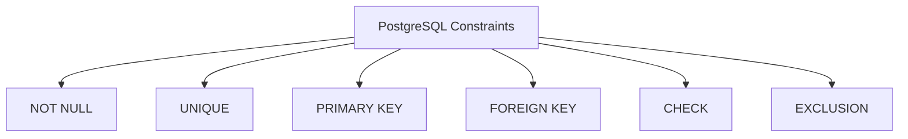

# PostgreSQL Constraints

## Introduction

Constraints are rules that you set on the data going into your database tables. They act as guardians of data integrity, ensuring that the information stored in your database remains valid, consistent, and reliable. PostgreSQL provides several types of constraints that help you enforce business rules directly at the database level.

In this tutorial, we'll explore the various types of constraints in PostgreSQL and learn how to implement them effectively in your database design.

## Why Use Constraints?

Before diving into the specific types of constraints, let's understand why they're essential:

- **Data Integrity**: Constraints prevent invalid data from entering your tables
- **Business Rules**: They enforce business logic at the database level
- **Consistency**: They maintain relationships between tables
- **Error Prevention**: They catch data errors early before they cause problems

## Types of PostgreSQL Constraints

PostgreSQL offers several types of constraints:



Let's examine each type in detail.

## NOT NULL Constraint

The `NOT NULL` constraint ensures that a column cannot have a NULL value.

### Syntax

You can define a `NOT NULL` constraint when creating a table:

```sql
CREATE TABLE employees (
    employee_id SERIAL,
    first_name VARCHAR(50) NOT NULL,
    last_name VARCHAR(50) NOT NULL,
    email VARCHAR(100) NOT NULL,
    hire_date DATE
);
```

Or add it to an existing table:

```sql
ALTER TABLE employees
ALTER COLUMN hire_date SET NOT NULL;
```

### Example

Let's try to insert a row with a NULL value for a NOT NULL column:

```sql
INSERT INTO employees (employee_id, first_name, last_name, email)
VALUES (1, 'John', NULL, 'john@example.com');
```

This would result in an error:

```
ERROR:  null value in column "last_name" of relation "employees" violates not-null constraint
DETAIL:  Failing row contains (1, John, null, john@example.com, null).
```

## UNIQUE Constraint

The `UNIQUE` constraint ensures that all values in a column (or a group of columns) are different.

### Syntax

```sql
CREATE TABLE departments (
    department_id SERIAL PRIMARY KEY,
    department_name VARCHAR(100) UNIQUE,
    location VARCHAR(100)
);
```

You can also create a UNIQUE constraint on multiple columns:

```sql
CREATE TABLE project_assignments (
    employee_id INTEGER,
    project_id INTEGER,
    role VARCHAR(50),
    UNIQUE (employee_id, project_id)
);
```

### Example

Trying to insert duplicate values will fail:

```sql
INSERT INTO departments (department_name, location)
VALUES ('Engineering', 'Building A');

INSERT INTO departments (department_name, location)
VALUES ('Engineering', 'Building B');
```

The second insert will fail with:

```
ERROR:  duplicate key value violates unique constraint "departments_department_name_key"
DETAIL:  Key (department_name)=(Engineering) already exists.
```

## PRIMARY KEY Constraint

A `PRIMARY KEY` constraint combines `NOT NULL` and `UNIQUE`. It uniquely identifies each record in a table.

### Syntax

```sql
CREATE TABLE products (
    product_id SERIAL PRIMARY KEY,
    product_name VARCHAR(100) NOT NULL,
    price DECIMAL(10, 2) NOT NULL,
    description TEXT
);
```

You can also define a primary key on multiple columns:

```sql
CREATE TABLE order_items (
    order_id INTEGER,
    product_id INTEGER,
    quantity INTEGER NOT NULL,
    unit_price DECIMAL(10, 2) NOT NULL,
    PRIMARY KEY (order_id, product_id)
);
```

### Example

The PRIMARY KEY ensures that each product has a unique identifier:

```sql
INSERT INTO products (product_id, product_name, price)
VALUES (1, 'Laptop', 1200.00);

-- This will fail because product_id 1 already exists
INSERT INTO products (product_id, product_name, price)
VALUES (1, 'Desktop', 900.00);
```

Result:

```
ERROR:  duplicate key value violates unique constraint "products_pkey"
DETAIL:  Key (product_id)=(1) already exists.
```

## FOREIGN KEY Constraint

A `FOREIGN KEY` constraint establishes a relationship between tables, ensuring that a value in one table corresponds to a value in another table.

### Syntax

```sql
CREATE TABLE orders (
    order_id SERIAL PRIMARY KEY,
    customer_id INTEGER NOT NULL,
    order_date DATE NOT NULL,
    total_amount DECIMAL(12, 2),
    FOREIGN KEY (customer_id) REFERENCES customers(customer_id)
);
```

### Example

Let's create the customers table first:

```sql
CREATE TABLE customers (
    customer_id SERIAL PRIMARY KEY,
    customer_name VARCHAR(100) NOT NULL,
    email VARCHAR(100) UNIQUE
);

INSERT INTO customers (customer_id, customer_name, email)
VALUES (1, 'Acme Corp', 'contact@acmecorp.com');
```

Now we can insert an order referring to an existing customer:

```sql
INSERT INTO orders (customer_id, order_date, total_amount)
VALUES (1, '2023-09-15', 150.75);
```

But trying to insert an order for a non-existent customer will fail:

```sql
INSERT INTO orders (customer_id, order_date, total_amount)
VALUES (999, '2023-09-15', 150.75);
```

Result:

```
ERROR:  insert or update on table "orders" violates foreign key constraint "orders_customer_id_fkey"
DETAIL:  Key (customer_id)=(999) is not present in table "customers".
```

### Foreign Key Actions

You can specify what should happen when a referenced row is updated or deleted:

```sql
CREATE TABLE orders (
    order_id SERIAL PRIMARY KEY,
    customer_id INTEGER NOT NULL,
    order_date DATE NOT NULL,
    total_amount DECIMAL(12, 2),
    FOREIGN KEY (customer_id) 
        REFERENCES customers(customer_id)
        ON DELETE CASCADE
        ON UPDATE CASCADE
);
```

Available actions:
- `CASCADE`: Automatically delete or update related rows
- `RESTRICT`: Prevent deletion or updating of the referenced row
- `NO ACTION`: Similar to RESTRICT, but checked at the end of the transaction
- `SET NULL`: Set the foreign key column to NULL
- `SET DEFAULT`: Set the foreign key column to its default value

## CHECK Constraint

A `CHECK` constraint ensures that all values in a column satisfy a specific condition.

### Syntax

```sql
CREATE TABLE products (
    product_id SERIAL PRIMARY KEY,
    product_name VARCHAR(100) NOT NULL,
    price DECIMAL(10, 2) CHECK (price > 0),
    stock INTEGER CHECK (stock >= 0)
);
```

You can also name your constraints:

```sql
CREATE TABLE employees (
    employee_id SERIAL PRIMARY KEY,
    first_name VARCHAR(50) NOT NULL,
    last_name VARCHAR(50) NOT NULL,
    birth_date DATE,
    hire_date DATE,
    CONSTRAINT check_dates CHECK (hire_date > birth_date)
);
```

### Example

Let's try to insert a row that violates a CHECK constraint:

```sql
INSERT INTO products (product_name, price, stock)
VALUES ('Defective Item', -10.00, 5);
```

This would result in an error:

```
ERROR:  new row for relation "products" violates check constraint "products_price_check"
DETAIL:  Failing row contains (1, Defective Item, -10.00, 5).
```

## EXCLUSION Constraint

The `EXCLUSION` constraint ensures that if any two rows are compared on the specified columns using the specified operators, at least one of these operator comparisons must return false or null.

This is a more advanced constraint type that's particularly useful for preventing overlapping time periods or ranges.

### Syntax

```sql
CREATE TABLE reservations (
    reservation_id SERIAL PRIMARY KEY,
    room_id INTEGER NOT NULL,
    start_time TIMESTAMP NOT NULL,
    end_time TIMESTAMP NOT NULL,
    EXCLUDE USING GIST (room_id WITH =, 
                        tsrange(start_time, end_time) WITH &&)
);
```

Note: This requires the `btree_gist` extension:

```sql
CREATE EXTENSION btree_gist;
```

### Example

This constraint would prevent double-booking a room for overlapping time periods:

```sql
INSERT INTO reservations (room_id, start_time, end_time)
VALUES (101, '2023-09-20 14:00', '2023-09-20 16:00');

-- This would fail because it overlaps with the existing reservation
INSERT INTO reservations (room_id, start_time, end_time)
VALUES (101, '2023-09-20 15:00', '2023-09-20 17:00');
```

## Real-World Applications

Let's explore a practical example of using constraints in a real-world scenario: an e-commerce database.

```sql
-- Create product categories table
CREATE TABLE product_categories (
    category_id SERIAL PRIMARY KEY,
    category_name VARCHAR(50) UNIQUE NOT NULL,
    description TEXT
);

-- Create products table with constraints
CREATE TABLE products (
    product_id SERIAL PRIMARY KEY,
    category_id INTEGER NOT NULL REFERENCES product_categories(category_id),
    product_name VARCHAR(100) NOT NULL,
    price DECIMAL(10, 2) CHECK (price > 0) NOT NULL,
    stock INTEGER CHECK (stock >= 0) DEFAULT 0,
    is_active BOOLEAN DEFAULT TRUE,
    created_at TIMESTAMP DEFAULT CURRENT_TIMESTAMP
);

-- Create customers table
CREATE TABLE customers (
    customer_id SERIAL PRIMARY KEY,
    email VARCHAR(100) UNIQUE NOT NULL,
    password_hash VARCHAR(100) NOT NULL,
    first_name VARCHAR(50) NOT NULL,
    last_name VARCHAR(50) NOT NULL,
    phone VARCHAR(20),
    created_at TIMESTAMP DEFAULT CURRENT_TIMESTAMP
);

-- Create orders table with constraints
CREATE TABLE orders (
    order_id SERIAL PRIMARY KEY,
    customer_id INTEGER NOT NULL REFERENCES customers(customer_id),
    order_date TIMESTAMP DEFAULT CURRENT_TIMESTAMP,
    status VARCHAR(20) CHECK (status IN ('pending', 'processing', 'shipped', 'delivered', 'cancelled')) DEFAULT 'pending',
    shipping_address TEXT NOT NULL,
    total_amount DECIMAL(12, 2) CHECK (total_amount >= 0)
);

-- Create order_items table with composite primary key
CREATE TABLE order_items (
    order_id INTEGER REFERENCES orders(order_id) ON DELETE CASCADE,
    product_id INTEGER REFERENCES products(product_id),
    quantity INTEGER CHECK (quantity > 0) NOT NULL,
    unit_price DECIMAL(10, 2) CHECK (unit_price >= 0) NOT NULL,
    PRIMARY KEY (order_id, product_id)
);
```

This schema effectively enforces many business rules:
- Products must have positive prices and non-negative stock
- Orders must be assigned to existing customers
- Order items must reference valid orders and products
- Order status must be one of the predefined values
- Email addresses must be unique
- And many more!

## Managing Constraints

### Viewing Existing Constraints

You can view all constraints in a database using this query:

```sql
SELECT conrelid::regclass AS table_name,
       conname AS constraint_name,
       pg_get_constraintdef(oid) AS constraint_definition
FROM pg_constraint
WHERE connamespace = 'public'::regnamespace
ORDER BY conrelid::regclass::text, contype, conname;
```

### Dropping Constraints

To remove a constraint:

```sql
-- Drop a named constraint
ALTER TABLE employees DROP CONSTRAINT check_dates;

-- Drop a primary key
ALTER TABLE products DROP CONSTRAINT products_pkey;

-- Drop a foreign key
ALTER TABLE orders DROP CONSTRAINT orders_customer_id_fkey;
```

### Temporarily Disabling Constraints

Sometimes, you might need to temporarily disable constraints for bulk operations:

```sql
-- Disable foreign key checks
SET session_replication_role = 'replica';

-- Perform bulk operations here...

-- Re-enable foreign key checks
SET session_replication_role = 'origin';
```

Be extremely careful when disabling constraints, as this can lead to data integrity issues if not handled properly.

## Best Practices

Here are some best practices for working with PostgreSQL constraints:

1. **Use Constraints Liberally**: Define constraints for all your business rules that can be enforced at the database level.

2. **Name Your Constraints**: Give meaningful names to your constraints to make error messages more understandable.

3. **Use Foreign Keys Wisely**: Choose appropriate ON DELETE and ON UPDATE actions based on your business requirements.

4. **Validate Existing Data**: When adding constraints to tables with existing data, validate the data first to prevent constraint violations.

5. **Consider Performance**: Some constraints (especially complex CHECK constraints) can impact performance, so use them judiciously.

6. **Document Your Constraints**: Document the purpose of each constraint, especially complex CHECK constraints, for future reference.

## Summary

Constraints are powerful tools in PostgreSQL that help maintain data integrity and enforce business rules. By using NOT NULL, UNIQUE, PRIMARY KEY, FOREIGN KEY, CHECK, and EXCLUSION constraints appropriately, you can ensure that your database remains consistent and reliable.

In this tutorial, we've covered:
- The importance of constraints for data integrity
- Different types of PostgreSQL constraints and their syntax
- Real-world examples of constraint usage
- How to manage and maintain constraints
- Best practices for working with constraints

## Exercises

1. Create a `students` and `courses` table with appropriate constraints to model a school database.

2. Implement a CHECK constraint that ensures a person's date of birth is not in the future.

3. Create a table to track employee vacation time with constraints that prevent overlapping vacation periods for the same employee.

4. Design a database schema for a library system using appropriate constraints to model the relationships between books, members, and loans.

5. Add a constraint to the products table that ensures the sale price is always less than or equal to the regular price.

## Additional Resources

- [PostgreSQL Documentation on Constraints](https://www.postgresql.org/docs/current/ddl-constraints.html)
- [PostgreSQL Foreign Key Documentation](https://www.postgresql.org/docs/current/tutorial-fk.html)
- [PostgreSQL Exclusion Constraints](https://www.postgresql.org/docs/current/sql-createtable.html#SQL-CREATETABLE-EXCLUDE)