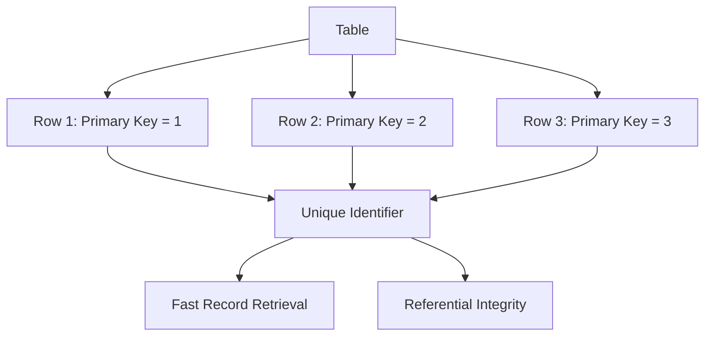

# PostgreSQL Primary Keys

## Introduction

Primary keys are a fundamental concept in relational database management systems like PostgreSQL. They serve as the unique identifier for each record in a table, ensuring data integrity and providing an efficient way to access specific rows. Understanding how to properly implement primary keys is essential for building well-structured and performant databases.

In this tutorial, we'll explore what primary keys are, how to create and modify them in PostgreSQL, and best practices for their use in real-world applications.

## What is a Primary Key?

A primary key is a column or group of columns that uniquely identifies each row in a table. Primary keys enforce two crucial constraints:

1. **Uniqueness**: No two rows can have the same primary key value
2. **Not NULL**: Primary key columns cannot contain NULL values



## Creating Tables with Primary Keys

Let's look at different ways to create primary keys in PostgreSQL.

### Method 1: Column Constraint Syntax

```sql
CREATE TABLE products (
    product_id SERIAL PRIMARY KEY,
    product_name VARCHAR(100) NOT NULL,
    price DECIMAL(10, 2) NOT NULL,
    description TEXT
);
```

In this example, `product_id` is defined as the primary key directly in the column definition. PostgreSQL automatically creates a unique index on this column.

### Method 2: Table Constraint Syntax

```sql
CREATE TABLE customers (
    customer_id SERIAL,
    email VARCHAR(100) NOT NULL,
    first_name VARCHAR(50) NOT NULL,
    last_name VARCHAR(50) NOT NULL,
    PRIMARY KEY (customer_id)
);
```

Here, we define the primary key as a table constraint at the end of the table definition.

### Method 3: Composite Primary Keys

Sometimes, a single column isn't enough to uniquely identify rows. In such cases, we can use multiple columns to form a composite primary key:

```sql
CREATE TABLE order_items (
    order_id INTEGER,
    product_id INTEGER,
    quantity INTEGER NOT NULL,
    price DECIMAL(10, 2) NOT NULL,
    PRIMARY KEY (order_id, product_id)
);
```

In this example, the combination of `order_id` and `product_id` forms the composite primary key.

## Adding Primary Keys to Existing Tables

If you already have a table without a primary key, you can add one using the `ALTER TABLE` command:

```sql
-- First, ensure the column has unique values and no NULLs
UPDATE users SET username = CONCAT(username, id) WHERE username IS NULL;

-- Then add the primary key constraint
ALTER TABLE users
ADD PRIMARY KEY (username);
```

## Primary Key Types and Best Practices

PostgreSQL supports several data types for primary keys. Here are some common choices:

### INTEGER with SERIAL or IDENTITY

Using an auto-incrementing integer is the most common approach:

```sql
CREATE TABLE employees (
    employee_id SERIAL PRIMARY KEY,
    first_name VARCHAR(50) NOT NULL,
    last_name VARCHAR(50) NOT NULL,
    hire_date DATE NOT NULL
);
```

The `SERIAL` type automatically creates a sequence and sets the default value of the column to the next number in the sequence.

For PostgreSQL 10 and later, you can also use the IDENTITY property:

```sql
CREATE TABLE departments (
    department_id INTEGER GENERATED ALWAYS AS IDENTITY PRIMARY KEY,
    department_name VARCHAR(100) NOT NULL,
    location VARCHAR(100)
);
```

### UUID Primary Keys

For distributed systems or when you need to generate IDs outside the database, UUID (Universally Unique Identifier) is a good choice:

```sql
CREATE EXTENSION IF NOT EXISTS "uuid-ossp";

CREATE TABLE sessions (
    session_id UUID DEFAULT uuid_generate_v4() PRIMARY KEY,
    user_id INTEGER NOT NULL,
    login_timestamp TIMESTAMP WITH TIME ZONE DEFAULT NOW(),
    last_activity TIMESTAMP WITH TIME ZONE DEFAULT NOW()
);
```

### Natural vs. Surrogate Keys

- **Natural keys** are attributes that exist naturally in the real world (like email addresses or social security numbers)
- **Surrogate keys** are artificial identifiers created solely for the purpose of uniquely identifying rows

While natural keys might seem intuitive, surrogate keys (like auto-incrementing IDs) are usually preferred because:
1. They're immutable (don't change over time)
2. They're typically smaller and more efficient
3. They don't expose potentially sensitive business data

## Querying with Primary Keys

Primary key columns are optimized for fast retrieval. When querying based on a primary key, PostgreSQL can perform a very efficient index lookup:

```sql
-- This query is extremely fast
SELECT * FROM products WHERE product_id = 42;
```

Primary keys also make joins more efficient:

```sql
SELECT o.order_date, p.product_name, oi.quantity, oi.price
FROM orders o
JOIN order_items oi ON o.order_id = oi.order_id
JOIN products p ON oi.product_id = p.product_id
WHERE o.customer_id = 123;
```

## Modifying Primary Keys

While it's generally not recommended to change primary keys once they're established, there are times when you need to modify them:

### Removing a Primary Key

```sql
ALTER TABLE products
DROP CONSTRAINT products_pkey;
```

### Changing a Primary Key

To change a primary key, you must first drop the existing primary key constraint and then add a new one:

```sql
-- Drop the old primary key
ALTER TABLE employees
DROP CONSTRAINT employees_pkey;

-- Add a new primary key
ALTER TABLE employees
ADD PRIMARY KEY (employee_id, department_id);
```

## Real-World Example: User Management System

Let's build a simplified user management system with properly structured primary keys:

```sql
-- Create users table with surrogate key
CREATE TABLE users (
    user_id SERIAL PRIMARY KEY,
    username VARCHAR(50) UNIQUE NOT NULL,
    email VARCHAR(100) UNIQUE NOT NULL,
    password_hash VARCHAR(100) NOT NULL,
    created_at TIMESTAMP WITH TIME ZONE DEFAULT NOW(),
    last_login TIMESTAMP WITH TIME ZONE
);

-- Create roles table
CREATE TABLE roles (
    role_id SERIAL PRIMARY KEY,
    role_name VARCHAR(50) UNIQUE NOT NULL,
    description TEXT
);

-- Create user_roles table with composite primary key
CREATE TABLE user_roles (
    user_id INTEGER,
    role_id INTEGER,
    assigned_at TIMESTAMP WITH TIME ZONE DEFAULT NOW(),
    PRIMARY KEY (user_id, role_id),
    FOREIGN KEY (user_id) REFERENCES users (user_id) ON DELETE CASCADE,
    FOREIGN KEY (role_id) REFERENCES roles (role_id) ON DELETE RESTRICT
);
```

This design demonstrates:
1. Using `SERIAL` for auto-incrementing primary keys
2. Creating a composite key for a many-to-many relationship
3. Setting up proper foreign key relationships

Let's insert some sample data:

```sql
-- Insert sample users
INSERT INTO users (username, email, password_hash)
VALUES 
    ('john_doe', 'john@example.com', 'hashed_password_here'),
    ('jane_smith', 'jane@example.com', 'hashed_password_here');

-- Insert roles
INSERT INTO roles (role_name, description)
VALUES 
    ('admin', 'System administrator with full access'),
    ('editor', 'Can edit content but not change system settings'),
    ('viewer', 'Read-only access to content');

-- Assign roles to users
INSERT INTO user_roles (user_id, role_id)
VALUES 
    (1, 1),  -- john_doe is an admin
    (2, 2),  -- jane_smith is an editor
    (2, 3);  -- jane_smith is also a viewer
```

Now we can query to find all roles for a specific user:

```sql
SELECT u.username, r.role_name
FROM users u
JOIN user_roles ur ON u.user_id = ur.user_id
JOIN roles r ON ur.role_id = r.role_id
WHERE u.username = 'jane_smith';
```

Output:
```
 username  | role_name
-----------+-----------
 jane_smith | editor
 jane_smith | viewer
```

## Common Mistakes and Troubleshooting

### 1. Using Non-Immutable Values as Primary Keys

Avoid using values that might change as primary keys (like names, email addresses, or business identifiers that could be reassigned).

### 2. Making Composite Keys Too Complex

While composite keys can be useful, having too many columns in a primary key can impact performance and make queries more complex.

### 3. Forgetting to Index Foreign Keys

When you reference a primary key from another table (as a foreign key), make sure to create an index on the foreign key column:

```sql
CREATE INDEX idx_user_roles_user_id ON user_roles (user_id);
CREATE INDEX idx_user_roles_role_id ON user_roles (role_id);
```

## Summary

Primary keys are essential for maintaining data integrity and enabling efficient data retrieval in PostgreSQL databases. In this tutorial, we've learned:

- The definition and importance of primary keys
- Different ways to create primary keys (single column, composite, etc.)
- Best practices for choosing primary key data types
- How to modify primary keys when needed
- Real-world examples of implementing primary keys in a relational schema

By properly implementing primary keys, you ensure your database is well-structured, performs efficiently, and maintains data consistency across tables.

## Exercises

1. Create a database schema for a library management system with tables for books, authors, and borrowers. Implement appropriate primary keys for each table.

2. Modify the user management system example to include a new table for user preferences with a foreign key relationship to the users table.

3. Practice converting a natural key (like an email address) to a surrogate key in an existing table, preserving data integrity throughout the process.

## Additional Resources

- [PostgreSQL Official Documentation on Primary Keys](https://www.postgresql.org/docs/current/ddl-constraints.html#DDL-CONSTRAINTS-PRIMARY-KEYS)
- [PostgreSQL Indexing Strategies](https://www.postgresql.org/docs/current/indexes-types.html)
- [Database Normalization and Key Selection](https://www.postgresql.org/docs/current/tutorial-fk.html)