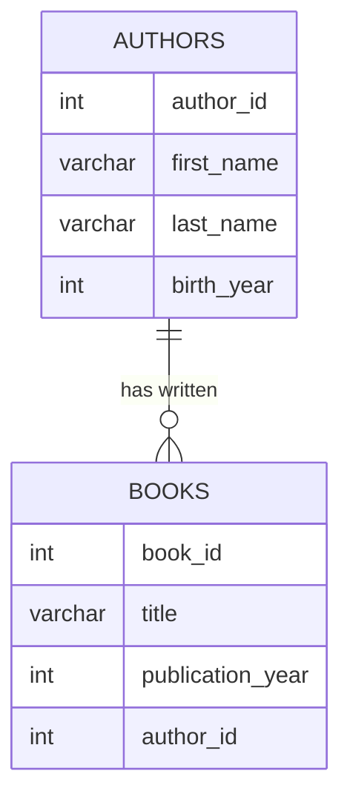

# PostgreSQL Foreign Keys

## Introduction

Foreign keys are a fundamental database concept that allows you to establish and enforce relationships between tables in PostgreSQL. They are crucial for maintaining referential integrity, which ensures that relationships between tables remain consistent.

A foreign key is a column or group of columns in a table that references the primary key of another table. This creates a parent-child relationship between the tables, where the table containing the foreign key is the child table, and the referenced table is the parent table.

## Why Use Foreign Keys?

Foreign keys serve several important purposes:

1. **Maintain data integrity**: They prevent invalid data by ensuring that values in the foreign key column(s) exist in the referenced table.
2. **Establish clear relationships**: They explicitly define how tables relate to each other.
3. **Cascade changes**: They can automatically propagate changes (updates or deletions) from the parent table to related records in child tables.
4. **Improve query efficiency**: They provide hints to the query optimizer about table relationships.

## Basic Foreign Key Syntax

The basic syntax for creating a foreign key constraint in PostgreSQL is:

```sql
CREATE TABLE child_table (
    column1 data_type,
    column2 data_type,
    ...
    CONSTRAINT constraint_name
        FOREIGN KEY (column1)
        REFERENCES parent_table (referenced_column)
        [ON DELETE action]
        [ON UPDATE action]
);
```

You can also add a foreign key constraint to an existing table:

```sql
ALTER TABLE child_table
    ADD CONSTRAINT constraint_name
    FOREIGN KEY (column1)
    REFERENCES parent_table (referenced_column)
    [ON DELETE action]
    [ON UPDATE action];
```

## Creating Tables with Foreign Keys: An Example

Let's create a simple database schema for a bookstore with two related tables: `authors` and `books`.

```sql
-- Create the authors table (parent table)
CREATE TABLE authors (
    author_id SERIAL PRIMARY KEY,
    first_name VARCHAR(50) NOT NULL,
    last_name VARCHAR(50) NOT NULL,
    birth_year INTEGER
);

-- Create the books table (child table) with a foreign key reference
CREATE TABLE books (
    book_id SERIAL PRIMARY KEY,
    title VARCHAR(255) NOT NULL,
    publication_year INTEGER,
    author_id INTEGER,
    CONSTRAINT fk_author
        FOREIGN KEY (author_id)
        REFERENCES authors (author_id)
);
```

In this example:
- `authors` is the parent table with `author_id` as its primary key
- `books` is the child table with a foreign key `author_id` that references `authors.author_id`

Let's insert some data to see how this works:

```sql
-- Insert authors
INSERT INTO authors (first_name, last_name, birth_year)
VALUES 
    ('Jane', 'Austen', 1775),
    ('George', 'Orwell', 1903),
    ('J.K.', 'Rowling', 1965);

-- Insert books
INSERT INTO books (title, publication_year, author_id)
VALUES 
    ('Pride and Prejudice', 1813, 1),
    ('Emma', 1815, 1),
    ('1984', 1949, 2),
    ('Animal Farm', 1945, 2),
    ('Harry Potter and the Philosopher''s Stone', 1997, 3);
```

## Referential Integrity in Action

Now let's see what happens if we try to insert a book with an author_id that doesn't exist:

```sql
-- This will fail due to foreign key constraint
INSERT INTO books (title, publication_year, author_id)
VALUES ('Invisible Man', 1952, 99);
```

PostgreSQL will return an error:

```
ERROR:  insert or update on table "books" violates foreign key constraint "fk_author"
DETAIL:  Key (author_id)=(99) is not present in table "authors".
```

This demonstrates how foreign keys maintain referential integrity by preventing invalid references.

## Foreign Key Actions

PostgreSQL allows you to specify what happens when a referenced row in the parent table is updated or deleted. These are called referential actions:

### ON DELETE Actions

1. **RESTRICT** (default): Prevents deletion of a referenced row.
2. **CASCADE**: Deletes all rows that reference the deleted row.
3. **SET NULL**: Sets the foreign key column(s) to NULL.
4. **SET DEFAULT**: Sets the foreign key column(s) to their default values.
5. **NO ACTION**: Similar to RESTRICT but checked at the end of the transaction.

### ON UPDATE Actions

The same options are available for the ON UPDATE clause when a referenced key is updated.

Let's modify our `books` table to include a CASCADE deletion:

```sql
-- First drop the existing constraint
ALTER TABLE books
DROP CONSTRAINT fk_author;

-- Add it back with CASCADE option
ALTER TABLE books
ADD CONSTRAINT fk_author
    FOREIGN KEY (author_id)
    REFERENCES authors (author_id)
    ON DELETE CASCADE;
```

Now, if we delete an author, all their books will be automatically deleted:

```sql
-- Delete George Orwell
DELETE FROM authors WHERE author_id = 2;

-- This will also delete '1984' and 'Animal Farm'
```

## Compound Foreign Keys

Foreign keys can also reference multiple columns. For example, if we have a composite primary key in a parent table:

```sql
-- Create a table with a composite primary key
CREATE TABLE courses (
    department VARCHAR(10),
    course_number INTEGER,
    title VARCHAR(100) NOT NULL,
    credits INTEGER NOT NULL,
    PRIMARY KEY (department, course_number)
);

-- Create a table with a composite foreign key
CREATE TABLE enrollments (
    student_id INTEGER,
    department VARCHAR(10),
    course_number INTEGER,
    semester VARCHAR(20),
    grade CHAR(1),
    PRIMARY KEY (student_id, department, course_number, semester),
    FOREIGN KEY (department, course_number)
        REFERENCES courses (department, course_number)
);
```

## Self-Referencing Foreign Keys

Tables can also reference themselves. This is useful for hierarchical data:

```sql
-- Create an employees table with a self-reference
CREATE TABLE employees (
    employee_id SERIAL PRIMARY KEY,
    name VARCHAR(100) NOT NULL,
    manager_id INTEGER,
    FOREIGN KEY (manager_id) REFERENCES employees (employee_id)
);

-- Insert some employees
INSERT INTO employees (name, manager_id)
VALUES 
    ('John Smith', NULL),  -- CEO, no manager
    ('Jane Doe', 1),       -- Reports to John
    ('Bob Johnson', 1),    -- Reports to John
    ('Alice Brown', 2);    -- Reports to Jane
```

## Visualizing Table Relationships

Foreign keys define relationships between tables that can be visualized as entity-relationship diagrams:



## Real-World Example: E-Commerce Database

Let's look at a more complex real-world example for an e-commerce system:

```sql
-- Create tables for an e-commerce system
CREATE TABLE customers (
    customer_id SERIAL PRIMARY KEY,
    email VARCHAR(100) UNIQUE NOT NULL,
    first_name VARCHAR(50) NOT NULL,
    last_name VARCHAR(50) NOT NULL,
    created_at TIMESTAMP NOT NULL DEFAULT CURRENT_TIMESTAMP
);

CREATE TABLE addresses (
    address_id SERIAL PRIMARY KEY,
    customer_id INTEGER NOT NULL,
    street VARCHAR(100) NOT NULL,
    city VARCHAR(50) NOT NULL,
    state VARCHAR(50) NOT NULL,
    postal_code VARCHAR(20) NOT NULL,
    country VARCHAR(50) NOT NULL,
    is_default BOOLEAN NOT NULL DEFAULT FALSE,
    CONSTRAINT fk_customer
        FOREIGN KEY (customer_id)
        REFERENCES customers (customer_id)
        ON DELETE CASCADE
);

CREATE TABLE products (
    product_id SERIAL PRIMARY KEY,
    name VARCHAR(100) NOT NULL,
    description TEXT,
    price DECIMAL(10, 2) NOT NULL,
    stock_quantity INTEGER NOT NULL
);

CREATE TABLE orders (
    order_id SERIAL PRIMARY KEY,
    customer_id INTEGER NOT NULL,
    shipping_address_id INTEGER NOT NULL,
    order_date TIMESTAMP NOT NULL DEFAULT CURRENT_TIMESTAMP,
    status VARCHAR(20) NOT NULL DEFAULT 'pending',
    CONSTRAINT fk_customer
        FOREIGN KEY (customer_id)
        REFERENCES customers (customer_id)
        ON DELETE RESTRICT,
    CONSTRAINT fk_address
        FOREIGN KEY (shipping_address_id)
        REFERENCES addresses (address_id)
        ON DELETE RESTRICT
);

CREATE TABLE order_items (
    order_id INTEGER NOT NULL,
    product_id INTEGER NOT NULL,
    quantity INTEGER NOT NULL,
    unit_price DECIMAL(10, 2) NOT NULL,
    PRIMARY KEY (order_id, product_id),
    CONSTRAINT fk_order
        FOREIGN KEY (order_id)
        REFERENCES orders (order_id)
        ON DELETE CASCADE,
    CONSTRAINT fk_product
        FOREIGN KEY (product_id)
        REFERENCES products (product_id)
        ON DELETE RESTRICT
);
```

In this e-commerce example:
- `addresses` has a foreign key to `customers`
- `orders` has foreign keys to both `customers` and `addresses`
- `order_items` has foreign keys to both `orders` and `products`

Each foreign key establishes a specific type of relationship and has appropriate ON DELETE actions based on business requirements.

## Common Problems and Solutions

### 1. Circular References

A circular reference occurs when two or more tables reference each other directly or indirectly. For example:

```
Table A references Table B
Table B references Table C
Table C references Table A
```

**Solution**: Use deferred constraints or carefully plan your DELETE operations. For example:

```sql
CREATE TABLE table_a (
    id SERIAL PRIMARY KEY,
    table_b_id INTEGER,
    CONSTRAINT fk_table_b
        FOREIGN KEY (table_b_id)
        REFERENCES table_b (id)
        DEFERRABLE INITIALLY DEFERRED
);
```

With deferred constraints, PostgreSQL checks the constraints at the end of the transaction, allowing you to make intermediate states that would otherwise violate constraints.

### 2. Performance Considerations

Foreign keys add overhead to INSERT, UPDATE, and DELETE operations as PostgreSQL needs to check the referenced table.

**Solution**: For very large tables where performance is critical, consider:
- Adding indexes on foreign key columns
- Using partitioning
- In extreme cases, implementing integrity checks at the application level

## Best Practices for Foreign Keys

1. **Always name your constraints**: Use meaningful names that indicate what tables and columns are involved.
   
   ```sql
   CONSTRAINT fk_book_author FOREIGN KEY (author_id) ...
   ```

2. **Consider impact of referential actions**: Choose the appropriate ON DELETE and ON UPDATE actions based on your business logic.

3. **Index foreign key columns**: This improves the performance of joins and constraint checks.
   
   ```sql
   CREATE INDEX idx_books_author_id ON books (author_id);
   ```

4. **Keep data types consistent**: The foreign key column and the referenced column should have identical data types.

5. **Plan for cascading operations**: Be careful with CASCADE actions as they can lead to unintended deletions across multiple tables.

## Summary

Foreign keys are essential for maintaining referential integrity in relational databases like PostgreSQL. They:

- Establish relationships between tables
- Enforce data consistency
- Provide options for handling changes (updates/deletions) in related tables
- Support complex data models with features like compound keys and self-references

By properly implementing foreign keys, you create a robust database schema that maintains data integrity and accurately represents the relationships between different entities in your application.

## Exercises

1. Create a database schema for a library with tables for books, authors, genres, and borrowers. Implement appropriate foreign key constraints.

2. Modify the e-commerce example to add a reviews table with foreign keys to both customers and products.

3. Implement a hierarchical category system for products using a self-referencing foreign key.

4. Design a database for a blog system with users, posts, comments, and tags. Consider what foreign key actions (ON DELETE, ON UPDATE) would be appropriate for each relationship.

5. Practice adding, modifying, and removing foreign key constraints on existing tables.

## Additional Resources

- [PostgreSQL Official Documentation on Foreign Keys](https://www.postgresql.org/docs/current/ddl-constraints.html#DDL-CONSTRAINTS-FK)
- [PostgreSQL Referential Integrity](https://www.postgresql.org/docs/current/features-integrity.html)
- [Database Design Patterns](https://www.postgresql.org/docs/current/patterns.html)