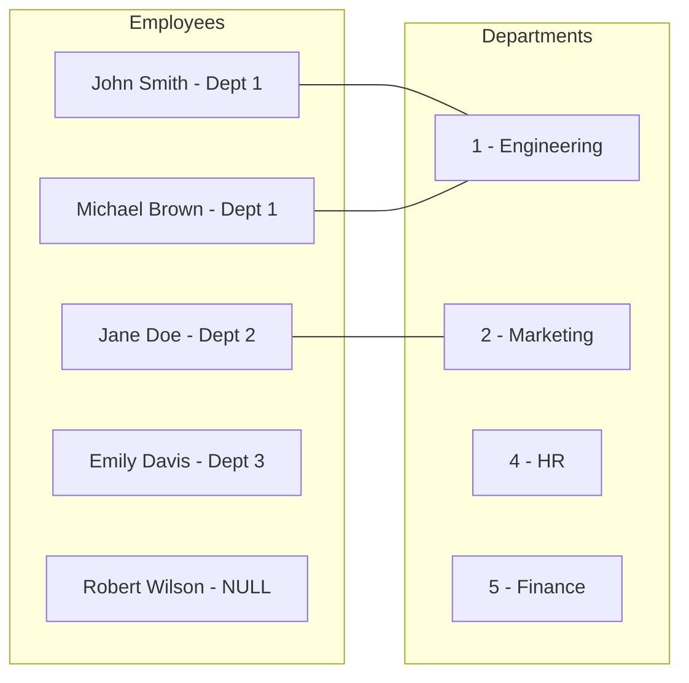
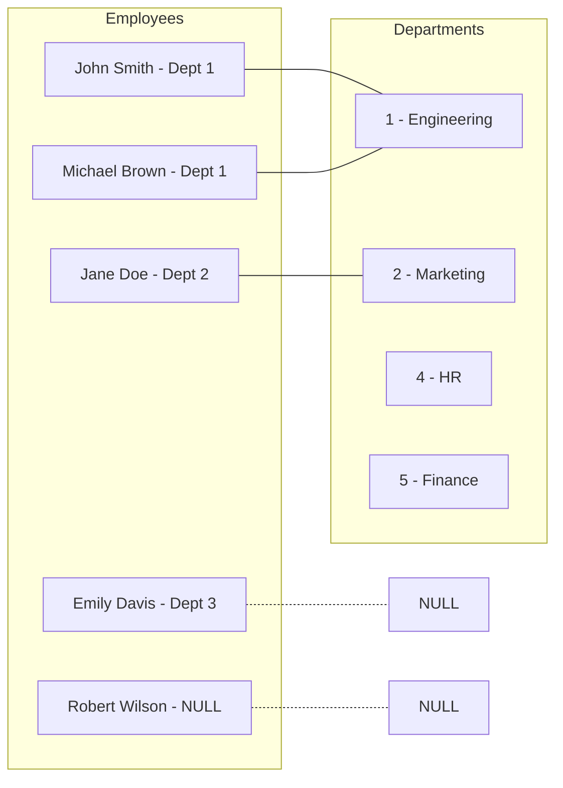
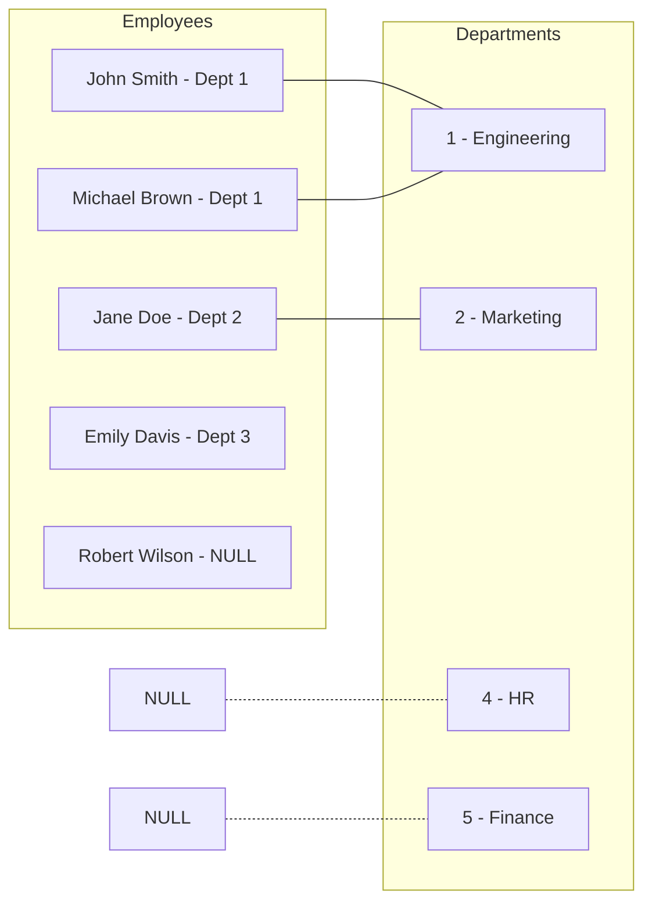
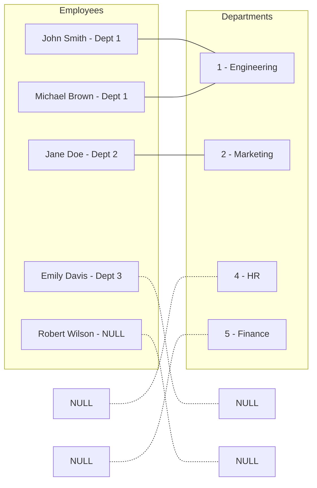
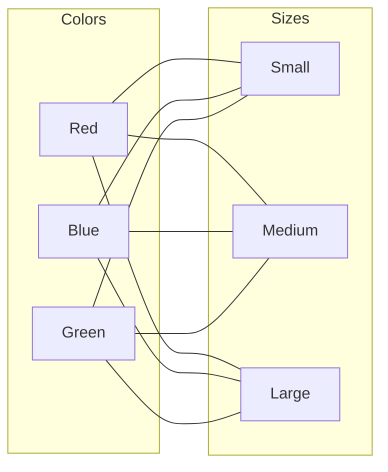

# PostgreSQL Join Types

## Introduction

In relational databases like PostgreSQL, data is organized into related tables. To retrieve data from multiple tables simultaneously, we use **joins**. Joins allow us to combine rows from two or more tables based on a related column between them.

PostgreSQL supports several types of joins, each serving different purposes:

1. INNER JOIN
2. LEFT JOIN (or LEFT OUTER JOIN)
3. RIGHT JOIN (or RIGHT OUTER JOIN)
4. FULL JOIN (or FULL OUTER JOIN)
5. CROSS JOIN

Understanding these join types is crucial for writing efficient queries and properly retrieving related data. In this tutorial, we'll explore each join type with examples.

## Prerequisites

- Basic understanding of SQL
- PostgreSQL installed and running
- Familiarity with creating tables and inserting data

## Setup Example Tables

Before diving into joins, let's create two sample tables to work with:

```sql
-- Create an employees table
CREATE TABLE employees (
    employee_id SERIAL PRIMARY KEY,
    name VARCHAR(100) NOT NULL,
    department_id INTEGER,
    salary NUMERIC(10, 2)
);

-- Create a departments table
CREATE TABLE departments (
    department_id SERIAL PRIMARY KEY,
    department_name VARCHAR(100) NOT NULL,
    location VARCHAR(100)
);

-- Insert sample data into employees
INSERT INTO employees (name, department_id, salary)
VALUES 
    ('John Smith', 1, 65000),
    ('Jane Doe', 2, 75000),
    ('Michael Brown', 1, 60000),
    ('Emily Davis', 3, 85000),
    ('Robert Wilson', NULL, 50000);

-- Insert sample data into departments
INSERT INTO departments (department_id, department_name, location)
VALUES 
    (1, 'Engineering', 'Building A'),
    (2, 'Marketing', 'Building B'),
    (4, 'HR', 'Building C'),
    (5, 'Finance', 'Building A');
```

Note that we've intentionally included some mismatches:
- Employee 'Robert Wilson' has no department (NULL)
- Department 'HR' has the ID 4, but employee 'Emily Davis' is assigned to department_id 3
- Departments 'HR' and 'Finance' have no employees assigned to them

This setup will help demonstrate how different join types handle these scenarios.

## 1. INNER JOIN

An INNER JOIN returns only the rows that have matching values in both tables. Rows without a match in either table are excluded from the results.

### Syntax

```sql
SELECT columns
FROM table1
INNER JOIN table2
ON table1.column = table2.column;
```

### Example

Let's join the employees and departments tables to get employees with their department information:

```sql
SELECT e.employee_id, e.name, e.salary, d.department_name, d.location
FROM employees e
INNER JOIN departments d
ON e.department_id = d.department_id;
```

### Result

```
 employee_id |     name     |  salary  | department_name |  location  
-------------+--------------+----------+-----------------+------------
           1 | John Smith   | 65000.00 | Engineering     | Building A
           2 | Jane Doe     | 75000.00 | Marketing       | Building B
           3 | Michael Brown| 60000.00 | Engineering     | Building A
```

### Visual Representation



### Explanation

Notice that:
- Only 3 rows are returned, even though we have 5 employees and 4 departments
- 'Robert Wilson' is not included because he has a NULL department_id
- 'Emily Davis' is not included because her department_id (3) doesn't exist in the departments table
- 'HR' and 'Finance' departments are not included because no employees are assigned to them

INNER JOIN is the most restrictive join type, returning only data that exists in both tables.

## 2. LEFT JOIN

A LEFT JOIN (or LEFT OUTER JOIN) returns all rows from the left table and matching rows from the right table. If there's no match in the right table, NULL values are returned for right table columns.

### Syntax

```sql
SELECT columns
FROM table1
LEFT JOIN table2
ON table1.column = table2.column;
```

### Example

```sql
SELECT e.employee_id, e.name, e.salary, d.department_name, d.location
FROM employees e
LEFT JOIN departments d
ON e.department_id = d.department_id;
```

### Result

```
 employee_id |     name      |  salary  | department_name |  location  
-------------+---------------+----------+-----------------+------------
           1 | John Smith    | 65000.00 | Engineering     | Building A
           2 | Jane Doe      | 75000.00 | Marketing       | Building B
           3 | Michael Brown | 60000.00 | Engineering     | Building A
           4 | Emily Davis   | 85000.00 | NULL            | NULL
           5 | Robert Wilson | 50000.00 | NULL            | NULL
```

### Visual Representation



### Explanation

Notice that:
- All 5 employees are included in the result
- 'Emily Davis' and 'Robert Wilson' have NULL values for department information
- LEFT JOIN ensures all records from the "left" table are included, regardless of whether there's a match in the "right" table

LEFT JOIN is useful when you want to see all records from one table, even if they don't have corresponding records in another table.

## 3. RIGHT JOIN

A RIGHT JOIN (or RIGHT OUTER JOIN) is the opposite of a LEFT JOIN. It returns all rows from the right table and matching rows from the left table. If there's no match in the left table, NULL values are returned for left table columns.

### Syntax

```sql
SELECT columns
FROM table1
RIGHT JOIN table2
ON table1.column = table2.column;
```

### Example

```sql
SELECT e.employee_id, e.name, e.salary, d.department_id, d.department_name, d.location
FROM employees e
RIGHT JOIN departments d
ON e.department_id = d.department_id;
```

### Result

```
 employee_id |     name      |  salary  | department_id | department_name |  location  
-------------+---------------+----------+--------------+-----------------+------------
           1 | John Smith    | 65000.00 |            1 | Engineering     | Building A
           3 | Michael Brown | 60000.00 |            1 | Engineering     | Building A
           2 | Jane Doe      | 75000.00 |            2 | Marketing       | Building B
         NULL| NULL          |     NULL |            4 | HR              | Building C
         NULL| NULL          |     NULL |            5 | Finance         | Building A
```

### Visual Representation



### Explanation

Notice that:
- All 4 departments are included in the result
- 'HR' and 'Finance' departments have NULL values for employee information
- Employees 'Emily Davis' and 'Robert Wilson' are excluded because their department_id values don't match any in the departments table
- RIGHT JOIN ensures all records from the "right" table are included, regardless of whether there's a match in the "left" table

RIGHT JOIN is less commonly used than LEFT JOIN, but it's functionally the same with the table order reversed.

## 4. FULL JOIN

A FULL JOIN (or FULL OUTER JOIN) returns all rows when there is a match in either of the tables. It combines the effect of LEFT JOIN and RIGHT JOIN.

### Syntax

```sql
SELECT columns
FROM table1
FULL JOIN table2
ON table1.column = table2.column;
```

### Example

```sql
SELECT e.employee_id, e.name, e.department_id as emp_dept_id, 
       d.department_id as dept_id, d.department_name, d.location
FROM employees e
FULL JOIN departments d
ON e.department_id = d.department_id;
```

### Result

```
 employee_id |     name      | emp_dept_id | dept_id | department_name |  location  
-------------+---------------+-------------+---------+-----------------+------------
           1 | John Smith    |           1 |       1 | Engineering     | Building A
           2 | Jane Doe      |           2 |       2 | Marketing       | Building B
           3 | Michael Brown |           1 |       1 | Engineering     | Building A
           4 | Emily Davis   |           3 |    NULL | NULL            | NULL
           5 | Robert Wilson |        NULL |    NULL | NULL            | NULL
        NULL | NULL          |        NULL |       4 | HR              | Building C
        NULL | NULL          |        NULL |       5 | Finance         | Building A
```

### Visual Representation



### Explanation

Notice that:
- All rows from both tables are included
- 'Emily Davis' and 'Robert Wilson' have NULL values for department information
- 'HR' and 'Finance' departments have NULL values for employee information
- FULL JOIN is ideal when you want to see all records from both tables, regardless of whether there are matches

FULL JOIN is useful for identifying mismatches between related tables or for ensuring all data is included regardless of relationships.

## 5. CROSS JOIN

A CROSS JOIN returns the Cartesian product of both tables - that is, it combines each row from the first table with each row from the second table. No join condition is specified.

### Syntax

```sql
SELECT columns
FROM table1
CROSS JOIN table2;
```

### Example

For demonstration, let's create smaller tables:

```sql
-- Create smaller tables for cross join demonstration
CREATE TABLE colors (color_id SERIAL PRIMARY KEY, color_name VARCHAR(20));
CREATE TABLE sizes (size_id SERIAL PRIMARY KEY, size_name VARCHAR(20));

INSERT INTO colors (color_name) VALUES ('Red'), ('Blue'), ('Green');
INSERT INTO sizes (size_name) VALUES ('Small'), ('Medium'), ('Large');

-- Perform cross join
SELECT color_name, size_name
FROM colors
CROSS JOIN sizes;
```

### Result

```
 color_name | size_name 
------------+-----------
 Red        | Small
 Red        | Medium
 Red        | Large
 Blue       | Small
 Blue       | Medium
 Blue       | Large
 Green      | Small
 Green      | Medium
 Green      | Large
```

### Visual Representation



### Explanation

The CROSS JOIN produced 9 rows (3 colors × 3 sizes), combining each color with each size. This is called a Cartesian product.

CROSS JOINs are useful when you need to generate all possible combinations between two sets of data. Common use cases include:
- Creating a product matrix (all combinations of product attributes)
- Generating a calendar with all time slots
- Building test data with all possible combinations

Be cautious when using CROSS JOINs with large tables, as the result set grows multiplicatively (rows in table1 × rows in table2).

## Common Use Cases

### 1. INNER JOIN
- Finding matching records across systems
- Retrieving complete information where relationships are mandatory
- Sales data with corresponding customer information

```sql
-- Find all orders with their customer details
SELECT o.order_id, o.order_date, c.customer_name, c.email
FROM orders o
INNER JOIN customers c ON o.customer_id = c.customer_id;
```

### 2. LEFT JOIN
- Generating reports including all primary records
- Finding missing relationships (by filtering WHERE right_table.column IS NULL)
- Customer analysis including those who haven't made purchases

```sql
-- Find customers who haven't placed any orders
SELECT c.customer_id, c.customer_name, c.email
FROM customers c
LEFT JOIN orders o ON c.customer_id = o.customer_id
WHERE o.order_id IS NULL;
```

### 3. RIGHT JOIN
- Similar to LEFT JOIN but with table priority reversed
- Usually, programmers prefer to rewrite as LEFT JOIN for consistency

### 4. FULL JOIN
- Data reconciliation between systems
- Finding discrepancies between related tables
- Complete data audits regardless of relationships

```sql
-- Find mismatches between employees and departments
SELECT e.employee_id, e.name, e.department_id as emp_dept_id, 
       d.department_id as dept_id, d.department_name
FROM employees e
FULL JOIN departments d ON e.department_id = d.department_id
WHERE e.department_id IS NULL OR d.department_id IS NULL;
```

### 5. CROSS JOIN
- Product configuration matrices
- Generating all possible combinations
- Creating test data

```sql
-- Generate all possible product combinations
SELECT p.product_name, c.color_name, s.size_name
FROM products p
CROSS JOIN colors c
CROSS JOIN sizes s;
```

## Performance Considerations

1. **Indexing** - Always create indexes on join columns for better performance
2. **Join Order** - In complex queries with multiple joins, the order can affect performance
3. **CROSS JOIN caution** - Be careful with large tables as result sets grow multiplicatively
4. **Subqueries vs Joins** - In many cases, joins perform better than subqueries
5. **EXPLAIN ANALYZE** - Use PostgreSQL's explain analyze to understand query execution plans

```sql
-- Example of using EXPLAIN ANALYZE
EXPLAIN ANALYZE
SELECT e.employee_id, e.name, d.department_name
FROM employees e
INNER JOIN departments d ON e.department_id = d.department_id;
```

## Summary

In this tutorial, we explored the five main join types in PostgreSQL:

1. **INNER JOIN** - Returns only matching rows across both tables
2. **LEFT JOIN** - Returns all rows from the left table plus matching rows from the right
3. **RIGHT JOIN** - Returns all rows from the right table plus matching rows from the left
4. **FULL JOIN** - Returns all rows when there's a match in either table
5. **CROSS JOIN** - Returns the Cartesian product of both tables

Each join type serves different purposes and helps you solve different data retrieval problems. Understanding these join types and when to use them will help you write more efficient and effective PostgreSQL queries.

## Exercises

1. Create two tables: `products` and `categories`. Write queries using different join types to:
   - Show all products with their category names
   - Find products without categories
   - Find categories without products
   - List all possible combinations

2. Using the employees and departments tables from our examples:
   - Find employees without departments
   - Find departments without employees
   - Count how many employees are in each department

3. Write a query that uses multiple join types in a single statement.

## Additional Resources

- [PostgreSQL Official Documentation on Joins](https://www.postgresql.org/docs/current/tutorial-join.html)
- [SQL Joins Visualized](https://joins.spathon.com/)
- [Advanced PostgreSQL Performance Tips](https://www.postgresql.org/docs/current/performance-tips.html)

Remember, mastering joins is a fundamental skill for effective database querying. Practice with different scenarios to solidify your understanding of when to use each join type.