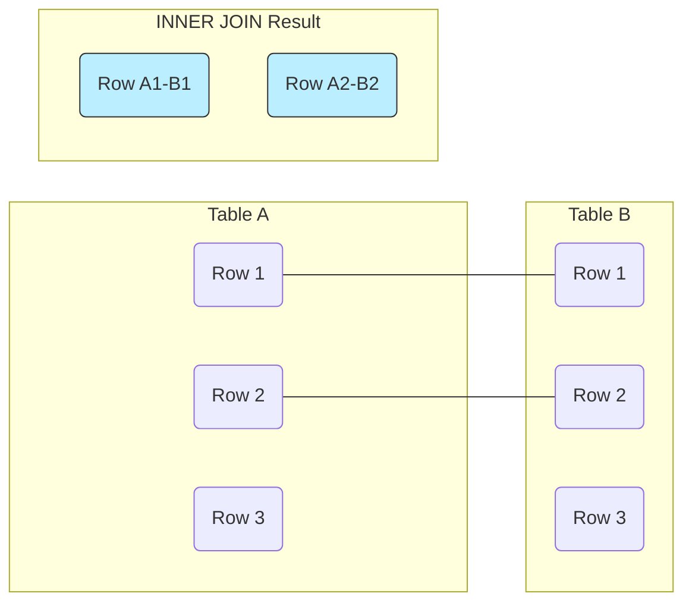

# PostgreSQL INNER JOIN

## Introduction

When working with relational databases like PostgreSQL, data is typically spread across multiple tables to minimize redundancy and improve data integrity. However, you'll often need to retrieve related data from multiple tables in a single query. This is where **JOIN** operations become essential.

The **INNER JOIN** is the most common type of join in PostgreSQL. It returns rows from both tables where there is a match between the specified columns. Think of it as finding the intersection between two tables based on a common column.

## Understanding INNER JOIN Syntax

The basic syntax for an INNER JOIN in PostgreSQL is:

```sql
SELECT columns
FROM table1
INNER JOIN table2 ON table1.column = table2.column;
```

Let's break down this syntax:

1. `SELECT columns`: Specify which columns you want to retrieve from either table
2. `FROM table1`: Identify the first table in the join
3. `INNER JOIN table2`: Specify the second table to join with
4. `ON table1.column = table2.column`: Define the join condition that connects the tables

Note that `INNER JOIN` can also be written simply as `JOIN` since INNER is the default join type in PostgreSQL.

## Basic INNER JOIN Example

Let's set up two simple tables to demonstrate how INNER JOIN works:

```sql
-- Create a table for departments
CREATE TABLE departments (
    department_id SERIAL PRIMARY KEY,
    department_name VARCHAR(100) NOT NULL
);

-- Create a table for employees
CREATE TABLE employees (
    employee_id SERIAL PRIMARY KEY,
    first_name VARCHAR(50) NOT NULL,
    last_name VARCHAR(50) NOT NULL,
    department_id INT,
    FOREIGN KEY (department_id) REFERENCES departments(department_id)
);

-- Insert sample data into departments
INSERT INTO departments (department_name)
VALUES 
    ('Engineering'),
    ('Marketing'),
    ('Human Resources'),
    ('Finance');

-- Insert sample data into employees
INSERT INTO employees (first_name, last_name, department_id)
VALUES
    ('John', 'Doe', 1),
    ('Jane', 'Smith', 2),
    ('Mike', 'Johnson', 1),
    ('Sarah', 'Williams', 3),
    ('David', 'Brown', 2),
    ('Emily', 'Davis', NULL),
    ('Robert', 'Wilson', 1);
```

Now, let's perform an INNER JOIN to get a list of employees with their department names:

```sql
SELECT e.employee_id, e.first_name, e.last_name, d.department_name
FROM employees e
INNER JOIN departments d ON e.department_id = d.department_id;
```

This query will produce the following output:

```
 employee_id | first_name | last_name | department_name
-------------+------------+-----------+----------------
           1 | John       | Doe       | Engineering
           2 | Jane       | Smith     | Marketing
           3 | Mike       | Johnson   | Engineering
           4 | Sarah      | Williams  | Human Resources
           5 | David      | Brown     | Marketing
           7 | Robert     | Wilson    | Engineering
(6 rows)
```

Notice that Emily Davis does not appear in the result set because she has a `NULL` department_id, which means there's no matching department. INNER JOIN only returns rows where there's a match between both tables.

## Visual Representation of INNER JOIN

To better understand how INNER JOIN works, here's a visual representation:



The INNER JOIN result only includes rows where there's a matching value in both tables.

## Joining Multiple Tables

You can extend INNER JOIN to combine data from more than two tables. Let's add a third table to our example:

```sql
-- Create a table for projects
CREATE TABLE projects (
    project_id SERIAL PRIMARY KEY,
    project_name VARCHAR(100) NOT NULL,
    department_id INT,
    FOREIGN KEY (department_id) REFERENCES departments(department_id)
);

-- Insert sample data into projects
INSERT INTO projects (project_name, department_id)
VALUES
    ('Website Redesign', 2),
    ('Database Migration', 1),
    ('Employee Onboarding System', 3),
    ('Financial Reporting Tool', 4),
    ('Mobile App Development', 1);
```

Now, let's join all three tables to find which employees are in departments that have active projects:

```sql
SELECT e.first_name, e.last_name, d.department_name, p.project_name
FROM employees e
INNER JOIN departments d ON e.department_id = d.department_id
INNER JOIN projects p ON d.department_id = p.department_id
ORDER BY e.last_name;
```

This query will return:

```
 first_name | last_name | department_name | project_name
------------+-----------+----------------+------------------------
 David      | Brown     | Marketing      | Website Redesign
 John       | Doe       | Engineering    | Database Migration
 John       | Doe       | Engineering    | Mobile App Development
 Mike       | Johnson   | Engineering    | Database Migration
 Mike       | Johnson   | Engineering    | Mobile App Development
 Jane       | Smith     | Marketing      | Website Redesign
 Sarah      | Williams  | Human Resources| Employee Onboarding System
 Robert     | Wilson    | Engineering    | Database Migration
 Robert     | Wilson    | Engineering    | Mobile App Development
(9 rows)
```

Notice how some employees appear multiple times if their department has multiple projects.

## Using Alias and Selecting Specific Columns

When working with JOINs, it's good practice to use table aliases to make your queries more readable, especially when selecting columns that have the same name in different tables:

```sql
SELECT 
    e.employee_id,
    CONCAT(e.first_name, ' ', e.last_name) AS employee_name,
    d.department_name
FROM 
    employees AS e
INNER JOIN 
    departments AS d ON e.department_id = d.department_id
ORDER BY 
    d.department_name, 
    employee_name;
```

Output:

```
 employee_id | employee_name   | department_name
-------------+-----------------+----------------
           1 | John Doe        | Engineering
           3 | Mike Johnson    | Engineering
           7 | Robert Wilson   | Engineering
           4 | Sarah Williams  | Human Resources
           2 | Jane Smith      | Marketing
           5 | David Brown     | Marketing
(6 rows)
```

## Real-World Application: Sales Dashboard

Let's explore a real-world example where INNER JOIN is useful. Imagine we have a sales database with customers, orders, and products:

```sql
-- Create tables
CREATE TABLE customers (
    customer_id SERIAL PRIMARY KEY,
    customer_name VARCHAR(100) NOT NULL,
    email VARCHAR(100) UNIQUE NOT NULL
);

CREATE TABLE products (
    product_id SERIAL PRIMARY KEY,
    product_name VARCHAR(100) NOT NULL,
    price DECIMAL(10, 2) NOT NULL
);

CREATE TABLE orders (
    order_id SERIAL PRIMARY KEY,
    customer_id INT NOT NULL,
    order_date DATE NOT NULL,
    FOREIGN KEY (customer_id) REFERENCES customers(customer_id)
);

CREATE TABLE order_items (
    order_item_id SERIAL PRIMARY KEY,
    order_id INT NOT NULL,
    product_id INT NOT NULL,
    quantity INT NOT NULL,
    FOREIGN KEY (order_id) REFERENCES orders(order_id),
    FOREIGN KEY (product_id) REFERENCES products(product_id)
);

-- Insert sample data
INSERT INTO customers (customer_name, email)
VALUES 
    ('Alice Johnson', 'alice@example.com'),
    ('Bob Smith', 'bob@example.com'),
    ('Carol Davis', 'carol@example.com');

INSERT INTO products (product_name, price)
VALUES 
    ('Laptop', 1200.00),
    ('Smartphone', 800.00),
    ('Tablet', 500.00),
    ('Headphones', 150.00);

INSERT INTO orders (customer_id, order_date)
VALUES 
    (1, '2023-06-15'),
    (2, '2023-06-16'),
    (3, '2023-06-17'),
    (1, '2023-06-18');

INSERT INTO order_items (order_id, product_id, quantity)
VALUES 
    (1, 1, 1),
    (1, 4, 2),
    (2, 2, 1),
    (3, 3, 1),
    (3, 4, 1),
    (4, 2, 1);
```

Now, let's build a query for a sales dashboard that shows customer orders with product details:

```sql
SELECT 
    c.customer_name,
    o.order_id,
    o.order_date,
    p.product_name,
    p.price,
    oi.quantity,
    (p.price * oi.quantity) AS item_total
FROM 
    customers c
INNER JOIN 
    orders o ON c.customer_id = o.customer_id
INNER JOIN 
    order_items oi ON o.order_id = oi.order_id
INNER JOIN 
    products p ON oi.product_id = p.product_id
ORDER BY 
    o.order_date DESC, 
    c.customer_name;
```

Output:

```
 customer_name | order_id | order_date | product_name | price  | quantity | item_total
---------------+----------+------------+--------------+--------+----------+------------
 Alice Johnson |        4 | 2023-06-18 | Smartphone   | 800.00 |        1 |     800.00
 Carol Davis   |        3 | 2023-06-17 | Tablet       | 500.00 |        1 |     500.00
 Carol Davis   |        3 | 2023-06-17 | Headphones   | 150.00 |        1 |     150.00
 Bob Smith     |        2 | 2023-06-16 | Smartphone   | 800.00 |        1 |     800.00
 Alice Johnson |        1 | 2023-06-15 | Laptop       | 1200.00|        1 |    1200.00
 Alice Johnson |        1 | 2023-06-15 | Headphones   | 150.00 |        2 |     300.00
(6 rows)
```

This query combines data from four tables to create a comprehensive sales report showing who bought what, when, and for how much.

## INNER JOIN with Conditions

You can add additional conditions to refine your INNER JOIN results using the WHERE clause:

```sql
SELECT 
    e.first_name, 
    e.last_name, 
    d.department_name
FROM 
    employees e
INNER JOIN 
    departments d ON e.department_id = d.department_id
WHERE 
    d.department_name = 'Engineering'
    AND e.last_name LIKE 'J%';
```

Output:

```
 first_name | last_name | department_name
------------+-----------+----------------
 Mike       | Johnson   | Engineering
(1 row)
```

## Common Mistakes and Best Practices

### 1. Forgetting to Specify Join Conditions

Always include the ON clause with your join condition:

```sql
-- Incorrect (will produce a Cartesian product)
SELECT e.first_name, d.department_name
FROM employees e
INNER JOIN departments d;

-- Correct
SELECT e.first_name, d.department_name
FROM employees e
INNER JOIN departments d ON e.department_id = d.department_id;
```

### 2. Ambiguous Column Names

When tables share column names, always specify which table the column belongs to:

```sql
-- Ambiguous (both tables have id columns)
SELECT id, first_name, department_name
FROM employees
INNER JOIN departments ON employees.department_id = departments.department_id;

-- Clear and unambiguous
SELECT e.employee_id, e.first_name, d.department_name
FROM employees e
INNER JOIN departments d ON e.department_id = d.department_id;
```

### 3. Inefficient Join Conditions

For optimal performance, join on indexed columns when possible, typically primary and foreign keys.

## Summary

INNER JOIN is a fundamental SQL operation in PostgreSQL that allows you to combine data from multiple tables based on matching column values. Key points to remember:

- INNER JOIN returns only rows that have matching values in both tables
- The ON clause specifies the condition for matching rows
- You can use table aliases to make queries more readable
- Multiple tables can be joined in a single query
- WHERE clauses can be added to filter the results further

INNER JOIN is just one of several join types in PostgreSQL, but it's the most commonly used and forms the foundation for understanding more complex join operations.

## Exercises

1. Create two tables of your choice with a common column and practice writing INNER JOIN queries.
2. Write a query to find all employees and their department names, but only for departments with more than 1 employee.
3. Modify the sales dashboard query to calculate the total amount spent by each customer.
4. Write a three-table join query combining employees, departments, and a new "locations" table.

## Additional Resources

- [PostgreSQL Official Documentation on Joins](https://www.postgresql.org/docs/current/tutorial-join.html)
- [PostgreSQL INNER JOIN Performance Tips](https://www.postgresql.org/docs/current/performance-tips.html)
- Practice platforms like [PostgreSQL Exercises](https://pgexercises.com/)

Happy coding!