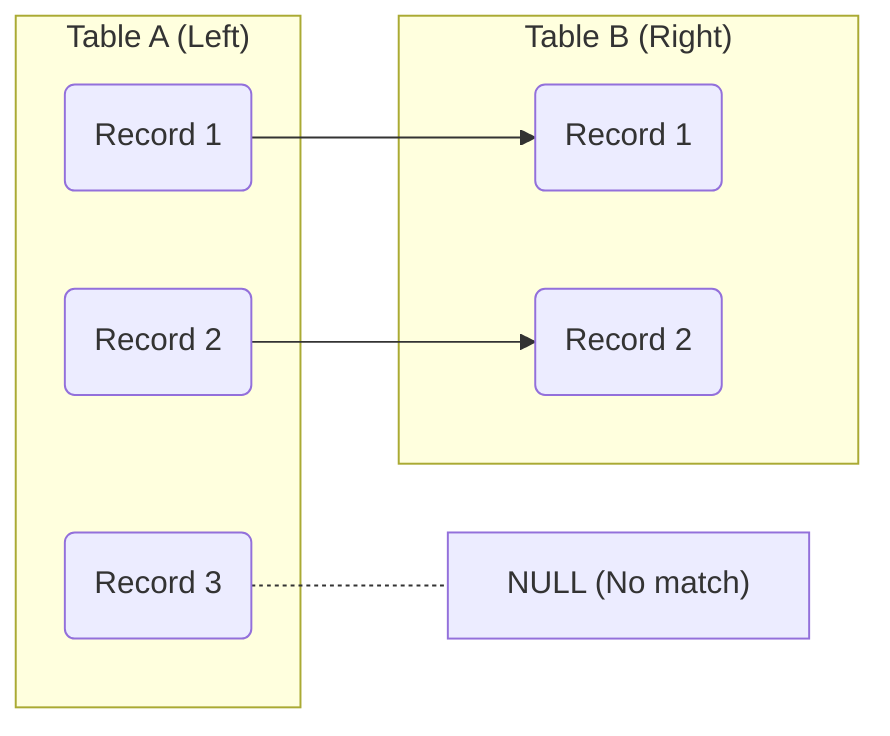

# PostgreSQL LEFT JOIN

## Introduction

When working with relational databases like PostgreSQL, data is often spread across multiple tables. Joins allow you to combine data from these tables into meaningful result sets. The **LEFT JOIN** (sometimes called LEFT OUTER JOIN) is particularly useful when you need all records from one table, regardless of whether there are matching records in another table.

In this tutorial, you'll learn:
- What a LEFT JOIN is and how it differs from other join types
- The syntax for performing LEFT JOINs in PostgreSQL
- Common use cases and practical examples
- Best practices and potential pitfalls

## Understanding LEFT JOIN

A LEFT JOIN returns *all* records from the left table (the table mentioned before the JOIN keyword) and only the matching records from the right table. If there's no match in the right table, NULL values are returned for the right table's columns.

Let's visualize how LEFT JOIN works:



## Basic Syntax

The basic syntax for a PostgreSQL LEFT JOIN is:

```sql
SELECT column1, column2, ...
FROM table1
LEFT JOIN table2
ON table1.column_name = table2.column_name;
```

Where:
- `table1` is the left table (all records will be included)
- `table2` is the right table (only matching records will be included)
- The `ON` clause specifies the join condition

## Setting Up Example Tables

To demonstrate LEFT JOINs, let's create two tables: `customers` and `orders`:

```sql
CREATE TABLE customers (
    customer_id SERIAL PRIMARY KEY,
    name VARCHAR(100) NOT NULL,
    email VARCHAR(100),
    signup_date DATE NOT NULL
);

CREATE TABLE orders (
    order_id SERIAL PRIMARY KEY,
    customer_id INT REFERENCES customers(customer_id),
    order_date DATE NOT NULL,
    amount DECIMAL(10, 2) NOT NULL
);

-- Insert sample data into customers
INSERT INTO customers (name, email, signup_date) VALUES
('John Smith', 'john@example.com', '2023-01-15'),
('Mary Johnson', 'mary@example.com', '2023-02-20'),
('Robert Brown', 'robert@example.com', '2023-03-10'),
('Patricia Davis', 'patricia@example.com', '2023-04-05'),
('Michael Wilson', 'michael@example.com', '2023-05-12');

-- Insert sample data into orders
INSERT INTO orders (customer_id, order_date, amount) VALUES
(1, '2023-01-20', 150.50),
(1, '2023-02-10', 89.99),
(2, '2023-02-25', 45.25),
(3, '2023-03-15', 199.99),
(3, '2023-04-02', 55.75);
```

Notice that customers with IDs 4 and 5 (Patricia and Michael) haven't placed any orders yet.

## Basic LEFT JOIN Example

Let's retrieve all customers and their orders, including customers who haven't placed any orders:

```sql
SELECT 
    c.customer_id,
    c.name,
    c.email,
    o.order_id,
    o.order_date,
    o.amount
FROM 
    customers c
LEFT JOIN 
    orders o
ON 
    c.customer_id = o.customer_id
ORDER BY 
    c.customer_id, o.order_id;
```

**Result:**

```
 customer_id |     name      |       email        | order_id | order_date |  amount  
-------------+---------------+--------------------+----------+------------+----------
           1 | John Smith    | john@example.com   |        1 | 2023-01-20 |   150.50
           1 | John Smith    | john@example.com   |        2 | 2023-02-10 |    89.99
           2 | Mary Johnson  | mary@example.com   |        3 | 2023-02-25 |    45.25
           3 | Robert Brown  | robert@example.com |        4 | 2023-03-15 |   199.99
           3 | Robert Brown  | robert@example.com |        5 | 2023-04-02 |    55.75
           4 | Patricia Davis| patricia@example.com |     NULL | NULL      |    NULL
           5 | Michael Wilson| michael@example.com |     NULL | NULL      |    NULL
(7 rows)
```

Notice how Patricia Davis and Michael Wilson appear in the results with NULL values for the order information, since they haven't placed any orders yet.

## Practical Use Cases

### 1. Finding Customers with No Orders

To find customers who haven't placed any orders:

```sql
SELECT 
    c.customer_id,
    c.name,
    c.email
FROM 
    customers c
LEFT JOIN 
    orders o
ON 
    c.customer_id = o.customer_id
WHERE 
    o.order_id IS NULL;
```

**Result:**

```
 customer_id |      name      |        email         
-------------+----------------+----------------------
           4 | Patricia Davis | patricia@example.com
           5 | Michael Wilson | michael@example.com
(2 rows)
```

### 2. Counting Orders per Customer (Including Customers with Zero Orders)

```sql
SELECT 
    c.customer_id,
    c.name,
    COUNT(o.order_id) AS order_count,
    COALESCE(SUM(o.amount), 0) AS total_spent
FROM 
    customers c
LEFT JOIN 
    orders o
ON 
    c.customer_id = o.customer_id
GROUP BY 
    c.customer_id, c.name
ORDER BY 
    c.customer_id;
```

**Result:**

```
 customer_id |      name      | order_count | total_spent 
-------------+----------------+-------------+-------------
           1 | John Smith     |           2 |      240.49
           2 | Mary Johnson   |           1 |       45.25
           3 | Robert Brown   |           2 |      255.74
           4 | Patricia Davis |           0 |        0.00
           5 | Michael Wilson |           0 |        0.00
(5 rows)
```

### 3. Multi-table LEFT JOIN

Let's add a third table to demonstrate a multi-table LEFT JOIN:

```sql
CREATE TABLE shipments (
    shipment_id SERIAL PRIMARY KEY,
    order_id INT REFERENCES orders(order_id),
    shipment_date DATE NOT NULL,
    tracking_number VARCHAR(50)
);

-- Insert sample data into shipments
INSERT INTO shipments (order_id, shipment_date, tracking_number) VALUES
(1, '2023-01-21', 'TRK123456'),
(2, '2023-02-11', 'TRK234567'),
(4, '2023-03-16', 'TRK345678');
```

Now let's join all three tables:

```sql
SELECT 
    c.name AS customer_name,
    o.order_id,
    o.order_date,
    o.amount,
    s.shipment_id,
    s.shipment_date,
    s.tracking_number
FROM 
    customers c
LEFT JOIN 
    orders o ON c.customer_id = o.customer_id
LEFT JOIN 
    shipments s ON o.order_id = s.order_id
ORDER BY 
    c.name, o.order_id;
```

**Result:**

```
 customer_name  | order_id | order_date |  amount  | shipment_id | shipment_date | tracking_number 
----------------+----------+------------+----------+-------------+---------------+-----------------
 John Smith     |        1 | 2023-01-20 |   150.50 |           1 | 2023-01-21    | TRK123456
 John Smith     |        2 | 2023-02-10 |    89.99 |           2 | 2023-02-11    | TRK234567
 Mary Johnson   |        3 | 2023-02-25 |    45.25 |        NULL | NULL          | NULL
 Michael Wilson |     NULL | NULL       |     NULL |        NULL | NULL          | NULL
 Patricia Davis |     NULL | NULL       |     NULL |        NULL | NULL          | NULL
 Robert Brown   |        4 | 2023-03-15 |   199.99 |           3 | 2023-03-16    | TRK345678
 Robert Brown   |        5 | 2023-04-02 |    55.75 |        NULL | NULL          | NULL
(7 rows)
```

This result shows customers, their orders, and shipment information, including customers without orders and orders without shipments.

## LEFT JOIN vs. INNER JOIN

It's important to understand the difference between LEFT JOIN and INNER JOIN:

- A LEFT JOIN returns all records from the left table and matching records from the right table
- An INNER JOIN only returns records where there's a match in both tables

Let's compare:

```sql
-- INNER JOIN (only customers with orders)
SELECT 
    c.name, 
    o.order_id
FROM 
    customers c
INNER JOIN 
    orders o ON c.customer_id = o.customer_id
ORDER BY 
    c.name;

-- LEFT JOIN (all customers, with or without orders)
SELECT 
    c.name, 
    o.order_id
FROM 
    customers c
LEFT JOIN 
    orders o ON c.customer_id = o.customer_id
ORDER BY 
    c.name;
```

**INNER JOIN Result:**
```
     name     | order_id 
--------------+----------
 John Smith   |        1
 John Smith   |        2
 Mary Johnson |        3
 Robert Brown |        4
 Robert Brown |        5
(5 rows)
```

**LEFT JOIN Result:**
```
      name      | order_id 
----------------+----------
 John Smith     |        1
 John Smith     |        2
 Mary Johnson   |        3
 Michael Wilson |     NULL
 Patricia Davis |     NULL
 Robert Brown   |        4
 Robert Brown   |        5
(7 rows)
```

Notice that the INNER JOIN excludes Patricia Davis and Michael Wilson since they don't have matching orders.

## Common LEFT JOIN Patterns

### Using COALESCE with LEFT JOINs

When working with LEFT JOINs, you'll often use `COALESCE` to replace NULL values with something more meaningful:

```sql
SELECT 
    c.name,
    COALESCE(o.order_id::TEXT, 'No orders') AS order_info
FROM 
    customers c
LEFT JOIN 
    orders o ON c.customer_id = o.customer_id;
```

### Finding Missing Relationships

LEFT JOINs are perfect for audit queries to find missing data:

```sql
-- Find orders without shipments
SELECT 
    o.order_id, 
    o.order_date, 
    o.amount, 
    'Not shipped yet' AS status
FROM 
    orders o
LEFT JOIN 
    shipments s ON o.order_id = s.order_id
WHERE 
    s.shipment_id IS NULL;
```

## Best Practices and Tips

1. **Alias your tables** to make queries more readable, especially with multiple joins
2. **Be specific about the columns** you select to avoid ambiguity
3. **Use appropriate indexes** on join columns for better performance
4. **Be careful with multiple LEFT JOINs** as they can produce large result sets with lots of NULL values
5. **Consider using COALESCE or NULLIF** when working with NULL values in LEFT JOIN results
6. **Pay attention to the join order** - the table order matters in LEFT JOINs

## Summary

LEFT JOIN is a powerful SQL operator that allows you to retrieve all records from one table and matching records from another. It's especially useful when:

- You need to include all records from a primary table, regardless of whether they have related records
- You want to find records that don't have matching relationships
- You need to perform data analysis that includes "zero" cases

By understanding LEFT JOINs, you've added an important tool to your PostgreSQL toolkit that will help you write more flexible and powerful queries.

## Exercises

To practice your LEFT JOIN skills, try these exercises:

1. Create a new table `customer_address` that stores address information for customers, but only add addresses for 3 out of the 5 customers. Then use a LEFT JOIN to find customers without addresses.

2. Write a query that shows each customer's name, total orders, total amount spent, and average order value. Include customers who haven't placed orders.

3. Add a `product` table and an `order_items` table to create a more realistic database schema. Then write a query that shows all products and how many times each product has been ordered, including products that have never been ordered.

## Additional Resources

- [PostgreSQL Official Documentation on Joins](https://www.postgresql.org/docs/current/tutorial-join.html)
- [SQL Joins Explained](https://www.postgresqltutorial.com/postgresql-tutorial/postgresql-joins/)
- [SQL Performance Tuning for Joins](https://www.postgresql.org/docs/current/using-explain.html)