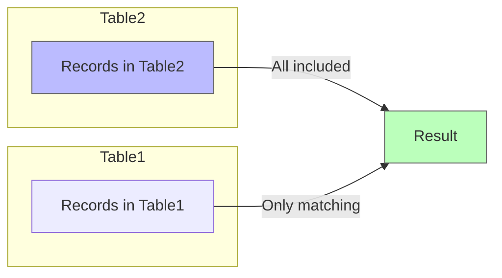

# PostgreSQL RIGHT JOIN

## Introduction

A RIGHT JOIN is a type of outer join operation in PostgreSQL that returns all rows from the right table (the second table mentioned in the query), and any matching rows from the left table (the first table mentioned). If there is no match in the left table, NULL values are returned for the left table's columns.

RIGHT JOINs are less commonly used than LEFT JOINs, but they serve an important purpose in certain query scenarios, especially when you need to ensure all records from a particular table are included in your results regardless of whether they have matching records in other tables.

## Syntax

The basic syntax for a RIGHT JOIN in PostgreSQL is:

```sql
SELECT columns
FROM table1
RIGHT JOIN table2
ON table1.column = table2.column;
```

Let's break down this syntax:

- `SELECT columns`: Specifies which columns you want to retrieve
- `FROM table1`: The first or "left" table in the join
- `RIGHT JOIN table2`: The second or "right" table in the join
- `ON table1.column = table2.column`: The join condition that specifies how the tables should be related

## Visual Representation

Here's a visual representation of how RIGHT JOIN works:



## Basic Example

Let's start with a simple example. Consider two tables: `employees` and `departments`.

First, let's create these tables and insert some sample data:

```sql
-- Create employees table
CREATE TABLE employees (
    employee_id SERIAL PRIMARY KEY,
    employee_name VARCHAR(100),
    department_id INT
);

-- Create departments table
CREATE TABLE departments (
    department_id SERIAL PRIMARY KEY,
    department_name VARCHAR(100)
);

-- Insert sample data into employees
INSERT INTO employees (employee_name, department_id)
VALUES
    ('John Doe', 1),
    ('Jane Smith', 2),
    ('Michael Johnson', 1),
    ('Sarah Williams', 3),
    ('Robert Brown', NULL);

-- Insert sample data into departments
INSERT INTO departments (department_id, department_name)
VALUES
    (1, 'Engineering'),
    (2, 'Marketing'),
    (4, 'Finance'),
    (5, 'Human Resources');
```

Now, let's perform a RIGHT JOIN to get all departments and their employees (if any):

```sql
SELECT e.employee_name, d.department_name
FROM employees e
RIGHT JOIN departments d
ON e.department_id = d.department_id
ORDER BY d.department_name;
```

The result will be:

| employee_name   | department_name  |
|-----------------|------------------|
| John Doe        | Engineering      |
| Michael Johnson | Engineering      |
| NULL            | Finance          |
| NULL            | Human Resources  |
| Jane Smith      | Marketing        |

Notice that:
- All departments are included in the result, even if they don't have any employees.
- The departments "Finance" and "Human Resources" appear with NULL values for employee_name because no employees are assigned to these departments.
- The employee "Robert Brown" who has a NULL department_id does not appear in the results, as RIGHT JOIN only guarantees all rows from the right table.

## RIGHT JOIN vs LEFT JOIN

It's important to understand that a RIGHT JOIN can be rewritten as a LEFT JOIN by switching the table order:

```sql
-- RIGHT JOIN version
SELECT e.employee_name, d.department_name
FROM employees e
RIGHT JOIN departments d
ON e.department_id = d.department_id;

-- Equivalent LEFT JOIN version
SELECT e.employee_name, d.department_name
FROM departments d
LEFT JOIN employees e
ON d.department_id = e.department_id;
```

Both queries produce the same results. In practice, many developers prefer to consistently use LEFT JOIN and arrange the tables accordingly, rather than switching between LEFT and RIGHT JOINs.

## Handling NULL Values

When working with RIGHT JOINs, you'll often need to handle NULL values appropriately. Let's see how to do this using the IS NULL operator:

```sql
-- Find departments with no employees
SELECT d.department_id, d.department_name, 'No employees assigned' AS status
FROM employees e
RIGHT JOIN departments d
ON e.department_id = d.department_id
WHERE e.employee_id IS NULL;
```

The result will be:

| department_id | department_name  | status               |
|---------------|------------------|----------------------|
| 4             | Finance          | No employees assigned |
| 5             | Human Resources  | No employees assigned |

This query identifies departments that don't have any employees assigned to them.

## Practical Real-World Example

Let's consider a more complex real-world example involving an e-commerce database.

Imagine we have three tables:
- `products`: Contains product information
- `categories`: Contains product category information
- `product_sales`: Contains sales information for products

```sql
-- Create tables
CREATE TABLE categories (
    category_id SERIAL PRIMARY KEY,
    category_name VARCHAR(100)
);

CREATE TABLE products (
    product_id SERIAL PRIMARY KEY,
    product_name VARCHAR(100),
    category_id INT,
    price DECIMAL(10, 2)
);

CREATE TABLE product_sales (
    sale_id SERIAL PRIMARY KEY,
    product_id INT,
    sale_date DATE,
    quantity INT
);

-- Insert sample data
INSERT INTO categories (category_id, category_name)
VALUES
    (1, 'Electronics'),
    (2, 'Clothing'),
    (3, 'Books'),
    (4, 'Home & Kitchen');

INSERT INTO products (product_name, category_id, price)
VALUES
    ('Smartphone', 1, 699.99),
    ('Laptop', 1, 1299.99),
    ('T-shirt', 2, 19.99),
    ('Novel', 3, 14.99);

INSERT INTO product_sales (product_id, sale_date, quantity)
VALUES
    (1, '2023-01-15', 5),
    (2, '2023-01-16', 2),
    (1, '2023-01-17', 3);
```

Now, let's use a RIGHT JOIN to find all categories and their sales statistics (including categories with no products or sales):

```sql
SELECT 
    c.category_name,
    COUNT(DISTINCT p.product_id) AS product_count,
    COALESCE(SUM(ps.quantity), 0) AS total_units_sold,
    COALESCE(SUM(ps.quantity * p.price), 0) AS total_revenue
FROM product_sales ps
RIGHT JOIN products p ON ps.product_id = p.product_id
RIGHT JOIN categories c ON p.category_id = c.category_id
GROUP BY c.category_id, c.category_name
ORDER BY c.category_name;
```

The result will be:

| category_name   | product_count | total_units_sold | total_revenue |
|-----------------|---------------|------------------|---------------|
| Books           | 1             | 0                | 0.00          |
| Clothing        | 1             | 0                | 0.00          |
| Electronics     | 2             | 10               | 9399.85       |
| Home & Kitchen  | 0             | 0                | 0.00          |

This query provides a comprehensive view of all categories, showing:
- All categories, even those without any products or sales
- The number of products in each category
- Total units sold for each category
- Total revenue generated by each category

This is particularly useful for reporting and analysis, as it gives a complete picture including categories that might need more attention due to having no products or sales.

## Multiple RIGHT JOINs

You can chain multiple RIGHT JOINs together to ensure that records from several tables are included in your results:

```sql
SELECT 
    d.department_name,
    e.employee_name,
    p.project_name
FROM employees e
RIGHT JOIN departments d ON e.department_id = d.department_id
LEFT JOIN projects p ON e.employee_id = p.employee_id
ORDER BY d.department_name, e.employee_name;
```

In this example, we're using a RIGHT JOIN to ensure all departments are included, and then a LEFT JOIN to include any projects that the employees might be working on.

## When to Use RIGHT JOIN

RIGHT JOIN is particularly useful in the following scenarios:

1. **Comprehensive reporting**: When you need to include all records from a specific table, regardless of whether they have related records in other tables

2. **Finding "orphaned" records**: When you want to identify records in the right table that don't have corresponding matches in the left table

3. **Data validation**: To check if all records in one table have the expected relationships with another table

4. **When table order matters**: In some complex queries where the order of tables is important for readability or performance reasons

## Common Mistakes and Troubleshooting

1. **Confusing LEFT and RIGHT JOINs**: Remember that RIGHT JOIN keeps all records from the second (right) table, while LEFT JOIN keeps all records from the first (left) table.

2. **Forgetting about NULL values**: When using RIGHT JOINs, be prepared to handle NULL values for columns from the left table.

3. **Using WHERE instead of ON for join conditions**: Make sure to put the join conditions in the ON clause, not the WHERE clause, as this can change the behavior of the join.

4. **Performance considerations**: In some cases, RIGHT JOINs may not perform as well as LEFT JOINs due to how database query optimizers work. Consider rewriting as a LEFT JOIN if you encounter performance issues.

## Summary

PostgreSQL RIGHT JOIN is a powerful tool for combining data from multiple tables while ensuring that all records from the right table are included in the results. While it's used less frequently than LEFT JOIN, it provides valuable functionality in specific scenarios.

Key points to remember:
- RIGHT JOIN returns all rows from the right table and matching rows from the left table
- NULL values appear for left table columns when there's no match
- You can rewrite any RIGHT JOIN as a LEFT JOIN by switching the table order
- RIGHT JOINs are particularly useful for comprehensive reporting and finding missing relationships

## Practice Exercises

1. Create two tables, `customers` and `orders`, and write a RIGHT JOIN query to find all orders and their associated customer information (if available).

2. Modify the query to find orders that don't have an associated customer.

3. Rewrite the RIGHT JOIN query from exercise 1 as an equivalent LEFT JOIN query.

4. Create a third table `order_items` and write a query using multiple joins to get a complete report of all orders, their items, and customer information.

## Additional Resources

- [PostgreSQL Official Documentation on Joins](https://www.postgresql.org/docs/current/tutorial-join.html)
- [SQL Joins Visualized](https://joins.spathon.com/)
- [PostgreSQL FULL OUTER JOIN Tutorial](https://www.postgresqltutorial.com/postgresql-tutorial/postgresql-full-outer-join/)