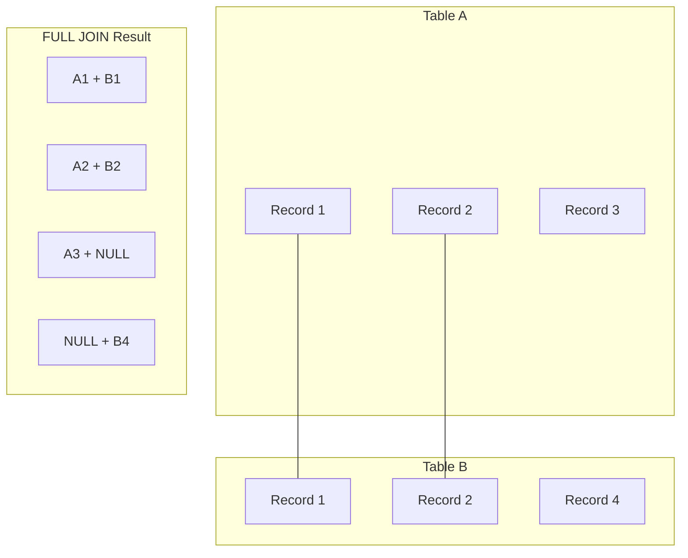

# PostgreSQL FULL JOIN

## Introduction

A FULL JOIN (also known as FULL OUTER JOIN) is one of the most comprehensive join operations available in PostgreSQL. Unlike INNER JOIN which only returns matching rows, or LEFT/RIGHT JOINs which favor one table, a FULL JOIN returns **all rows from both tables**, regardless of whether there are matching rows in the other table.

When no matching row exists in the second table, the result will contain NULL values for the columns of the second table, and vice versa. This makes FULL JOIN particularly useful when you want to identify missing or unmatched data between two tables.

## Syntax

The basic syntax for a FULL JOIN in PostgreSQL is:

```sql
SELECT columns
FROM table1
FULL JOIN table2
ON table1.column = table2.column;
```

You can also write it as FULL OUTER JOIN, which is equivalent:

```sql
SELECT columns
FROM table1
FULL OUTER JOIN table2
ON table1.column = table2.column;
```

## Visual Representation

Here's a visual representation of how FULL JOIN works:



## Basic Example

Let's create two simple tables to demonstrate FULL JOIN:

```sql
-- Create departments table
CREATE TABLE departments (
    dept_id SERIAL PRIMARY KEY,
    dept_name VARCHAR(100) NOT NULL
);

-- Create employees table
CREATE TABLE employees (
    emp_id SERIAL PRIMARY KEY,
    name VARCHAR(100) NOT NULL,
    dept_id INT,
    FOREIGN KEY (dept_id) REFERENCES departments(dept_id)
);

-- Insert sample data
INSERT INTO departments (dept_id, dept_name) VALUES 
(1, 'HR'),
(2, 'Engineering'),
(3, 'Marketing'),
(4, 'Finance');

INSERT INTO employees (name, dept_id) VALUES 
('John Doe', 1),
('Jane Smith', 2),
('Emily Davis', 2),
('Michael Johnson', 3),
('David Wilson', NULL);
```

Now, let's use a FULL JOIN to combine these tables:

```sql
SELECT e.emp_id, e.name, d.dept_id, d.dept_name
FROM employees e
FULL JOIN departments d ON e.dept_id = d.dept_id;
```

The result would be:

| emp_id | name           | dept_id | dept_name   |
|--------|----------------|---------|-------------|
| 1      | John Doe       | 1       | HR          |
| 2      | Jane Smith     | 2       | Engineering |
| 3      | Emily Davis    | 2       | Engineering |
| 4      | Michael Johnson| 3       | Marketing   |
| 5      | David Wilson   | NULL    | NULL        |
| NULL   | NULL           | 4       | Finance     |

Notice the FULL JOIN gives us:
1. All matched employee-department pairs
2. David Wilson who doesn't belong to any department (NULL dept_name)
3. The Finance department which has no employees (NULL emp_id and name)

## Finding Missing Relationships

One of the most common use cases for FULL JOIN is to identify missing relationships between tables:

```sql
SELECT e.emp_id, e.name, d.dept_id, d.dept_name
FROM employees e
FULL JOIN departments d ON e.dept_id = d.dept_id
WHERE e.emp_id IS NULL OR d.dept_id IS NULL;
```

The result shows only unmatched rows:

| emp_id | name         | dept_id | dept_name |
|--------|--------------|---------|-----------|
| 5      | David Wilson | NULL    | NULL      |
| NULL   | NULL         | 4       | Finance   |

This query helps identify:
- Employees not assigned to any department
- Departments with no employees

## Combining Multiple Tables

FULL JOIN can be extended to more than two tables:

```sql
SELECT e.emp_id, e.name, d.dept_name, p.project_name
FROM employees e
FULL JOIN departments d ON e.dept_id = d.dept_id
FULL JOIN projects p ON e.emp_id = p.emp_id;
```

## Real-World Applications

### 1. Data Integrity Checking

FULL JOIN is excellent for validating data integrity across related tables:

```sql
-- Find orders without customers or customers without orders
SELECT c.customer_id, c.name, o.order_id, o.order_date
FROM customers c
FULL JOIN orders o ON c.customer_id = o.customer_id
WHERE c.customer_id IS NULL OR o.order_id IS NULL;
```

### 2. Reporting with Complete Data

When generating reports, FULL JOIN ensures you include all data even if relationships are incomplete:

```sql
-- Complete sales report including products with no sales
SELECT p.product_name, 
       COALESCE(SUM(s.quantity), 0) as total_quantity_sold,
       COALESCE(SUM(s.quantity * p.price), 0) as total_revenue
FROM products p
FULL JOIN sales s ON p.product_id = s.product_id
GROUP BY p.product_id, p.product_name
ORDER BY total_revenue DESC;
```

### 3. Comparing Data Sets

FULL JOIN is useful for comparing two data sets or two periods:

```sql
-- Compare sales between two months
SELECT 
    curr.product_id,
    p.product_name,
    curr.sales as current_month_sales,
    prev.sales as previous_month_sales,
    COALESCE(curr.sales, 0) - COALESCE(prev.sales, 0) as sales_difference
FROM 
    (SELECT product_id, SUM(amount) as sales 
     FROM sales 
     WHERE EXTRACT(MONTH FROM sale_date) = EXTRACT(MONTH FROM CURRENT_DATE)
     GROUP BY product_id) curr
FULL JOIN 
    (SELECT product_id, SUM(amount) as sales 
     FROM sales 
     WHERE EXTRACT(MONTH FROM sale_date) = EXTRACT(MONTH FROM CURRENT_DATE) - 1
     GROUP BY product_id) prev
ON curr.product_id = prev.product_id
LEFT JOIN products p ON COALESCE(curr.product_id, prev.product_id) = p.product_id;
```

## Performance Considerations

FULL JOINs can be resource-intensive since they require PostgreSQL to process all rows from both tables. Consider the following best practices:

1. Always ensure proper indexing on the join columns
2. Use WHERE clauses to filter unnecessary data before applying the JOIN
3. For large tables, consider alternative approaches if possible

## Common Mistakes and Troubleshooting

### 1. Misinterpreting NULL Values

When working with FULL JOIN, NULL values have special significance—they indicate missing relationships. Be careful when filtering with conditions like `column = NULL`, which will always fail. Use `IS NULL` instead:

```sql
-- Incorrect
SELECT * FROM table1 FULL JOIN table2 ON table1.id = table2.id WHERE table2.name = NULL;

-- Correct
SELECT * FROM table1 FULL JOIN table2 ON table1.id = table2.id WHERE table2.name IS NULL;
```

### 2. Forgetting to Handle NULLs in Calculations

When performing calculations on columns from a FULL JOIN result, always handle potential NULL values:

```sql
-- Using COALESCE to handle NULLs in calculation
SELECT 
    p.product_name,
    COALESCE(s.quantity, 0) * p.price as revenue
FROM products p
FULL JOIN sales s ON p.product_id = s.product_id;
```

## Summary

The PostgreSQL FULL JOIN operation is a powerful tool for combining data from multiple tables, ensuring that all rows from both tables are included in the result set, regardless of whether matches exist. Key points to remember:

- FULL JOIN returns all rows from both tables, with NULL values for non-matching columns
- It's particularly useful for finding missing relationships and data integrity checking
- Performance may be a concern with large tables
- Proper handling of NULL values is essential when working with FULL JOIN results

## Exercises

1. Create two tables: `students` and `courses` with a many-to-many relationship table `enrollments`. Write a FULL JOIN query to find students not enrolled in any course and courses with no students.

2. Using the employees and departments tables from our examples, write a query to calculate the percentage of employees in each department, accounting for employees not assigned to any department.

3. Create a report showing all products and their sales for the current month, including products with no sales. Format the output to display "No sales" instead of NULL or 0.

## Additional Resources

- [PostgreSQL Official Documentation on Joins](https://www.postgresql.org/docs/current/tutorial-join.html)
- [Understanding Query Plans for Joins](https://www.postgresql.org/docs/current/using-explain.html)
- Practice these concepts with interactive exercises on platforms like PostgreSQL Exercises or SQLZoo