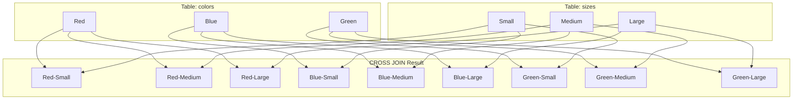

# PostgreSQL CROSS JOIN

## Introduction

A CROSS JOIN is one of the fundamental join types in PostgreSQL that creates a **Cartesian product** between two tables. Unlike other join types that match rows based on a condition, a CROSS JOIN combines each row from the first table with every row from the second table, resulting in a table with a size equal to the product of the two original table sizes.

CROSS JOINs are useful in specific scenarios where you need all possible combinations of elements from different sets of data. While potentially producing large result sets, when used correctly, they can solve unique problems in data analysis and transformation.

## Syntax

The syntax for a CROSS JOIN in PostgreSQL is straightforward:

```sql
SELECT columns
FROM table1
CROSS JOIN table2;
```

There's also an alternative syntax using the comma operator:

```sql
SELECT columns
FROM table1, table2;
```

Both syntaxes are equivalent in PostgreSQL, but the explicit `CROSS JOIN` syntax is preferred as it clearly communicates the intent of the operation.

## How CROSS JOIN Works

To understand a CROSS JOIN, consider two simple tables:

```sql
CREATE TABLE colors (
    color_id SERIAL PRIMARY KEY,
    color_name VARCHAR(20)
);

CREATE TABLE sizes (
    size_id SERIAL PRIMARY KEY,
    size_name VARCHAR(10)
);

INSERT INTO colors (color_name) VALUES 
('Red'), ('Blue'), ('Green');

INSERT INTO sizes (size_name) VALUES 
('Small'), ('Medium'), ('Large');
```

When we apply a CROSS JOIN between these tables:

```sql
SELECT c.color_name, s.size_name
FROM colors c
CROSS JOIN sizes s;
```

The result is a combination of every color with every size:

| color_name | size_name |
|------------|-----------|
| Red        | Small     |
| Red        | Medium    |
| Red        | Large     |
| Blue       | Small     |
| Blue       | Medium    |
| Blue       | Large     |
| Green      | Small     |
| Green      | Medium    |
| Green      | Large     |

This produces 9 rows (3 colors × 3 sizes) from the original 3 rows in each table.

## Visualizing a CROSS JOIN

Here's a diagram showing how CROSS JOIN works:



## Practical Applications

### 1. Generating Product Combinations

CROSS JOIN is perfect for generating all possible variations of products:

```sql
-- Creating tables for a t-shirt product line
CREATE TABLE shirt_materials (material_id SERIAL PRIMARY KEY, material TEXT);
CREATE TABLE shirt_styles (style_id SERIAL PRIMARY KEY, style TEXT);

INSERT INTO shirt_materials (material) VALUES ('Cotton'), ('Polyester'), ('Blend');
INSERT INTO shirt_styles (style) VALUES ('V-neck'), ('Crew'), ('Polo');

-- Generate all possible t-shirt combinations
SELECT 
    m.material,
    s.style,
    CONCAT(m.material, ' ', s.style, ' T-shirt') AS product_name
FROM 
    shirt_materials m
CROSS JOIN 
    shirt_styles s;
```

Result:

| material  | style  | product_name           |
|-----------|--------|------------------------|
| Cotton    | V-neck | Cotton V-neck T-shirt  |
| Cotton    | Crew   | Cotton Crew T-shirt    |
| Cotton    | Polo   | Cotton Polo T-shirt    |
| Polyester | V-neck | Polyester V-neck T-shirt |
| Polyester | Crew   | Polyester Crew T-shirt |
| Polyester | Polo   | Polyester Polo T-shirt |
| Blend     | V-neck | Blend V-neck T-shirt   |
| Blend     | Crew   | Blend Crew T-shirt     |
| Blend     | Polo   | Blend Polo T-shirt     |

### 2. Generating Date Ranges

CROSS JOIN can help create date combinations for scheduling or reporting:

```sql
-- Generate combinations of months and weekdays
WITH months AS (
    SELECT generate_series(1, 12) AS month_num,
           to_char(to_date(generate_series(1, 12)::text, 'MM'), 'Month') AS month_name
),
weekdays AS (
    SELECT generate_series(1, 7) AS day_num,
           to_char(to_date(generate_series(1, 7)::text, 'ID'), 'Day') AS day_name
)
SELECT 
    m.month_name,
    w.day_name,
    CONCAT(m.month_name, ' ', w.day_name) AS time_slot
FROM 
    months m
CROSS JOIN 
    weekdays w
ORDER BY 
    m.month_num, w.day_num
LIMIT 
    10;  -- Limiting output to 10 rows for demonstration
```

Result (first 10 rows):

| month_name | day_name  | time_slot           |
|------------|-----------|---------------------|
| January    | Monday    | January Monday      |
| January    | Tuesday   | January Tuesday     |
| January    | Wednesday | January Wednesday   |
| January    | Thursday  | January Thursday    |
| January    | Friday    | January Friday      |
| January    | Saturday  | January Saturday    |
| January    | Sunday    | January Sunday      |
| February   | Monday    | February Monday     |
| February   | Tuesday   | February Tuesday    |
| February   | Wednesday | February Wednesday  |

### 3. Data Transformation with Additional Filtering

You can combine CROSS JOIN with WHERE clauses to generate specific combinations:

```sql
-- Create sample tables
CREATE TABLE regions (region_id SERIAL PRIMARY KEY, region_name TEXT);
CREATE TABLE products (product_id SERIAL PRIMARY KEY, product_name TEXT, suitable_region_id INT);

INSERT INTO regions (region_name) VALUES 
('North America'), ('Europe'), ('Asia'), ('Australia');

INSERT INTO products (product_name, suitable_region_id) VALUES 
('Winter Jacket', 1), 
('Raincoat', 2),
('Light Sweater', 3),
('Sun Hat', 4);

-- Find all potential market opportunities, highlighting current availability
SELECT 
    r.region_name,
    p.product_name,
    CASE 
        WHEN p.suitable_region_id = r.region_id THEN 'Currently Available'
        ELSE 'Potential Opportunity'
    END AS status
FROM 
    regions r
CROSS JOIN 
    products p
ORDER BY 
    r.region_id, p.product_id;
```

Result:

| region_name   | product_name  | status              |
|---------------|---------------|---------------------|
| North America | Winter Jacket | Currently Available |
| North America | Raincoat      | Potential Opportunity |
| North America | Light Sweater | Potential Opportunity |
| North America | Sun Hat       | Potential Opportunity |
| Europe        | Winter Jacket | Potential Opportunity |
| Europe        | Raincoat      | Currently Available |
| Europe        | Light Sweater | Potential Opportunity |
| Europe        | Sun Hat       | Potential Opportunity |
| Asia          | Winter Jacket | Potential Opportunity |
| Asia          | Raincoat      | Potential Opportunity |
| Asia          | Light Sweater | Currently Available |
| Asia          | Sun Hat       | Potential Opportunity |
| Australia     | Winter Jacket | Potential Opportunity |
| Australia     | Raincoat      | Potential Opportunity |
| Australia     | Light Sweater | Potential Opportunity |
| Australia     | Sun Hat       | Currently Available |

## Performance Considerations

Since CROSS JOINs generate result sets that grow multiplicatively with the size of input tables, they can have significant performance implications:

- A CROSS JOIN between a table with 1,000 rows and another with 1,000 rows will produce 1,000,000 rows
- Always use appropriate WHERE clauses or subqueries to limit the data before applying a CROSS JOIN
- Consider the memory requirements for large result sets
- Test queries with EXPLAIN ANALYZE to understand execution plans

```sql
EXPLAIN ANALYZE
SELECT c.color_name, s.size_name
FROM colors c
CROSS JOIN sizes s;
```

## Common Mistakes and Pitfalls

1. **Accidental CROSS JOINs**: In PostgreSQL, forgetting to specify a join condition in a multi-table query can result in an unintended CROSS JOIN:

   ```sql
   -- Accidental CROSS JOIN (missing join condition)
   SELECT * FROM orders, customers;
   
   -- Correct query with proper join
   SELECT * FROM orders JOIN customers ON orders.customer_id = customers.id;
   ```

2. **Resource Exhaustion**: Running CROSS JOINs on large tables without limiting the result set can exhaust system resources.

3. **Logical Errors**: Using CROSS JOIN when another join type would be more appropriate can lead to incorrect analysis.

## Summary

PostgreSQL's CROSS JOIN is a powerful SQL operator that produces Cartesian products by combining every row from one table with every row from another. While this can potentially create very large result sets, CROSS JOINs are invaluable for:

- Generating all possible combinations between data sets
- Creating product variations
- Building date/time matrices
- Transforming data structures

When used appropriately and with attention to performance implications, CROSS JOINs can solve unique data problems that would be difficult to address with other join types.

## Practice Exercises

1. Create two tables: `teams` (with 5 team names) and `positions` (with 5 sports positions). Use a CROSS JOIN to generate all possible team-position combinations.

2. Generate a multiplication table (1-10) using a CROSS JOIN and simple calculations.

3. Create a schedule matrix showing all possible meeting time slots by cross-joining days of the week with hourly time slots.

## Additional Resources

- [PostgreSQL Official Documentation on Joins](https://www.postgresql.org/docs/current/tutorial-join.html)
- [SQL Performance Tuning for CROSS JOINs](https://www.postgresql.org/docs/current/performance-tips.html)
- [Advanced Query Techniques in PostgreSQL](https://www.postgresql.org/docs/current/queries.html)