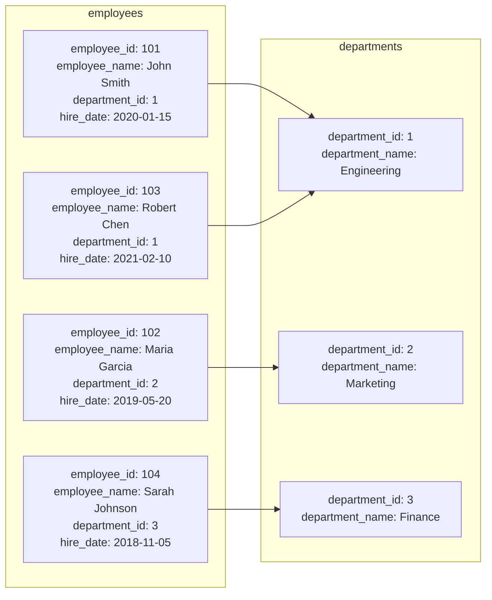

# PostgreSQL Natural Joins

## Introduction

In PostgreSQL, a **Natural Join** is a type of join operation that automatically joins tables based on columns with the same name. Unlike other join types where you explicitly specify the join condition, a natural join implicitly uses all columns with identical names as the joining criteria.

Natural joins can simplify your SQL queries by reducing the need to explicitly state join conditions, but they also require careful understanding of your database schema to avoid unexpected results.

## Basic Syntax

The basic syntax for a PostgreSQL NATURAL JOIN is:

```sql
SELECT columns
FROM table1
NATURAL JOIN table2;
```

This statement will join `table1` and `table2` using all columns that have the same name in both tables.

## How Natural Joins Work

When you use a NATURAL JOIN:

1. PostgreSQL identifies all columns with identical names in both tables
2. It uses these common columns as join conditions (equivalent to using an equality operator)
3. It returns only one instance of each common column in the result set
4. The join behaves like an INNER JOIN by default, returning only matching rows

## Simple Example

Let's create two simple tables to demonstrate natural joins:

```sql
CREATE TABLE departments (
    department_id INT PRIMARY KEY,
    department_name VARCHAR(100)
);

CREATE TABLE employees (
    employee_id INT PRIMARY KEY,
    employee_name VARCHAR(100),
    department_id INT,
    hire_date DATE
);

-- Insert sample data
INSERT INTO departments VALUES 
(1, 'Engineering'),
(2, 'Marketing'),
(3, 'Finance');

INSERT INTO employees VALUES 
(101, 'John Smith', 1, '2020-01-15'),
(102, 'Maria Garcia', 2, '2019-05-20'),
(103, 'Robert Chen', 1, '2021-02-10'),
(104, 'Sarah Johnson', 3, '2018-11-05');
```

Now let's use a NATURAL JOIN to retrieve employees with their department names:

```sql
SELECT employee_name, department_name
FROM employees
NATURAL JOIN departments;
```

Results:

```
 employee_name | department_name
---------------+-----------------
 John Smith    | Engineering
 Maria Garcia  | Marketing
 Robert Chen   | Engineering
 Sarah Johnson | Finance
```

In this example, PostgreSQL automatically joined the tables using the `department_id` column, which exists in both tables. The result includes only matching rows, similar to an INNER JOIN.

## Visualizing the Natural Join Process



## Natural Join with Multiple Common Columns

Natural joins become more interesting when tables share multiple column names. Let's see an example:

```sql
CREATE TABLE projects (
    project_id INT PRIMARY KEY,
    project_name VARCHAR(100),
    department_id INT,
    manager_id INT
);

CREATE TABLE project_assignments (
    assignment_id INT PRIMARY KEY,
    project_id INT,
    department_id INT,
    employee_id INT
);

-- Insert sample data
INSERT INTO projects VALUES 
(201, 'Website Redesign', 1, 101),
(202, 'Marketing Campaign', 2, 102),
(203, 'Database Migration', 1, 101);

INSERT INTO project_assignments VALUES 
(1, 201, 1, 101),
(2, 201, 1, 103),
(3, 202, 2, 102),
(4, 203, 1, 101),
(5, 203, 3, 104);
```

When we use a natural join between these tables:

```sql
SELECT project_name, assignment_id, employee_id
FROM projects
NATURAL JOIN project_assignments;
```

Results:

```
 project_name      | assignment_id | employee_id
-------------------+---------------+-------------
 Website Redesign  | 1             | 101
 Website Redesign  | 2             | 103
 Marketing Campaign| 3             | 102
 Database Migration| 4             | 101
```

In this case, PostgreSQL joined the tables using both `project_id` AND `department_id` columns, since both appear in both tables. Notice that the 5th assignment (ID: 5) doesn't appear because the `department_id` values don't match (3 vs 1).

## Potential Pitfalls of Natural Joins

While natural joins can make queries more concise, they come with several potential issues:

### 1. Schema Dependency

Natural joins create a tight coupling between your query and the database schema. If column names change, your query may produce unexpected results.

### 2. Accidental Joins on Unintended Columns

If tables happen to share column names that weren't meant to be join conditions, a natural join will use them anyway, potentially producing incorrect results.

### 3. Adding New Common Columns Can Break Queries

If you add a new column with the same name to both tables, a natural join will automatically include it in the join condition, potentially changing the result set.

### 4. Column Order Uncertainty

The order of columns in the result set can be unpredictable, especially when joining multiple tables.

## Alternative: USING Clause

For more explicit control while still maintaining brevity, you can use the USING clause:

```sql
SELECT employee_name, department_name
FROM employees
JOIN departments USING (department_id);
```

This produces the same result as the natural join but explicitly states which column to join on.

## Real-World Application Example

Let's look at a practical example of when a natural join might be useful. Consider a product inventory system:

```sql
CREATE TABLE products (
    product_id SERIAL PRIMARY KEY,
    product_name VARCHAR(100),
    category_id INT,
    unit_price DECIMAL(10, 2)
);

CREATE TABLE inventory (
    inventory_id SERIAL PRIMARY KEY,
    product_id INT,
    warehouse_id INT,
    quantity INT
);

CREATE TABLE warehouses (
    warehouse_id SERIAL PRIMARY KEY,
    warehouse_name VARCHAR(100),
    location VARCHAR(100)
);

-- Insert sample data
INSERT INTO products VALUES 
(1, 'Laptop', 1, 999.99),
(2, 'Smartphone', 1, 699.99),
(3, 'Headphones', 2, 149.99);

INSERT INTO warehouses VALUES 
(1, 'Main Warehouse', 'New York'),
(2, 'West Warehouse', 'San Francisco');

INSERT INTO inventory VALUES 
(1, 1, 1, 20),  -- 20 Laptops in New York
(2, 1, 2, 15),  -- 15 Laptops in San Francisco
(3, 2, 1, 30),  -- 30 Smartphones in New York
(4, 3, 2, 45);  -- 45 Headphones in San Francisco
```

To get a complete inventory report with product names and warehouse locations:

```sql
-- Using natural join (not ideal in this case)
SELECT p.product_name, w.warehouse_name, i.quantity
FROM inventory i
JOIN products p USING (product_id)
JOIN warehouses w USING (warehouse_id);

-- This is clearer than the equivalent natural join version:
SELECT p.product_name, w.warehouse_name, i.quantity
FROM inventory i
NATURAL JOIN products p
NATURAL JOIN warehouses w;
```

Results:

```
 product_name | warehouse_name  | quantity
--------------+-----------------+----------
 Laptop       | Main Warehouse  | 20
 Laptop       | West Warehouse  | 15
 Smartphone   | Main Warehouse  | 30
 Headphones   | West Warehouse  | 45
```

## Comparing NATURAL JOIN with Other Join Types

Here's how NATURAL JOIN compares to other PostgreSQL join types:

| Join Type | Description | When to Use |
|-----------|-------------|------------|
| NATURAL JOIN | Automatically joins tables using all common columns | When tables have well-designed schemas with consistent naming and only intended common columns |
| INNER JOIN ON | Joins tables based on explicit condition | When you need precise control over join conditions |
| JOIN USING | Joins tables based on specified common columns | When you want some brevity but more control than NATURAL JOIN |
| LEFT/RIGHT JOIN | Includes unmatched rows from one table | When you need to keep rows even without matches |
| FULL JOIN | Includes unmatched rows from both tables | When you need all data regardless of matches |

## Best Practices for Natural Joins

1. **Use sparingly**: Natural joins are best used in controlled environments where schemas are stable
2. **Document schema dependencies**: Make it clear which columns are expected to be common
3. **Consider USING instead**: The USING clause offers a good balance of brevity and explicitness
4. **Test thoroughly after schema changes**: Always verify natural join results after modifying table structures

## Summary

PostgreSQL Natural Joins provide a concise way to join tables based on columns with identical names. While they can simplify queries, they also create tight coupling between your queries and the database schema.

Natural joins work by automatically identifying common columns between tables and using them as join conditions. The result set contains only one instance of each common column and behaves like an inner join by default.

For more control while maintaining some brevity, consider using the USING clause as an alternative to natural joins.

## Exercises

1. Create two tables with at least two common column names and experiment with natural joins
2. Try adding a new common column and observe how it affects the natural join results
3. Compare the results of a natural join with an equivalent explicit join using the ON clause
4. Write a query that uses a natural join and a USING join together in the same statement
5. Find a scenario where a natural join produces unexpected results and fix it

## Additional Resources

- [PostgreSQL Official Documentation on Joins](https://www.postgresql.org/docs/current/queries-table-expressions.html)
- [SQL Standard Joins Explained](https://www.w3resource.com/sql/joins/sql-joins.php)
- [Database Normalization Principles](https://www.postgresql.org/docs/current/ddl-constraints.html)