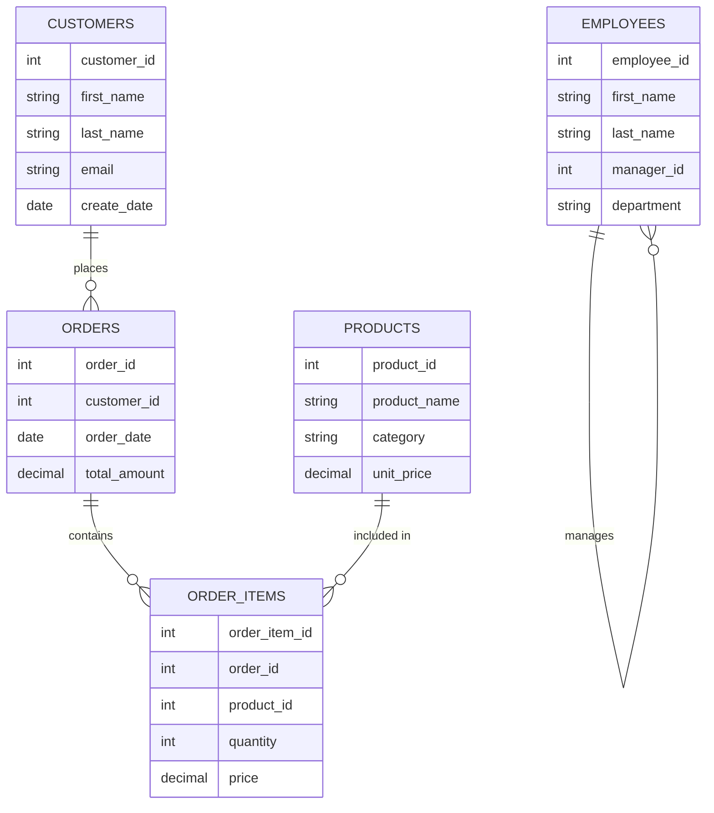

# PostgreSQL Multiple Joins

## Introduction

In real-world database scenarios, you'll often need to retrieve data from more than two tables at once. PostgreSQL allows you to combine multiple joins in a single query, enabling you to pull related information from across your database schema. This capability is essential for building complex reports, data analysis, and creating comprehensive views of your data.

This guide will show you how to effectively use multiple joins in PostgreSQL, building on the fundamental join concepts you've already learned.

## Understanding Multiple Joins

Multiple joins extend the concept of joining two tables to joining three or more tables in a single query. The basic syntax follows this pattern:

```sql
SELECT columns
FROM table1
JOIN table2 ON table1.column = table2.column
JOIN table3 ON table2.column = table3.column
...
```

Each join connects to the result set of the previous join, creating a chain of relationships that allows you to navigate through your database schema.

## Setting Up Example Tables

Before diving into examples, let's set up a realistic scenario with some sample tables. Imagine we're working with an e-commerce database with the following tables:

```sql
-- Create customers table
CREATE TABLE customers (
    customer_id SERIAL PRIMARY KEY,
    first_name VARCHAR(50),
    last_name VARCHAR(50),
    email VARCHAR(100),
    create_date DATE
);

-- Create orders table
CREATE TABLE orders (
    order_id SERIAL PRIMARY KEY,
    customer_id INT REFERENCES customers(customer_id),
    order_date DATE,
    total_amount DECIMAL(10, 2)
);

-- Create products table
CREATE TABLE products (
    product_id SERIAL PRIMARY KEY,
    product_name VARCHAR(100),
    category VARCHAR(50),
    unit_price DECIMAL(10, 2)
);

-- Create order_items (junction table)
CREATE TABLE order_items (
    order_item_id SERIAL PRIMARY KEY,
    order_id INT REFERENCES orders(order_id),
    product_id INT REFERENCES products(product_id),
    quantity INT,
    price DECIMAL(10, 2)
);
```

Let's add some sample data:

```sql
-- Insert sample customers
INSERT INTO customers (first_name, last_name, email, create_date) VALUES
('John', 'Doe', 'john.doe@example.com', '2023-01-15'),
('Jane', 'Smith', 'jane.smith@example.com', '2023-02-20'),
('Bob', 'Johnson', 'bob.johnson@example.com', '2023-03-10');

-- Insert sample products
INSERT INTO products (product_name, category, unit_price) VALUES
('Laptop', 'Electronics', 999.99),
('Headphones', 'Electronics', 149.99),
('Coffee Mug', 'Kitchen', 12.99),
('Notebook', 'Office', 4.99);

-- Insert sample orders
INSERT INTO orders (customer_id, order_date, total_amount) VALUES
(1, '2023-04-15', 1149.98),
(2, '2023-04-20', 12.99),
(3, '2023-04-22', 154.98),
(1, '2023-05-01', 4.99);

-- Insert sample order items
INSERT INTO order_items (order_id, product_id, quantity, price) VALUES
(1, 1, 1, 999.99),
(1, 2, 1, 149.99),
(2, 3, 1, 12.99),
(3, 2, 1, 149.99),
(3, 4, 1, 4.99),
(4, 4, 1, 4.99);
```

## Basic Multiple Join Example

Let's start with a basic example that joins three tables to get customer information along with their order details:

```sql
SELECT 
    c.first_name,
    c.last_name,
    o.order_id,
    o.order_date,
    o.total_amount
FROM 
    customers c
JOIN 
    orders o ON c.customer_id = o.customer_id
ORDER BY 
    c.last_name, o.order_date;
```

**Output:**
```
first_name | last_name | order_id | order_date | total_amount
-----------+-----------+----------+------------+-------------
John       | Doe       | 1        | 2023-04-15 | 1149.98
John       | Doe       | 4        | 2023-05-01 | 4.99
Bob        | Johnson   | 3        | 2023-04-22 | 154.98
Jane       | Smith     | 2        | 2023-04-20 | 12.99
```

## Three-Table Join

Now, let's expand our query to include product information by joining three tables:

```sql
SELECT 
    c.first_name,
    c.last_name,
    o.order_id,
    o.order_date,
    p.product_name,
    oi.quantity,
    oi.price
FROM 
    customers c
JOIN 
    orders o ON c.customer_id = o.customer_id
JOIN 
    order_items oi ON o.order_id = oi.order_id
JOIN 
    products p ON oi.product_id = p.product_id
ORDER BY 
    o.order_id, p.product_name;
```

**Output:**
```
first_name | last_name | order_id | order_date | product_name | quantity | price
-----------+-----------+----------+------------+--------------+----------+--------
John       | Doe       | 1        | 2023-04-15 | Headphones   | 1        | 149.99
John       | Doe       | 1        | 2023-04-15 | Laptop       | 1        | 999.99
Jane       | Smith     | 2        | 2023-04-20 | Coffee Mug   | 1        | 12.99
Bob        | Johnson   | 3        | 2023-04-22 | Headphones   | 1        | 149.99
Bob        | Johnson   | 3        | 2023-04-22 | Notebook     | 1        | 4.99
John       | Doe       | 4        | 2023-05-01 | Notebook     | 1        | 4.99
```

## Mixing Different Join Types

You can mix different types of joins in a single query. For example, let's use a LEFT JOIN to include all customers, even those who haven't placed orders:

```sql
SELECT 
    c.first_name,
    c.last_name,
    COALESCE(COUNT(o.order_id), 0) AS order_count,
    COALESCE(SUM(o.total_amount), 0) AS total_spent
FROM 
    customers c
LEFT JOIN 
    orders o ON c.customer_id = o.customer_id
GROUP BY 
    c.customer_id, c.first_name, c.last_name
ORDER BY 
    total_spent DESC;
```

**Output:**
```
first_name | last_name | order_count | total_spent
-----------+-----------+-------------+------------
John       | Doe       | 2           | 1154.97
Bob        | Johnson   | 1           | 154.98
Jane       | Smith     | 1           | 12.99
```

## Complex Multiple Join Example

Let's create a more complex query that combines different join types to get a comprehensive view of our data:

```sql
SELECT 
    c.first_name,
    c.last_name,
    o.order_id,
    o.order_date,
    p.product_name,
    p.category,
    oi.quantity,
    oi.price,
    (oi.quantity * oi.price) AS item_total
FROM 
    customers c
JOIN 
    orders o ON c.customer_id = o.customer_id
JOIN 
    order_items oi ON o.order_id = oi.order_id
LEFT JOIN 
    products p ON oi.product_id = p.product_id
WHERE 
    p.category = 'Electronics'
ORDER BY 
    o.order_date, o.order_id;
```

**Output:**
```
first_name | last_name | order_id | order_date | product_name | category    | quantity | price   | item_total
-----------+-----------+----------+------------+--------------+-------------+----------+---------+-----------
John       | Doe       | 1        | 2023-04-15 | Laptop       | Electronics | 1        | 999.99  | 999.99
John       | Doe       | 1        | 2023-04-15 | Headphones   | Electronics | 1        | 149.99  | 149.99
Bob        | Johnson   | 3        | 2023-04-22 | Headphones   | Electronics | 1        | 149.99  | 149.99
```

## Using Subqueries with Joins

You can also combine subqueries with multiple joins for even more powerful queries:

```sql
SELECT 
    c.first_name,
    c.last_name,
    c.email,
    order_summary.order_count,
    order_summary.total_spent
FROM 
    customers c
JOIN 
    (
        SELECT 
            customer_id,
            COUNT(order_id) AS order_count,
            SUM(total_amount) AS total_spent
        FROM 
            orders
        GROUP BY 
            customer_id
    ) AS order_summary ON c.customer_id = order_summary.customer_id
WHERE 
    order_summary.total_spent > 100
ORDER BY 
    order_summary.total_spent DESC;
```

**Output:**
```
first_name | last_name | email                  | order_count | total_spent
-----------+-----------+------------------------+-------------+------------
John       | Doe       | john.doe@example.com   | 2           | 1154.97
Bob        | Johnson   | bob.johnson@example.com| 1           | 154.98
```

## Self Joins with Multiple Tables

Let's expand our database with an employees table to demonstrate self joins combined with other join types:

```sql
-- Create employees table
CREATE TABLE employees (
    employee_id SERIAL PRIMARY KEY,
    first_name VARCHAR(50),
    last_name VARCHAR(50),
    manager_id INT REFERENCES employees(employee_id),
    department VARCHAR(50)
);

-- Insert sample employees
INSERT INTO employees (employee_id, first_name, last_name, manager_id, department) VALUES
(1, 'Alice', 'Johnson', NULL, 'Management'),
(2, 'David', 'Smith', 1, 'Sales'),
(3, 'Emily', 'Davis', 1, 'Support'),
(4, 'Michael', 'Wilson', 2, 'Sales'),
(5, 'Sarah', 'Brown', 3, 'Support');
```

Now let's join this with our customer data:

```sql
SELECT 
    e.first_name AS employee_first,
    e.last_name AS employee_last,
    m.first_name AS manager_first,
    m.last_name AS manager_last,
    COUNT(o.order_id) AS orders_processed
FROM 
    employees e
LEFT JOIN 
    employees m ON e.manager_id = m.employee_id
LEFT JOIN 
    orders o ON e.employee_id = o.customer_id -- Assuming employees can also be customers
GROUP BY 
    e.employee_id, e.first_name, e.last_name, m.first_name, m.last_name
ORDER BY 
    orders_processed DESC;
```

The result would show employees, their managers, and any orders they've placed as customers.

## Common Pitfalls with Multiple Joins

When working with multiple joins, be aware of these common issues:

1. **Performance concerns**: Joining many tables can impact query performance. Always include appropriate WHERE clauses to limit the result set.

2. **Cartesian products**: If you forget join conditions, you can inadvertently create a Cartesian product, which multiplies the number of rows exponentially:

```sql
-- Problematic query with missing join condition
SELECT * FROM customers, orders, products;  -- Don't do this!
```

3. **Column ambiguity**: When multiple tables have columns with the same name, always qualify them with table aliases:

```sql
-- Good practice with column qualification
SELECT 
    c.customer_id,  -- Using alias to qualify column
    o.order_date
FROM 
    customers c
JOIN 
    orders o ON c.customer_id = o.customer_id;
```

## Visual Representation of Multiple Joins

Here's a Mermaid diagram showing the relationships in our example database:



## Optimizing Multiple Join Queries

When working with multiple joins, consider these optimization techniques:

1. **Use appropriate indexes**: Ensure that joined columns are properly indexed.

2. **Join order matters**: PostgreSQL's query planner usually optimizes this, but sometimes specifying a different join order can help.

3. **Limit data early**: Apply WHERE clauses as early as possible to reduce the size of intermediate result sets.

4. **Consider using WITH clauses (CTEs)** for complex queries:

```sql
WITH customer_orders AS (
    SELECT 
        customer_id,
        COUNT(*) AS order_count
    FROM 
        orders
    GROUP BY 
        customer_id
)
SELECT 
    c.first_name,
    c.last_name,
    co.order_count
FROM 
    customers c
JOIN 
    customer_orders co ON c.customer_id = co.customer_id
WHERE 
    co.order_count > 1;
```

## Summary

Multiple joins in PostgreSQL allow you to:

- Combine data from three or more related tables in a single query
- Mix different join types (INNER, LEFT, RIGHT, FULL) to accommodate various data requirements
- Create complex reports that span multiple entities in your database
- Build comprehensive views of your data relationships

By mastering multiple joins, you can write powerful queries that extract meaningful insights from your relational database without the need for multiple separate queries.

## Exercises

1. Write a query that lists all customers and shows the total number of products they've purchased across all orders.

2. Create a query that finds the most popular product category by total sales amount.

3. Write a query that shows each manager and the total sales generated by employees under their management.

4. Create a report showing customers who have purchased products from all available categories.

5. Write a query using multiple joins that identifies customers who have spent more than the average amount on electronics products.

## Additional Resources

- [PostgreSQL Documentation on Joins](https://www.postgresql.org/docs/current/tutorial-join.html)
- [PostgreSQL Performance Optimization](https://www.postgresql.org/docs/current/performance-tips.html)
- [Query Planning in PostgreSQL](https://www.postgresql.org/docs/current/using-explain.html)