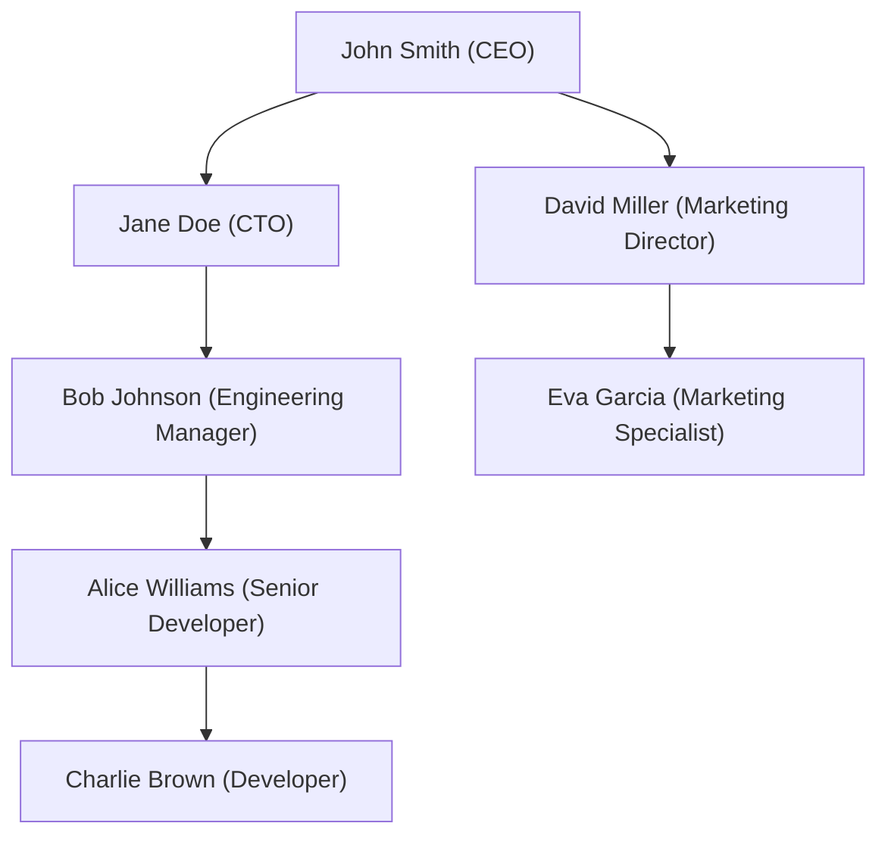

# PostgreSQL Self Joins

## Introduction

A self join is a regular join operation where a table is joined with itself. This might sound unusual at first, but it's a powerful technique when you need to compare rows within the same table or work with hierarchical data.

Self joins are particularly useful when dealing with:
- Hierarchical relationships (employees and managers)
- Sequential data (before/after relationships)
- Finding duplicate or related records within the same table

In this tutorial, we'll explore how self joins work in PostgreSQL and look at practical examples of when and how to use them.

## Understanding Self Joins

A self join works by treating the same table as if it were two different tables in the join operation. To do this, we use table aliases to distinguish between the two instances of the same table.

### Basic Syntax

```sql
SELECT a.column_name, b.column_name
FROM table_name a
JOIN table_name b
ON a.common_column = b.common_column;
```

Here:
- `a` and `b` are aliases for the same table
- We're joining the table to itself using some condition

Let's look at some practical examples to understand this better.

## Example 1: Employee-Manager Relationship

One of the most common uses for self joins is representing hierarchical relationships like an organizational structure.

Let's create a simple `employees` table:

```sql
CREATE TABLE employees (
    employee_id INT PRIMARY KEY,
    name VARCHAR(100),
    position VARCHAR(100),
    manager_id INT
);

INSERT INTO employees VALUES
(1, 'John Smith', 'CEO', NULL),
(2, 'Jane Doe', 'CTO', 1),
(3, 'Bob Johnson', 'Engineering Manager', 2),
(4, 'Alice Williams', 'Senior Developer', 3),
(5, 'Charlie Brown', 'Developer', 4),
(6, 'David Miller', 'Marketing Director', 1),
(7, 'Eva Garcia', 'Marketing Specialist', 6);
```

Now, let's use a self join to list each employee along with their manager's name:

```sql
SELECT 
    e.employee_id,
    e.name AS employee_name,
    e.position AS employee_position,
    m.name AS manager_name,
    m.position AS manager_position
FROM 
    employees e
LEFT JOIN 
    employees m ON e.manager_id = m.employee_id
ORDER BY 
    e.employee_id;
```

Output:

```
 employee_id | employee_name  | employee_position    | manager_name  | manager_position
-------------+----------------+----------------------+---------------+------------------
           1 | John Smith     | CEO                  | NULL          | NULL
           2 | Jane Doe       | CTO                  | John Smith    | CEO
           3 | Bob Johnson    | Engineering Manager  | Jane Doe      | CTO
           4 | Alice Williams | Senior Developer     | Bob Johnson   | Engineering Manager
           5 | Charlie Brown  | Developer            | Alice Williams| Senior Developer
           6 | David Miller   | Marketing Director   | John Smith    | CEO
           7 | Eva Garcia     | Marketing Specialist | David Miller  | Marketing Director
```

In this example:
- `e` represents the employee records
- `m` represents the manager records
- We join them where the employee's `manager_id` equals the manager's `employee_id`
- We use a `LEFT JOIN` to include employees who don't have a manager (like the CEO)

### Visualizing the Hierarchy

We can also create a visual representation of the organizational hierarchy:



## Example 2: Finding Pairs

Self joins are useful for finding pairs of related rows. Let's say we have a `products` table and want to find products with similar prices.

```sql
CREATE TABLE products (
    product_id INT PRIMARY KEY,
    product_name VARCHAR(100),
    category VARCHAR(50),
    price DECIMAL(10, 2)
);

INSERT INTO products VALUES
(1, 'Laptop', 'Electronics', 1200.00),
(2, 'Smartphone', 'Electronics', 800.00),
(3, 'Tablet', 'Electronics', 500.00),
(4, 'Desk Chair', 'Furniture', 150.00),
(5, 'Office Desk', 'Furniture', 300.00),
(6, 'Gaming Console', 'Electronics', 450.00),
(7, 'Bookshelf', 'Furniture', 180.00);
```

Now, let's find pairs of products in the same category where the price difference is less than 100:

```sql
SELECT 
    p1.product_name AS product1,
    p1.price AS price1,
    p2.product_name AS product2, 
    p2.price AS price2,
    p1.category,
    ABS(p1.price - p2.price) AS price_difference
FROM 
    products p1
JOIN 
    products p2 ON p1.category = p2.category 
                AND p1.product_id < p2.product_id -- Avoid duplicates and self-matching
                AND ABS(p1.price - p2.price) < 100
ORDER BY 
    p1.category, price_difference;
```

Output:

```
  product1   |  price1  |   product2   |  price2  |  category   | price_difference
-------------+----------+--------------+----------+-------------+------------------
 Tablet      |   500.00 | Gaming Console|  450.00 | Electronics |            50.00
 Desk Chair  |   150.00 | Bookshelf    |   180.00 | Furniture   |            30.00
```

In this example:
- We use aliases `p1` and `p2` for the same `products` table
- We match products in the same category
- We use `p1.product_id < p2.product_id` to avoid duplicate pairs and self-matching
- We calculate the absolute price difference and filter for differences less than 100

## Example 3: Finding Adjacent Items

Self joins can help with sequential or ordered data. Let's create a `tasks` table with sequential IDs and find tasks that come before and after each task:

```sql
CREATE TABLE tasks (
    task_id INT PRIMARY KEY,
    task_name VARCHAR(100),
    deadline DATE,
    priority INT
);

INSERT INTO tasks VALUES
(1, 'Database Design', '2023-03-10', 1),
(2, 'Backend API Development', '2023-03-15', 2),
(3, 'Frontend Implementation', '2023-03-20', 3),
(4, 'Integration Testing', '2023-03-25', 4),
(5, 'Deployment', '2023-03-30', 5);
```

Now, let's list each task along with its previous and next tasks:

```sql
SELECT 
    current.task_id,
    current.task_name,
    prev.task_name AS previous_task,
    next.task_name AS next_task
FROM 
    tasks current
LEFT JOIN 
    tasks prev ON current.task_id = prev.task_id + 1
LEFT JOIN 
    tasks next ON current.task_id = next.task_id - 1
ORDER BY 
    current.task_id;
```

Output:

```
 task_id |        task_name        |     previous_task     |        next_task       
---------+-------------------------+-----------------------+------------------------
       1 | Database Design         | NULL                  | Backend API Development
       2 | Backend API Development | Database Design       | Frontend Implementation
       3 | Frontend Implementation | Backend API Development| Integration Testing
       4 | Integration Testing     | Frontend Implementation| Deployment
       5 | Deployment              | Integration Testing   | NULL
```

In this example:
- `current` represents the current task
- `prev` represents the previous task (task_id - 1)
- `next` represents the next task (task_id + 1)
- We use `LEFT JOIN` to include tasks without a previous or next task

## Common Use Cases for Self Joins

1. **Hierarchical Data**:
   - Employee-manager relationships
   - Category-subcategory structures
   - File and folder organization

2. **Finding Relationships Within a Table**:
   - Similar products
   - Duplicate detection
   - Friends or connections in social networks

3. **Sequential Data**:
   - Before/after relationships
   - Tracking state changes
   - Finding gaps in sequences

4. **Distance or Difference Calculations**:
   - Calculating distances between locations
   - Finding price differences between products
   - Comparing time periods

## Best Practices for Self Joins

1. **Always Use Meaningful Aliases**: 
   Choose clear, descriptive aliases that make your query readable.

2. **Avoid Redundant Comparisons**: 
   Use conditions like `a.id < b.id` to avoid duplicate results.

3. **Consider Performance**: 
   Self joins can be resource-intensive on large tables. Consider adding appropriate indexes.

4. **Use the Right Join Type**:
   - `INNER JOIN`: When you need matches on both sides
   - `LEFT JOIN`: When you need to include rows without matches

5. **Be Careful with Conditions**: 
   Incorrect join conditions can lead to Cartesian products (every row joined with every other row).

## Summary

Self joins are a powerful SQL technique where a table is joined with itself using different aliases. They're particularly useful for:

- Working with hierarchical data
- Finding relationships between rows in the same table
- Processing sequential or ordered information

While they might seem complex at first, self joins open up many possibilities for data analysis and reporting that would be difficult to achieve with other types of queries.

## Exercises

1. Using the `employees` table from Example 1, write a query to list all employees along with their direct reports (employees who report to them).

2. Modify the `products` example to find products in the same category with a price difference of less than 20%.

3. Create a `locations` table with coordinates and use a self join to find locations within a certain distance of each other.

4. Using the `tasks` table, write a query to calculate how many days are between each task's deadline and the deadline of the next task.

## Additional Resources

- [PostgreSQL Documentation on Joins](https://www.postgresql.org/docs/current/tutorial-join.html)
- [Recursive Queries in PostgreSQL](https://www.postgresql.org/docs/current/queries-with.html) (for more advanced hierarchical data processing)
- [SQL Performance Tuning for Self Joins](https://www.postgresql.org/docs/current/performance-tips.html)