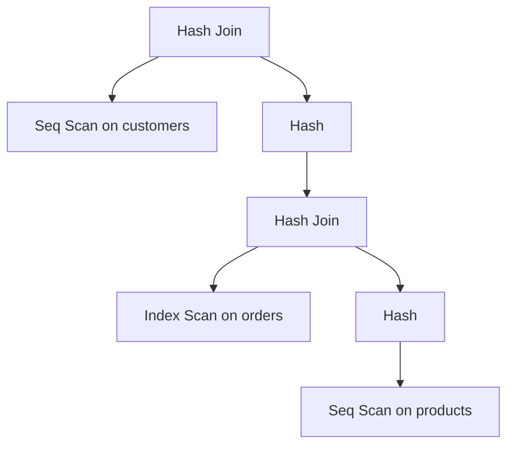

# PostgreSQL Join Optimization

## Introduction

When working with relational databases like PostgreSQL, joins are essential operations that allow you to combine data from multiple tables. However, as your database grows in size and complexity, joins can become performance bottlenecks if not properly optimized. This guide explores various techniques and best practices to optimize joins in PostgreSQL, helping you write efficient queries that execute quickly even on large datasets.

Join optimization is a critical skill for database developers and administrators. By understanding how PostgreSQL executes joins internally and learning optimization strategies, you can significantly improve your application's performance and responsiveness.

## Understanding the PostgreSQL Query Planner

Before diving into specific optimization techniques, it's important to understand how PostgreSQL decides to execute your queries.

### The Query Planning Process

PostgreSQL uses a cost-based optimizer to determine the most efficient way to execute a query. When you run a query with joins, the planner:

1. Analyzes possible execution plans
2. Estimates the cost of each plan
3. Selects the plan with the lowest estimated cost

You can see the query plan using the `EXPLAIN` command:

```sql
EXPLAIN SELECT * FROM customers 
JOIN orders ON customers.customer_id = orders.customer_id;
```

For more detailed information including actual execution times, use `EXPLAIN ANALYZE`:

```sql
EXPLAIN ANALYZE SELECT * FROM customers 
JOIN orders ON customers.customer_id = orders.customer_id;
```

Output might look like:

```
Merge Join  (cost=117.65..258.35 rows=5000 width=72) (actual time=0.924..4.129 rows=5000 loops=1)
  Merge Cond: (customers.customer_id = orders.customer_id)
  ->  Sort  (cost=59.33..61.83 rows=1000 width=36) (actual time=0.530..0.686 rows=1000 loops=1)
        Sort Key: customers.customer_id
        Sort Method: quicksort  Memory: 97kB
        ->  Seq Scan on customers  (cost=0.00..20.00 rows=1000 width=36) (actual time=0.013..0.237 rows=1000 loops=1)
  ->  Sort  (cost=58.33..60.83 rows=1000 width=36) (actual time=0.379..0.551 rows=1000 loops=1)
        Sort Key: orders.customer_id
        Sort Method: quicksort  Memory: 88kB
        ->  Seq Scan on orders  (cost=0.00..20.00 rows=1000 width=36) (actual time=0.008..0.168 rows=1000 loops=1)
Planning time: 0.351 ms
Execution time: 4.686 ms
```

This output shows that PostgreSQL chose a Merge Join strategy, which involves sorting both tables by the join key and then merging them.

## Join Types and Their Performance Characteristics

PostgreSQL supports several join types, each with different performance characteristics:

### Nested Loop Joins

```sql
SELECT * FROM small_table a JOIN large_table b ON a.id = b.small_id;
```

**Characteristics:**
- Works best when one table is very small
- Efficient if the join condition uses an indexed column on the inner table
- Can be slow for large tables without proper indexing

### Hash Joins

```sql
SELECT * FROM large_table_1 a JOIN large_table_2 b ON a.id = b.foreign_id;
```

**Characteristics:**
- Good for large tables without sorted data
- Builds a hash table from the smaller table
- Requires memory to store the hash table
- Often faster than nested loops for large datasets

### Merge Joins

```sql
SELECT * FROM sorted_table_1 a JOIN sorted_table_2 b ON a.id = b.id;
```

**Characteristics:**
- Works best when both tables are sorted on the join columns
- Efficient for large, already sorted datasets
- May require a sort operation if tables aren't already sorted

## Key Optimization Techniques

### 1. Create and Maintain Proper Indexes

Indexes are crucial for join performance. Create indexes on columns used in join conditions:

```sql
-- Create an index on the foreign key column
CREATE INDEX idx_orders_customer_id ON orders(customer_id);

-- Create an index on the primary key (usually automatic)
CREATE INDEX idx_customers_customer_id ON customers(customer_id);
```

When properly indexed, the query plan might change to a more efficient method:

```
Hash Join  (cost=35.00..75.25 rows=5000 width=72) (actual time=0.397..2.130 rows=5000 loops=1)
  Hash Cond: (orders.customer_id = customers.customer_id)
  ->  Seq Scan on orders  (cost=0.00..20.00 rows=1000 width=36) (actual time=0.008..0.168 rows=1000 loops=1)
  ->  Hash  (cost=20.00..20.00 rows=1000 width=36) (actual time=0.379..0.379 rows=1000 loops=1)
        Buckets: 1024  Batches: 1  Memory Usage: 52kB
        ->  Seq Scan on customers  (cost=0.00..20.00 rows=1000 width=36) (actual time=0.013..0.232 rows=1000 loops=1)
Planning time: 0.254 ms
Execution time: 2.554 ms
```

### 2. Keep Statistics Up-to-Date

PostgreSQL relies on table statistics to make good planning decisions:

```sql
-- Update statistics for a table
ANALYZE customers;

-- Update statistics for all tables
ANALYZE;
```

### 3. Optimize Join Order

The order of tables in a join can significantly impact performance. PostgreSQL generally does a good job of determining the optimal join order, but sometimes you might need to force a specific order using join order hints:

```sql
-- Using join_collapse_limit to control join order
SET join_collapse_limit = 1;
SELECT * FROM small_table 
JOIN medium_table ON small_table.id = medium_table.small_id
JOIN large_table ON medium_table.id = large_table.medium_id;
```

### 4. Use LIMIT with Joins

When you only need a subset of results, use LIMIT to reduce the amount of data processed:

```sql
SELECT c.name, o.order_date
FROM customers c
JOIN orders o ON c.customer_id = o.customer_id
ORDER BY o.order_date DESC
LIMIT 10;
```

### 5. Filter Data Before Joining

Reduce the size of joined datasets by filtering data before the join operation:

```sql
-- Less efficient
SELECT * FROM customers c
JOIN orders o ON c.customer_id = o.customer_id
WHERE c.region = 'Europe' AND o.order_date > '2023-01-01';

-- More efficient
SELECT * FROM 
(SELECT * FROM customers WHERE region = 'Europe') c
JOIN 
(SELECT * FROM orders WHERE order_date > '2023-01-01') o
ON c.customer_id = o.customer_id;
```

### 6. Use JOINs Instead of Subqueries When Possible

JOINs often perform better than correlated subqueries:

```sql
-- Using a correlated subquery (can be slower)
SELECT c.customer_id, c.name,
  (SELECT MAX(order_date) FROM orders o WHERE o.customer_id = c.customer_id) as last_order
FROM customers c;

-- Using a JOIN (often faster)
SELECT c.customer_id, c.name, MAX(o.order_date) as last_order
FROM customers c
LEFT JOIN orders o ON c.customer_id = o.customer_id
GROUP BY c.customer_id, c.name;
```

## Real-World Example: E-commerce Database Optimization

Let's optimize a common e-commerce query that retrieves order details with customer information:

### Initial Query (Unoptimized)

```sql
SELECT c.name, c.email, o.order_id, o.order_date, p.product_name, oi.quantity, oi.price
FROM customers c, orders o, order_items oi, products p
WHERE c.customer_id = o.customer_id
AND o.order_id = oi.order_id
AND oi.product_id = p.product_id
AND o.order_date BETWEEN '2023-01-01' AND '2023-12-31';
```

### Optimized Query

```sql
SELECT c.name, c.email, o.order_id, o.order_date, p.product_name, oi.quantity, oi.price
FROM customers c
JOIN (
  SELECT * FROM orders 
  WHERE order_date BETWEEN '2023-01-01' AND '2023-12-31'
) o ON c.customer_id = o.customer_id
JOIN order_items oi ON o.order_id = oi.order_id
JOIN products p ON oi.product_id = p.product_id;
```

### Creating Proper Indexes

```sql
-- Create indexes on join columns
CREATE INDEX idx_orders_customer_id ON orders(customer_id);
CREATE INDEX idx_orders_date ON orders(order_date);
CREATE INDEX idx_order_items_order_id ON order_items(order_id);
CREATE INDEX idx_order_items_product_id ON order_items(product_id);
```

### Setting Work Memory

For complex joins, you might need to increase work memory:

```sql
-- Set session-level work memory (adjust based on your server's capacity)
SET work_mem = '50MB';
```

## Visualizing Join Planning

We can visualize how PostgreSQL might execute different join strategies:



This diagram represents a query plan where PostgreSQL performs a hash join between customers and the results of another hash join between orders and products.

## Common Pitfalls and How to Avoid Them

### 1. Joining on Non-Indexed Columns

**Problem:**
```sql
SELECT * FROM customers c
JOIN orders o ON c.email = o.customer_email;
```

**Solution:**
```sql
CREATE INDEX idx_orders_customer_email ON orders(customer_email);
CREATE INDEX idx_customers_email ON customers(email);
```

### 2. Cartesian Products (Cross Joins)

**Problem:**
```sql
-- Missing join condition creates cartesian product
SELECT * FROM customers, orders;
```

**Solution:**
```sql
-- Always specify join conditions
SELECT * FROM customers c
JOIN orders o ON c.customer_id = o.customer_id;
```

### 3. Joining Too Many Tables at Once

**Problem:**
```sql
-- Joining 6+ tables can lead to performance issues
SELECT * FROM table1
JOIN table2 ON table1.id = table2.t1_id
JOIN table3 ON table2.id = table3.t2_id
JOIN table4 ON table3.id = table4.t3_id
JOIN table5 ON table4.id = table5.t4_id
JOIN table6 ON table5.id = table6.t5_id;
```

**Solution:**
```sql
-- Consider using CTEs or temporary tables for complex join chains
WITH step1 AS (
  SELECT t1.*, t2.* FROM table1 t1
  JOIN table2 t2 ON t1.id = t2.t1_id
),
step2 AS (
  SELECT s1.*, t3.* FROM step1 s1
  JOIN table3 t3 ON s1.id = t3.t2_id
)
SELECT s2.*, t4.* FROM step2 s2
JOIN table4 t4 ON s2.id = t4.t3_id;
```

## Advanced Techniques

### Using Common Table Expressions (CTEs)

CTEs can make complex joins more readable and sometimes more efficient:

```sql
WITH recent_orders AS (
  SELECT * FROM orders
  WHERE order_date > CURRENT_DATE - INTERVAL '30 days'
),
high_value_customers AS (
  SELECT customer_id, SUM(total_amount) as total_spent
  FROM recent_orders
  GROUP BY customer_id
  HAVING SUM(total_amount) > 1000
)
SELECT c.name, c.email, hvc.total_spent
FROM customers c
JOIN high_value_customers hvc ON c.customer_id = hvc.customer_id
ORDER BY hvc.total_spent DESC;
```

### Partial Indexes

For tables with specific query patterns, partial indexes can improve performance:

```sql
-- Create a partial index for active customers only
CREATE INDEX idx_active_customers ON customers(customer_id) 
WHERE status = 'active';

-- Queries that filter by active status will benefit
SELECT * FROM customers c
JOIN orders o ON c.customer_id = o.customer_id
WHERE c.status = 'active';
```

## Performance Testing Your Joins

Always measure the performance of your optimized queries:

```sql
-- Turn on timing to see execution time
\timing on

-- Compare before and after optimization
EXPLAIN ANALYZE SELECT * FROM table1 JOIN table2 ON table1.id = table2.foreign_id;

-- After adding indexes or other optimizations
EXPLAIN ANALYZE SELECT * FROM table1 JOIN table2 ON table1.id = table2.foreign_id;
```

## Summary

Optimizing PostgreSQL joins is essential for building performant database applications. The key strategies include:

1. Creating appropriate indexes on join columns
2. Keeping statistics up-to-date with ANALYZE
3. Filtering data before joining large tables
4. Using the right join types for your data characteristics
5. Using EXPLAIN ANALYZE to understand and improve query execution plans
6. Considering query structure and join order
7. Using advanced techniques like CTEs and partial indexes for complex scenarios

By applying these optimization techniques, you can significantly improve the performance of your PostgreSQL database, resulting in faster response times and better user experience for your applications.

## Additional Resources

- [PostgreSQL Documentation: Performance Tips](https://www.postgresql.org/docs/current/performance-tips.html)
- [PostgreSQL Indexing: How, Why, When](https://devcenter.heroku.com/articles/postgresql-indexes)
- [Use the Index, Luke!](https://use-the-index-luke.com/) - A guide to database performance for developers

## Exercises

1. Create two tables with at least 10,000 rows each and experiment with different join types (INNER JOIN, LEFT JOIN, etc.) to see how they affect performance.

2. Use EXPLAIN ANALYZE to compare the performance of joins with and without indexes.

3. Write a query that joins at least three tables, then optimize it using the techniques learned in this guide. Measure the performance improvement.

4. Practice using CTEs to break down a complex join involving 4+ tables. Compare performance with a single large join query.

5. Experiment with different work_mem settings to see how they affect join performance on large tables.