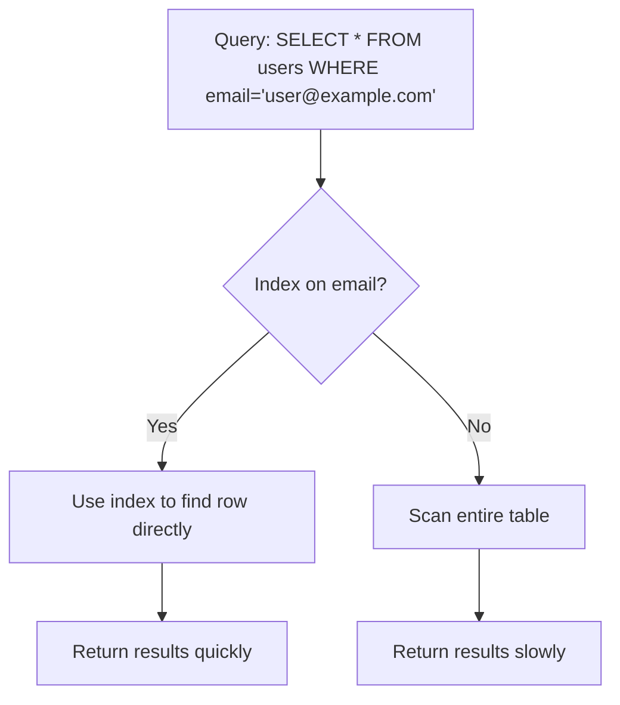

# PostgreSQL Index Basics

## Introduction

Database indexes are one of the most powerful tools for optimizing query performance, yet they're often misunderstood or underutilized. In PostgreSQL, proper indexing can transform a sluggish query that takes minutes into one that completes in milliseconds.

Think of an index like the index at the back of a book - instead of reading through every page to find a specific topic, you can look up the page number in the index and jump straight there. Similarly, database indexes allow PostgreSQL to find data without scanning every row in a table.

In this guide, we'll explore the fundamental concepts of PostgreSQL indexes, learn how to create them, understand when they're beneficial, and examine their impact on query performance.

## What Are Indexes?

Indexes are special data structures that store a sorted subset of a table's data, making it faster to find specific rows. When a query includes a WHERE clause or join condition on an indexed column, PostgreSQL can use the index to quickly locate matching rows instead of scanning the entire table.



## Types of PostgreSQL Indexes

PostgreSQL supports several index types, each optimized for different data types and query patterns:

1. **B-tree** (default) - General-purpose balanced tree structure, suitable for most scenarios
2. **Hash** - Optimized for equality comparisons only
3. **GiST** - Generalized Search Tree for complex data types (geometric data, full-text search)
4. **SP-GiST** - Space-partitioned GiST for non-balanced data structures
5. **GIN** - Generalized Inverted Index for composite values (arrays, JSON, full-text search)
6. **BRIN** - Block Range Index for very large tables with naturally clustered data

For most beginners, B-tree indexes will be the go-to choice as they work well for equality and range comparisons.

## Creating Your First Index

Let's create a simple table and add an index to it:

```sql
-- Create a users table
CREATE TABLE users (
    id SERIAL PRIMARY KEY,
    username VARCHAR(50) UNIQUE,
    email VARCHAR(100),
    created_at TIMESTAMP DEFAULT CURRENT_TIMESTAMP
);

-- Insert some sample data
INSERT INTO users (username, email) VALUES
('john_doe', 'john@example.com'),
('jane_smith', 'jane@example.com'),
('bob_jones', 'bob@example.com');

-- Create an index on the email column
CREATE INDEX idx_users_email ON users(email);
```

In this example:
- The `PRIMARY KEY` constraint automatically creates an index on the `id` column
- The `UNIQUE` constraint creates an index on the `username` column
- We manually created an index named `idx_users_email` on the `email` column

### Index Naming Conventions

While PostgreSQL doesn't enforce a naming convention for indexes, a common practice is to use the format:

```
idx_[table name]_[column name(s)]
```

For multi-column indexes, you might use:

```
idx_users_email_created_at
```

This makes it easier to identify what the index is for when examining your database schema.

## When To Use Indexes

Indexes are most beneficial when:

1. **Tables are large** - Small tables (a few hundred rows) can be scanned quickly anyway
2. **Columns are used frequently in WHERE clauses** - Index columns that are often filtered on
3. **Columns are used in JOIN conditions** - Index foreign keys to speed up joins
4. **Columns have high cardinality (many unique values)** - Indexes work best when they can eliminate many rows

For example, indexing a `gender` column with only two possible values wouldn't be very helpful, but indexing an `email` column with unique values for each row would be very effective.

## Examining Index Usage

PostgreSQL provides tools to check if and how your indexes are being used. The `EXPLAIN` command shows the query plan, revealing whether an index scan or a sequential scan will be performed:

```sql
-- Check if our index is used
EXPLAIN SELECT * FROM users WHERE email = 'john@example.com';
```

Example output:

```
                                 QUERY PLAN
----------------------------------------------------------------------------
 Index Scan using idx_users_email on users  (cost=0.29..8.30 rows=1 width=72)
   Index Cond: (email = 'john@example.com'::text)
```

The output shows PostgreSQL is using our `idx_users_email` index to find the matching row directly.

Let's compare with a query that can't use the index:

```sql
-- This query can't use our email index
EXPLAIN SELECT * FROM users WHERE username LIKE 'j%';
```

Example output:

```
                           QUERY PLAN
-----------------------------------------------------------------
 Seq Scan on users  (cost=0.00..22.00 rows=4 width=72)
   Filter: (username ~~ 'j%'::text)
```

This query performs a sequential scan, checking every row in the table.

## Multi-Column Indexes

Sometimes you need to filter on multiple columns together. In these cases, a multi-column index can be more efficient than individual indexes:

```sql
-- Create a multi-column index
CREATE INDEX idx_users_email_created_at ON users(email, created_at);
```

This index is useful for queries that filter on `email` alone OR on both `email` AND `created_at`:

```sql
-- Can use the multi-column index
SELECT * FROM users WHERE email = 'john@example.com' AND created_at > '2023-01-01';
```

However, it's important to understand that the order of columns matters. This index won't help queries that only filter on `created_at` without also filtering on `email`.

## Index Impact on Performance

Let's see the real impact of indexes by comparing query times on a larger dataset:

```sql
-- Create a test table with 1 million rows
CREATE TABLE large_test (
    id SERIAL PRIMARY KEY,
    data TEXT,
    search_column VARCHAR(100)
);

-- Insert 1 million rows
INSERT INTO large_test (data, search_column)
SELECT 
    'Some data ' || i,
    'value_' || (i % 10000)
FROM generate_series(1, 1000000) i;

-- Query without an index
EXPLAIN ANALYZE SELECT * FROM large_test WHERE search_column = 'value_9999';

-- Create an index
CREATE INDEX idx_large_test_search ON large_test(search_column);

-- Query with the index
EXPLAIN ANALYZE SELECT * FROM large_test WHERE search_column = 'value_9999';
```

Example output without index:

```
                                                  QUERY PLAN
--------------------------------------------------------------------------------------------------------------
 Seq Scan on large_test  (cost=0.00..18334.00 rows=100 width=40) (actual time=0.028..94.815 rows=100 loops=1)
   Filter: (search_column = 'value_9999'::text)
   Rows Removed by Filter: 999900
 Planning Time: 0.107 ms
 Execution Time: 94.849 ms
```

Example output with index:

```
                                                       QUERY PLAN
------------------------------------------------------------------------------------------------------------------------
 Index Scan using idx_large_test_search on large_test  (cost=0.43..8.45 rows=100 width=40) (actual time=0.036..0.075 rows=100 loops=1)
   Index Cond: (search_column = 'value_9999'::text)
 Planning Time: 0.153 ms
 Execution Time: 0.099 ms
```

The difference is dramatic - the query with an index is about 950 times faster! This illustrates why proper indexing is crucial for database performance.

## Index Maintenance

Indexes come with trade-offs. While they speed up SELECT queries, they slow down INSERT, UPDATE, and DELETE operations because the index must be updated along with the table.

Some important maintenance considerations:

### Viewing Your Indexes

To list all indexes in your database:

```sql
SELECT
    tablename,
    indexname,
    indexdef
FROM
    pg_indexes
WHERE
    schemaname = 'public'
ORDER BY
    tablename,
    indexname;
```

### Removing Unused Indexes

Unused indexes consume space and slow down writes without providing benefits. You can drop them:

```sql
DROP INDEX idx_users_unused;
```

### Rebuilding Indexes

Over time, indexes can become fragmented. You can rebuild them with:

```sql
REINDEX INDEX idx_users_email;
```

Or rebuild all indexes on a table:

```sql
REINDEX TABLE users;
```

## Common Indexing Mistakes

1. **Over-indexing** - Creating too many indexes wastes space and slows down write operations
2. **Indexing small tables** - Tables with few rows don't benefit much from indexes
3. **Indexing low-cardinality columns** - Columns with few unique values don't make good indexes
4. **Not indexing foreign keys** - Foreign keys used in JOINs should almost always be indexed
5. **Not monitoring index usage** - Regular review helps identify unused or inefficient indexes

## Summary

PostgreSQL indexes are powerful performance optimization tools that:

- Dramatically speed up query performance when properly implemented
- Work best on large tables with columns that have many unique values
- Should be created for columns used in WHERE clauses and JOIN conditions
- Come with maintenance overhead that affects write operations

Understanding when and how to use indexes is a fundamental skill for database optimization. As your database grows, proper indexing becomes increasingly important for maintaining good performance.

## Practice Exercises

1. Create a table representing a product inventory with at least 5 columns, then add appropriate indexes based on likely query patterns.
2. Write queries that would and would not benefit from those indexes, and use EXPLAIN to verify your predictions.
3. Create a multi-column index and experiment with different query conditions to see when it gets used.
4. Experiment with different index types (e.g., Hash vs. B-tree) and compare their performance for various queries.

## Additional Resources

- [PostgreSQL Documentation on Indexes](https://www.postgresql.org/docs/current/indexes.html)
- [PostgreSQL Query Planner](https://www.postgresql.org/docs/current/planner-optimizer.html)
- [Use the Index, Luke!](https://use-the-index-luke.com/) - A guide to database performance for developers