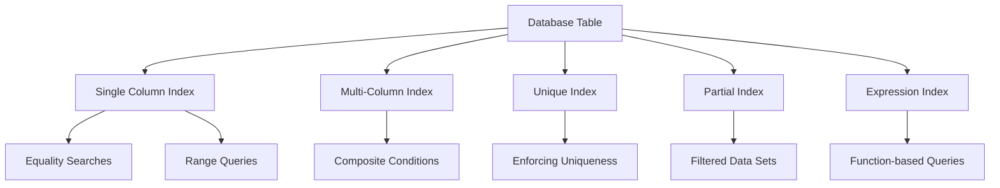

# PostgreSQL CREATE INDEX

Indexes are one of the most powerful tools for improving database performance. In this tutorial, you'll learn how to create and use indexes in PostgreSQL to speed up your queries and make your applications more efficient.

## Introduction

An index in a database works much like an index in a book - it helps PostgreSQL find data without scanning the entire table. When you query a non-indexed column, PostgreSQL must look at every row to find matches (a sequential scan). With an index, PostgreSQL can quickly locate the data you're looking for.

Think of indexes as a separate sorted data structure that points to the actual data in your tables. While indexes speed up data retrieval, they add overhead to data modification operations (INSERT, UPDATE, DELETE), so they should be used thoughtfully.

## Basic Syntax

The basic syntax for creating an index in PostgreSQL is:

```sql
CREATE INDEX index_name ON table_name (column_name);
```

Let's break down each component:

- `CREATE INDEX`: The command that tells PostgreSQL to create a new index
- `index_name`: A name you choose for your index (should be descriptive)
- `table_name`: The table containing the column(s) you want to index
- `column_name`: The column(s) you want to index

## Simple Index Example

Let's say we have a `users` table with thousands of records, and we frequently search for users by their email address:

```sql
CREATE TABLE users (
    id SERIAL PRIMARY KEY,
    email VARCHAR(255) NOT NULL,
    first_name VARCHAR(100),
    last_name VARCHAR(100),
    created_at TIMESTAMP DEFAULT CURRENT_TIMESTAMP
);
```

To create an index on the `email` column:

```sql
CREATE INDEX idx_users_email ON users (email);
```

Now when we run a query like:

```sql
SELECT * FROM users WHERE email = 'john.doe@example.com';
```

PostgreSQL will use the index to quickly find the matching row instead of scanning the entire table.

## Types of Indexes

PostgreSQL supports several types of indexes. The default is a B-tree index, which works well for most scenarios, but you can specify other types for specific use cases.

### B-tree Index (Default)

B-tree indexes are balanced tree structures and are the default index type. They work well for equality and range queries.

```sql
CREATE INDEX idx_users_lastname ON users (last_name);
```

### Hash Index

Hash indexes are optimized for equality comparisons but don't support range queries.

```sql
CREATE INDEX idx_users_id_hash ON users USING HASH (id);
```

### GIN (Generalized Inverted Index)

GIN indexes are useful for composite values like arrays, jsonb, and full-text search.

```sql
-- For a table with a jsonb column
CREATE TABLE products (
    id SERIAL PRIMARY KEY,
    name VARCHAR(255),
    attributes JSONB
);

-- Create a GIN index on the jsonb column
CREATE INDEX idx_products_attributes ON products USING GIN (attributes);
```

### GIST (Generalized Search Tree)

GIST indexes support geometric data types and custom data types.

```sql
-- For a table with geometric data
CREATE TABLE locations (
    id SERIAL PRIMARY KEY,
    name VARCHAR(255),
    position POINT
);

-- Create a GIST index for geometric searches
CREATE INDEX idx_locations_position ON locations USING GIST (position);
```

## Multi-Column Indexes

You can create an index on multiple columns, which is useful when you frequently query based on combinations of columns:

```sql
CREATE INDEX idx_users_lastname_firstname ON users (last_name, first_name);
```

This index is useful for queries like:

```sql
SELECT * FROM users WHERE last_name = 'Smith' AND first_name = 'John';
```

Or even:

```sql
SELECT * FROM users WHERE last_name = 'Smith';
```

But it would not help with:

```sql
SELECT * FROM users WHERE first_name = 'John';
```

The order of columns in a multi-column index matters! Put the columns most frequently used in WHERE clauses first.

## Unique Indexes

When you want to ensure column values are unique across the table, you can create a unique index:

```sql
CREATE UNIQUE INDEX idx_users_email_unique ON users (email);
```

This prevents duplicate email addresses in the `users` table and is often used alongside a unique constraint.

## Partial Indexes

A partial index covers only a subset of a table's rows, defined by a WHERE clause:

```sql
-- Index only active users
CREATE INDEX idx_users_active ON users (last_name, first_name) WHERE active = TRUE;
```

This is great for optimizing queries that regularly filter for specific conditions.

## Expression Indexes

You can create indexes on expressions, not just columns:

```sql
-- Index for case-insensitive searches
CREATE INDEX idx_users_email_lower ON users (LOWER(email));
```

Now you can efficiently perform case-insensitive searches:

```sql
SELECT * FROM users WHERE LOWER(email) = 'john.doe@example.com';
```

## When to Create Indexes

Consider creating indexes when:

1. A column is frequently used in WHERE clauses
2. A column is used to join tables
3. A column is frequently used in ORDER BY or GROUP BY clauses
4. A column has high cardinality (many unique values)

## When NOT to Create Indexes

Avoid creating indexes when:

1. The table is small (PostgreSQL might perform a sequential scan anyway)
2. The column has low cardinality (few unique values)
3. The column is frequently updated
4. You rarely query the column

## Practical Example: Building a Blog

Let's look at a more comprehensive example. Imagine we're building a blog platform:

```sql
-- Create tables
CREATE TABLE authors (
    id SERIAL PRIMARY KEY,
    username VARCHAR(50) UNIQUE NOT NULL,
    email VARCHAR(255) UNIQUE NOT NULL,
    full_name VARCHAR(255) NOT NULL,
    bio TEXT,
    created_at TIMESTAMP DEFAULT CURRENT_TIMESTAMP
);

CREATE TABLE articles (
    id SERIAL PRIMARY KEY,
    author_id INTEGER REFERENCES authors(id),
    title VARCHAR(255) NOT NULL,
    slug VARCHAR(255) UNIQUE NOT NULL,
    content TEXT,
    status VARCHAR(20) DEFAULT 'draft',
    published_at TIMESTAMP,
    created_at TIMESTAMP DEFAULT CURRENT_TIMESTAMP
);

CREATE TABLE tags (
    id SERIAL PRIMARY KEY,
    name VARCHAR(50) UNIQUE NOT NULL
);

CREATE TABLE article_tags (
    article_id INTEGER REFERENCES articles(id),
    tag_id INTEGER REFERENCES tags(id),
    PRIMARY KEY (article_id, tag_id)
);
```

Now let's create appropriate indexes:

```sql
-- Author indexes
CREATE INDEX idx_authors_fullname ON authors (full_name);

-- Article indexes
CREATE INDEX idx_articles_author_id ON articles (author_id);
CREATE INDEX idx_articles_status ON articles (status);
CREATE INDEX idx_articles_published_at ON articles (published_at);

-- Partial index for published articles
CREATE INDEX idx_articles_published 
ON articles (published_at) 
WHERE status = 'published';

-- Expression index for case-insensitive title searches
CREATE INDEX idx_articles_title_lower ON articles (LOWER(title));

-- For tag lookups
CREATE INDEX idx_article_tags_tag_id ON article_tags (tag_id);
```

These indexes would optimize common queries like:

- Finding articles by author
- Listing published articles by date
- Searching articles by title
- Finding articles with specific tags

## Monitoring Index Usage

To check if your indexes are being used, you can use the `EXPLAIN` command:

```sql
EXPLAIN SELECT * FROM articles WHERE author_id = 1;
```

Sample output:

```
                                QUERY PLAN
---------------------------------------------------------------------------
 Index Scan using idx_articles_author_id on articles  (cost=0.28..8.29 rows=1 width=144)
   Index Cond: (author_id = 1)
```

This shows PostgreSQL is using the `idx_articles_author_id` index for this query.

## Managing Indexes

### Dropping an Index

If an index is no longer useful, you can remove it:

```sql
DROP INDEX idx_name;
```

### Reindexing

If an index becomes corrupted or inefficient:

```sql
REINDEX INDEX idx_name;
```

Or reindex all indexes on a table:

```sql
REINDEX TABLE table_name;
```

## Performance Considerations

1. **Indexes consume disk space**: Each index requires additional storage.
2. **Indexes slow down writes**: INSERT, UPDATE, and DELETE operations need to update indexes.
3. **Too many indexes can degrade performance**: The query planner has more options to evaluate.
4. **Unused indexes waste resources**: Regularly monitor and remove unused indexes.

## Common Index Design Patterns

Here's a diagram showing common index usage patterns:



## Summary

Indexes are powerful tools for optimizing PostgreSQL query performance. By understanding the different types of indexes and when to use them, you can significantly improve your application's database performance.

Remember these key points:
- Indexes speed up data retrieval but slow down data modification
- Choose the right type of index for your specific query patterns
- Monitor index usage and remove unused indexes
- Balance the number of indexes against write performance needs

## Additional Resources

- [PostgreSQL Official Documentation on Indexes](https://www.postgresql.org/docs/current/indexes.html)
- [PostgreSQL Index Types](https://www.postgresql.org/docs/current/indexes-types.html)
- [PostgreSQL EXPLAIN](https://www.postgresql.org/docs/current/using-explain.html)

## Exercises

1. Create a table with at least 5 columns and add appropriate indexes for different query patterns.
2. Write queries that would benefit from different types of indexes (B-tree, Hash, GIN, etc.).
3. Use EXPLAIN to verify your indexes are being used.
4. Create a partial index for a specific business case.
5. Create an expression index and write a query that uses it.